<h2>NO LONGER AVAILABLE ON COURSERA NOR UNIVERSITY OF MICHIGAN</h2>
<h1 align="center">Interactivity with jQuery &amp; JavaScript</h1>
<h6 align="center">(by Colleen van Lent, Ph.D. University of Michigan)</h6>
<!--~~~~~~~~~~~~~~~~~~~~~~~~~~~~~~~~~~~~~~~~~~~~~~~~~~~~~~~~~~~~~~~~~~~~~~~~~~~~~~~~~~~~~~~~~~~~-->
<!--~~~~~~~~~~~~~~~~~~~~~~~ readme.md of uofm-inter-with-js.bauska.org ~~~~~~~~~~~~~~~~~~~~~~~~~-->
<!--~~~~~~~~~~~~~~~~~~~~~~~~~~~~~~~~~~~~~~~~~~~~~~~~~~~~~~~~~~~~~~~~~~~~~~~~~~~~~~~~~~~~~~~~~~~~-->
<!--~~~~~~~~~~~~~~~~~~~ 01. javascript logo for university of michigan (i) ~~~~~~~~~~~~~~~~~~~~~-->
<p align="center">
  
</p>
<!--~~~~~~~~~~~~~~~~~~~~~~~~~~~~~~~~~~~~~~~~~~~~~~~~~~~~~~~~~~~~~~~~~~~~~~~~~~~~~~~~~~~~~~~~~~~~-->
<!--~~~~~~~~~~~~~~~~~~~~~~~~~~ 02. university of michigan logo (i) ~~~~~~~~~~~~~~~~~~~~~~~~~~~~~-->
<p align="center">
  
</p>
<!--->
<h2><a href="#table-of-contents">Table of Contents</a></h2>

## [**About**](#cha)
>### - [**About**](#cha-1)
>### - [**Source Code for Each Week**](#cha-2)
>### - [**Course Slides**](#cha-3)

## [**Course Information**](#chb)
>### * [**Syllabus**](#chb-1)
>### * [**Resources**](#chb-2)
>### * [**Fluid Measurements background readings**](#chb-3)
>### * [**Pixel to Em conversion tool**](#chb-4)
>### * [**Dynamically change size of font with sliders**](#chb-5)
>### * [**Good Examples of Responsive Design**](#chb-6)
>### * [**Media Queries and Breakpoints**](#chb-7)
>### * [**Demystifying Bootstrap**](#chb-8)
>### * [**Grid System Check**](#chb-9)
>### * [**The Evolution of the Airbnb front-end development**](#chb-10)
>### * [**Debugging Your Style**](#chb-11)
>### * [**More Resources for Learning to Debug/Develop**](#chb-12)

## [**Week 1: jQuery PLugins and Capturing the Scroll Event**](#ch1)
>### 1.01 [**Welcome to this Course!**](#ch1-01)
>### 1.02 [**Module 1 Introduction**](#ch1-02)
>### 1.03 [**Intro to jQuery Plugins**](#ch1-03)
>### 1.04 [**Using Plugins and Essential Steps**](#ch1-04)
>### 1.05 [**Gotchas and Rookie Mistakes**](#ch1-05)
>### 1.06 [**FlexSlider: A jQuery Plugin**](#ch1-06)
>### 1.07 [**About the Minified Version**](#ch1-07)
>### 1.08 [**Adding Markup &amp; Hooking Up the Slider**](#ch1-08)
>### 1.09 [**FlexSlider Rules**](#ch1-09)
>### 1.10 [**Additional Controls**](#ch1-10)
>### 1.11 [**Advanced FlexSlider**](#ch1-11)
>### 1.12 [**Additional Styling**](#ch1-12)
>### 1.13 [**Styling the CTA**](#ch1-13)

## [**Week 2: Combining Scripts and Skill Building Through Practice**](#ch2)
>### 2.01 [**Module 2 Introduction**](#ch2-01)
>### 2.02 [**Intro to Smooth Scroll with jQuery**](#ch2-02)
>### 2.03 [**Creating a Click Handler**](#ch2-03)
>### 2.04 [**Adding the Animation**](#ch2-04)
>### 2.05 [**Add Some Easing and a Callback Function**](#ch2-05)
>### 2.06 [***Highlighting Elements*](#ch2-06)
>### 2.07 [**Intro to Page Location Tracking**](#ch2-07)
>### 2.08 [**The Crux of the Problem**](#ch2-08)
>### 2.09 [**Strategy**](#ch2-09)
>### 2.10 [**Adding PageTop and If Statements**](#ch2-10)
>### 2.11 [**Writing the Else/If Statement - Part 1**](#ch2-11)
>### 2.12 [**Writing the Else/If Statement - Part 2**](#ch2-12)
>### 2.13 [**Edge Case Issues**](#ch2-13)
>### 2.14 [**Resizing Your Window**](#ch2-14)
>### 2.15 [**Resetting the Counter**](#ch2-15)
>### 2.16 [**resetPagePosition Function**](#ch2-16)
>### 2.17 [**Reviewing the Whole Script**](#ch2-17)
>### 2.18 [**Intro to Scroll Effects with JS**](#ch2-18)
>### 2.19 [**Getting the Target - Part 1**](#ch2-19)
>### 2.20 [**Getting the Target - Part 2**](#ch2-20)
>### 2.21 [**Smooth Scroll Polyfill**](#ch2-21)
>### 2.22 [**Checking the Load**](#ch2-22)
>### 2.23 [**Top Posts**](#ch2-23)
>### 2.24 [**Add an Event Listener**](#ch2-24)
>### 2.25 [**The Magic Conditionals**](#ch2-25)
>### 2.26 [**Changing the Next Link**](#ch2-26)
>### 2.27 [**Resizing Function**](#ch2-27)
>### 2.28 [**Finalizing the Script**](#ch2-28)
>### 2.29 [**Scription Site Introduction**](#ch2-29)
>### 2.30 [**Header HTML**](#ch2-30)
>### 2.31 [**Pricing HTML**](#ch2-31)
>### 2.32 [**Beginning Styling**](#ch2-32)
>### 2.33 [**Styling That Attaches to Whole Page**](#ch2-33)
>### 2.34 [**Slider Styling**](#ch2-34)
>### 2.35 [**Pricing Styles**](#ch2-35)
>### 2.36 [**Tablet Styles**](#ch2-36)
>### 2.37 [**Media Query for 1020 Pixels Wide**](#ch2-37)
>### 2.38 [**Media Query for 1200 Pixels Wide**](#ch2-38)
>### 2.39 [**Scription Site: Building Interactive Elements Challenges**](#ch2-39)

## [**Week 3: Intro to Objects &amp; Data in JavaScript**](#ch3)
>### 3.01 [**Module 3 Introduction**](#ch3-01)
>### 3.02 [**Introduction to Objects and Data in JS**](#ch3-02)
>### 3.03 [**Objects Can Contain Arrays and Other Objects**](#ch3-03)
>### 3.04 [**Functions Inside Objects Equals Methods**](#ch3-04)
>### 3.05 [**Putting Objects and Functions Together**](#ch3-05)
>### 3.06 [**Data Formats - XML**](#ch3-06)
>### 3.07 [**Example File**](#ch3-07)
>### 3.08 [**Intro to Pig Dice Game**](#ch3-08)
>### 3.09 [**Play the Game of Pig**](#ch3-09)
>### 3.10 [**Version One**](#ch3-10)
>### 3.11 [**Other Versions**](#ch3-11)

## [**Week 4: Building a Simple Game in JavaScript**](#ch4)
>### 4.01 [**Module 4 Introduction**](#ch4-01)
>### 4.02 [**Intro to the Game of Pig**](#ch4-02)
>### 4.03 [**Start the Game**](#ch4-03)
>### 4.04 [**Set Up the Turn**](#ch4-04)
>### 4.05 [**Throwing the Dice**](#ch4-05)
>### 4.06 [**Test Throwing the Dice**](#ch4-06)
>### 4.07 [**Add the Selection Statements**](#ch4-07)
>### 4.08 [**Snake Eyes!**](#ch4-08)
>### 4.09 [**A '1' Was Rolled**](#ch4-09)
>### 4.10 [**The Else Statement**](#ch4-10)
>### 4.11 [**Checking for a Win**](#ch4-11)
>### 4.12 [**Show the Current Score**](#ch4-12)
>### 4.13 [**Final Clean-Up**](#ch4-13)
>### 4.14 [**Extending the Game**](#ch4-14)
>### 4.15 [**Course Summary**](#ch4-15)
<!--->
<h2>About this Course</h2>

If you want to take your website to the next level, the ability to
incorporate interactivity is a must. But adding some of these types of
capabilities requires a stronger programming language than HTML5 or
CSS3, and JavaScript can provide just what you need.

With just a basic understanding of the language, you can create a page
that will react to common events such as page loads, mouse clicks &
movements, and even keyboard input. This course will introduce you to
the basics of the JavaScript language. We will cover concepts such as
variables, looping, functions, and even a little bit about debugging
tools.

You will understand how the Document Object Model (DOM) is used by
JavaScript to identify and modify specific parts of your page. After the
course, learners will be able to react to DOM Events and dynamically
alter the contents and style of their page. The class will culminate in
a final project - the creation of an interactive HTML5 form that accepts
and verifies input.

This is the third course in the Web Design for Everybody specialization.
A basic understanding of HTML and CSS is expected when you enroll in
this class. Additional courses focus on enhancing the styling with
responsive design and completing a capstone project.

<h2>Syllabus</h2>

<h3>Week One: Introduction to JavaScript</h3>

If you haven&#39;t used a traditional programming language before, this
first week is key. Before we begin with the how, we will talk about the
why, mainly why we want to use JavaScript. The main reason is that it is
very easy for JavaScript to work with the DOM. And easy is always a
great way to start. Speaking of starting out, it is also always more fun
when our code actually does something we can see, so we will jump
quickly into different ways we can generate output. It won&#39;t be flashy
yet, but it will be a great way to get your feet wet with traditional
programming. After that we go back to the basics of how a computer uses
data. We begin with variables, expressions, and operators.

1.  <b>Syllabus</b>

2.  <b>[Introduction](https://www.coursera.org/lecture/javascript/introduction-EYX66)&ast;
    (1)</b>

3.  <b>Link to All of the Code for Week One</b>

4.  <b>The Document Object Model (DOM)</b>

5.  <b>DOM Review with Object Oriented Programming&ast; (2)</b>

6.  <b>Output&ast; (3)</b>

7.  <b>Trying to Create and Debug Your Own Output</b>

8.  <b>Variables&ast; (4)</b>

9.  <b>Data Types&ast; (5)</b>

10. <b>Operators and Expressions&ast; (6)</b>

11. <b>Discussion - CodePen</b>

12. <b>Materials</b>

13. <b>The History of &#34;Debugging&#34;</b>

<b>Summary:</b> Introduction to JavaScript

<h3>Week Two: Reacting to Your Audience</h3>

If you have written HTML code in the past, hopefully you have fallen
into the great habit of validating your code &#45;&#45; making sure that you
close all of your open tags. There are other rules that you may or may
not have been following as well, for instance the importance of using
each id attribute only once per page. This is called writing &#34;clean&#34;
code. The reasoning and importance of following these rules becomes
clear as we begin to manipulate the different components of your webpage
based on the actions of the person interacting with your page. In
particular you will learn about the JavaScript Mouse Events and Touch
Events. This week&#39;s materials will end with a photo gallery example
that you can create along with me.

1.  <b>Reading: </b>Link to All of the Code for Week Two

2.  <b>Reading: </b>Functions

3.  [<b>Functions</b>](https://www.coursera.org/lecture/javascript/functions-Ltkbl)&ast;
    (1)

4.  <b>Video: </b>Code Placement&ast; (2)

5.  <b>Reading: </b>Organizing Your Code

6.  <b>Video: </b>Folder Structure / Organizing Your Code&ast; (3)

7.  <b>Video: </b>Events&ast; (4)

8.  <b>Reading: </b>Mastering Events and Functions

9.  <b>Video: </b>Code With Me -- Events&ast; (5)

10. <b>Reading: </b>Just a little note before the next video

11. <b>Video: </b>&#34;this&#34;&ast; (6)

12. <b>Reading: </b>Homework Time!!

13. <b>Video: </b>Photo Gallery&ast; (7)

<b>Summary: </b>JavaScript Interactive Photo Gallery

<h3>Week Three: Arrays and Looping</h3>

This week we will delve into more complex programming concepts: arrays
and looping. Arrays allow you to represent groups of related
information. Looping provides efficiency and flexibility to your
programs. Using both we will expand upon the photo gallery example.

1.  <b>Reading: </b>Link to All of the Code for Week Three

2.  <b>Reading: </b>A JavaScript Cheat Sheet

3.  <b>Reading: </b>Arrays

4.  [<b>Video: </b>JavaScript Arrays](https://www.coursera.org/lecture/javascript/javascript-arrays-g8N8v)&ast;
    (1)

5.  <b>Video: </b>Code With Me -- Arrays&ast; (2)

6.  <b>Reading: </b>Advanced Coding Techniques

7.  <b>Video: </b>JavaScript Iteration&ast; (3)

8.  <b>Video: </b>Flow Of Control&ast; (4)

9.  <b>Video: </b>Code With Me - Combining Loops and Conditionals&ast; (5)

10. <b>Video: </b>Advanced Conditionals&ast; (6)

11. <b>Video: </b>Common Errors&ast; (7)

<b>Summary:</b> JavaScript Review

<h3>Week Four: Validating Form Data</h3>

This week we will put a number of the concepts from this course together
to tackle a new project - creating and validating input entered into an
HTML5 form. Forms are extremely common elements used to input and send
data to via a webpage. We will look at how you can use JavaScript to add
options to your forms, to pre-fill data based on previous input, and
even to check that passwords match.

1.  **Reading: </b>Link to All of the Code for Week Four

2.  **Reading: </b>Introduction to Forms

3.  [**Video: </b>Simple Forms](https://www.coursera.org/lecture/javascript/simple-forms-2VjBX)&ast;
    (1)

4.  **Video: </b>Simple Validation&ast; (2)

5.  **Reading: </b>&#34;"Cool Stuff&#34;" - Friend or Foe?

6.  **Video: </b>Comparing Two Inputs&ast; (3)

7.  **Video: </b>Checkboxes and Radio Buttons&ast; (4)

8.  **Reading: **Using Forms on Your Site

9.  **Reading: **More Code Examples

10. **Video: **Conclusion&ast; (5)

11. **Reading: **Intro to JQuery

12. **Reading: **Post-course Survey

13. **Reading: **Keep Learning with Michigan Online

<b>Summary:</b> Autocomplete with JavaScript

<h3 id="ch1-01">1-01. Welcome to Introduction to JavaScript, taught by Colleen van Lent!</h3>

This course is an introduction to the use of the JavaScript programming
language to add some interactivity to your website. This course is meant
for people who are comfortable using HTML and CSS, but are new to
programming.

What is the benefit of learning JavaScript? HTML and CSS are not
programming languages and therefore they are not very powerful. You can
do some really interesting things with the new tags and properties, but
there are limitations. JavaScript, on the other hand, allows you to add
complex levels of interactivity to your pages. And unlike some other
programming languages, JavaScript works really well with the DOM
structure of web pages.

In the next few weeks, we will talk about how you can add pop-up boxes
(not always a good idea), change the structure and style of your page
when special events happen (sometimes a good idea), and validate form
data (always a good idea). To be completely honest, there are so many
things that we can do with JavaScript we can&#39;t possibly cover them all
in the time we have. We will focus on the following:

-   How to create output with JavaScript. This could be with pop up
    boxes, adding content to your page, or sending information to the
    browser console to help you fix (&#34;debug&#34;) your code.

-   How JavaScript uses variables and data types to save your data. This
    is a powerful and important concept because it lets you save
    information to use over and over again.

-   How to write functions to react to events. You will be able to write
    code that only runs when special events occur. Because we want to
    add interactivity, we will make sure to use special DOM events that
    react to mouse clicks and movement.

-   Why arrays are an important part of any programming language and how
    to use them to store multiple pieces of information in one variable.

-   How to create and validate HTML forms.

<!--~~~~~~~~~~~~~~~~~~~~~~~~~~~~~~~~~~~~~~~~~~~~~~~~~~~~~~~~~~~~~~~~~~~~~~~~~~~~~~~~~~~~~~~~~~~~-->
<h2 id="ch1-02">1-02. Introduction</h2>
<!--~~~~~~~~~~~~~~~~~~~~~~~~~~~~~~~~~~~~~~~~~~~~~~~~~~~~~~~~~~~~~~~~~~~~~~~~~~~~~~~~~~~~~~~~~~~~-->
<!--~~~~~~~~~~~~~~~~~~~~~~ 03. introduction - interactivity with js (05) ~~~~~~~~~~~~~~~~~~~~~~~-->
<p align="center">
  
</p>

Hi everybody. Today I&#39;m going to introduce you to the JavaScript
programming language. JavaScript has a lot of uses, but we&#39;re really
going to focus on how we can use JavaScript to add interactivity to your
web design pages. While I&#39;m assuming that you&#39;re new to programming,
there is an expectation that you know HTML 5 and CSS. If you don&#39;t,
you&#39;re really going to want to go back and review those two areas
because everything we with JavaScript in this class is based on web
programming.
<!--~~~~~~~~~~~~~~~~~~~~~~~~~~~~~~~~~~~~~~~~~~~~~~~~~~~~~~~~~~~~~~~~~~~~~~~~~~~~~~~~~~~~~~~~~~~~-->
<!--~~~~~~~~~~~~~~~~~~~~~~~~ 04. what you can do with javascript (05) ~~~~~~~~~~~~~~~~~~~~~~~~~~-->
<p align="center">
  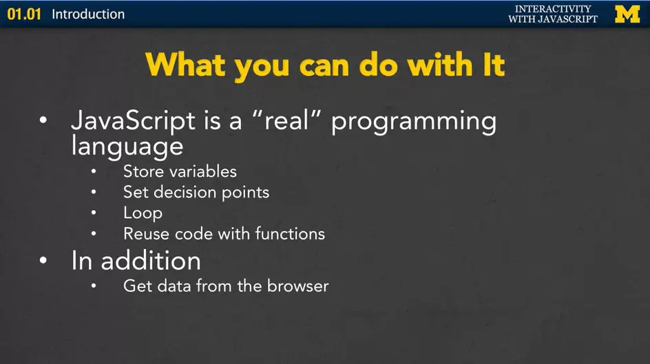
</p>

Let&#39;s get started. If you&#39;ve done HTML, if you&#39;ve done CSS, you
haven&#39;t necessarily done what we call real programming, at least not
what us computer scientists call real programming. Instead, we&#39;re going
to be talking in JavaScript about really definite data manipulation, and
in order to do that, there are a few things you need to learn how to do.
The first is, you want to learn how to store variables. You&#39;re going to
want to learn how to set decision points, you&#39;re going to be looping
and writing functions, you&#39;re also going to be really getting in-depth
with how you can get data from the browser.

Did you know that every time you load a web page, you can actually get
back the title of the page, the URL of your page, a lot of different
information that you know is there, but you can&#39;t always see at first
glance?
<!--~~~~~~~~~~~~~~~~~~~~~~~~~~~~~~~~~~~~~~~~~~~~~~~~~~~~~~~~~~~~~~~~~~~~~~~~~~~~~~~~~~~~~~~~~~~~-->
<!--~~~~~~~~~~~~~~~~~~~~~~ 05. what you can do with javascript, #2 (06) ~~~~~~~~~~~~~~~~~~~~~~~~-->
<p align="center">
  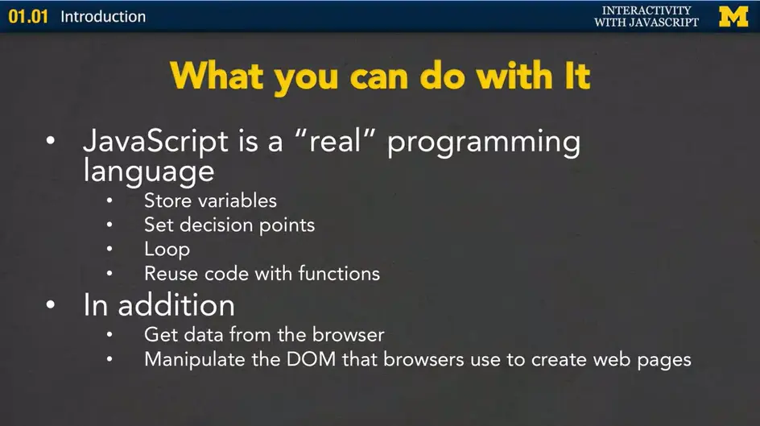
</p>

The other thing we can do, which is really where it gets a little bit
more exciting, is that we can manipulate the DOM that the browsers use
to create webpages. The DOM is the Document Object Model, it&#39;s what
builds up a webpage. If you&#39;re a little fuzzy, it&#39;s been a little
while, don&#39;t worry. We&#39;re going to review the DOM in a future lecture.
<!--~~~~~~~~~~~~~~~~~~~~~~~~~~~~~~~~~~~~~~~~~~~~~~~~~~~~~~~~~~~~~~~~~~~~~~~~~~~~~~~~~~~~~~~~~~~~-->
<!--~~~~~~~~~~~~~~~~~~~~~~~~~~~~~~~~~~~ 06. variables (06) ~~~~~~~~~~~~~~~~~~~~~~~~~~~~~~~~~~~~~-->
<p align="center">
  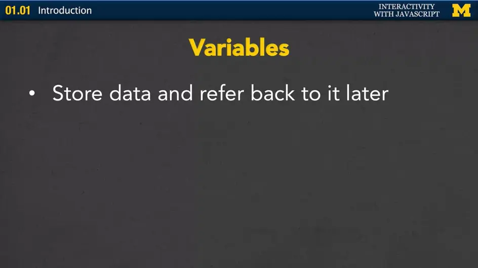
</p>

Let&#39;s start with variables. In computer science, we use variables in
order to store information. Your program isn&#39;t going to be very
exciting if you ask somebody their name and then you can&#39;t actually use
that name later on. You&#39;re going to find out how to get information
from the user, and then store it so you can use it later.
<!--~~~~~~~~~~~~~~~~~~~~~~~~~~~~~~~~~~~~~~~~~~~~~~~~~~~~~~~~~~~~~~~~~~~~~~~~~~~~~~~~~~~~~~~~~~~~-->
<!--~~~~~~~~~~~~~~~~~~~~~~~~~~~~~~~~ 07. decision points (07) ~~~~~~~~~~~~~~~~~~~~~~~~~~~~~~~~~~-->
<p align="center">
  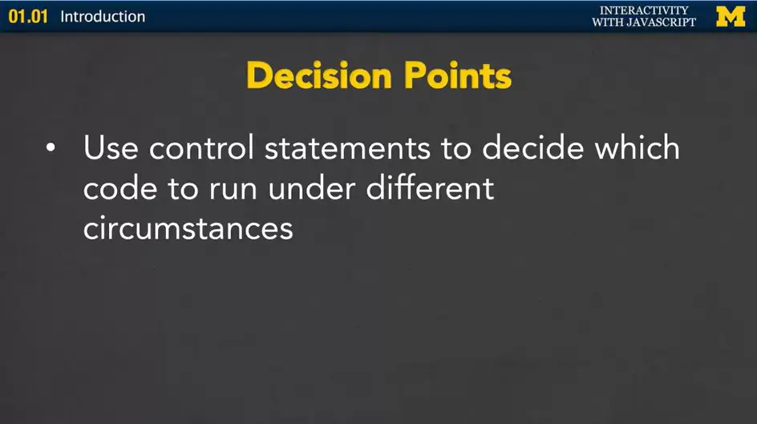
</p>

We&#39;re also going to add decision points. Things are much more
interesting when they don&#39;t do the same thing every single time. We&#39;re
going to write a little bit of code that can help the program decide in
some cases I want to do this and in other cases, I want to do that. We
call this decision points.
<!--~~~~~~~~~~~~~~~~~~~~~~~~~~~~~~~~~~~~~~~~~~~~~~~~~~~~~~~~~~~~~~~~~~~~~~~~~~~~~~~~~~~~~~~~~~~~-->
<!--~~~~~~~~~~~~~~~~~~~~~~~~~~~~~~~~~~ 08. looping, #1 (07) ~~~~~~~~~~~~~~~~~~~~~~~~~~~~~~~~~~~~-->
<p align="center">
  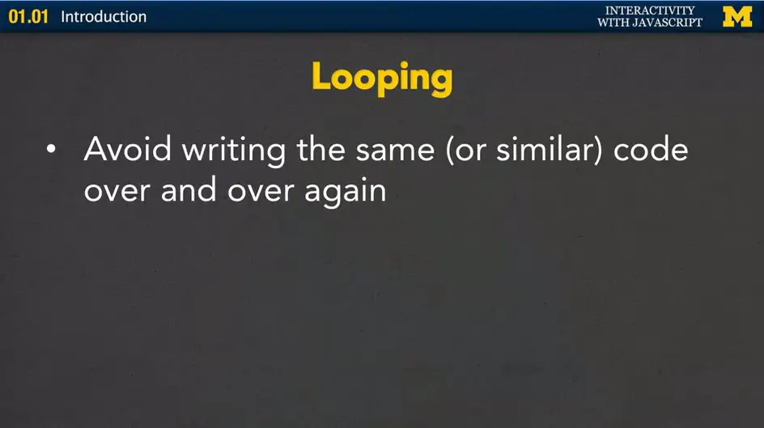
</p>

We can also do looping. Looping is really powerful. As your programs get
bigger, there&#39;s certain things you&#39;ll want to do over and over again,
but you really don&#39;t want to write code over and over and over again.
In computer science, we use something called looping to control the
program and say, see that little bit of code over there? We want to do
that five times, or ten times, or we want to keep doing it until the
human does what we want them to do.
<!--~~~~~~~~~~~~~~~~~~~~~~~~~~~~~~~~~~~~~~~~~~~~~~~~~~~~~~~~~~~~~~~~~~~~~~~~~~~~~~~~~~~~~~~~~~~~-->
<!--~~~~~~~~~~~~~~~~~~~~~~~~~~~~~~~~~~ 09. looping, #2 (08) ~~~~~~~~~~~~~~~~~~~~~~~~~~~~~~~~~~~~-->
<p align="center">
  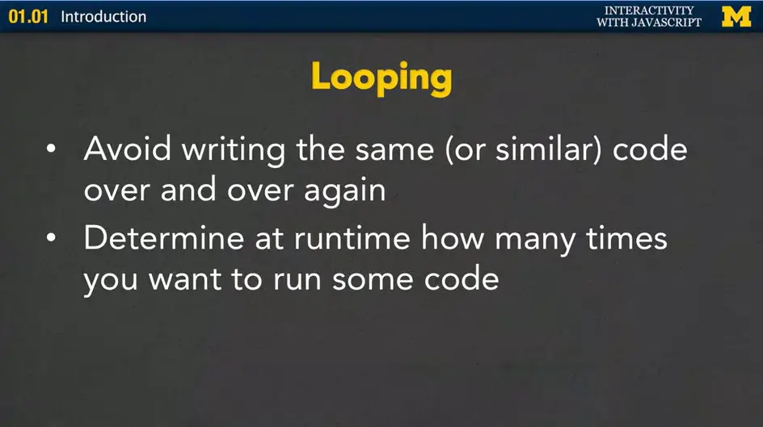
</p>

Otherwise, you sometimes have to decide at run time how many times you
want to run some code. If you know that you want someone to do something
five times, you can be very specific about it. Programming gives you so
much flexibility in how you want your code to run.
<!--~~~~~~~~~~~~~~~~~~~~~~~~~~~~~~~~~~~~~~~~~~~~~~~~~~~~~~~~~~~~~~~~~~~~~~~~~~~~~~~~~~~~~~~~~~~~-->
<!--~~~~~~~~~~~~~~~~~~~~~~~~~~~~~~~~~~~ 10. functions (08) ~~~~~~~~~~~~~~~~~~~~~~~~~~~~~~~~~~~~~-->
<p align="center">
  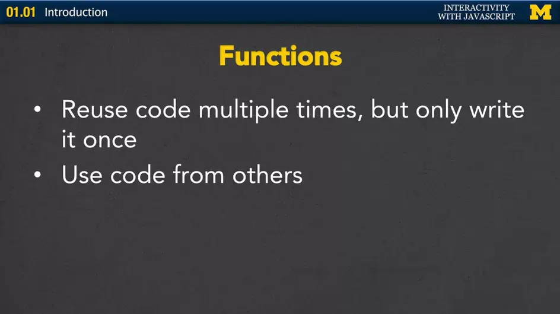
</p>

Next in this course we&#39;re going to talk about functions. Functions are
one, are a way for you to reuse your code multiple times, but you only
have to write it once. The other really great things about functions is
that other people can write code and you can use it, and you don&#39;t even
need to know how it works all you need to know is, what did you call
your function? Great. I want to use that.
<!--~~~~~~~~~~~~~~~~~~~~~~~~~~~~~~~~~~~~~~~~~~~~~~~~~~~~~~~~~~~~~~~~~~~~~~~~~~~~~~~~~~~~~~~~~~~~-->
<!--~~~~~~~~~~~~~~~~~~~~~~~~~~~~~~ 11. manipulating the dom (09) ~~~~~~~~~~~~~~~~~~~~~~~~~~~~~~~-->
<p align="center">
  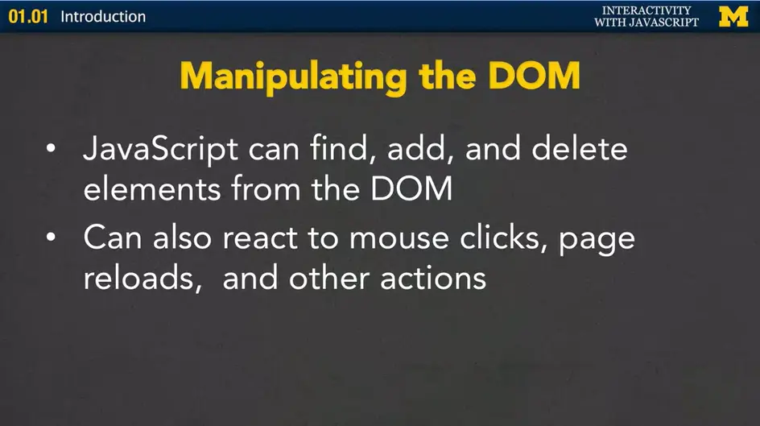
</p>

Finally, we&#39;re going to talk about manipulating the dominant class.
JavaScript can actually go through your web page and search and find
certain elements. It can add new elements. It can delete other elements
from the DOM. So, think about when you&#39;re filling out a form on a web
page with your credit card information. There are always these little
buttons that you can click that can say use the same billing address for
shipping. Things like this can make your page much more usable.

You can also react to mouse clicks, page reloads, and other actions that
the user might have. This is where it really gets fun. We&#39;re going to
start with the basics, the variables, the loopings, and then we&#39;re
going to have fun manipulating the DOM.
<!--~~~~~~~~~~~~~~~~~~~~~~~~~~~~~~~~~~~~~~~~~~~~~~~~~~~~~~~~~~~~~~~~~~~~~~~~~~~~~~~~~~~~~~~~~~~~-->
<!--~~~~~~~~~~~~~~~~~~~~~~~~~~~~~~~~~ 12. review (1-01) (09) ~~~~~~~~~~~~~~~~~~~~~~~~~~~~~~~~~~~-->
<p align="center">
  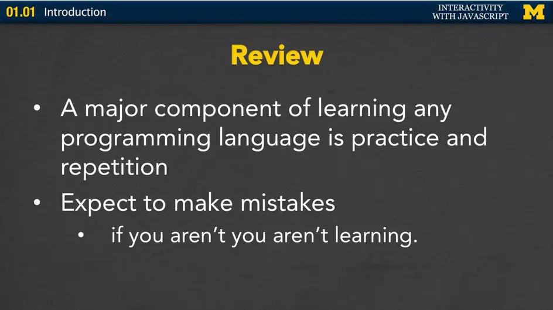
</p>

A major component of learning any new programming language, or I guess,
really any language at all, is that the key is practice and repetition.

The other thing that you really need to understand, and I&#39;m actually
hoping that you&#39;ll embrace, is that you need to expect that you&#39;re
going to make mistakes. If you aren&#39;t making mistakes constantly, you
aren&#39;t really learning in this class. Join us, we&#39;re going to do a lot
of fun stuff. But I promise, I&#39;m going to go slow, explain what I&#39;m
doing step by step, so that you can come along with me and start adding
some interactivity to your pages with JavaScript.

<h3 id="cha-wk1"><a href="http://codepen.io/collection/nLPkgP/">Link to All of the Code for Week One</a></h3>

Again, the following is a link to all of the code for Week One. The individual
files are linked within the modules but the weekly collections may
include additional code that you are free to use.

<a href="http://codepen.io/collection/nLPkgP/">Code: Week One</a>

Above is a link to a collection of all of the Code for Week One. (There
may be a few extra files in there as I play with new examples.) Each
individual file is also linked above. I find that it can be annoying to
use CodePen for the first few lectures since it causes a lot of pop-up
boxes. Don&#39;t worry, we move away from that by Week Two.

Even if you use CodePen, I encourage you to practice writing the code on
your own. For now, I put complete examples in CodePen, but as time goes
on, I will remove some of the commands to link the code together. You
will need to work on that part on your own..

<h3>The Document Object Model (DOM)</h3>

<h3>Examples:</h3>

<a href="https://developer.mozilla.org/en-US/docs/Web/API/Document_Object_Model/Examples">The DOM Example</a>

One of the reasons you want to learn about JavaScript is that it works
so well with the structure used to create HTML documents. Every webpage
can be broken down into a mathematical tree structure called the
Document Object Model (DOM). Each HTML tag is a node in the tree and
these nodes have all types of different attributes, such as text,
background color, width, etc.

With JavaScript it is easy to write code that basically says &#34;I want to
grab *that* part of the webpage and change it.&#34; In this lecture I
review the DOM and talk about how it is related to JavaScript. There is
no code associated with this lecture, but if you check under the
resources, I do include a link to site where you can find specifics on
the DOM.

<!--~~~~~~~~~~~~~~~~~~~~~~~~~~~~~~~~~~~~~~~~~~~~~~~~~~~~~~~~~~~~~~~~~~~~~~~~~~~~~~~~~~~~~~~~~~~~-->
<h2 id="Week1-02">Week 1-02. DOM Review with Object Oriented Programming</h2>
<!--~~~~~~~~~~~~~~~~~~~~~~~~~~~~~~~~~~~~~~~~~~~~~~~~~~~~~~~~~~~~~~~~~~~~~~~~~~~~~~~~~~~~~~~~~~~~-->
<!--~~~~~~~~~~~~~~~~~~ 13. dom review with object oriented programming (11) ~~~~~~~~~~~~~~~~~~~~-->
<p align="center">
  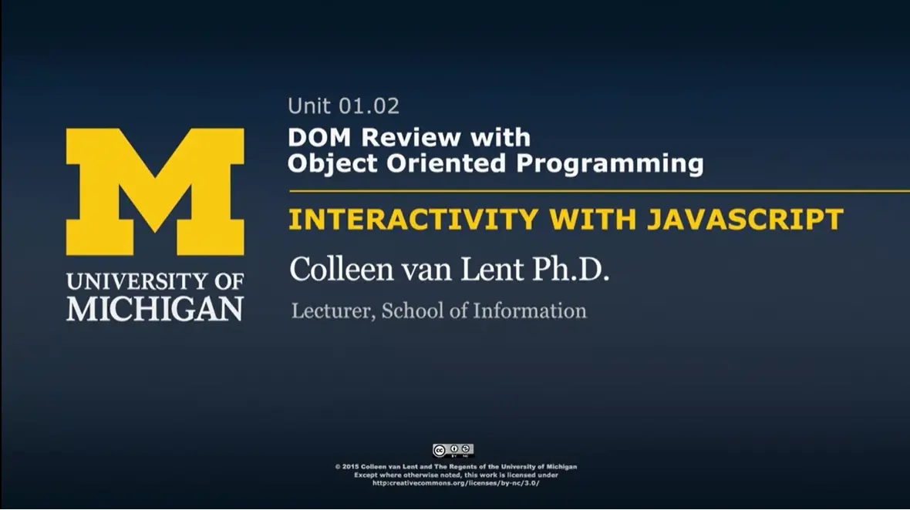
</p>

<p>Today we&#39;re going to be talking about the DOM, or the document object model.</p>
<!--~~~~~~~~~~~~~~~~~~~~~~~~~~~~~~~~~~~~~~~~~~~~~~~~~~~~~~~~~~~~~~~~~~~~~~~~~~~~~~~~~~~~~~~~~~~~-->
<!--~~~~~~~~~~~~~~~~~~~~~~~~ 14. web pages are built upon the dom (11) ~~~~~~~~~~~~~~~~~~~~~~~~~-->
<p align="center">
  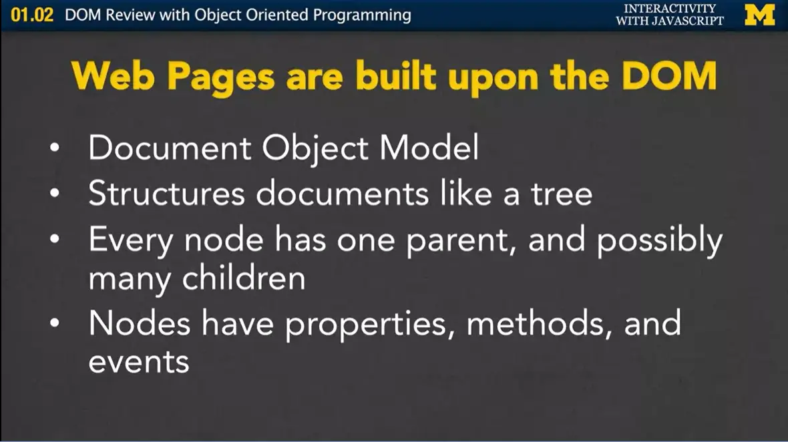
</p>

As you may or may not remember, every webpage is built upon this DOM.
And what it means is that our pages are structured like a tree. We have
one parent and possibly a few children. And the page as you add more and
more things it just gets deeper and deeper. Nodes have different
properties, methods, and events.
<!--~~~~~~~~~~~~~~~~~~~~~~~~~~~~~~~~~~~~~~~~~~~~~~~~~~~~~~~~~~~~~~~~~~~~~~~~~~~~~~~~~~~~~~~~~~~~-->
<!--~~~~~~~~~~~~~~~~~~~~~~~~~~~~ 15. sample document tree, #1 (12) ~~~~~~~~~~~~~~~~~~~~~~~~~~~~~-->
<p align="center">
  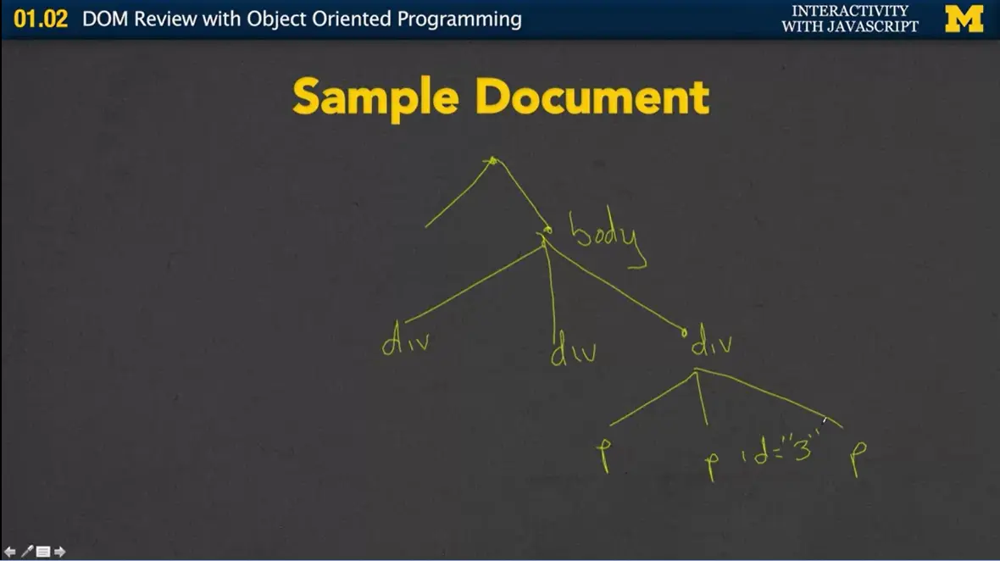
</p>

Let me draw you a quick example and then we&#39;ll talk about how we can
use JavaScript to manipulate this DOM. Every web page is built like a
tree. We start up here and we&#39;ve got our document and then you&#39;re
going to have, hopefully you remember your head and your body, all
right?

Well, what kind of things are in your webpage? You might have a div and
another div. And then the third div we&#39;re going to give more specific.
We&#39;ll say, well this div has three paragraphs and one of those
paragraphs has the id equals 3. What does this mean? Why do we care that
the pages built like a tree?
<!--~~~~~~~~~~~~~~~~~~~~~~~~~~~~~~~~~~~~~~~~~~~~~~~~~~~~~~~~~~~~~~~~~~~~~~~~~~~~~~~~~~~~~~~~~~~~-->
<!--~~~~~~~~~~~~~~~~~~~~~~~~~~~~ 16. sample document tree, #2 (12) ~~~~~~~~~~~~~~~~~~~~~~~~~~~~~-->
<p align="center">
  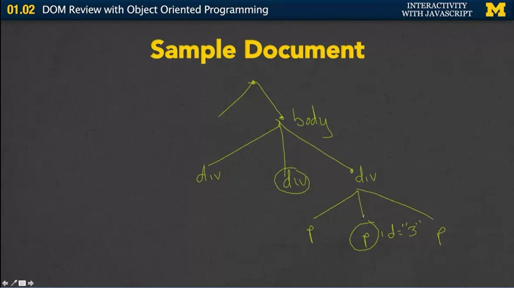
</p>

This means that JavaScript can actually go in and it can look and say,
you know what, I want to find the second div. I found this thing right
here. I want to find the specific paragraph that had the id equals 3.
It&#39;s right here.

Because JavaScript can find these different elements in your page, it
can also change what we call are the attributes of that page. For
instance, that paragraph might have a background color or a special kind
of font, the paragraph also has text in it. How can we go in there and
how can we change that text? This is what we&#39;re going to be using
JavaScript to do in this course.
<!--~~~~~~~~~~~~~~~~~~~~~~~~~~~~~~~~~~~~~~~~~~~~~~~~~~~~~~~~~~~~~~~~~~~~~~~~~~~~~~~~~~~~~~~~~~~~-->
<!--~~~~~~~~~~~~~~~~~~~~~~~~~~~~~ 17. the dom and javascript (13) ~~~~~~~~~~~~~~~~~~~~~~~~~~~~~~-->
<p align="center">
  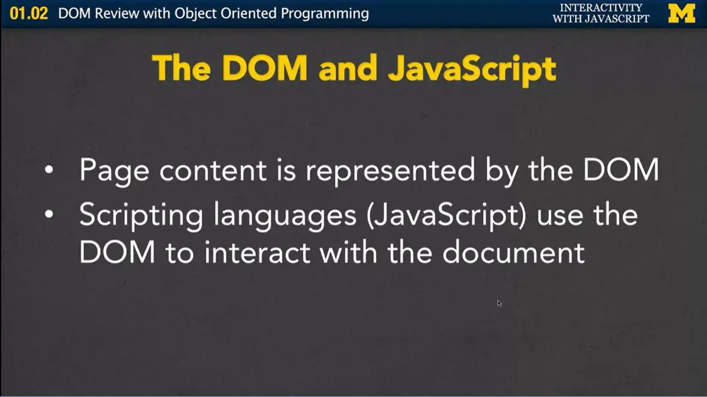
</p>

Again, we&#39;ve got that the page content is represented by the DOM. The
scripting language JavaScript uses the DOM to interact with the
document. How does it do that, though? How does it know how to interact?

<!--~~~~~~~~~~~~~~~~~~~~~~~~~~~~~~~~~~~~~~~~~~~~~~~~~~~~~~~~~~~~~~~~~~~~~~~~~~~~~~~~~~~~~~~~~~~~-->
<!--~~~~~~~~~~~~~~~~~~~~~~~~~~~~~ 18. how does it work, #1? (13) ~~~~~~~~~~~~~~~~~~~~~~~~~~~~~~~-->
<p align="center">
  
</p>

Well, the JavaScript has something called an API, or an application
programming interface. You may have heard people talking about APIs in
the past. Programmers tend to do that. They&#39;re like, oh, what API are
you using? Or what API are you using? And it can sound kind of
intimidating if you&#39;ve never used one before. An API is just a way for
someone else to write code, and then you to use it, to interact with
their programs.
<!--~~~~~~~~~~~~~~~~~~~~~~~~~~~~~~~~~~~~~~~~~~~~~~~~~~~~~~~~~~~~~~~~~~~~~~~~~~~~~~~~~~~~~~~~~~~~-->
<!--~~~~~~~~~~~~~~~~~~~~~~~~~~~~~ 19. how does it work, #2? (14) ~~~~~~~~~~~~~~~~~~~~~~~~~~~~~~~-->
<p align="center">
  
</p>

No matter which browser you&#39;re using, Firefox, Chrome, different things
like that. And no matter which scripting language you&#39;re using, in our
case we&#39;re going to use JavaScript. The API is always the same. The way
you interact is always going to be the same. And this is really
important, because it&#39;s nice to know that if you learn this you won&#39;t
have to learn something different later on.
<!--~~~~~~~~~~~~~~~~~~~~~~~~~~~~~~~~~~~~~~~~~~~~~~~~~~~~~~~~~~~~~~~~~~~~~~~~~~~~~~~~~~~~~~~~~~~~-->
<!--~~~~~~~~~~~~~~~~~~~~~~~~~~~~ 20. the dom objects/elements (14) ~~~~~~~~~~~~~~~~~~~~~~~~~~~~~-->
<p align="center">
  
</p>

Let&#39;s talk about some of these DOM objects or element as we call them.
The first one, kind of the root of your entire page, is the document. If
you wanted to, you could find out what the document URL is, what the
height of the document is, all the different links in the document, the
document background color. If there&#39;s an attribute you&#39;ve used to
style your page, you can find it using JavaScript in the API.

The next kind of concept we talk about is an element, or a node in the
tree. If you remember, I drew that you can have the body, and inside the
body you could have divs, paragraphs, links, list items. Each one of
those is a node in the tree. And you can find it using the API.

Sometimes, though, it can be a little bit more complicated than just
returning a single element. What if you wanted to find all of the
children of one particular ordered list, or un-ordered list? Well, in
that case, instead of returning a single element, sometimes it&#39;s
returned a node list, or an array of elements.

For instance, there&#39;s this one API that we can use, called document
that get element by tag name, and you can give it any element you want.
So, p, or a list item. Well, there&#39;s a really good chance that there&#39;s
more than one paragraph in your page. You return all of them together.
This is how we&#39;re going to be using arrays later in the course,
probably around week three, to help you understand how to deal with an
overload of information.

Finally, the important thing I need you to remember is that in the Dom
there are attributes. You have your elements and every element probably
has one or more attributes that go with it. So, an image for image
element, it would have a source, it would have alt text, it would have
width, and a style, different things like that.

Attributes are the kind of cool things that we want you to be able to
change to make your page look different.
<!--~~~~~~~~~~~~~~~~~~~~~~~~~~~~~~~~~~~~~~~~~~~~~~~~~~~~~~~~~~~~~~~~~~~~~~~~~~~~~~~~~~~~~~~~~~~~-->
<!--~~~~~~~~~~~~~~~~~~~~~~~~~~~~~~~~~ 21. specific api's (15) ~~~~~~~~~~~~~~~~~~~~~~~~~~~~~~~~~~-->
<p align="center">
  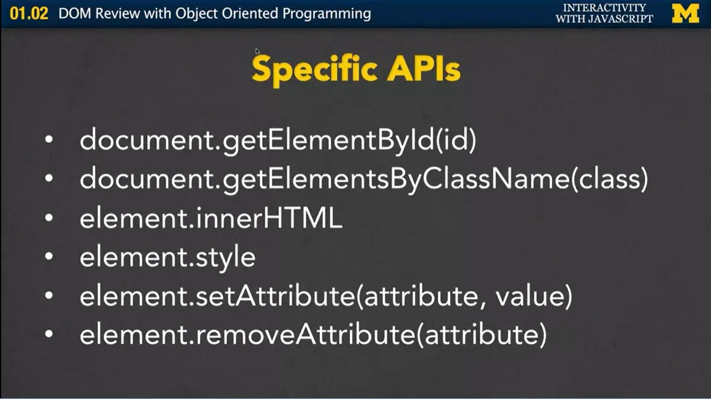
</p>

Okay, so if you understand that the page is made up of documents, and
elements, and attributes, I&#39;m hoping this side will make a little bit
more sense. For a view of a document, you can say you know that I want
to get a certain element using the id. You can also say oh I&#39;ve got
this document grab all the elements that happen to be a paragraph or a
link. Now this one&#39;s new, this idea of element.inner.HTML.

A paragraph is an element and you assume there is some sort of text
inside that paragraph. Well, if you&#39;ve been coding HTML or CSS, you
probably might be thinking, when I use the paragraph tag, I never saw an
inner HTML attribute. You wouldn&#39;t have. This is part of the API, but
you can use this to change the content of any element. You can also
change the element style, and you can even add additional attributes to
any element that the DOM can grab.

Finally, an interesting one that you may or may not use, is you can even
remove attributes. If something has a certain color, you can get rid of
that if you want.
<!--~~~~~~~~~~~~~~~~~~~~~~~~~~~~~~~~~~~~~~~~~~~~~~~~~~~~~~~~~~~~~~~~~~~~~~~~~~~~~~~~~~~~~~~~~~~~-->
<!--~~~~~~~~~~~~~~~~~~~~~~~~~~~~~~~~~ 22. review (1-02) (16) ~~~~~~~~~~~~~~~~~~~~~~~~~~~~~~~~~~~-->
<p align="center">
  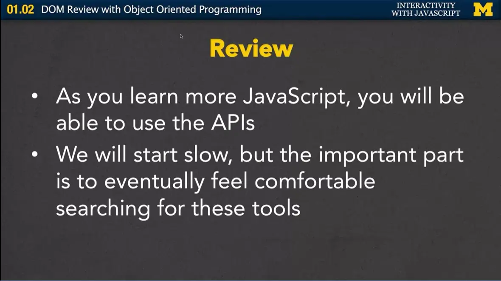
</p>

I know that there was a lot I went over in this slide that maybe didn&#39;t
make a lot of sense to you yet. That&#39;s okay. That&#39;s the point of this
class. It&#39;s so that the end of this course, you can go back to this
slide, and you can say, oh great, I&#39;ve mastered this. I&#39;m beginning to
understand that learning JavaScript doesn&#39;t mean that I know how to
code everything by hand, it means that I know that there&#39;s something
called an API and I know how I can use it to make my page a little bit
better.

We&#39;re going to start slow, and the most important part to me is for you
to feel comfortable searching for information on the web. I&#39;ll be able
to teach you a little bit, I can show you some of the main methods and
API&#39;s and different things like that. But I want you to code with me
and then make sure you go off and you try to change things just a little
bit until your confidence is really up there. Good luck.

<!--~~~~~~~~~~~~~~~~~~~~~~~~~~~~~~~~~~~~~~~~~~~~~~~~~~~~~~~~~~~~~~~~~~~~~~~~~~~~~~~~~~~~~~~~~~~~-->
<h2 id="Week1-03">Week 1-03. Output</h2>
<!--~~~~~~~~~~~~~~~~~~~~~~~~~~~~~~~~~~~~~~~~~~~~~~~~~~~~~~~~~~~~~~~~~~~~~~~~~~~~~~~~~~~~~~~~~~~~-->
<!--~~~~~~~~~~~~~~~~~~~~~~~~~~~~~~~~~ 23. output (1.03) (16) ~~~~~~~~~~~~~~~~~~~~~~~~~~~~~~~~~~~-->
<p align="center">
  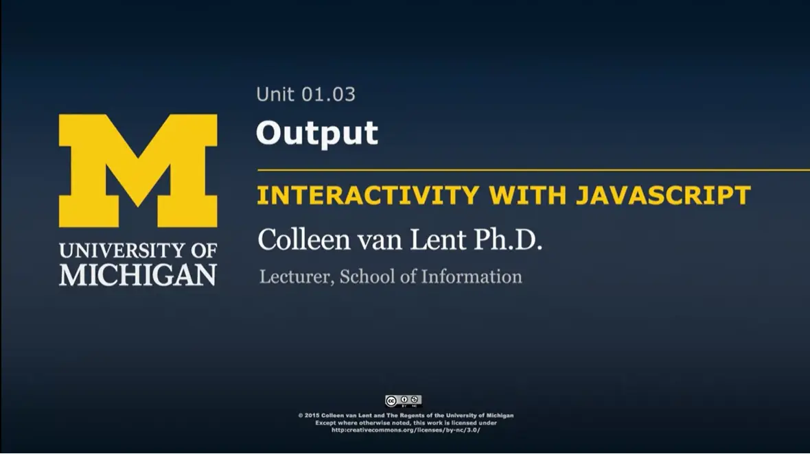
</p>

Hi everybody. Today, let&#39;s start coding a little bit to see some of
things we can do with JavaScript. Maybe, using HTML 5 or CSS 3, you&#39;ve
added what we call a little bit of interactivity to your page. There&#39;s
the details tag if you&#39;re using HTML. There&#39;s the hover property or
pseudo class if you&#39;re using CSS 3 and you were able to make little
things change in your page by reacting to what the user was doing.
<!--~~~~~~~~~~~~~~~~~~~~~~~~~~~~~~~~~~~~~~~~~~~~~~~~~~~~~~~~~~~~~~~~~~~~~~~~~~~~~~~~~~~~~~~~~~~~-->
<!--~~~~~~~~~~~~~~~~~~~~~~~~~~~~~~~~~ 24. interactivity (17) ~~~~~~~~~~~~~~~~~~~~~~~~~~~~~~~~~~~-->
<p align="center">
  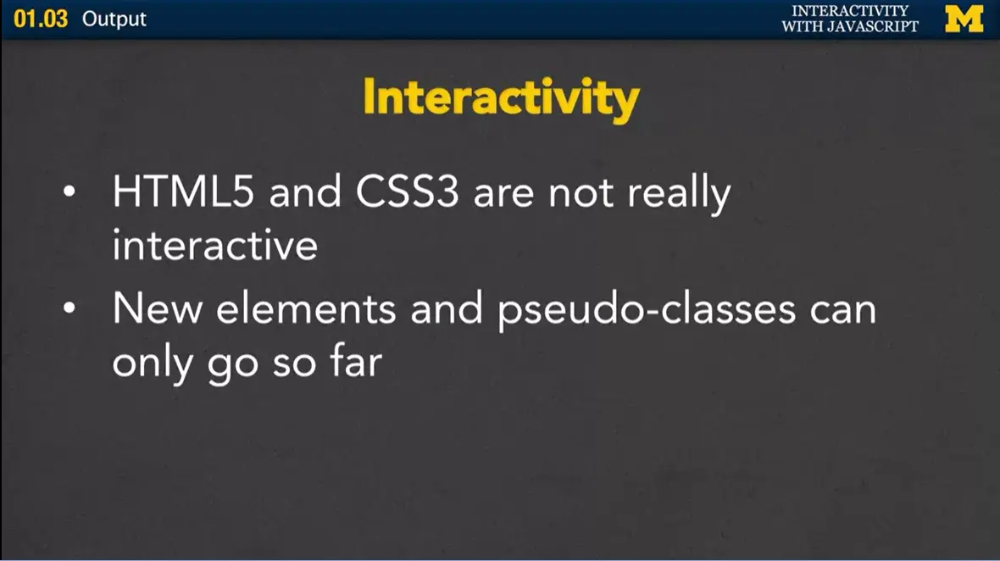
</p>

But typically, that&#39;s not really what we call interactivity when we&#39;re
talking about true web design because these new elements and the pseudo
classes can only go so far. They tend to be temporary changes.
<!--~~~~~~~~~~~~~~~~~~~~~~~~~~~~~~~~~~~~~~~~~~~~~~~~~~~~~~~~~~~~~~~~~~~~~~~~~~~~~~~~~~~~~~~~~~~~-->
<!--~~~~~~~~~~~~~~~~~~~~~~~~~~~~ 25. what can javascript do? (17) ~~~~~~~~~~~~~~~~~~~~~~~~~~~~~~-->
<p align="center">
  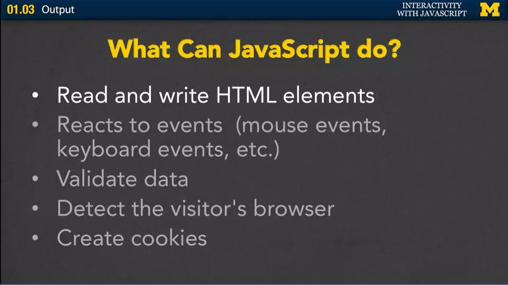
</p>

So, what can JavaScript do that HTML and CSS can&#39;t do? Well, the one
that I&#39;m going to talk about today is that they can read and write HTML
elements. Now that&#39;s not the only thing they can do. We&#39;re going to be
talking about different things like reacting to events and validating
data and different things like that. But today, we&#39;re really going to
focus on output.

Whenever you learn a new programming language, one of the first things
you want to do is find out how can I make things happen. How can I have
things print out to the screen or generate some sort of output.
<!--~~~~~~~~~~~~~~~~~~~~~~~~~~~~~~~~~~~~~~~~~~~~~~~~~~~~~~~~~~~~~~~~~~~~~~~~~~~~~~~~~~~~~~~~~~~~-->
<!--~~~~~~~~~~~~~~~~~~~~~~~~~~~~~~~ 26. javascript output (18) ~~~~~~~~~~~~~~~~~~~~~~~~~~~~~~~~~-->
<p align="center">
  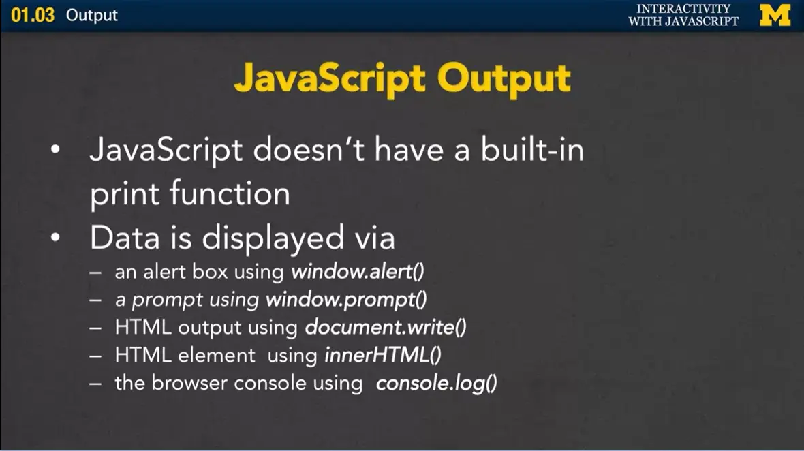
</p>

Well, JavaScript doesn&#39;t have a built-in print function. Instead, you
have four or five different ways where you can generate different
things. Data is typically displayed via alerts, prompts, document.write,
innertHTML or reading information directly to the console. Let&#39;s talk
about each one of these.
<!--~~~~~~~~~~~~~~~~~~~~~~~~~~~~~~~~~~~~~~~~~~~~~~~~~~~~~~~~~~~~~~~~~~~~~~~~~~~~~~~~~~~~~~~~~~~~-->
<!--~~~~~~~~~~~~~~~~~~~~~~~~~~~~~~~~~~~~ 27. alert() (18) ~~~~~~~~~~~~~~~~~~~~~~~~~~~~~~~~~~~~~~-->
<p align="center">
  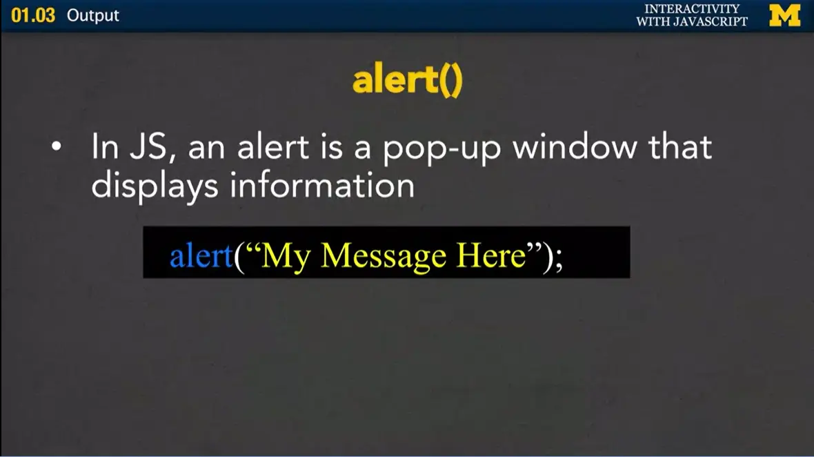
</p>

You&#39;ve all seen alert JavaScript alert boxes. Because many times,
especially back maybe 10, 15 years ago, when you went to a page, people
loved to have these little boxes pop up and say hey, welcome. Doing
things like that. In JavaScript it&#39;s pretty easy. You can just use
alert and then inside you put my message here. A few things just to
point out right from the beginning.

Alert is a keyword. In your editor it should change some sort of special
color. Inside the parentheses, and you need the parentheses, both
beginning parentheses and end parentheses, is that you&#39;re going to have
some sort of string and it should be inside quotes. It can be inside
single quotes or double quotes. And then, the last thing is, to end in a
semicolon. If you were to put this code right here inside your HTML, you
can generate some output.
<!--~~~~~~~~~~~~~~~~~~~~~~~~~~~~~~~~~~~~~~~~~~~~~~~~~~~~~~~~~~~~~~~~~~~~~~~~~~~~~~~~~~~~~~~~~~~~-->
<!--~~~~~~~~~~~~~~~~~~~~~~~~~~~~ 28. html example of alert() (19) ~~~~~~~~~~~~~~~~~~~~~~~~~~~~~~-->
<p align="center">
  
</p>

Let me show you an example. What I&#39;ve done over here is I&#39;ve created
the HTML that I would need to generate an alert box. I&#39;ve got my body
tag, now this is new I have what we call is a script tag. The script tag
tells the browser, oh wait, don&#39;t just print this out, I&#39;m actually
going to give you some JavaScript that I want you to run. And in this
case, I have my code alert(&#34;Hello World&#34;).
<!--~~~~~~~~~~~~~~~~~~~~~~~~~~~~~~~~~~~~~~~~~~~~~~~~~~~~~~~~~~~~~~~~~~~~~~~~~~~~~~~~~~~~~~~~~~~~-->
<!--~~~~~~~~~~~~~~~~~~~~~~~~~~~~~ 29. html example alert() (19) ~~~~~~~~~~~~~~~~~~~~~~~~~~~~~~~~-->
<p align="center">
  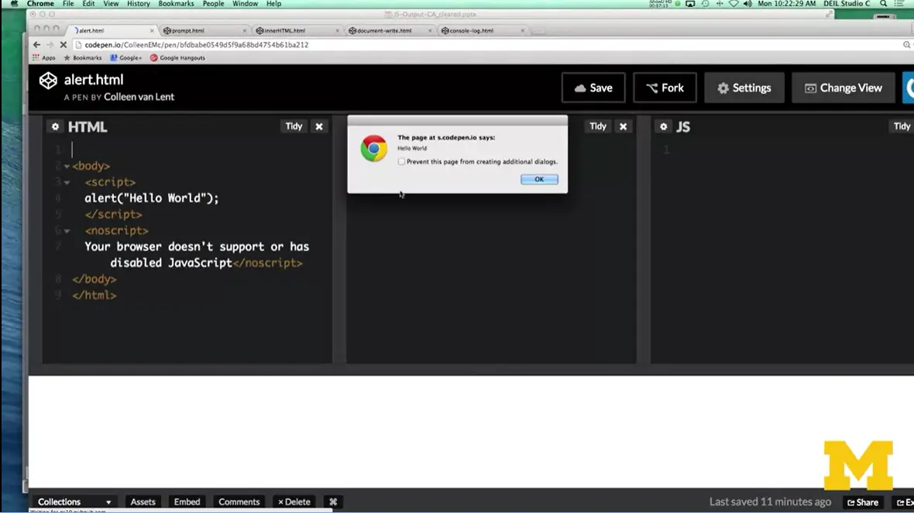
</p>

If I were to run this, and I&#39;m going to refresh it. You can see I get
my little pop-up box. Now, if you&#39;re running this along with me at
home, and you&#39;re not using Chrome, the box is going to look different.
For some of you it&#39;s going to have the little Safari symbol, or the
Edge, or Firefox.
<!--~~~~~~~~~~~~~~~~~~~~~~~~~~~~~~~~~~~~~~~~~~~~~~~~~~~~~~~~~~~~~~~~~~~~~~~~~~~~~~~~~~~~~~~~~~~~-->
<!--~~~~~~~~~~~~~~~~~~~~~~~~~~~~~~ 30. hello world example (20) ~~~~~~~~~~~~~~~~~~~~~~~~~~~~~~~~-->
<p align="center">
  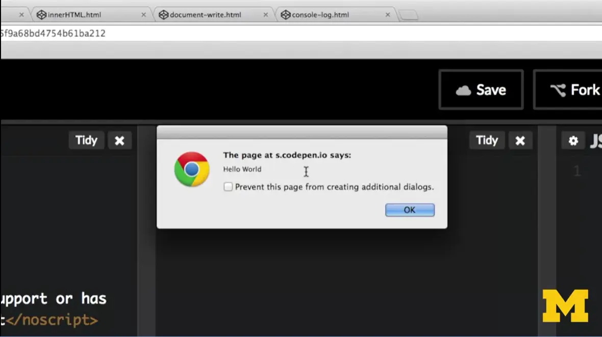
</p>

That&#39;s okay, the important thing is that somewhere in here it says
hello world. Now you might be click on the prevent this page from
creating additional dialogues button. Don&#39;t do it. Because in this
class we&#39;re going to be playing with alert a lot because it&#39;s a nice
way for you to know if your code&#39;s working or not. Again, this is just
a quick and simple way for you to generate output using the alert.
<!--~~~~~~~~~~~~~~~~~~~~~~~~~~~~~~~~~~~~~~~~~~~~~~~~~~~~~~~~~~~~~~~~~~~~~~~~~~~~~~~~~~~~~~~~~~~~-->
<!--~~~~~~~~~~~~~~~~~~~~~~~~~~~~~~~~~~~~ 31. prompt() (20) ~~~~~~~~~~~~~~~~~~~~~~~~~~~~~~~~~~~~~-->
<p align="center">
  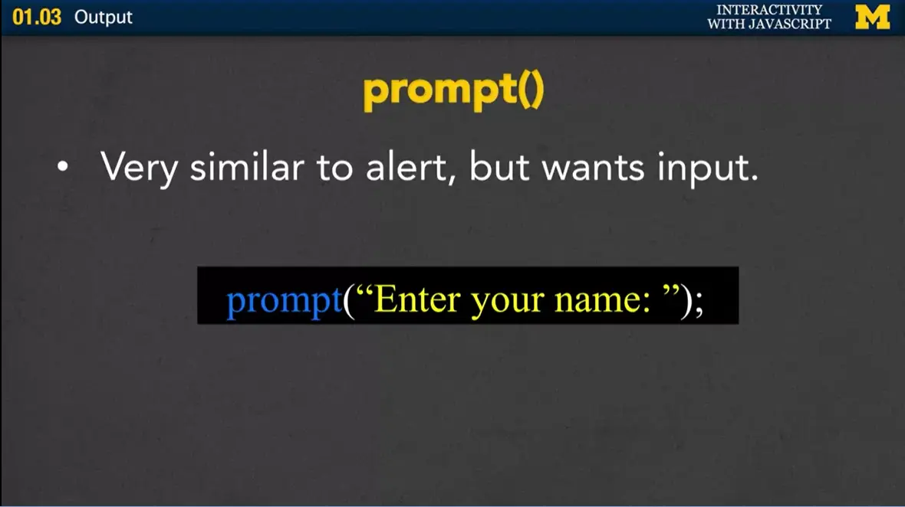
</p>

The next way we can generate output is using prompt. Prompt is very
similar to alert, but it&#39;s slightly different in that it wants you to
do more than just click OK or Cancel. It wants you to generate some sort
of input to put in there. As you can see, the alert and the prompt look
very similar. They&#39;ve both got the key word, the parentheses, the
semicolon and the string, but the way they act is very different.
<!--~~~~~~~~~~~~~~~~~~~~~~~~~~~~~~~~~~~~~~~~~~~~~~~~~~~~~~~~~~~~~~~~~~~~~~~~~~~~~~~~~~~~~~~~~~~~-->
<!--~~~~~~~~~~~~~~~~~~~~~~~~ 32/33. example prompt, side-by-side (21) ~~~~~~~~~~~~~~~~~~~~~~~~~~-->
<p align="center">
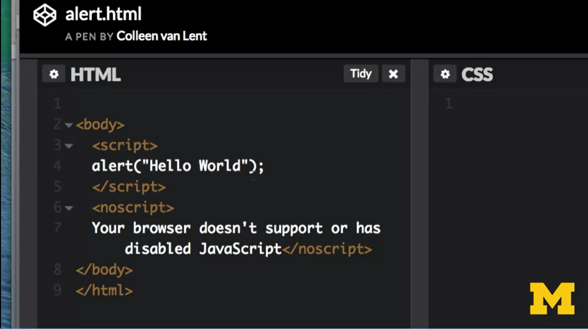
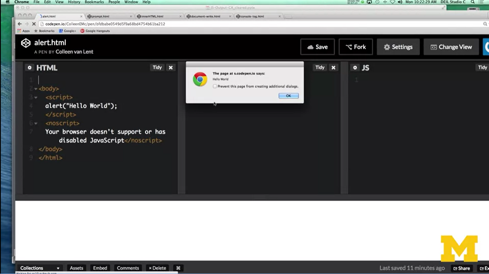
</p>

In this case when you run it, it&#39;s actually waiting for you to type
something in. I can put in Colleen van Lent and hit OK. Now, don&#39;t get
too excited. We didn&#39;t do anything with the stuff I put in. But, again,
I&#39;m just giving you some of the different options. So, you have alert
and you have prompt and both of them generate some sort of box where you
can display information, but nothing is actually showing up on the page.
Let&#39;s switch to the general ways in which you can generate output to
the screen.
<!--~~~~~~~~~~~~~~~~~~~~~~~~~~~~~~~~~~~~~~~~~~~~~~~~~~~~~~~~~~~~~~~~~~~~~~~~~~~~~~~~~~~~~~~~~~~~-->
<!--~~~~~~~~~~~~~~~~~~~~~~~~~~~~~~~ 34. document.write() (21) ~~~~~~~~~~~~~~~~~~~~~~~~~~~~~~~~~~-->
<p align="center">
  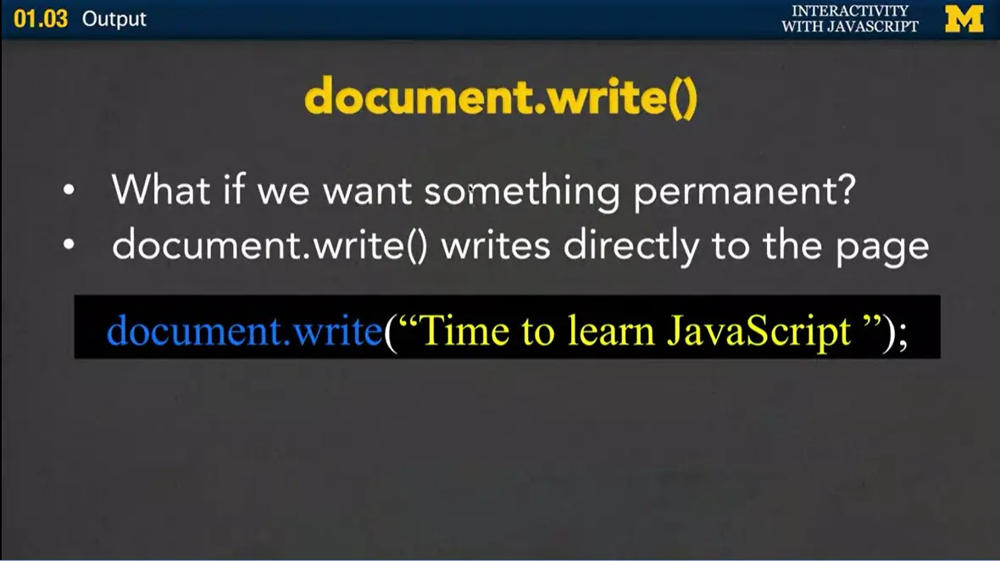
</p>

One way, if you want something to be what we call permanent, to not just
disappear once you hit okay, is to use what we call <em>document.write</em>.
So again, I&#39;m hoping that you&#39;re picking up on these ideas that we&#39;re
using terms like document, and element, and different things like that.
The way that <em>document.write</em> works is it goes through and it says, we
want you to write something directly to the page. We want it to become
part of the dom, we want it to become part of the page permanently. In
this case I can&#39;t just use write. That won&#39;t work. Alert worked by
itself, prompt worked by itself, but here you need to have
<em>document.write()</em>. Same thing, hopefully you&#39;re seeing the pattern.
Let&#39;s see when we add this.
<!--~~~~~~~~~~~~~~~~~~~~~~~~~~~~~~~~~~~~~~~~~~~~~~~~~~~~~~~~~~~~~~~~~~~~~~~~~~~~~~~~~~~~~~~~~~~~-->
<!--~~~~~~~~~~~~~~~~~~~~~~~~~~~~ 35. example document.write() (22) ~~~~~~~~~~~~~~~~~~~~~~~~~~~~~-->
<p align="center">
  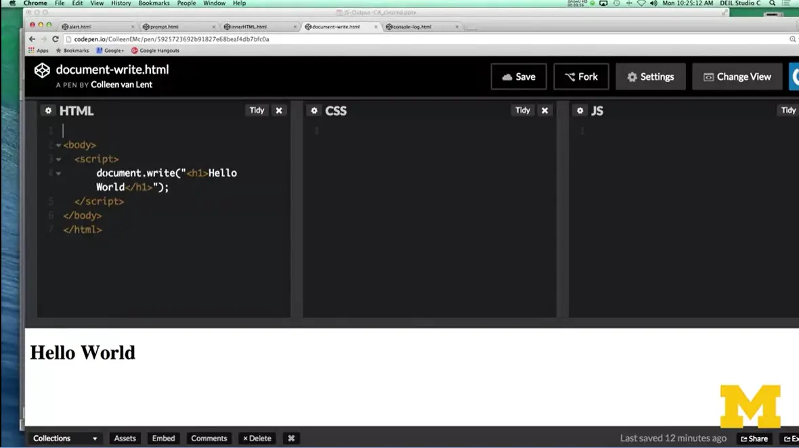
</p>

Here you can see that inside the script tag, again, I have the
**document.write()**. But instead of things popping up or asking us for
input, it writes it directly into the screen.
<!--~~~~~~~~~~~~~~~~~~~~~~~~~~~~~~~~~~~~~~~~~~~~~~~~~~~~~~~~~~~~~~~~~~~~~~~~~~~~~~~~~~~~~~~~~~~~-->
<!--~~~~~~~~~~~~~~~~~~~~~~~~~~ 36. example document.write(), #2 (22) ~~~~~~~~~~~~~~~~~~~~~~~~~~~-->
<p align="center">
  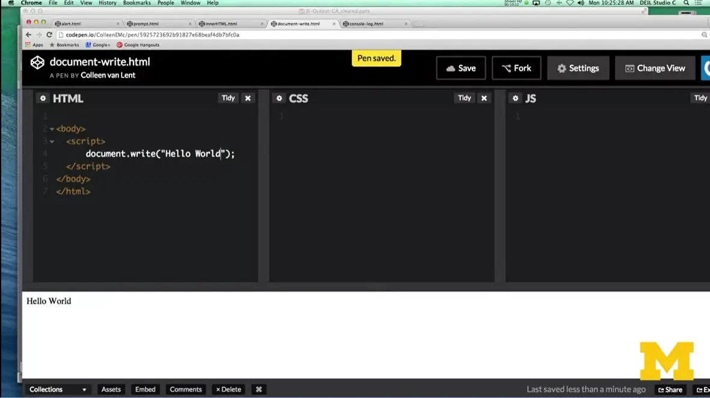
</p>

Now I&#39;m going to change something right here. Because I put h1 inside
the quotes. If I get rid of that you can see this still works, but
instead of being an h1 heading, it's just regular old text. So,
**document.write** is a way for you to generate output. But we need to
realize that it is probably not the best way to do it.
<!--~~~~~~~~~~~~~~~~~~~~~~~~~~~~~~~~~~~~~~~~~~~~~~~~~~~~~~~~~~~~~~~~~~~~~~~~~~~~~~~~~~~~~~~~~~~~-->
<!--~~~~~~~~~~~~~~~~~~~~~~~~ 37. document.write not recommended (23) ~~~~~~~~~~~~~~~~~~~~~~~~~~~-->
<p align="center">
  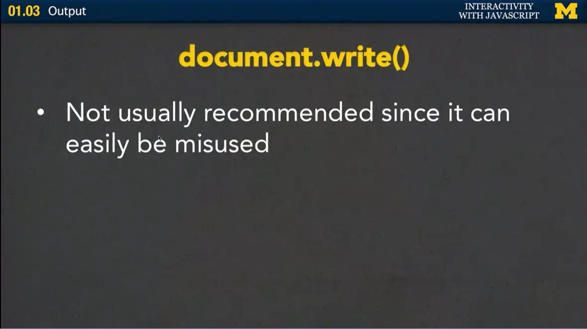
</p>

Because sometimes if you&#39;re misusing it, you can overwrite other things
that exist. So, **document.write** is something you just want to use
when you&#39;re beginning and you don&#39;t know some of the more complex
methods.
<!--~~~~~~~~~~~~~~~~~~~~~~~~~~~~~~~~~~~~~~~~~~~~~~~~~~~~~~~~~~~~~~~~~~~~~~~~~~~~~~~~~~~~~~~~~~~~-->
<!--~~~~~~~~~~~~~~~~~~~~~~~~~~~~~~~~~ 38. innerhtml, #1 (23) ~~~~~~~~~~~~~~~~~~~~~~~~~~~~~~~~~~~-->
<p align="center">
  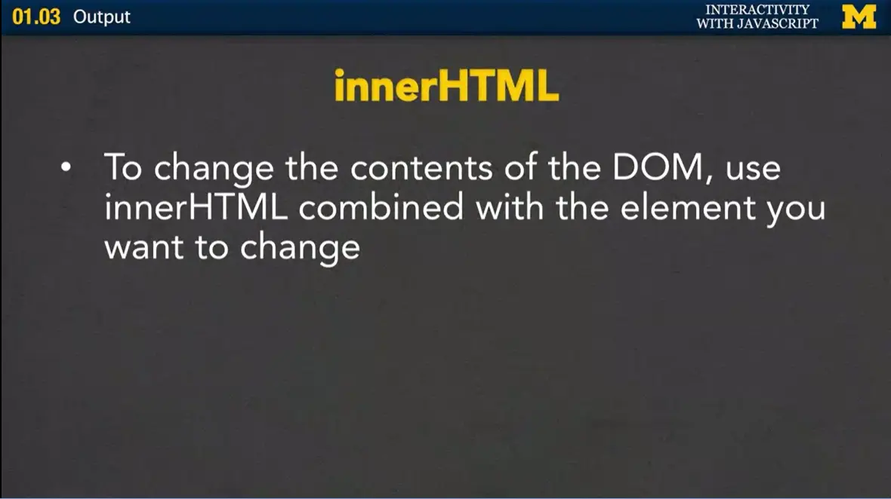
</p>

One of the more complex methods you can use is called innerHTML. And
with innerHTML, you combine this with other functions that return
elements. So, you can&#39;t just say innerHTML or **element.innerHTML**.
You have to say, all right, what part of the page do I want to change?
Oh, I want to change that particular paragraph, all right. But how do I
grab that particular paragraph? Or remember we have these different APIs
that can go and get things for us.
<!--~~~~~~~~~~~~~~~~~~~~~~~~~~~~~~~~~~~~~~~~~~~~~~~~~~~~~~~~~~~~~~~~~~~~~~~~~~~~~~~~~~~~~~~~~~~~-->
<!--~~~~~~~~~~~~~~~~~~~~~~~~~~~~~~~~~ 39. innerhtml, #2 (24) ~~~~~~~~~~~~~~~~~~~~~~~~~~~~~~~~~~~-->
<p align="center">
  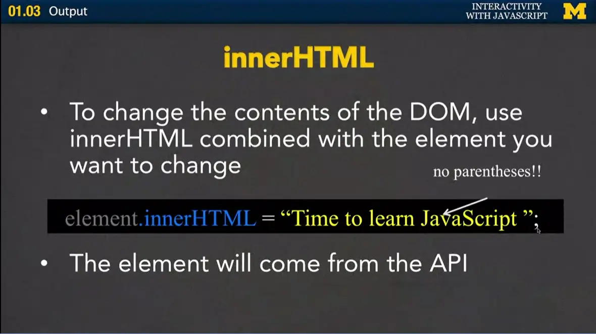
</p>

In this case, I have element which is hopefully we&#39;ll find something
using the API that in your HTML equals time to learn JavaScript. I
wanted you to recognize something right away. When we use document dot
write alert and prompt we had parenthesis around the side, here. We
don&#39;t have that anymore. Instead, we use an equal and we just have it
ending with a semicolon. No parenthesis when you&#39;re using
**inner.HTML**. How do you figure that out when you&#39;re coding? You
don&#39;t. You just keep coding and practicing and after a while, it
becomes second nature to you, all right?

When I talk about this kind of generic element, I didn&#39;t make it a
color that&#39;s something that you need to grab using the API. Let me give
you an example of something we can do using innerHTML.
<!--~~~~~~~~~~~~~~~~~~~~~~~~~~~~~~~~~~~~~~~~~~~~~~~~~~~~~~~~~~~~~~~~~~~~~~~~~~~~~~~~~~~~~~~~~~~~-->
<!--~~~~~~~~~~~~~~~~~~~~~~ 40. document.getelementbyid().innerhtml (24) ~~~~~~~~~~~~~~~~~~~~~~~~-->
<p align="center">
  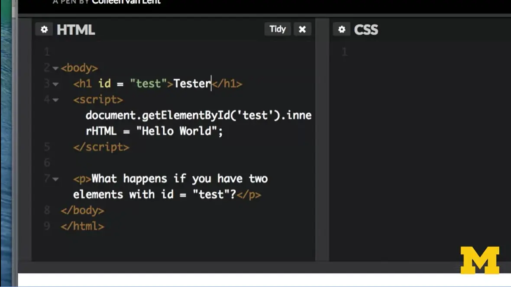
</p>

Let&#39;s look at this, what I&#39;ve done is I made an **h1** heading and
I&#39;ve given it the id of test. I also have a paragraph element a little
bit further down that just says, hey what happens if I&#39;d messed with
this code?
<!--~~~~~~~~~~~~~~~~~~~~~~~~~~~~~~~~~~~~~~~~~~~~~~~~~~~~~~~~~~~~~~~~~~~~~~~~~~~~~~~~~~~~~~~~~~~~-->
<!--~~~~~~~~~~~~~~~~~~~~~~~~~~~~~~~~ 41. h1 id = 'test' (xx) ~~~~~~~~~~~~~~~~~~~~~~~~~~~~~~~~~~~-->
<p align="center">
  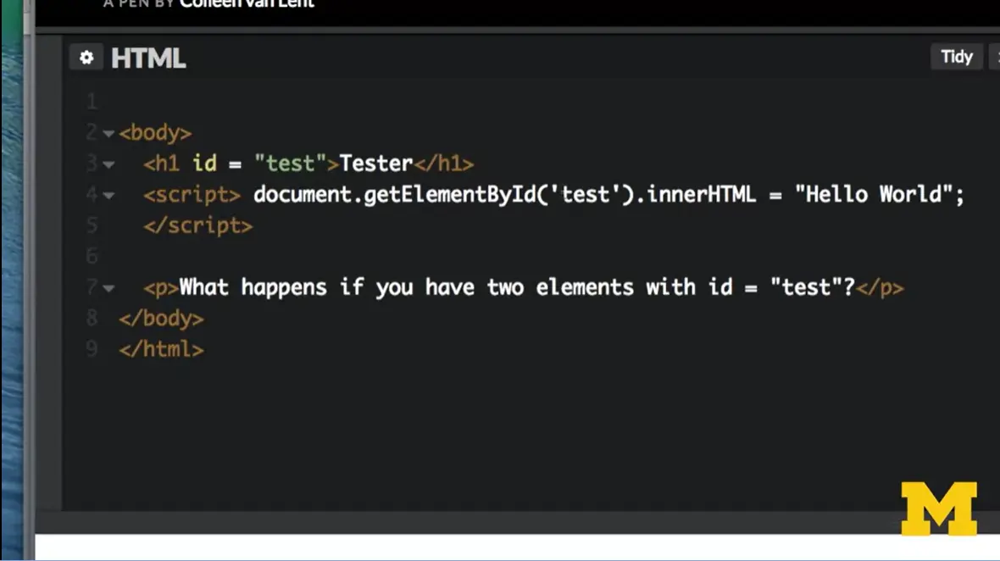
</p>

All right, so I want you to look as closely as you can. You might be on
a small screen. You might not be able to see it. Is that in my h1
heading, I actually have the words tester, but if you look at the web
page, it says Hello World. Well, how did I do that? It&#39;s pretty simple,
actually. Because you can go in, and I can say
**document.getElementById**. Test. It&#39;s going to grab, it&#39;s going to
look through the page and go where, where can I find something that says
ID equals test. There it is. All right, now I want to change whatever
used to be in there and replace it with the words, Hello World. This is
kind of what happens when this is a weird example, but all early
examples are weird examples. Because you just want to get your feet wet.
<!--~~~~~~~~~~~~~~~~~~~~~~~~~~~~~~~~~~~~~~~~~~~~~~~~~~~~~~~~~~~~~~~~~~~~~~~~~~~~~~~~~~~~~~~~~~~~-->
<!--~~~~~~~~~~~~~~~~~~ 42. multiple classes but only one id recommended (xx) ~~~~~~~~~~~~~~~~~~~-->
<p align="center">
  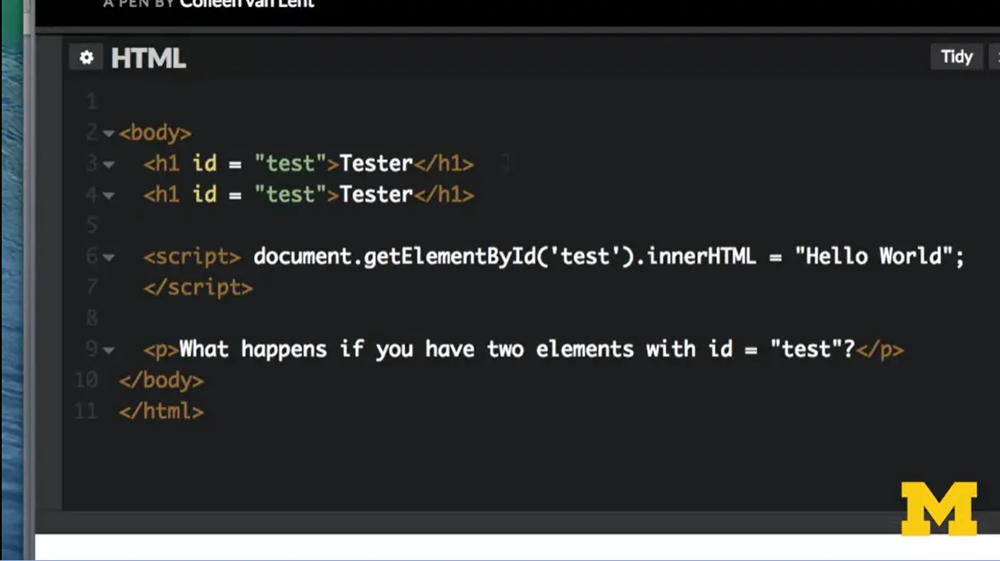
</p>

But I did want you to look at what happens if I do this. Back from your
days of learning CSS, you might remember that in general, you can expect
to see multiple classes. But you&#39;re making this contract or rule that
says, you really should see each ID only once.

JavaScript is expecting you to keep that rule. When you do something get
element by ID, JavaScript thinks there&#39;s only one out there. I&#39;m going
to stop as soon as I find that one.
<!--~~~~~~~~~~~~~~~~~~~~~~~~~~~~~~~~~~~~~~~~~~~~~~~~~~~~~~~~~~~~~~~~~~~~~~~~~~~~~~~~~~~~~~~~~~~~-->
<!--~~~~~~~~~~~~~~~~~~~~~~~~~~~ 43. two elements with same id (xx) ~~~~~~~~~~~~~~~~~~~~~~~~~~~~~-->
<p align="center">
  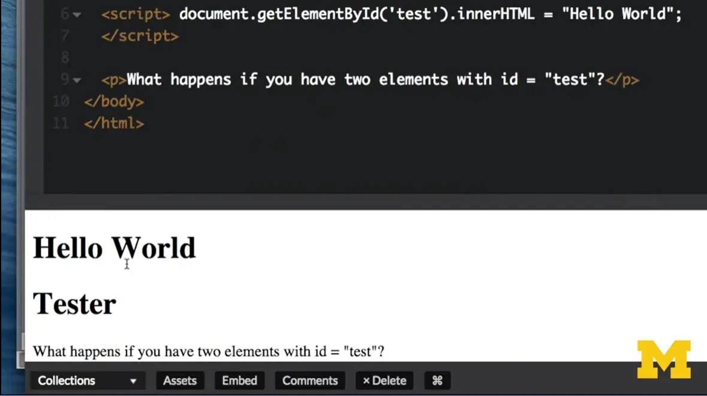
</p>

As you can see down here, it changed the first one it found. It didn&#39;t
change the second one it found, okay? All right.
<!--~~~~~~~~~~~~~~~~~~~~~~~~~~~~~~~~~~~~~~~~~~~~~~~~~~~~~~~~~~~~~~~~~~~~~~~~~~~~~~~~~~~~~~~~~~~~-->
<!--~~~~~~~~~~~~~~~~~~~~~~~~~~~~~~~~~~ 44. console.log (xx) ~~~~~~~~~~~~~~~~~~~~~~~~~~~~~~~~~~~~-->
<p align="center">
  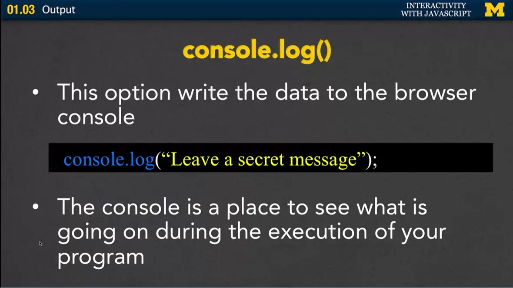

Let&#39;s go play with the last output method I have for you today.
**document.write** and enter HTML. Write directly into the browser
screen. What we have in this last option is something that doesn&#39;t
write to the browser screen, but it does write to the browser console.
Console dot log takes a message and says you know what, I want to store
this information some place. But I want it to be something that not
necessarily pops up and everyone can see.

The console&#39;s a place to see what&#39;s going on in your program during
execution. If you haven&#39;t used the console before, you might not
realize that it&#39;s even there. But I&#39;m hoping you have when you were
doing your CSS.
<!--~~~~~~~~~~~~~~~~~~~~~~~~~~~~~~~~~~~~~~~~~~~~~~~~~~~~~~~~~~~~~~~~~~~~~~~~~~~~~~~~~~~~~~~~~~~~-->
<!--~~~~~~~~~~~~~~~~~~~~~~~~~~ 45.  (xxx) ~~~~~~~~~~~~~~~~~~~~~~~~~~~~-->
<p align="center">
  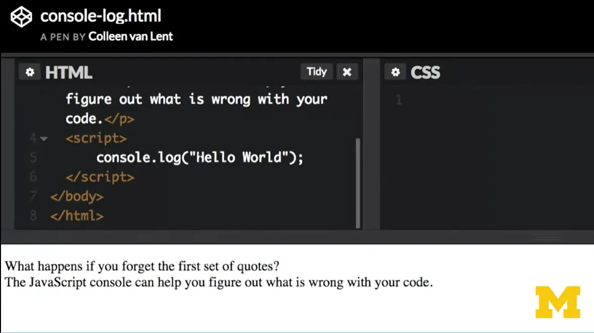
</p>

Let&#39;s take a look at this example. In my HTML up here, you can see that
I have **console.log** Hello World. Nothing too exciting going on here.
<!--~~~~~~~~~~~~~~~~~~~~~~~~~~~~~~~~~~~~~~~~~~~~~~~~~~~~~~~~~~~~~~~~~~~~~~~~~~~~~~~~~~~~~~~~~~~~-->
<!--~~~~~~~~~~~~~~~~~~~~~~~~~~ 46.  (xxx) ~~~~~~~~~~~~~~~~~~~~~~~~~~~~-->
<p align="center">
  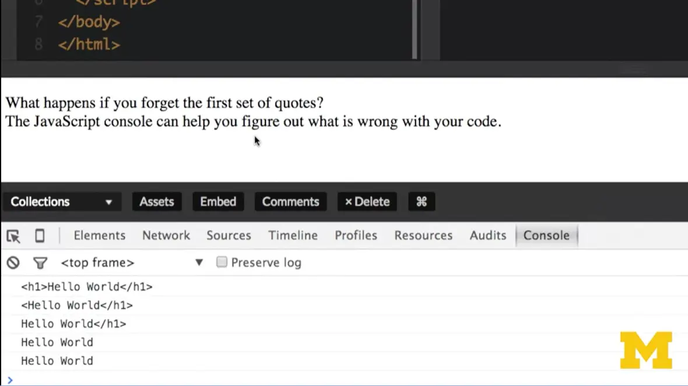
</p>

But if you look at the actual browser, hm, it&#39;s not there. It doesn&#39;t
show up like it did with document.ray. Where did it go? Well, it&#39;s
actually in the Console of your browser. I&#39;m going to go down here. I
did inspect element, and I checked the Console. Oh, you can see Hello
World showed up here.
<!--~~~~~~~~~~~~~~~~~~~~~~~~~~~~~~~~~~~~~~~~~~~~~~~~~~~~~~~~~~~~~~~~~~~~~~~~~~~~~~~~~~~~~~~~~~~~-->
<!--~~~~~~~~~~~~~~~~~~~~~~~~~~ 47.  (xxx) ~~~~~~~~~~~~~~~~~~~~~~~~~~~~-->
<p align="center">
  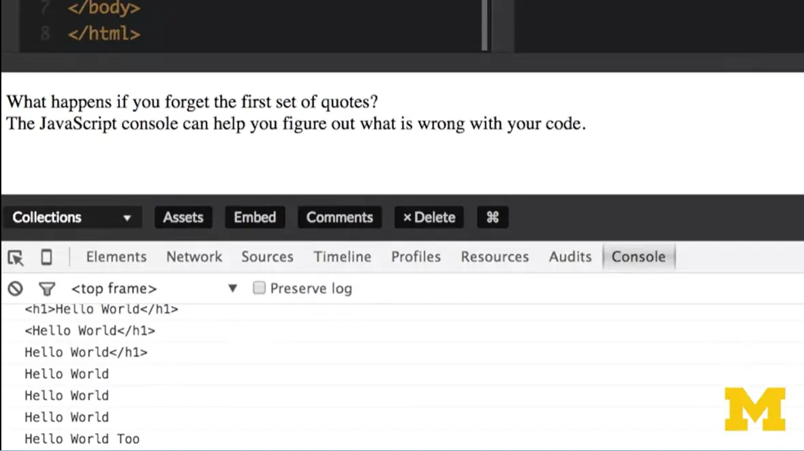
</p>

What happens if I change the code to Hello World Too.

You're sending yourself these little secret messages that can help you
debug your code. You can log things, you can leave little notes for
yourself, you can do debugging tests. You can even log the things that
other people have been writing in. And so, this is a really handy tool
if you want to do development but not let everyone see exactly what you
are doing. We&#39;re going to come back to this example in just a second,
but first I want to talk to you about why you should be utilizing the
console by now, if you haven&#39;t.
<!--~~~~~~~~~~~~~~~~~~~~~~~~~~~~~~~~~~~~~~~~~~~~~~~~~~~~~~~~~~~~~~~~~~~~~~~~~~~~~~~~~~~~~~~~~~~~-->
<!--~~~~~~~~~~~~~~~~~~~~~~~~~~ 48.  (xxx) ~~~~~~~~~~~~~~~~~~~~~~~~~~~~-->
<p align="center">
  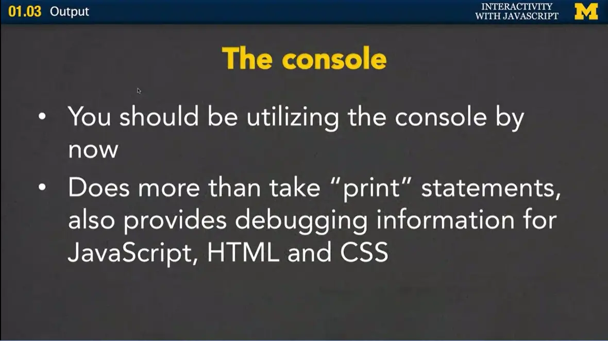
</p>

The console does more than just take these print statements. It also
provides debugging information for JavaScript, HTML, and CSS. By going
in and looking at it, you&#39;re going to be able to help yourself become a
much better programmer.
<!--~~~~~~~~~~~~~~~~~~~~~~~~~~~~~~~~~~~~~~~~~~~~~~~~~~~~~~~~~~~~~~~~~~~~~~~~~~~~~~~~~~~~~~~~~~~~-->
<!--~~~~~~~~~~~~~~~~~~~~~~~~~~ 49.  (xxx) ~~~~~~~~~~~~~~~~~~~~~~~~~~~~-->
<p align="center">
  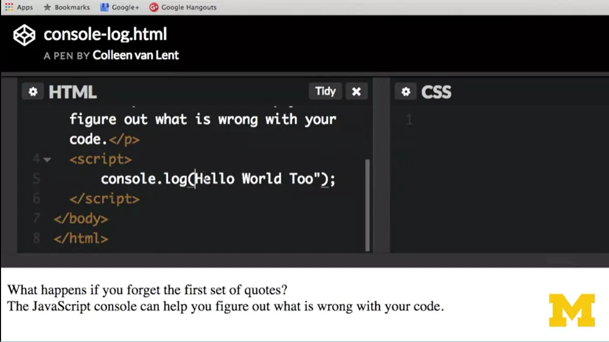
</p>

Let&#39;s take a look at just doing some debugging with the JavaScript.
I&#39;m going to go in here and I&#39;m going to accidentally forget to put in
my first quotes, all right. But if we didn&#39;t know that there&#39;s
anything going on or that anything is supposed to show up.
<!--~~~~~~~~~~~~~~~~~~~~~~~~~~~~~~~~~~~~~~~~~~~~~~~~~~~~~~~~~~~~~~~~~~~~~~~~~~~~~~~~~~~~~~~~~~~~-->
<!--~~~~~~~~~~~~~~~~~~~~~~~~~~ 50.  (xxx) ~~~~~~~~~~~~~~~~~~~~~~~~~~~~-->
<p align="center">
  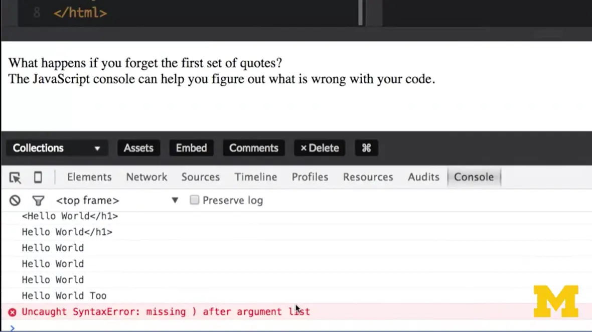
</p>

You might not realize that there&#39;s a typo but inside the console,
it&#39;ll show you pretty much along the way add, hey, anything in red
means we found an error. So red lines usually means either you have a
JavaScript error or you linked to a file that didn&#39;t exist. When I put
it back in, no more red syntax error.

I really want to stress this to you right now. I need you to stop and
make sure that you know how to access the console on your machine. One
of the things that really helps other people help you is when you can
pinpoint where exactly your code is going wrong. You might not know
what&#39;s going wrong, but you're saying somewhere in this line of code
I&#39;m getting an error. This kind of ability to help yourself debug is
going to be critical to going on and advancing in this course.
<!--~~~~~~~~~~~~~~~~~~~~~~~~~~~~~~~~~~~~~~~~~~~~~~~~~~~~~~~~~~~~~~~~~~~~~~~~~~~~~~~~~~~~~~~~~~~~-->
<!--~~~~~~~~~~~~~~~~~~~~~~~~~~ 51.  (xxx) ~~~~~~~~~~~~~~~~~~~~~~~~~~~~-->
<p align="center">
  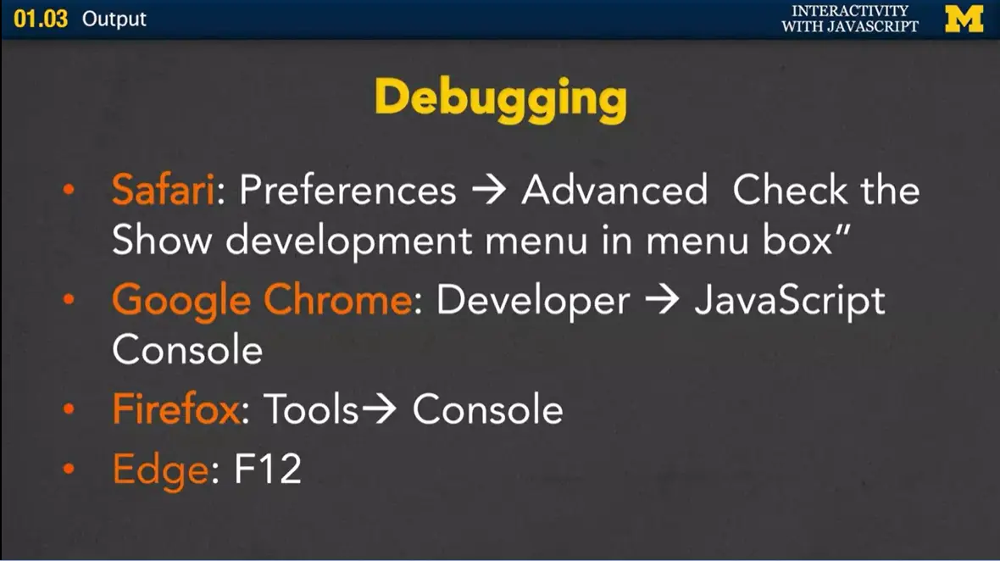
</p>

If I&#39;m going to ask you debug, I should probably tell you how you can
debug. If you&#39;re using Safari, you&#39;re going to need to go to
Preferences &gt; Advanced. Once you go there, you should be able to check
the Show development menu in menu box. And that will show you some of
the different JavaScript errors and tools that you have available. In
Google Chrome, you go to Developer, and then JavaScript Console. If
you&#39;ve been coding with me in the past, you know that my shortcut is
always to right click, inspect element, and boom, there it is for you.
If you&#39;re using Firefox, you want to go to Tools and then Console.
Firefox is, believed by many to be the best browser to use when you&#39;re
doing debugging for JavaScript. If you&#39;re using Edge or Internet
Explorer, typically hitting F12 will bring up the different JavaScript
and development tools that you can use to improve your page. All right,
so let&#39;s review.
<!--~~~~~~~~~~~~~~~~~~~~~~~~~~~~~~~~~~~~~~~~~~~~~~~~~~~~~~~~~~~~~~~~~~~~~~~~~~~~~~~~~~~~~~~~~~~~-->
<!--~~~~~~~~~~~~~~~~~~~~~~~~~~ 52.  (xxx) ~~~~~~~~~~~~~~~~~~~~~~~~~~~~-->
<p align="center">
  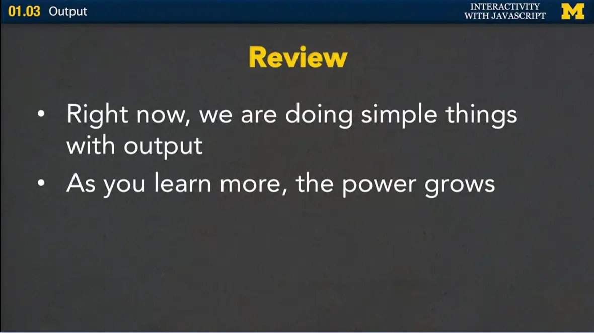
</p>

Right now, we&#39;re doing really simple things, and I understand that.
It&#39;s not that exciting to just print things out to the screen or have
little pop-up boxes coming up. But we need to do these small steps to
help you gain the confidence to go on and write more complex bits of
code.

As you learn more, the power that you&#39;re going to have to manipulate
the dom is really going to get quite impressive. But for now, just make
the small mistakes, learn how to debug the small mistakes, and then that
way you&#39;ll be able to build your confidence slowly. Good luck.

<h4>Trying to Create and Debug Your Own Output</h4>

In the previous lecture I showed you how you can create output using
JavaScript. My code examples are all on CodePen and I have included a
link to each of the examples in the Resources section of that module.
With CodePen you get your own copy of my code that you can change. I
encourage you to experiment with that code, or even better try
recreating it yourself using an editor such as TextEdit, Sublime, or
Notepad++.

If you are using a laptop or desktop to do your coding, make sure to use
the console window of your browser to look for errors in your code. In
programming, looking for and correcting errors is called &#34;debugging.&#34;
Below I have a screen shot of my code, the (empty) browser, and the
error message I get from the Chrome console. Don&#39;t worry if error
message itself doesn&#39;t make sense, that is something that comes with
time, the important part is to look for the line number, in this case
line 9. The console will always try to tell you about where it ran into
a problem. In this case, I didn&#39;t include the quotes to end the message
for the alert.
<!--~~~~~~~~~~~~~~~~~~~~~~~~~~~~~~~~~~~~~~~~~~~~~~~~~~~~~~~~~~~~~~~~~~~~~~~~~~~~~~~~~~~~~~~~~~~~-->
<!--~~~~~~~~~ 53. code, an empty browser, and an error message in chrome console (36) ~~~~~~~~~~-->
<p align="center">
  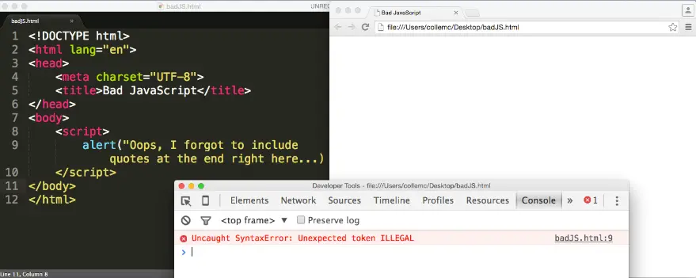
</p>

<h2 id="Week1-04">Week 1-04. Variables</h2>

<https://codepen.io/ColleenEMc/pen/jbYEEW>

<!--~~~~~~~~~~~~~~~~~~~~~~~~~~~~~~~~~~~~~~~~~~~~~~~~~~~~~~~~~~~~~~~~~~~~~~~~~~~~~~~~~~~~~~~~~~~~-->
<!--~~~~~~~~~~~~~~~~~~~~~~~~~~~~~~~~ 54. variables (1.04) (36) ~~~~~~~~~~~~~~~~~~~~~~~~~~~~~~~~~-->
<p align="center">
  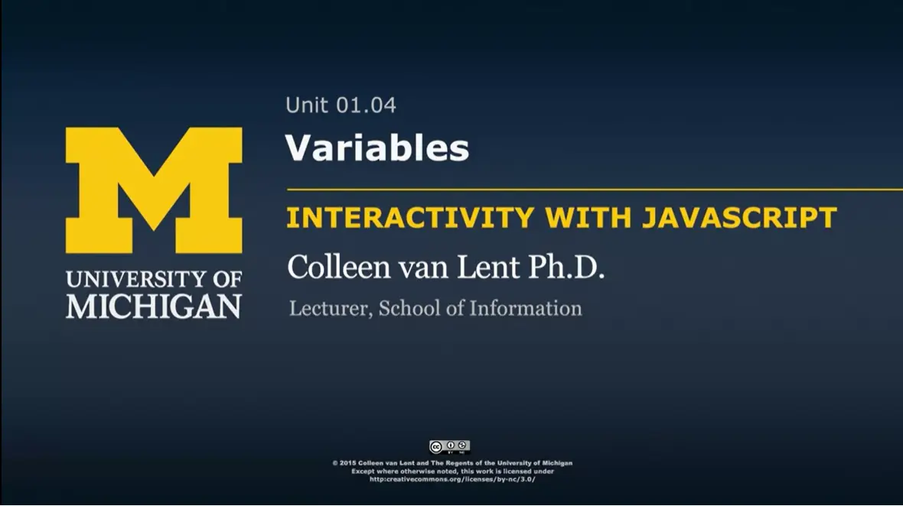
</p>

Hi, everybody. Today we&#39;re going to learn about JavaScript variables.
An important part of programming is learning how you can save data.
Because by saving data, you can reuse it and give you program that&#39;s
impression that&#39;s kind of intelligent and knows the user very well.

<!--~~~~~~~~~~~~~~~~~~~~~~~~~~~~~~~~~~~~~~~~~~~~~~~~~~~~~~~~~~~~~~~~~~~~~~~~~~~~~~~~~~~~~~~~~~~~-->
<!--~~~~~~~~~~~~~~~~~~~~~~~~~~~ 55. storing data in variables (37) ~~~~~~~~~~~~~~~~~~~~~~~~~~~~~-->
<p align="center">
  
</p>

In JavaScript, data is stored in what we call variables, and it&#39;s very
easy to use variables in your programming. The only important part is
that you need to tell the computer very specifically, hey, I need you to
save something for me. And this is how we do it. We start by using the
keyword var, V-A-R. When we&#39;re using the editor, hopefully this will
show up in some special color that indicates, ooh, this is a special
word to the computer. Next, you need to give your variable a name. Now,
I chose the name "name" here, but you can imagine it being age, first
name, last name, dob for date of birth. The important thing is that it
should be special to you, but not special to the computer.
<!--~~~~~~~~~~~~~~~~~~~~~~~~~~~~~~~~~~~~~~~~~~~~~~~~~~~~~~~~~~~~~~~~~~~~~~~~~~~~~~~~~~~~~~~~~~~~-->
<!--~~~~~~~~~~~~~~~~~ 56. variable name, memory location, value stored (37) ~~~~~~~~~~~~~~~~~~~~-->
<p align="center">
  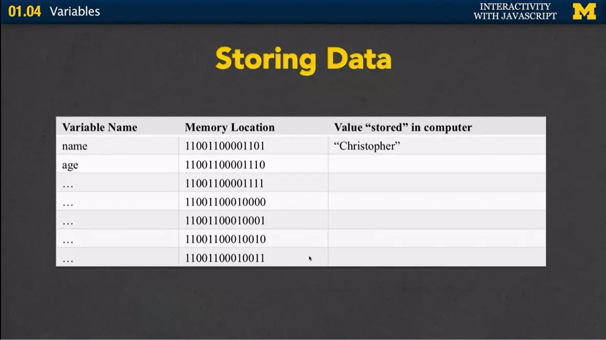
</p>

How does this work? When you declare a variable, you&#39;re basically
telling the computer, let&#39;s stop talking in human talk and let&#39;s talk
computer talk. So here, once you said var name, it reserved a space in
memory. It said oh, okay. I know that I&#39;m talking about position 11011,
blah, blah, blah, blah, blah. But Colleen doesn&#39;t want to talk about
those numbers, she wants to use the actual variable name. So, whenever
she talks about name, I know she actually wants me to use the value,
Christopher. There might be some variables that you&#39;ve declared, such
as age, that you haven&#39;t put anything in there yet.

The important thing to know is that computers aren&#39;t smart. Computers
are just trying to give you a way to avoid remembering big long numbers
and instead using English words.

<!--~~~~~~~~~~~~~~~~~~~~~~~~~~~~~~~~~~~~~~~~~~~~~~~~~~~~~~~~~~~~~~~~~~~~~~~~~~~~~~~~~~~~~~~~~~~~-->
<!--~~~~~~~~~~~~~~~~~~~~~~~~~~~~~~ 57. variable name rules (38) ~~~~~~~~~~~~~~~~~~~~~~~~~~~~~~~~-->
<p align="center">
  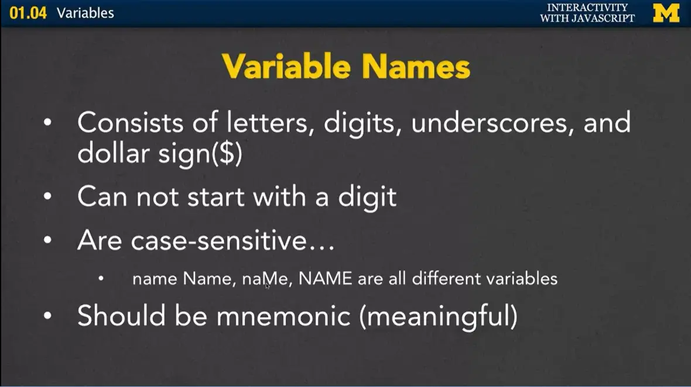
</p>

When you come up with your variable name, there&#39;s a few rules that you
need to follow. Every variable name can have letters, digits,
underscores, and dollar signs in it. Now to be honest, I don&#39;t put
dollar signs in my JavaScript variable names because it can be very
confusing, particular for those people who know multiple programming
language. I tend to stick to letters, and sometimes digits and
underscores.

When you do come up with a variable name, even though numbers are
allowed, your variable can&#39;t start with a number. That number has to be
somewhere else in the middle or the end.

Also, variables are case-sensitive. What that means is that lower case
name is not the same thing as name with a capital N or name with a
capital M or name on all capitals. To the computer these are all
different variables. So, just be careful when you&#39;re programming and be
consistent.

Also, this last one isn&#39;t a rule so much as a suggestion that I want to
convey to you. Make your variable names meaningful or mnemonic as the
computer science term we use. That means, if the variable is storing
someone&#39;s name, call it name. If it&#39;s storing age, call it age. You
could get away with calling it &#39;yyy&#39; or &#39;bbb&#39;, just don&#39;t do it.
Okay? Taking a little bit of time to give meaningful names will save you
a lot of heart ache later.
<!--~~~~~~~~~~~~~~~~~~~~~~~~~~~~~~~~~~~~~~~~~~~~~~~~~~~~~~~~~~~~~~~~~~~~~~~~~~~~~~~~~~~~~~~~~~~~-->
<!--~~~~~~~~~~~~~~~~~~~~~~~~~~~~~~ 58. variable assignments (39) ~~~~~~~~~~~~~~~~~~~~~~~~~~~~~~~-->
<p align="center">
  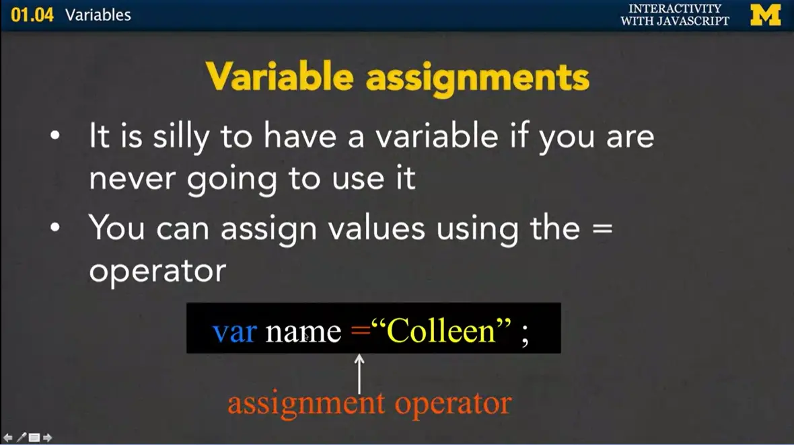
</p>

If you&#39;re going to go to the trouble of declaring a variable and
telling the computer to save a spot in memory for it, it&#39;s pretty silly
if you don&#39;t then use your variable. And what I mean by use it, is you
should assign some sort of value to it.

When we assign things in computer science, we use what we call the
equal, or assignment operator. So, it looks like an equal sign, but we
call it assignment, because what we&#39;re doing is we&#39;re not saying hey,
are these two things the same, we&#39;re saying take the value and store it
into the variable.

So here I have **var** name, and instead of just leaving it at that, I
say, hey, I want you to store the name Colleen in there, all right.
<!--~~~~~~~~~~~~~~~~~~~~~~~~~~~~~~~~~~~~~~~~~~~~~~~~~~~~~~~~~~~~~~~~~~~~~~~~~~~~~~~~~~~~~~~~~~~~-->
<!--~~~~~~~~~~~~~~~~~~~~~~~~~~~~~ 59. assignment statements (39) ~~~~~~~~~~~~~~~~~~~~~~~~~~~~~~~-->
<p align="center">
  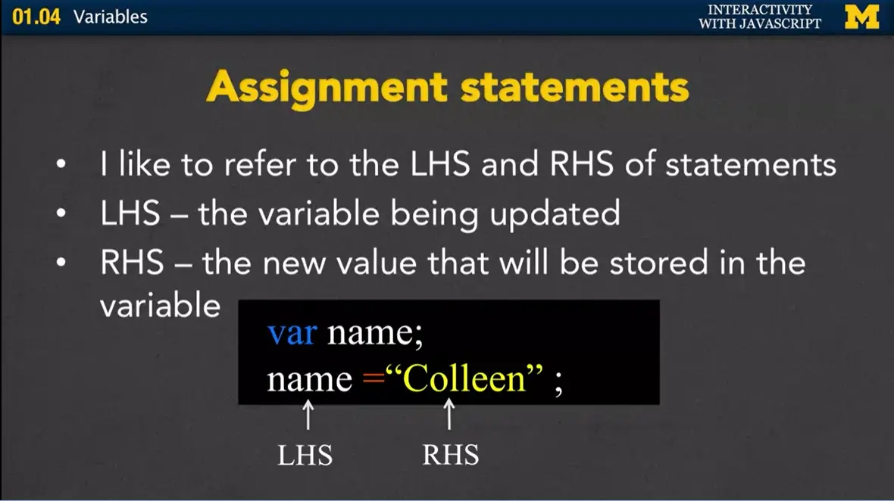
</p>

This is where when we start talking about assignment statements, I refer
to LHS and RHS. I mean left-hand side and right-hand side of statements.
The left-hand side should always be the variable, alright so this is
going to be in our case name or some sort of element, something that we
want to change. The right-hand side is going to be that new value that
will be stored in the variable. Sometimes, the right-hand side can be
pretty long and complex.

Right here would be an example where I&#39;m just having, I declare my
variable, and then later I want to update it. I say, name equals
Colleen. This works really well.
<!--~~~~~~~~~~~~~~~~~~~~~~~~~~~~~~~~~~~~~~~~~~~~~~~~~~~~~~~~~~~~~~~~~~~~~~~~~~~~~~~~~~~~~~~~~~~~-->
<!--~~~~~~~~~~~~~~~~~~~~~~~~~~~ 60. assignment statements, #2 (40) ~~~~~~~~~~~~~~~~~~~~~~~~~~~~~-->
<p align="center">
  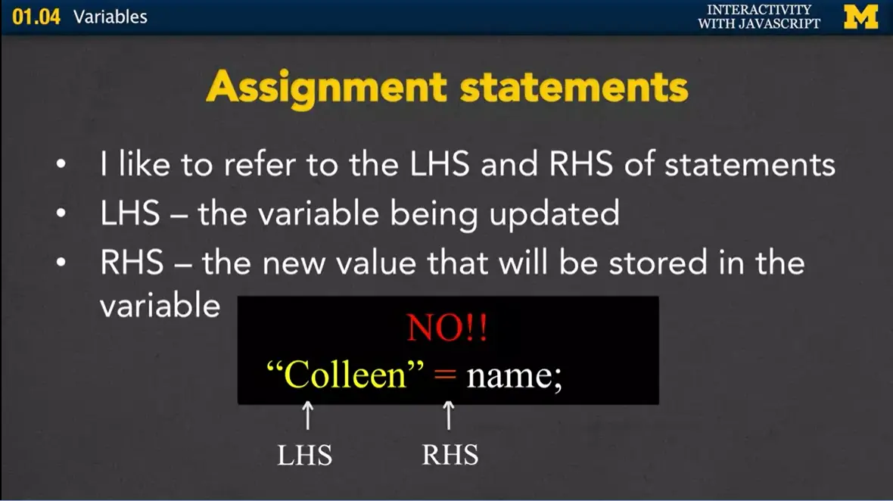
</p>

What I need people to avoid is doing something along this line, where
they switch the left-hand side and the right-hand side. Mathematically,
if you&#39;re a math major, this makes perfect sense and it&#39;s the same
thing, but it&#39;s not okay in programming. Always put the variable on the
left-hand side.

All right, so I&#39;m going to show you a few examples of how you might use
a variable. If you remember when we talked about output, one way that we
were able to produce output also was a way to generate input, and that
was the prompt.
<!--~~~~~~~~~~~~~~~~~~~~~~~~~~~~~~~~~~~~~~~~~~~~~~~~~~~~~~~~~~~~~~~~~~~~~~~~~~~~~~~~~~~~~~~~~~~~-->
<!--~~~~~~~~~~~~~~~~~~~~~~~~~~~~~~~~ 61. using a variable (40) ~~~~~~~~~~~~~~~~~~~~~~~~~~~~~~~~~-->
<p align="center">
  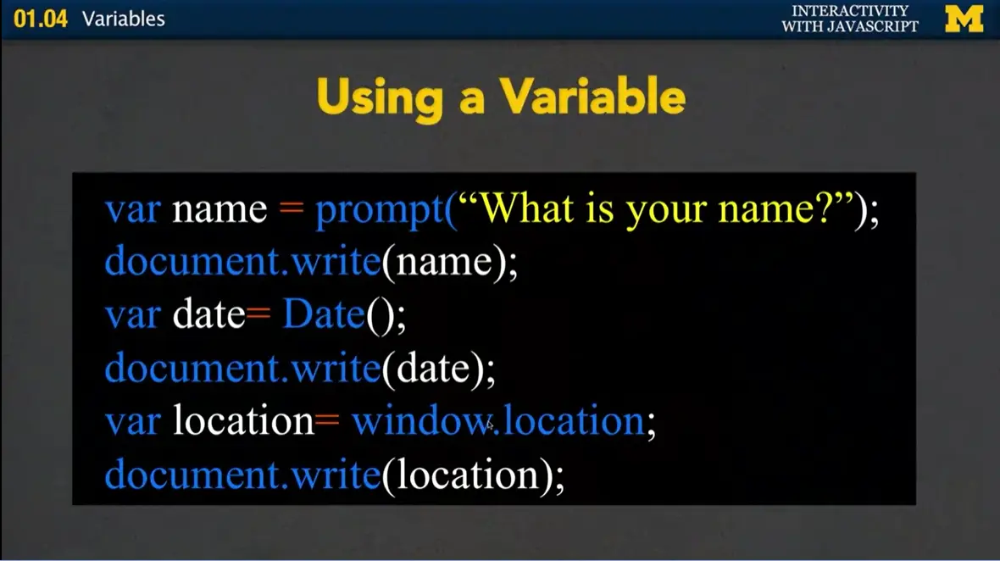
</p>

When you use the prompt, it&#39;s waiting for you to type something in and
when you type it in, it&#39;s going to store that in the name. Now can we
use that whenever we want to? We can say document dot write name and
we&#39;ll promote to the screen. Next, we can use another variable and say
hey, I want you to use this JavaScript function called date. And date is
going to return what the current date and time is, right now when
you&#39;re looking at the page. Then you can write that information out.
You can even use more from the API saying, you know what? I want to know
where this window is. What&#39;s the location of this window? And you can
write that out as well.
<!--~~~~~~~~~~~~~~~~~~~~~~~~~~~~~~~~~~~~~~~~~~~~~~~~~~~~~~~~~~~~~~~~~~~~~~~~~~~~~~~~~~~~~~~~~~~~-->
<!--~~~~~~~~~~~~~~~~~~~~~~~~~~ 62.  (41) ~~~~~~~~~~~~~~~~~~~~~~~~~~~~-->
<p align="center">
  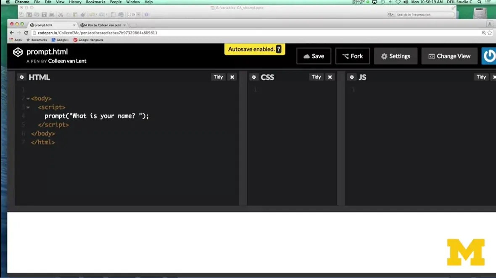
</p>

Let&#39;s look at a quick example of how we can use that. Let&#39;s start with
the simple code we used before when we were learning about prompts.
<!--~~~~~~~~~~~~~~~~~~~~~~~~~~~~~~~~~~~~~~~~~~~~~~~~~~~~~~~~~~~~~~~~~~~~~~~~~~~~~~~~~~~~~~~~~~~~-->
<!--~~~~~~~~~~~~~~~~~~~~~~~~~~ 63.  (41) ~~~~~~~~~~~~~~~~~~~~~~~~~~~~-->
<p align="center">
  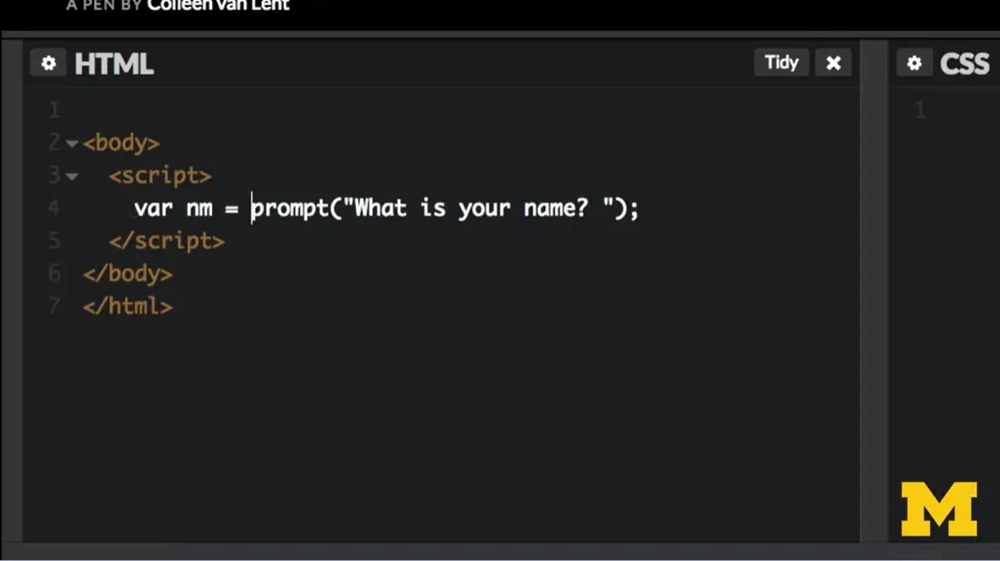
</p>

Only now, I want to combine it with a variable, so I am going to go in
here and do var, and I&#39;m actually just going to call it nm. The reason
I&#39;m doing that instead of name is because I really want to make people
realize that the name you give your variable. Doesn&#39;t really matter, it
can be anything you want. Just because I call it name, doesn&#39;t mean you
have to.
<!--~~~~~~~~~~~~~~~~~~~~~~~~~~~~~~~~~~~~~~~~~~~~~~~~~~~~~~~~~~~~~~~~~~~~~~~~~~~~~~~~~~~~~~~~~~~~-->
<!--~~~~~~~~~~~~~~~~~~~~~~~~~~ 64.  (42) ~~~~~~~~~~~~~~~~~~~~~~~~~~~~-->
<p align="center">
  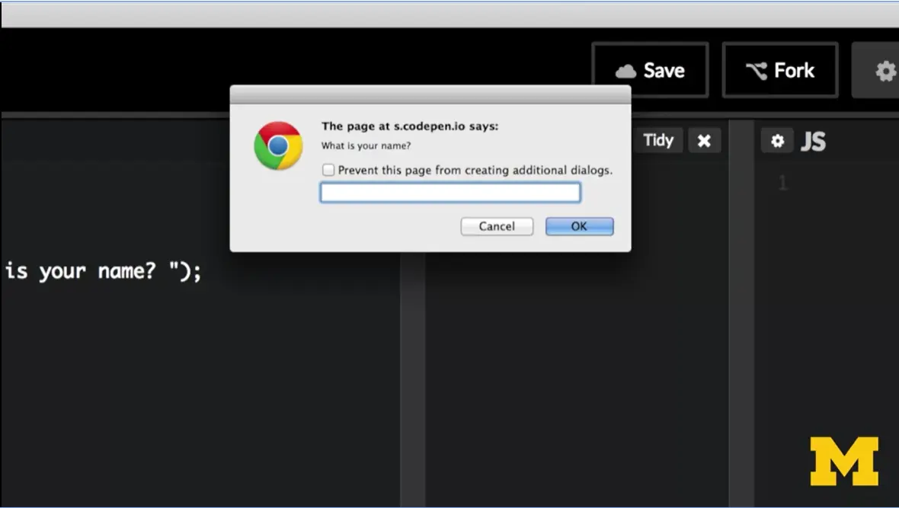
</p>

And as soon as I did this, the prompt statement showed up, and I put in
Colleen. Great, it worked, but we didn&#39;t do anything with it. Let&#39;s
add a bit more code. Now I am going to comment out this line. You can
see why, because otherwise it&#39;ll keep asking us to prompt things.
We&#39;ll comment that out when we&#39;re done. All right.
<!--~~~~~~~~~~~~~~~~~~~~~~~~~~~~~~~~~~~~~~~~~~~~~~~~~~~~~~~~~~~~~~~~~~~~~~~~~~~~~~~~~~~~~~~~~~~~-->
<!--~~~~~~~~~~~~~~~~~~~~~~~~~~ 65.  (42) ~~~~~~~~~~~~~~~~~~~~~~~~~~~~-->
<p align="center">
  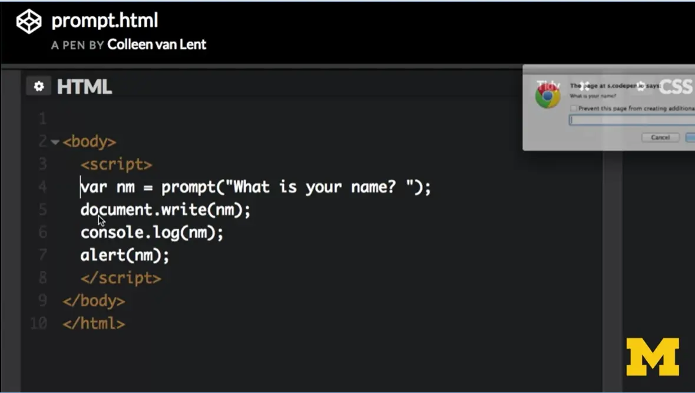
</p>

I have this variable called **name**, now I can do something like
**document.write nm**. I can also do **Console.log(nm)**. If you wanted
to you could even put in **alert(nm)**. Let&#39;s put this back in. Might
want to edit all my typing out. What is your name? Well, it is Colleen.
<!--~~~~~~~~~~~~~~~~~~~~~~~~~~~~~~~~~~~~~~~~~~~~~~~~~~~~~~~~~~~~~~~~~~~~~~~~~~~~~~~~~~~~~~~~~~~~-->
<!--~~~~~~~~~~~~~~~~~~~~~~~~~~ 66.  (43) ~~~~~~~~~~~~~~~~~~~~~~~~~~~~-->
<p align="center">
  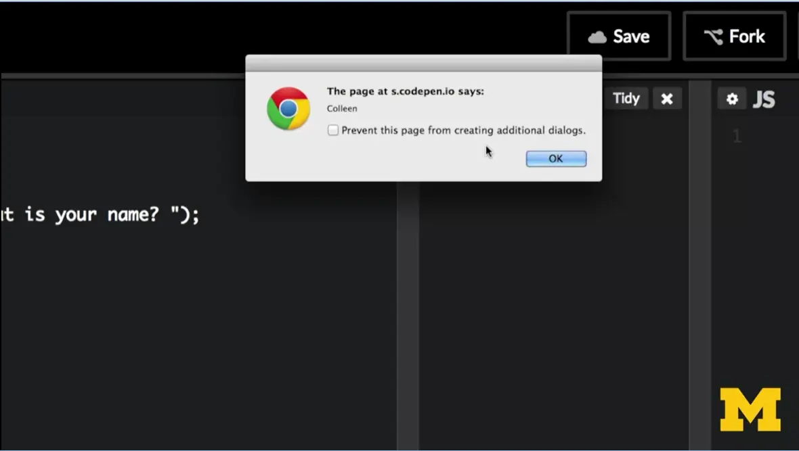
</p>

All right, so the alert popped up, but why didn&#39;t the
**document.write** work? This is a good question, and this is actually
an example where I can go in, that&#39;s what was going on.
<!--~~~~~~~~~~~~~~~~~~~~~~~~~~~~~~~~~~~~~~~~~~~~~~~~~~~~~~~~~~~~~~~~~~~~~~~~~~~~~~~~~~~~~~~~~~~~-->
<!--~~~~~~~~~~~~~~~~~~~~~~~~~~ 67.  (43) ~~~~~~~~~~~~~~~~~~~~~~~~~~~~-->
<p align="center">
  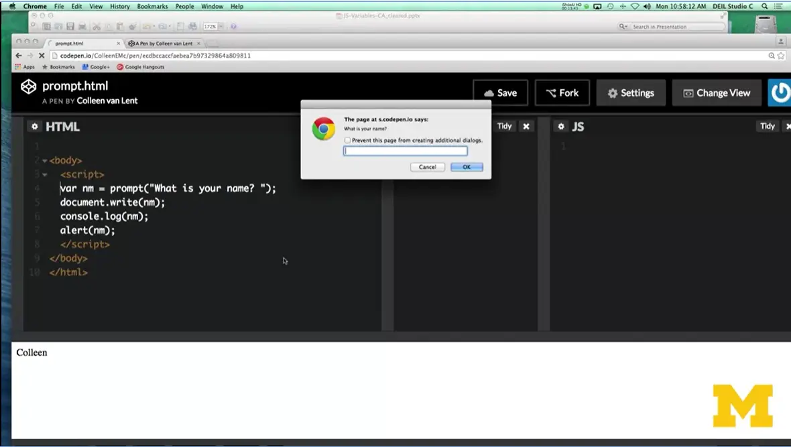
</p>

It was actually waiting for me to hit okay. When it was all done, it
went in and it printed out my name. This is a really simple, quick
example.
<!--~~~~~~~~~~~~~~~~~~~~~~~~~~~~~~~~~~~~~~~~~~~~~~~~~~~~~~~~~~~~~~~~~~~~~~~~~~~~~~~~~~~~~~~~~~~~-->
<!--~~~~~~~~~~~~~~~~~~~~~~~~~~ 68.  (44) ~~~~~~~~~~~~~~~~~~~~~~~~~~~~-->
<p align="center">
  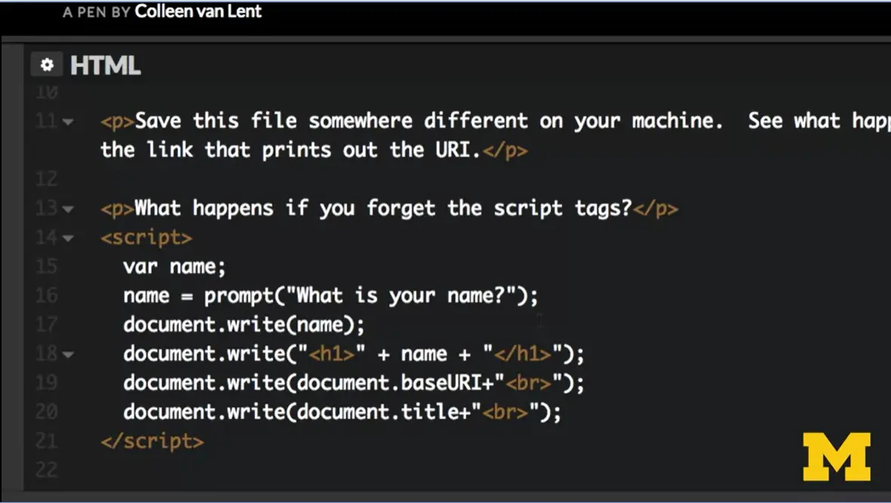
</p>

Let&#39;s do one that has a little bit more going on with it. All right, in
this case we&#39;re going to talk a little bit more about how you can add
different things together, and how you can assign your variables using
more than just prompts. In this case, I declared a variable. We&#39;re
going to ask for the name. I write out the name. I write out the name
twice actually. Once with my name and then another time with an H1
heading. And then I just wanted to show you that you could also grab
other information from the document, itself, such as the URL and the
title.
<!--~~~~~~~~~~~~~~~~~~~~~~~~~~~~~~~~~~~~~~~~~~~~~~~~~~~~~~~~~~~~~~~~~~~~~~~~~~~~~~~~~~~~~~~~~~~~-->
<!--~~~~~~~~~~~~~~~~~~~~~~~~~~ 69.  (44) ~~~~~~~~~~~~~~~~~~~~~~~~~~~~-->
<p align="center">
  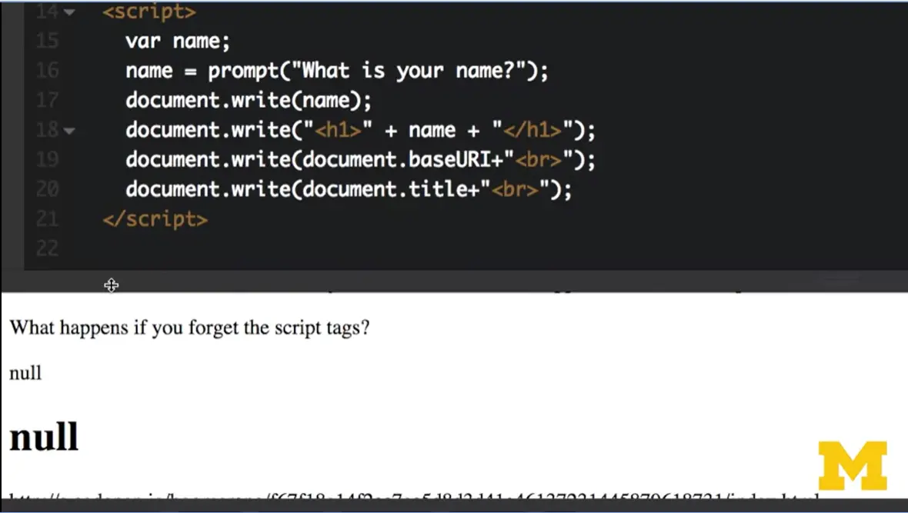
</p>

First thing I&#39;m going to show you is, it says null and null. And
that&#39;s kind of weird, and it might happen to you and it might not. The
first thing I wanted to print out was my name, but I didn&#39;t type
anything in the prompt. When the JavaScript doesn&#39;t know what to do,
when it doesn&#39;t know what value should have been in there, it&#39;s going
to assign it a value of null.
<!--~~~~~~~~~~~~~~~~~~~~~~~~~~~~~~~~~~~~~~~~~~~~~~~~~~~~~~~~~~~~~~~~~~~~~~~~~~~~~~~~~~~~~~~~~~~~-->
<!--~~~~~~~~~~~~~~~~~~~~~~~~~~ 70.  (45) ~~~~~~~~~~~~~~~~~~~~~~~~~~~~-->
<p align="center">
  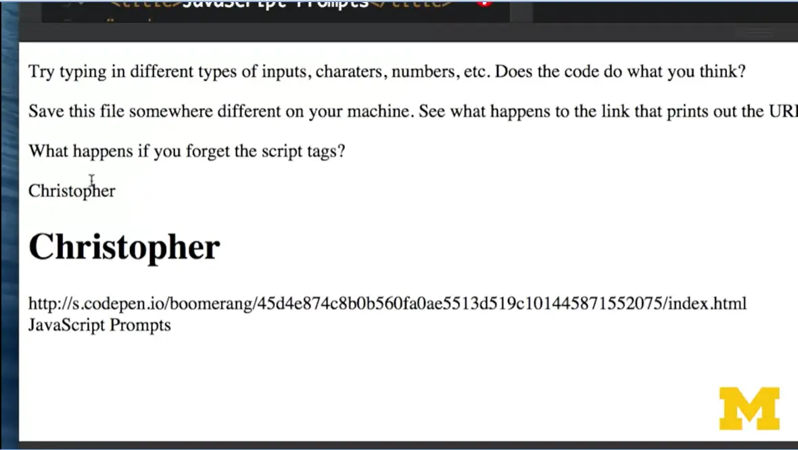
</p>

Let&#39;s run this one more time. I&#39;m going to put in the name Christopher
just in case someone else named Christopher is reading this and they can
feel special. But now you can see it printed out Christopher, the URL,
and the title of my page.
<!--~~~~~~~~~~~~~~~~~~~~~~~~~~~~~~~~~~~~~~~~~~~~~~~~~~~~~~~~~~~~~~~~~~~~~~~~~~~~~~~~~~~~~~~~~~~~-->
<!--~~~~~~~~~~~~~~~~~~~~~~~~~~~~~ 71. 1.04 variables review (45) ~~~~~~~~~~~~~~~~~~~~~~~~~~~~~~~-->
<p align="center">
  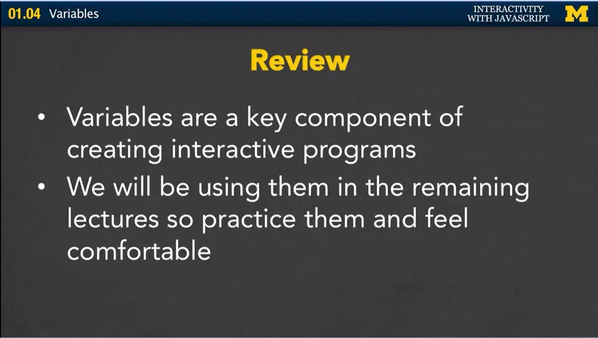
</p>

Variables are a key component of really doing any type of programming
language at all. We&#39;re going to be using them throughout this entire
course, so I need you to practice them and feel comfortable using them.
Go into the code that I have on CodePen or online and change it, and see
if what you do does what you expect it to do. You might create some
errors and that&#39;s okay. That&#39;s a great practice using things that just
consult that log. The most important thing is I want you to understand
how variables work, so that you can use them throughout the rest of the
course. Good luck.

<!--~~~~~~~~~~~~~~~~~~~~~~~~~~~~~~~~~~~~~~~~~~~~~~~~~~~~~~~~~~~~~~~~~~~~~~~~~~~~~~~~~~~~~~~~~~~~-->
<h2 id="Week1-05">Week 1-05. Data Types</h2>
<!--~~~~~~~~~~~~~~~~~~~~~~~~~~~~~~~~~~~~~~~~~~~~~~~~~~~~~~~~~~~~~~~~~~~~~~~~~~~~~~~~~~~~~~~~~~~~-->
<!--~~~~~~~~~~~~~~~~~~~~~~~~~~~~~~~ 72. data types (1.05) (46) ~~~~~~~~~~~~~~~~~~~~~~~~~~~~~~~~~-->
<p align="center">
  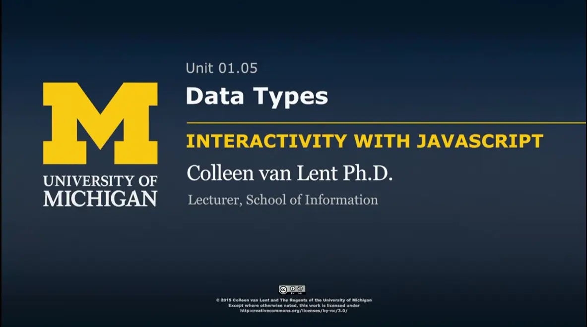
</p>

Once you realize that computers store all of the information using
variables, the next step is to start to learn about the different data
types used in the JavaScript programming language.
<!--~~~~~~~~~~~~~~~~~~~~~~~~~~~~~~~~~~~~~~~~~~~~~~~~~~~~~~~~~~~~~~~~~~~~~~~~~~~~~~~~~~~~~~~~~~~~-->
<!--~~~~~~~~~~~~~~~~~~~~~~~~~~~~~~~~~~ 73. assignments (46) ~~~~~~~~~~~~~~~~~~~~~~~~~~~~~~~~~~~~-->
<p align="center">
  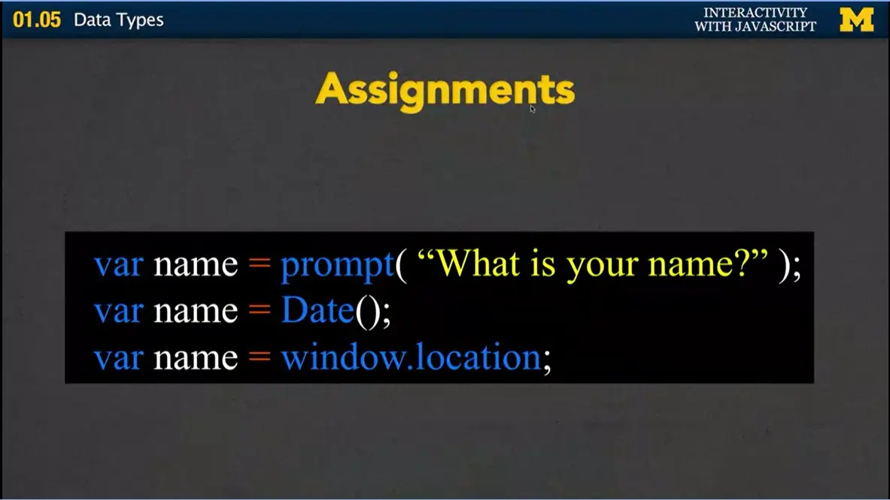
</p>

If you look here in this example, you can see that I&#39;ve got variable
name equals prompt, what is your name. So, it&#39;s expecting me to type in
probably something like Colleen or Chris or Becca, something along that
line.

In the next example, we have variable name equals Date. This is not a
string. This is something that actually can be quite a bit longer and is
very complex. You might also have variable name equals
**window.location**. If I wanted to in JavaScript, I could even say name
equals 12. Doesn&#39;t make any sense but there&#39;s nothing stopping me from
doing it. In each of these examples, name would have what we call a
different type. Things that are stored in the computer are completely
different.
<!--~~~~~~~~~~~~~~~~~~~~~~~~~~~~~~~~~~~~~~~~~~~~~~~~~~~~~~~~~~~~~~~~~~~~~~~~~~~~~~~~~~~~~~~~~~~~-->
<!--~~~~~~~~~~~~~~~~~~~~~~~~~~~~~~~~~~~~~ 74. types (47) ~~~~~~~~~~~~~~~~~~~~~~~~~~~~~~~~~~~~~~~-->
<p align="center">
  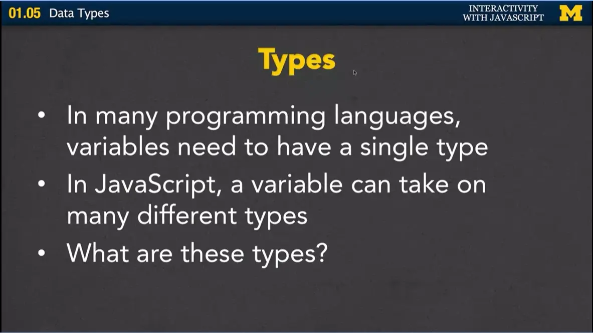
</p>

In computer programming languages, computers tend to have a single type.
In JavaScript, that&#39;s fine, a variable can only be one type, but
throughout the course of the program, it can switch from being a program
to characters, back to a number to something else that&#39;s completely
complex. Let&#39;s talk about what these types are in JavaScript and how we
can represent them.
<!--~~~~~~~~~~~~~~~~~~~~~~~~~~~~~~~~~~~~~~~~~~~~~~~~~~~~~~~~~~~~~~~~~~~~~~~~~~~~~~~~~~~~~~~~~~~~-->
<!--~~~~~~~~~~~~~~~~~~~~~~~~~~~~~~~~~~~~ 75. number (47) ~~~~~~~~~~~~~~~~~~~~~~~~~~~~~~~~~~~~~~~-->
<p align="center">
  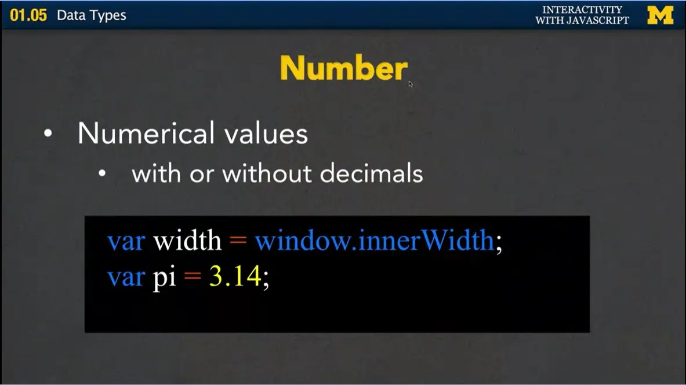
</p>

The first type we&#39;re going to talk about is number, and it&#39;s pretty
straightforward, it&#39;s simply any type of numerical value that you want
to store. This can be with or without decimals. JavaScript doesn&#39;t care
if it&#39;s 2 or 2.0 or 2.6785, it&#39;s all the same.

In this example, I went in and I said you know what, I have this
variable called width and I&#39;m going to set it using
**window.innerWidth**. This is pretty cool actually if you&#39;re trying to
do something interesting in CSS because you can find out how wide the
window is and then use that information to update other things.

My next example is I have **var** pi, which is equal to 3.14. In this
case, I hard coded it to something. In both cases, it&#39;s storing a
number, but in the different cases or one, it&#39;s going to be, normally
would be an integer or a whole number, and the next time it has
decimals.
<!--~~~~~~~~~~~~~~~~~~~~~~~~~~~~~~~~~~~~~~~~~~~~~~~~~~~~~~~~~~~~~~~~~~~~~~~~~~~~~~~~~~~~~~~~~~~~-->
<!--~~~~~~~~~~~~~~~~~~~~~~~~~~~~~~~~~~~~~ 76. string (48) ~~~~~~~~~~~~~~~~~~~~~~~~~~~~~~~~~~~~~~-->
<p align="center">
  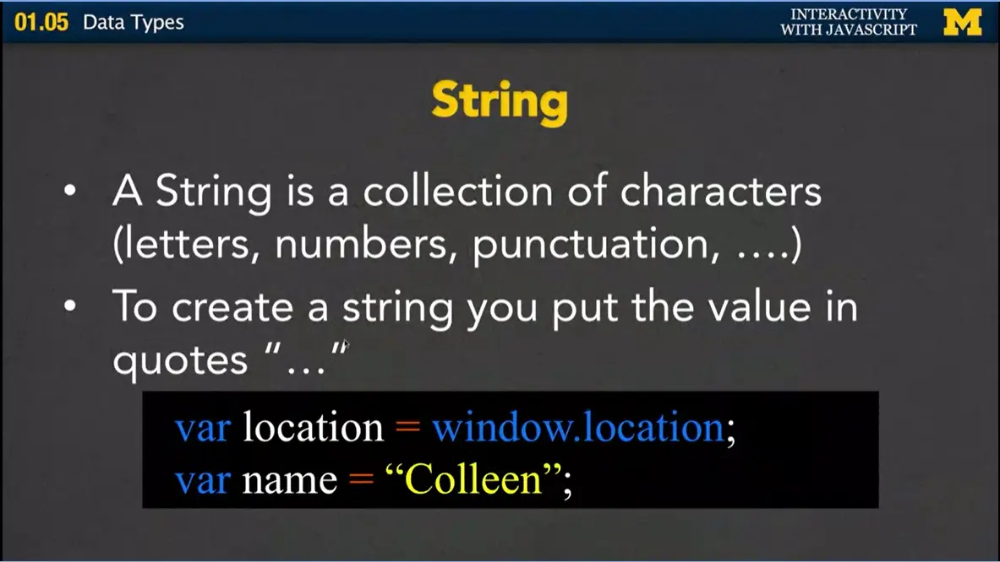
</p>

The next type is called String. String is simply a collection of
characters such as letters, numbers, punctuation, spaces, basically
anything you can type into the keyboard.

To create a string, you have to put the value in quotes. Now, these can
be single quotes or double quotes. And I want to be very clear here that
in PowerPoint it&#39;s drawn the quotes as kind of forward and forward.
Make sure you don&#39;t copy and paste and instead you do the quotes
directly from your keyboard because the slant does matter. In this case,
I&#39;ve done var location = **window.location**. Because it happens to be
that that attribute is a string or in my second example once again,
I&#39;ve just hardcoded it to something you might expect.
<!--~~~~~~~~~~~~~~~~~~~~~~~~~~~~~~~~~~~~~~~~~~~~~~~~~~~~~~~~~~~~~~~~~~~~~~~~~~~~~~~~~~~~~~~~~~~~-->
<!--~~~~~~~~~~~~~~~~~~~~~~~~~~~~~~~~~~~~ 77. boolean (48) ~~~~~~~~~~~~~~~~~~~~~~~~~~~~~~~~~~~~~~-->
<p align="center">
  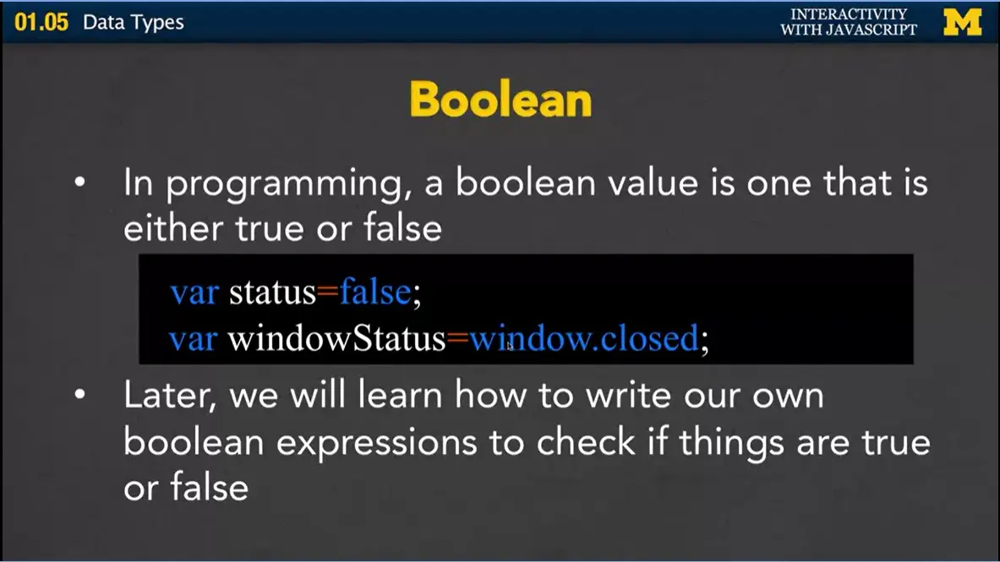
</p>

The third data type is Boolean. In programing, a boolean value is
something that is either true or false. It doesn&#39;t have numbers to it
or strings, it&#39;s very straightforward. In this case, I might have my
variable status equals false, this is again called hard coding it, or in
my program if I want to do something based on whether or not the window
is open or closed. I can set it dynamically right here. The important
thing to know is that status and window status can only be true or
false. Those are the only two options.

Later, we&#39;re going to learn how to write our own boolean expressions to
check to see if things are true or false. And that can add really a lot
of power to your page.
<!--~~~~~~~~~~~~~~~~~~~~~~~~~~~~~~~~~~~~~~~~~~~~~~~~~~~~~~~~~~~~~~~~~~~~~~~~~~~~~~~~~~~~~~~~~~~~-->
<!--~~~~~~~~~~~~~~~~~~~~~~~~~~~~~~~~~~~~ 78. object (49) ~~~~~~~~~~~~~~~~~~~~~~~~~~~~~~~~~~~~~~~-->
<p align="center">
  
</p>

The next data type is called object. Because sometimes the variables or
the nodes are more complex than just a number or couple characters. A
node in the DOM would be a really good example. If you think about a
paragraph element to it, paragraphs are not just a number or a string,
there are a lot of different things that go into it. Here I might have
var topic = **document.getElementById(&#39;myId&#39;)**. If I wanted to print
out what topic is now, something like **document.RightTopic**. I would
get something that pretty much looks like junk because it&#39;s an object,
and objects can only read illegibly using things like attributes.

Using those attributes, we can go in and we might be able to say
something along the lines of write out **topic.style, topic.innerHTML.**
Different things like that can show us really the attributes or the
string&#39;s numbers that make up objects.
<!--~~~~~~~~~~~~~~~~~~~~~~~~~~~~~~~~~~~~~~~~~~~~~~~~~~~~~~~~~~~~~~~~~~~~~~~~~~~~~~~~~~~~~~~~~~~~-->
<!--~~~~~~~~~~~~~~~~~~~~~~~~~~~~~~~~~~~~~ 79. array (50) ~~~~~~~~~~~~~~~~~~~~~~~~~~~~~~~~~~~~~~~-->
<p align="center">
  
</p>

Finally, the last type we&#39;re going to talk about is array, because in
some cases a function might want to return more than one value. We&#39;ve
seen how the API can return something complex, like an object that could
be a paragraph, or a div, something along that line. What if it needs to
return multiple things?

Here I have var links = **document.getElements**. Not element, but
elements, **ByTagName(&#39;a&#39;)**. We&#39;re going to go in, it&#39;s going to
search the entire document, and find all the hyperlinks in the page.
Well, that&#39;s certainly not going to return just a single number, or a
bunch of strings, or even a single object. Instead, it needs to return a
whole collection.
<!--~~~~~~~~~~~~~~~~~~~~~~~~~~~~~~~~~~~~~~~~~~~~~~~~~~~~~~~~~~~~~~~~~~~~~~~~~~~~~~~~~~~~~~~~~~~~-->
<!--~~~~~~~~~~~~~~~~~~~~~~~~~~~ 80. accessing array elements (50) ~~~~~~~~~~~~~~~~~~~~~~~~~~~~~~-->
<p align="center">
  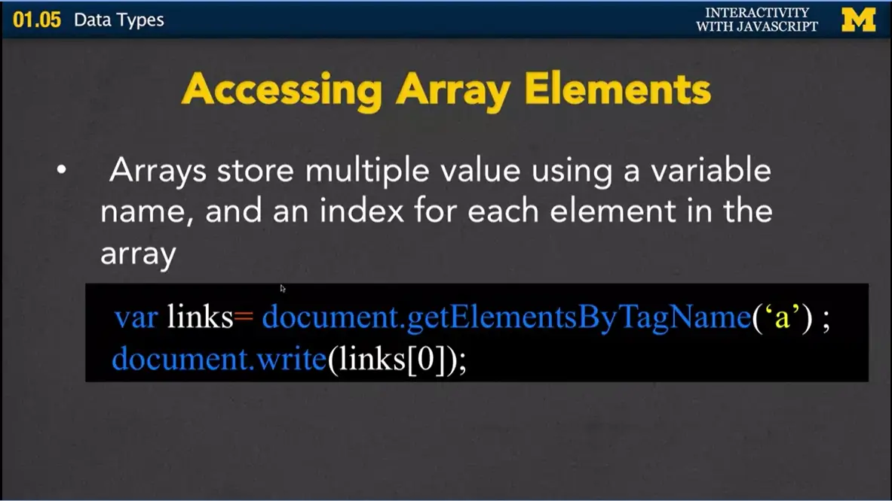
</p>

Arrays store these multiple values using a variable name, just like the
ones we&#39;ve done, but it also includes what we call an index for each
element in the array.

This is the same example where I say hey, go out and grab all the links.
Now if I wanted to write some sort of element out, I could say
**document.write(links&lbrack;0&rbrack;)**, and it would say return the very first
link I saw. If I had links three, it would actually return the fourth
one because computers love to talk starting from zero and up. Now we&#39;re
going to have an entire lecture or more on arrays later in this course.
But for now, I just want you to realize that it&#39;s one of the data types
that can be returned.

<!--~~~~~~~~~~~~~~~~~~~~~~~~~~~~~~~~~~~~~~~~~~~~~~~~~~~~~~~~~~~~~~~~~~~~~~~~~~~~~~~~~~~~~~~~~~~~-->
<!--~~~~~~~~~~~~~~~~~~~~~~~~~~~ 80. accessing array elements (51) ~~~~~~~~~~~~~~~~~~~~~~~~~~~~~~-->
<p align="center">
  
</p>

Let&#39;s look at a quick example that uses some of the different types.
Let&#39;s see what happens when I type in a string to this sample code.
I&#39;m going to put in for what is your name, I&#39;ll put in Coleen.

If we look at the code, what I was doing here is I was just prompting
for the name and then I want to write out the name. Boom, there&#39;s
Colleen. And then I want to say, hey, what happens if I add H1 elements
on each side. You haven&#39;t seen this plus before, and we&#39;re going to be
talking about it soon, but what we&#39;re doing right now is we&#39;re doing
what&#39;s called concatenating. We&#39;re saying take the name and add H1 on
either side. So, boom, I get it bigger now. I also want to print out the
title. That&#39;s a string. I also want to print out right here
**document.getElementsByTagName(&#39;p&#39;)**. This is where we&#39;re using an
array, and I just want to show you this because there&#39;s a really good
chance this message might pop up for you and I don&#39;t want you to get
freaked out about it.

<!--~~~~~~~~~~~~~~~~~~~~~~~~~~~~~~~~~~~~~~~~~~~~~~~~~~~~~~~~~~~~~~~~~~~~~~~~~~~~~~~~~~~~~~~~~~~~-->
<!--~~~~~~~~~~~~~~~~~~~~~~~~~~~ 81.  () ~~~~~~~~~~~~~~~~~~~~~~~~~~~~~~-->
<p align="center">
  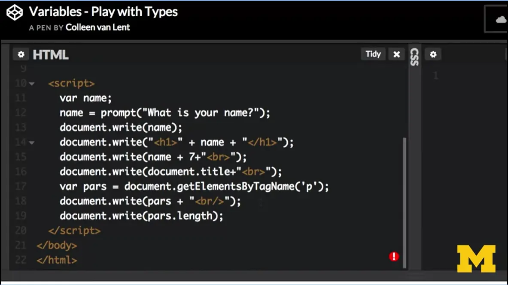
</p>

<!--~~~~~~~~~~~~~~~~~~~~~~~~~~~~~~~~~~~~~~~~~~~~~~~~~~~~~~~~~~~~~~~~~~~~~~~~~~~~~~~~~~~~~~~~~~~~-->
<!--~~~~~~~~~~~~~~~~~~~~~~~~~~~ 82.  () ~~~~~~~~~~~~~~~~~~~~~~~~~~~~~~-->
<p align="center">
  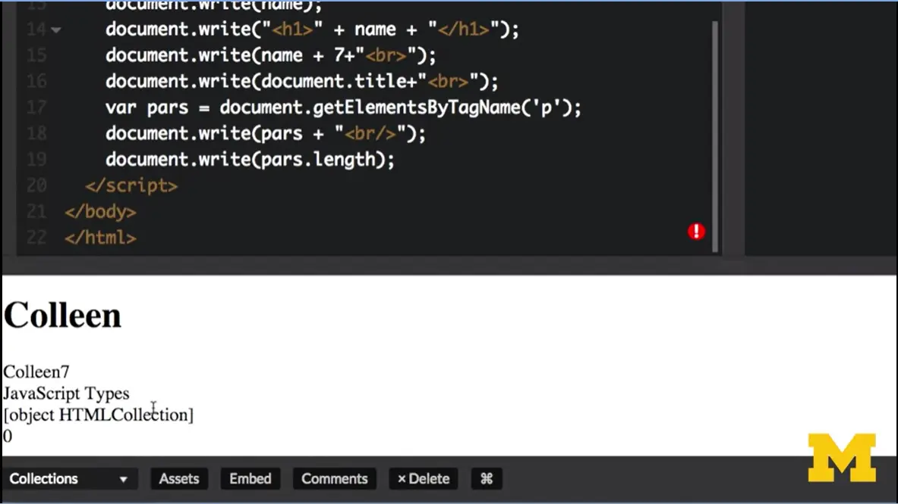
</p>

After I grab all the paragraph elements, if I try to print them out, it
prints out object **HTMLCollection 0.** It says, oh, you didn&#39;t
actually have any paragraphs in this page. If I go back, and I add a
few, they can even be empty. Gotta love when it keeps popping up on you.
I don&#39;t know how many I added but we&#39;re going to do it.

<!--~~~~~~~~~~~~~~~~~~~~~~~~~~~~~~~~~~~~~~~~~~~~~~~~~~~~~~~~~~~~~~~~~~~~~~~~~~~~~~~~~~~~~~~~~~~~-->
<!--~~~~~~~~~~~~~~~~~~~~~~~~ 83/84.  (xx) ~~~~~~~~~~~~~~~~~~~~~~~~~~-->
<p align="center">
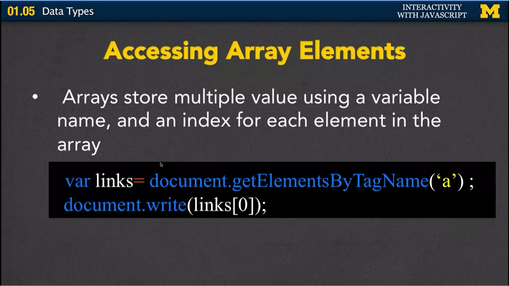
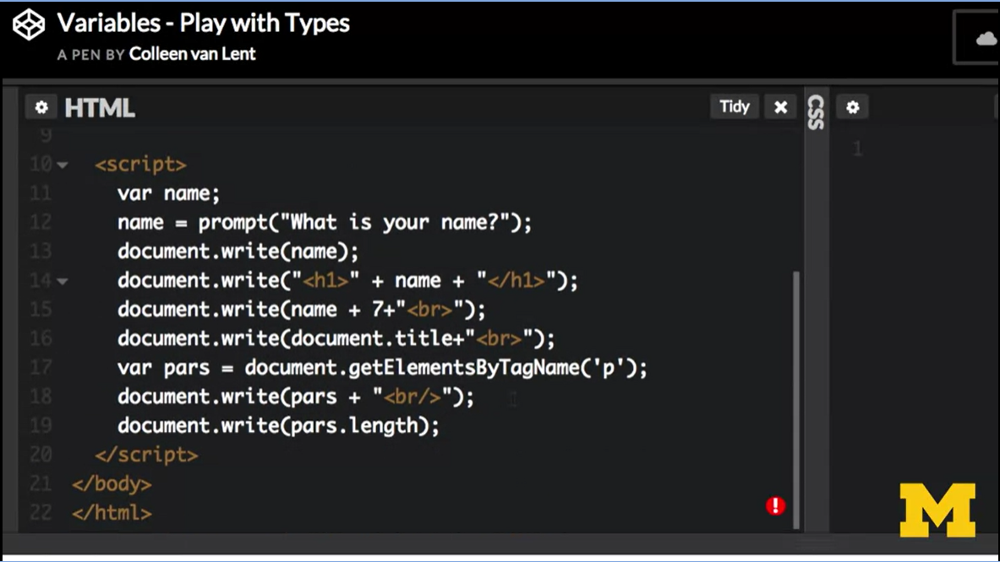
</p>

I can try running this again. And when I type in Colleen, you can see
that now it knows that I have five paragraph elements in there.

<!--~~~~~~~~~~~~~~~~~~~~~~~~~~~~~~~~~~~~~~~~~~~~~~~~~~~~~~~~~~~~~~~~~~~~~~~~~~~~~~~~~~~~~~~~~~~~-->
<!--~~~~~~~~~~~~~~~~~~~~~~~~~~~ 85.  () ~~~~~~~~~~~~~~~~~~~~~~~~~~~~~~-->
<p align="center">
  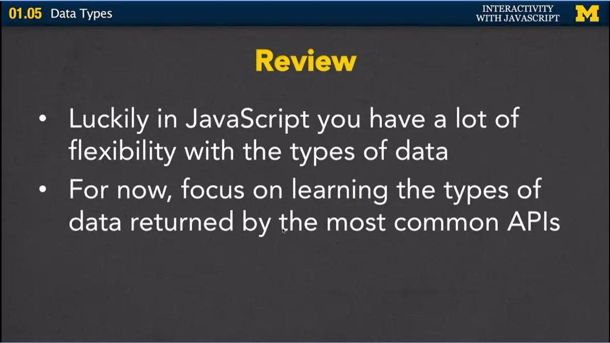
</p>

Luckily in JavaScript, there&#39;s a ton of flexibility with the different
types of data you can use. In other programming languages they&#39;re very
strict, but here with JavaScript they want you to have the power to try
different things.

For now, I want you to focus on learning what types of data are returned
from those common APIs. If you do **getElementByID**, does that return a
number, a string, an object, or an array? If you do something along the
lines of **getTitle** or **getLinks**, what types of things are those
returning? If you can play with that and start to feel comfortable
knowing what the types are, even if you don&#39;t know how they work,
you&#39;re really going to be on your way to doing some cool programming.
So good luck.

<h2 id="Week1-06">Week 1-06. Operators & Expressions</h2>

<!--~~~~~~~~~~~~~~~~~~~~~~~~~~~~~~~~~~~~~~~~~~~~~~~~~~~~~~~~~~~~~~~~~~~~~~~~~~~~~~~~~~~~~~~~~~~~-->
<!--~~~~~~~~~~~~~~~~~~~~~~~~~~~ 86.  () ~~~~~~~~~~~~~~~~~~~~~~~~~~~~~~-->
<p align="center">
  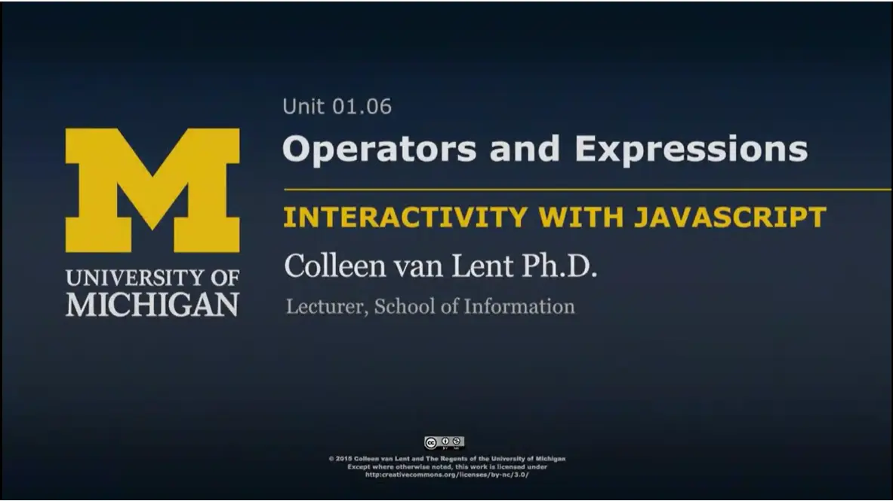
</p>
{width="4.0in"
height="2.251709317585302in"}

Today we&#39;re going to be talking about expressions and mainly operators,
the different ways that you can manipulate your code. We&#39;ve been using
statements to execute our JavaScript code. Every time you saw a line
that ended with a semicolon, we were writing a statement.

<!--~~~~~~~~~~~~~~~~~~~~~~~~~~~~~~~~~~~~~~~~~~~~~~~~~~~~~~~~~~~~~~~~~~~~~~~~~~~~~~~~~~~~~~~~~~~~-->
<!--~~~~~~~~~~~~~~~~~~~~~~~~~~~ 87.  (xx) ~~~~~~~~~~~~~~~~~~~~~~~~~~~~~~-->
<p align="center">
  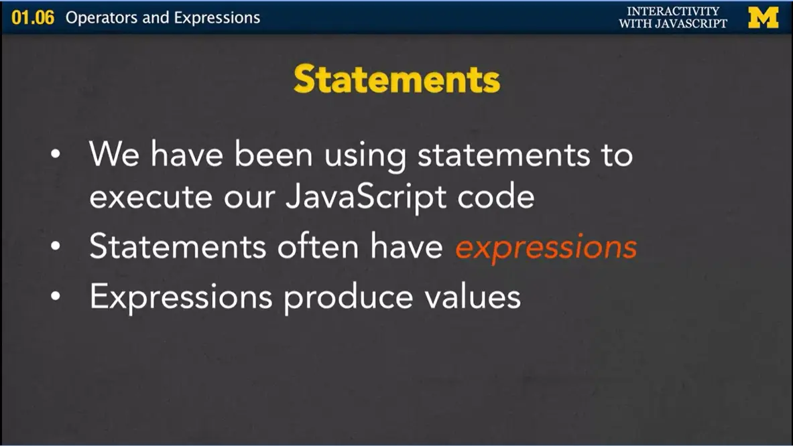
</p>

Statements often have what we call expressions, or things that can be
evaluated. Expressions produce values. They might produce a number, or a
string, but many times they produce what we call Boolean values. I want
to show you all the different types of operators that we can use in
JavaScript to produce these types of expression values.

<!--~~~~~~~~~~~~~~~~~~~~~~~~~~~~~~~~~~~~~~~~~~~~~~~~~~~~~~~~~~~~~~~~~~~~~~~~~~~~~~~~~~~~~~~~~~~~-->
<!--~~~~~~~~~~~~~~~~~~~~~~~~~~~ 88.  (xx) ~~~~~~~~~~~~~~~~~~~~~~~~~~~~~~-->
<p align="center">
  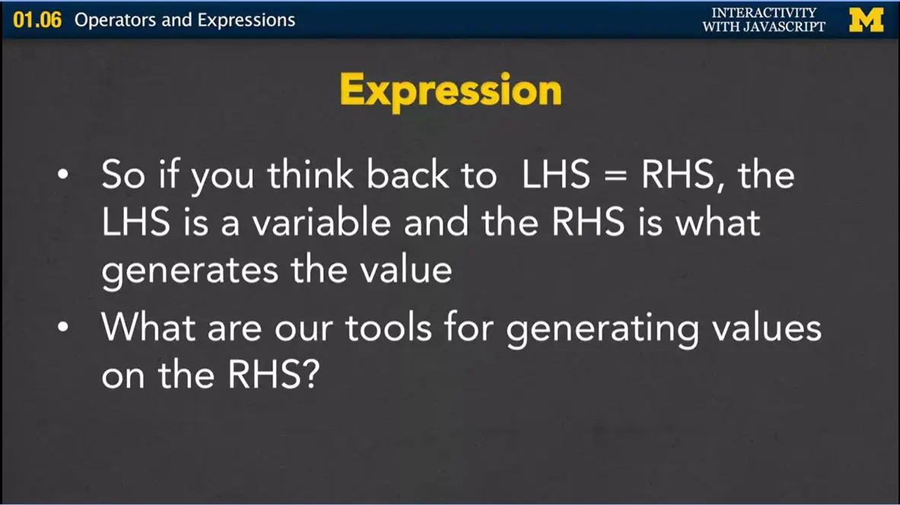
</p>

If you think back, I tend to talked about that left hand side equals
right hand side. With the left-hand side is a variable and the
right-hand side is that new value we want to be stored.

What are our tools for generating different values on that right hand
side? We&#39;ve seen direct assignments or calls to different functions but
there&#39;s more to it that we can do than just that.

<!--~~~~~~~~~~~~~~~~~~~~~~~~~~~~~~~~~~~~~~~~~~~~~~~~~~~~~~~~~~~~~~~~~~~~~~~~~~~~~~~~~~~~~~~~~~~~-->
<!--~~~~~~~~~~~~~~~~~~~~~~~~~~~ 89.  (xx) ~~~~~~~~~~~~~~~~~~~~~~~~~~~~~~-->
<p align="center">
  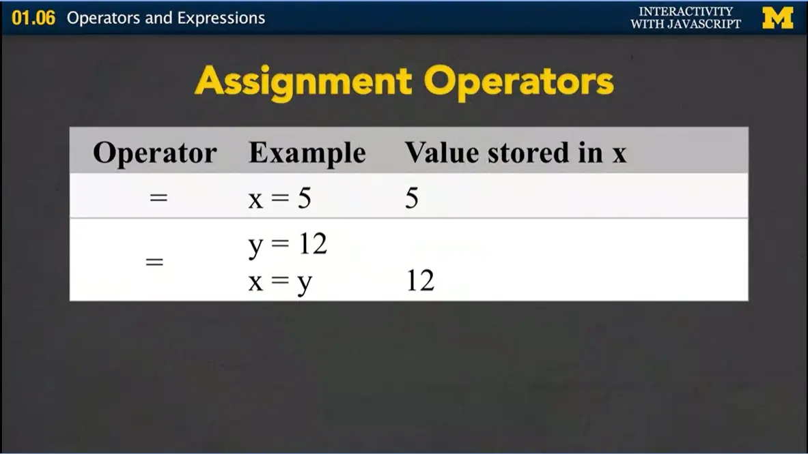
</p>

Here&#39;s a very simple assignment expression. I just had x=5 or in
another example I said y=12. What&#39;s going on here is not an equal or a
thing if two things are the same. In this expression I&#39;m saying, go
find the value that is story in y. After I grab that, go and store it in
x as well.

<!--~~~~~~~~~~~~~~~~~~~~~~~~~~~~~~~~~~~~~~~~~~~~~~~~~~~~~~~~~~~~~~~~~~~~~~~~~~~~~~~~~~~~~~~~~~~~-->
<!--~~~~~~~~~~~~~~~~~~~~~~~~~~~ 90.  (xx) ~~~~~~~~~~~~~~~~~~~~~~~~~~~~~~-->
<p align="center">
  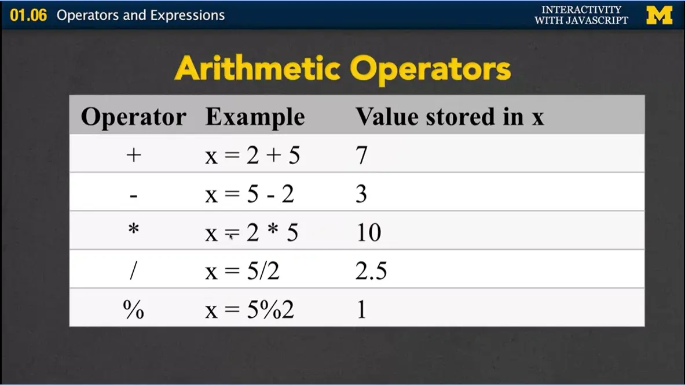
</p>

We also have arithmetic operators. Most of these are very straight
forward. You&#39;ve probably seen plus, minus, this is multiplied, and then
we also have divide. And these are the straightforward math that you
learned, hopefully in somewhere around third or fourth grade at the
latest. 2 + 5 is 7. 5- 2 is 3. 2 &ast; 5 is 10. 5/2 is 2.5.

But this last one, the modulus operator is something you may not have
seen before. It goes back to the idea of old long division. If you do
5/2 and you&#39;re looking only at the whole numbers, you have 2. What&#39;s
that leftover number that&#39;s kind of left over at the end. 5%2 is 1. See
if I can do another one here.

What would happen if I did something along the lines of 13/5? Well, 13/5
would give us something along of 2.blah, blah, blah. If I do 13%5, you
figure out how many times does 5 go into 13? That&#39;s 2, and what&#39;s left
over? 13%5 is going to be 3. Go ahead and play with that if you&#39;d like,
and type a few numbers in and see what kind of response you get.

<!--~~~~~~~~~~~~~~~~~~~~~~~~~~~~~~~~~~~~~~~~~~~~~~~~~~~~~~~~~~~~~~~~~~~~~~~~~~~~~~~~~~~~~~~~~~~~-->
<!--~~~~~~~~~~~~~~~~~~~~~~~~~~~ 91.  (xx) ~~~~~~~~~~~~~~~~~~~~~~~~~~~~~~-->
<p align="center">
  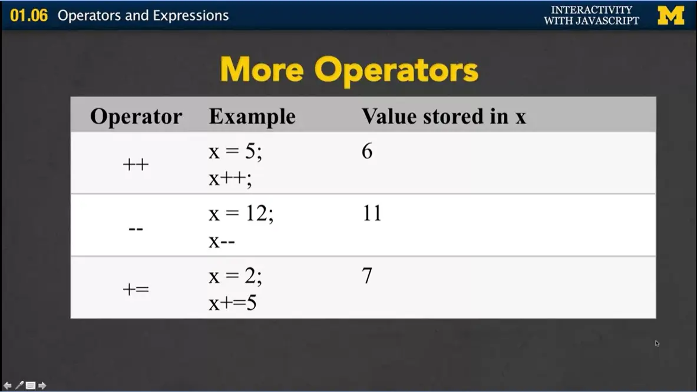
</p>

Some additional operators we have are the plus plus and minus minus.
This is the increment and the decrement. It&#39;s the same thing as saying,
take whatever I had before and add 1 to it. Or take whatever I had
before and subtract 1 from it. A third operator that&#39;s very similar is
the plus equals. You can also have minus equals. It&#39;s the same thing as
writing out long something along the lines of x = x + 2. It&#39;s the same
thing as saying x + = 2. It&#39;s just short hand you don&#39;t need to use
it. But I wanted to show you just in case you see it in somebody else's
code.

<!--~~~~~~~~~~~~~~~~~~~~~~~~~~~~~~~~~~~~~~~~~~~~~~~~~~~~~~~~~~~~~~~~~~~~~~~~~~~~~~~~~~~~~~~~~~~~-->
<!--~~~~~~~~~~~~~~~~~~~~~~~~~~~ 92.  (xx) ~~~~~~~~~~~~~~~~~~~~~~~~~~~~~~-->
<p align="center">
  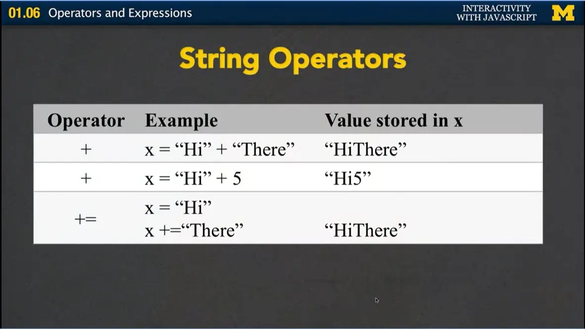
</p>

We talked about how plus will add two numbers together. That&#39;s only
true if the operators on both sides are numbers. In some cases, we have
the string operators, and in that case, the plus is actually a
concatenation. It&#39;ll take the 'Hi' and the 'There' and put it together
into one variable. If you want to put those spaces in, you have to
remember to actually add them. In the same case, if I have a string and
a number, and I use the plus, it&#39;s going to be concatenation. You want
to be careful when you&#39;re playing with this, because anything that&#39;s
read in from a prompt is a string. You&#39;re going to need to make sure
that your output is what you&#39;re expecting. The plus equals has the same
effect as the plus equals from before. It just means take whatever I
used to have and concatenate this new part on to it.

<!--~~~~~~~~~~~~~~~~~~~~~~~~~~~~~~~~~~~~~~~~~~~~~~~~~~~~~~~~~~~~~~~~~~~~~~~~~~~~~~~~~~~~~~~~~~~~-->
<!--~~~~~~~~~~~~~~~~~~~~~~~~~~~ 93.  (xx) ~~~~~~~~~~~~~~~~~~~~~~~~~~~~~~-->
<p align="center">
  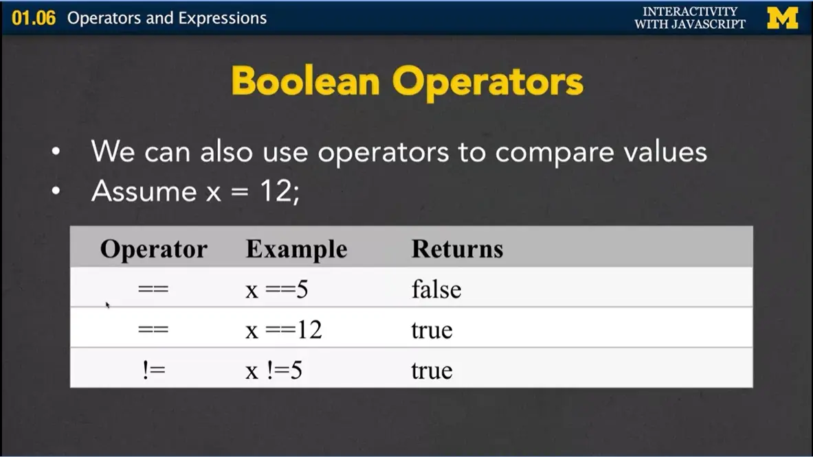
</p>

Those first few operators, we use usually to assign values to a
variable. Sometimes we use what we call Boolean operators to compare
values instead. In this case, let&#39;s assume that I&#39;m assigned x = 12.
Well, some of the different Boolean operators I can use are equal equal,
which means don&#39;t set x equal to 5, instead, I want you to check, is
the value stored in x equal to 5? This is kind of a test case. Well, in
this case, no, it doesn&#39;t, so it returns false. But if I have x==12, oh
okay, yep, those two things are equivalent, so I&#39;m going to return
true. There&#39;s also another short hand, which is the exclamation point
equals. This is a negation or the opposite, it says, hey, make sure the
value stored in x doesn&#39;t equal 5.

<!--~~~~~~~~~~~~~~~~~~~~~~~~~~~~~~~~~~~~~~~~~~~~~~~~~~~~~~~~~~~~~~~~~~~~~~~~~~~~~~~~~~~~~~~~~~~~-->
<!--~~~~~~~~~~~~~~~~~~~~~~~~~~~ 94.  (xx) ~~~~~~~~~~~~~~~~~~~~~~~~~~~~~~-->
<p align="center">
  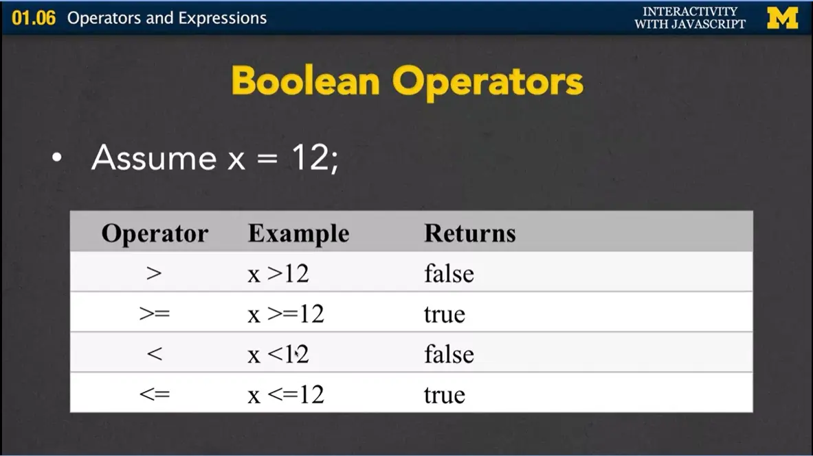
</p>

We also have more of the traditional greater than, greater than or equal
to, less than, or less than or equal to, where they just compare the
left-hand side and the right-hand side and they return true or false.

With JavaScript we have a special case, though. And that&#39;s because in
JavaScript we don&#39;t really care about types too much. What happens if
you want to see if a number is equal to something else, but you don&#39;t
want it to say yes if it&#39;s a string?

<!--~~~~~~~~~~~~~~~~~~~~~~~~~~~~~~~~~~~~~~~~~~~~~~~~~~~~~~~~~~~~~~~~~~~~~~~~~~~~~~~~~~~~~~~~~~~~-->
<!--~~~~~~~~~~~~~~~~~~~~~~~~~~~ 95.  (xx) ~~~~~~~~~~~~~~~~~~~~~~~~~~~~~~-->
<p align="center">
  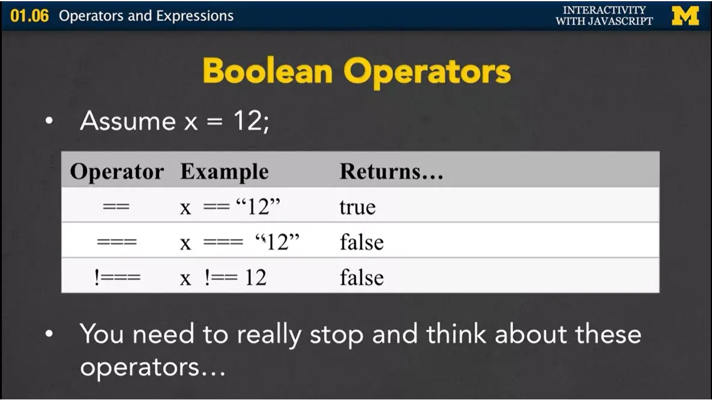
</p>

Here I&#39;ve got the equality statement that we used before, which is
equal equal. If I were to say x == &#34;12&#34; the string, JavaScript would
say yep, yep they&#39;re the same. Even though to us it&#39;s probably not the
case that 12 the number and 12 the string are the same thing. If you&#39;re
looking for what we call equality with type you would use the equal
equal equal, the triple equal operator. And that checks and says, hey
are these two values the same? And are they the same type? This is just
one more thing to put in your arsenal as you start programming. Now I&#39;m
putting in this little note here, because I need you to stop and think
about these operators and what we&#39;ve been talking about. It is complete
human nature to read this and nod along. Got it? Yep. Got it, got it.
And just think you&#39;ve really grasped everything I&#39;ve been talking
about. It&#39;s really hard to understand how these things work unless you
type in some examples, play with the numbers, and try to fool yourself
and give yourself tricky situations. If you can do that, then you&#39;ll
feel comfortable moving on with these operators.

<!--~~~~~~~~~~~~~~~~~~~~~~~~~~~~~~~~~~~~~~~~~~~~~~~~~~~~~~~~~~~~~~~~~~~~~~~~~~~~~~~~~~~~~~~~~~~~-->
<!--~~~~~~~~~~~~~~~~~~~~~~~~~~~ 96.  (xx) ~~~~~~~~~~~~~~~~~~~~~~~~~~~~~~-->
<p align="center">
  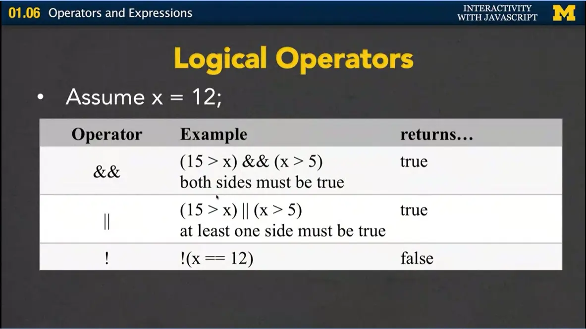
</p>

Let&#39;s do one last little group or two groups before we finish up. In
this case, I have what we call the and and (&&). This stands for "and".
It means, hey are the things on the left-hand side, and the right-hand
side, are they both true? The pipes, the straight up and down the lines,
this is what we call "or". In this case, you might want to say at least
one side must be true in order for me to say true.

And then we have the exclamation part "not", just kind of like this
negation. If I had to come up with an example for using and and or, one
might be that in order to enroll in courses at University of Michigan
you have to be an enrolled student and your tuition has to be paid up.
It doesn&#39;t work if it&#39;s only one or the other. For the "or", you might
use the example that in America, you can&#39;t get into certain movies
unless you&#39;re 18 or you&#39;re with your parents. So that would be a case
where you only need one thing to be true.

<!--~~~~~~~~~~~~~~~~~~~~~~~~~~~~~~~~~~~~~~~~~~~~~~~~~~~~~~~~~~~~~~~~~~~~~~~~~~~~~~~~~~~~~~~~~~~~-->
<!--~~~~~~~~~~~~~~~~~~~~~~~~~~~ 97.  (xx) ~~~~~~~~~~~~~~~~~~~~~~~~~~~~~~-->
<p align="center">
  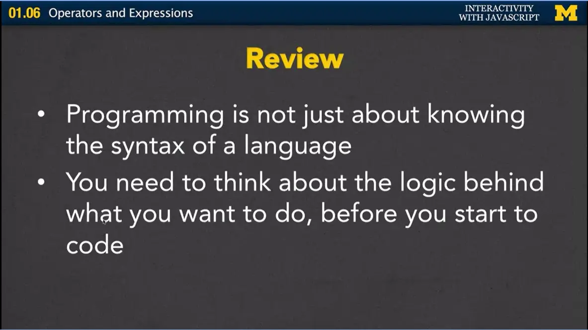
</p>

When it comes to programming, it&#39;s not enough for you to just know the
syntax of the language or the different rules, or even for you to listen
to me and kind of nod along. It&#39;s really key that you practice these
different things. '

And before you start programming yourself, make sure you think about the
logic you want to go into your program. Do you want to use greater than
or greater than or equal? Do you want to use the and or do you want to
use the or? If you think about these things before you start, and then
you go in and test them a lot, your code is going to be a lot cleaner
and the whole experience will be one that you really enjoy much more. So
good luck.

<h3>The History of &#34;Debugging&#34;</h3>

If you want to learn more about the history of debugging, here is an
article that talks about the fact that two different people are credited
with the term, Grace Hopper and Thomas Edison

<http://theinstitute.ieee.org/tech-history/technology-history/did-you-know-edison-coined-the-term-bug>

<h3 id="cha-wk3"><a href="http://codepen.io/collection/Adbwgo/">Link to All of the Code for Week Two</a></h3>

Again, the following is a link to all of the code for Week Two. The individual
files are linked within the modules but the weekly collections may
include additional code that you are free to use.

<a href="http://codepen.io/collection/Adbwgo/">Code: Week Two</a>

Even if you use CodePen, I encourage you to practice writing the code on
your own. For now, I put complete examples in CodePen, but as time goes
on, I will remove some of the commands to link the code together. You
will need to work on that part on your own..

## Functions

The next module on functions is crucial to any type of programming that
you may do in the future. The reason that programming languages work so
well is that they allow people to reuse work that other people have
done. Someone else writes the complex code that can determine what time
it is in any given country? Excellent. If they put that code in a
function then you can use it without really knowing the details of how
it works. (And yes, there is a function for that.)

One of the things I want you to watch for in this next module is the
distinction between ***defining*** a function (writing the code) and
***calling*** a function (running the code at the precise time you want
it to happen).

<!--~~~~~~~~~~~~~~~~~~~~~~~~~~~~~~~~~~~~~~~~~~~~~~~~~~~~~~~~~~~~~~~~~~~~~~~~~~~~~~~~~~~~~~~~~~~~-->
<h2 id="Week2-01">Week 2-01. Functions</h2>
<!--~~~~~~~~~~~~~~~~~~~~~~~~~~~~~~~~~~~~~~~~~~~~~~~~~~~~~~~~~~~~~~~~~~~~~~~~~~~~~~~~~~~~~~~~~~~~-->
<!--~~~~~~~~~~~~~~~~~~~~~~~~~~~ 98.  (xx) ~~~~~~~~~~~~~~~~~~~~~~~~~~~~~~-->
<p align="center">
  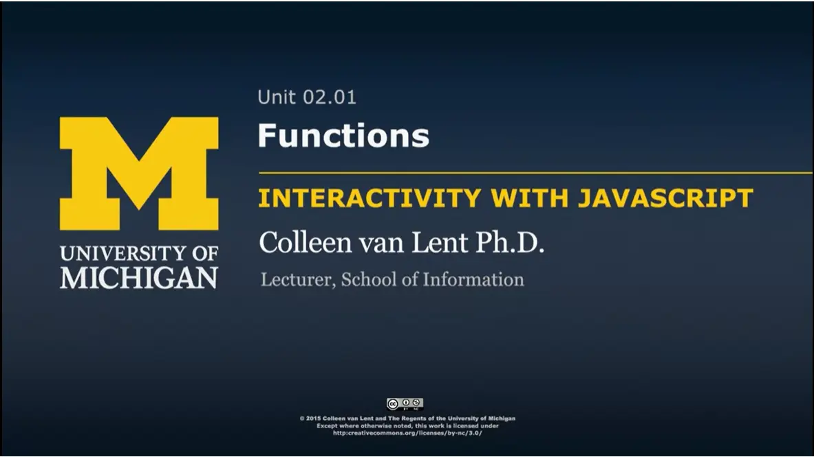
</p>

Today we&#39;re going to talk about functions. Functions are these bits of
code that you can reuse over and over again by just coding what we call
the function name.
<!--~~~~~~~~~~~~~~~~~~~~~~~~~~~~~~~~~~~~~~~~~~~~~~~~~~~~~~~~~~~~~~~~~~~~~~~~~~~~~~~~~~~~~~~~~~~~-->
<!--~~~~~~~~~~~~~~~~~~~~~~~~~~~ 99.  (xx) ~~~~~~~~~~~~~~~~~~~~~~~~~~~~~~-->
<p align="center">
  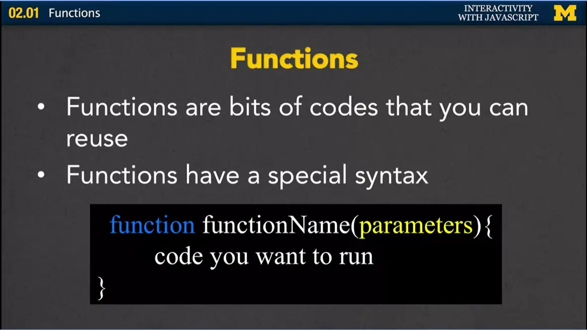
</p>

Functions of course, like everything else in programming, have special
syntax that you need to follow. In order to declare a function so that
you can use it later, you need to use the special keyword, function,
f-u-n-c-t-i-o-n. It&#39;s not an abbreviated such as, var, so make sure you
write out the whole thing. Once you write out function you can give it
any name you want. Stick to the same rules as the variables, only use
letters, and digits, and underscores. Next, this third thing I have
inside here, inside the parenthesis, are what we call the parameters.
Sometimes there&#39;ll be things in here, sometimes there won&#39;t. Once you
have what we call the function header, where you have function, the
name, the parentheses and any type of information in here. We&#39;re going
use curly brackets to begin and end our function.

It&#39;s really important right here that you realize that you do not put a
semi-colon right here at the end. In all of our other JavaScript
expressions and statements, we ended them with a semicolon. If you do
that here, you&#39;re going to mess up your code. All those statements go
inside here. And how it works is that later,

then when people run your function, it&#39;ll execute all the code that&#39;s
in {code you want to run}. And this code is just general code you would
always write with your semicolons, your expression, your statements.
It&#39;s just a really nice way to save it. You don&#39;t have to keep typing
it over and over again.

<!--~~~~~~~~~~~~~~~~~~~~~~~~~~~~~~~~~~~~~~~~~~~~~~~~~~~~~~~~~~~~~~~~~~~~~~~~~~~~~~~~~~~~~~~~~~~~-->
<!--~~~~~~~~~~~~~~~~~~~~~~~~~~~ 100.  (xx) ~~~~~~~~~~~~~~~~~~~~~~~~~~~~~~-->
<p align="center">
  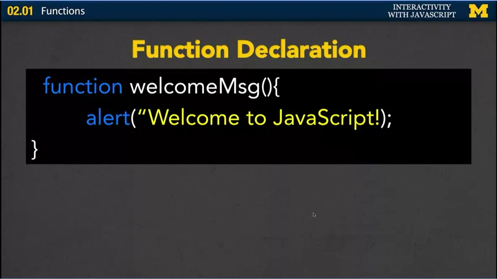
</p>

Let me show you an example. In this case, I declared a function called
**welcomeMsg**. And I didn&#39;t put anything inside the parenthesis.
Because I said, you know what it is doesn&#39;t matter. Every time I run
this function, all I want to happen is to have an alert that says,
Welcome to JavaScript. And this will work numerous times. I don&#39;t have
to keep writing things over and over again. It&#39;s a small function, but
it&#39;s something that will work.

<!--~~~~~~~~~~~~~~~~~~~~~~~~~~~~~~~~~~~~~~~~~~~~~~~~~~~~~~~~~~~~~~~~~~~~~~~~~~~~~~~~~~~~~~~~~~~~-->
<!--~~~~~~~~~~~~~~~~~~~~~~~~~~~ 101.  (xx) ~~~~~~~~~~~~~~~~~~~~~~~~~~~~~~-->
<p align="center">
  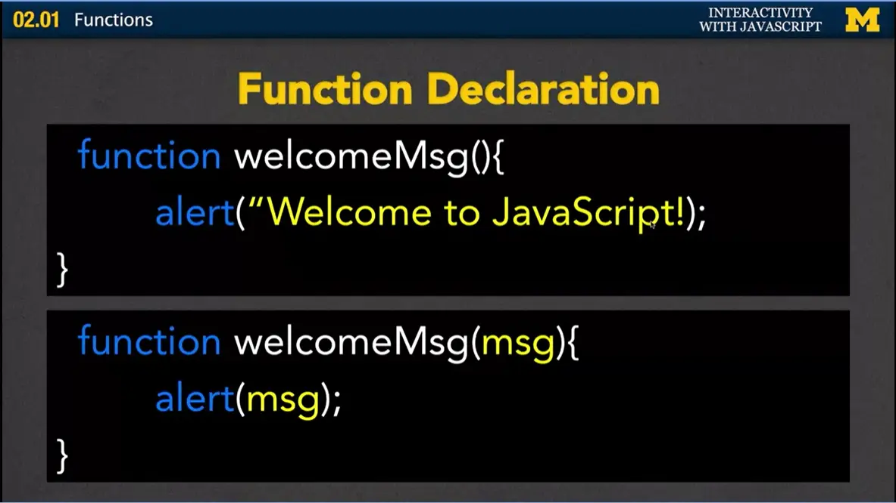
</p>

Here&#39;s another very similar function. The only difference is that, this
time, I went ahead and I included a parameter list, which says, hey, now
instead of saying Welcome to JavaScript every time we run this function.
It&#39;s actually going to give an alert of whatever message you tell it to
do in what we call it real time.

The first step in using functions is to do this function declaration,
where you use the keywords, the curly brackets, and the parenthesis.
Declaring a function doesn&#39;t actually do anything for you though. You
need to tell the computer when you want that function to run.

<!--~~~~~~~~~~~~~~~~~~~~~~~~~~~~~~~~~~~~~~~~~~~~~~~~~~~~~~~~~~~~~~~~~~~~~~~~~~~~~~~~~~~~~~~~~~~~-->
<!--~~~~~~~~~~~~~~~~~~~~~~~~~~~ 102.  (xx) ~~~~~~~~~~~~~~~~~~~~~~~~~~~~~~-->
<p align="center">
  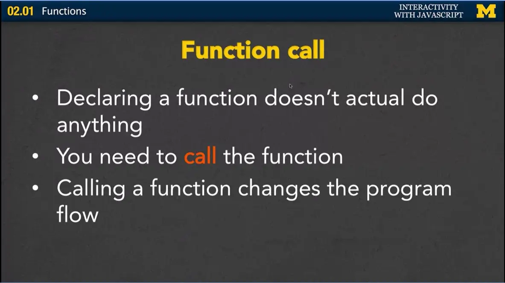
</p>

We do this by saying or we call the function. Every time you write the
function name, you&#39;re telling the computer that you want to run that
code. Calling a function changes what we call the program flow. Before
our programs start at the top and just work their way down line by line
by line. Now with functions, the computer is actually jumping around in
memory and executing different parts of code, not necessarily in the
order that you write them.

<!--~~~~~~~~~~~~~~~~~~~~~~~~~~~~~~~~~~~~~~~~~~~~~~~~~~~~~~~~~~~~~~~~~~~~~~~~~~~~~~~~~~~~~~~~~~~~-->
<!--~~~~~~~~~~~~~~~~~~~~~~~~~~~ 103.  (xx) ~~~~~~~~~~~~~~~~~~~~~~~~~~~~~~-->
<p align="center">
  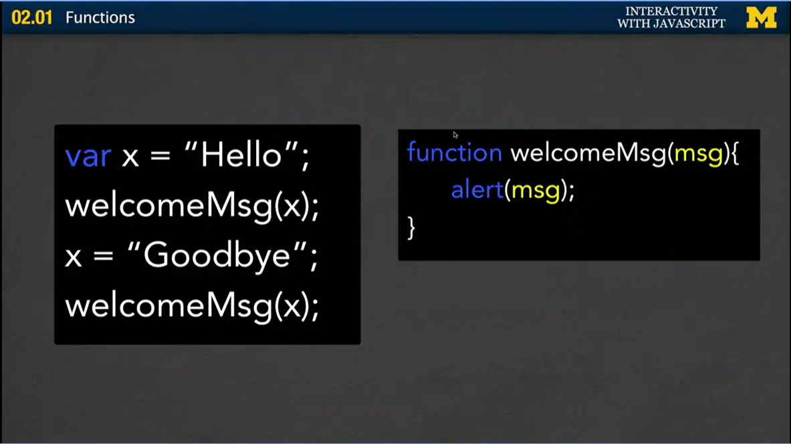
</p>

Here&#39;s an example. I have my **welcomeMsg** function, the one with the
parameters. Over here, in my HTML file, or JavaScript file, the file
I&#39;m running, is the computer gets down here, it says, oh, I know how to
do that, check. Then it gets to our function call, where it says oh,
I&#39;m going to leave here and I&#39;m going to go over and run this code. As
soon as it&#39;s done running this code, it comes back to the next line of
code. Well, we know how to say x = &#34;Goodbye&#34;, the computer knows how
to assign that new value. When we go here, once again, we go back up to
this code and then back down here. The code looks quite straightforward
to you, and when it runs it should look straightforward to you. But
it&#39;s important to know that behind the scenes there&#39;s a lot going on
as the computer jumps from different bits of code back to other bits of
code. Hopefully if you type this in and run it, you should get a hello
and then a goodbye message. You could type putting in numbers or
anything you&#39;d like instead if you prefer.

<!--~~~~~~~~~~~~~~~~~~~~~~~~~~~~~~~~~~~~~~~~~~~~~~~~~~~~~~~~~~~~~~~~~~~~~~~~~~~~~~~~~~~~~~~~~~~~-->
<!--~~~~~~~~~~~~~~~~~~~~~~~~~~~ 104.  (xx) ~~~~~~~~~~~~~~~~~~~~~~~~~~~~~~-->
<p align="center">
  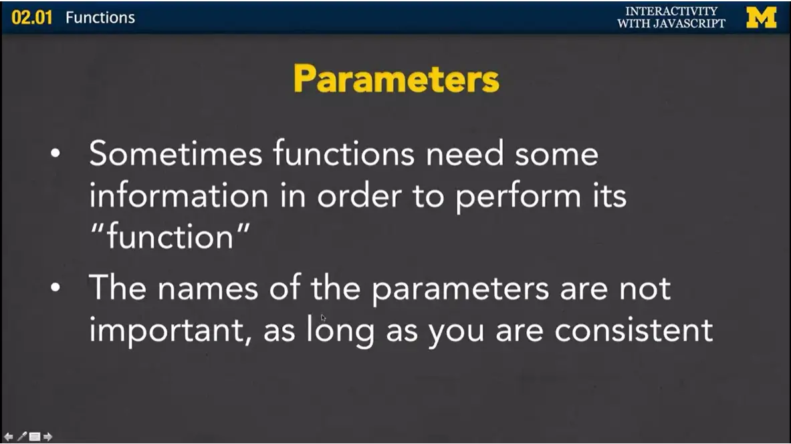
</p>

Let&#39;s talk a little bit more about those parameters that I talked
about. Because sometimes some functions need a little bit of extra
information in order to perform its task.

Let&#39;s think about **getElementById**. That&#39;s not really going to work
unless you tell it which ID you&#39;re looking for. That&#39;s an extra piece
of information or a parameter that you need to provide. The important
thing to know is the names of the parameters for your functions,
they&#39;re not important, they&#39;re like variable names. You can call them
anything you want, as long as you&#39;re consistent.

<!--~~~~~~~~~~~~~~~~~~~~~~~~~~~~~~~~~~~~~~~~~~~~~~~~~~~~~~~~~~~~~~~~~~~~~~~~~~~~~~~~~~~~~~~~~~~~-->
<!--~~~~~~~~~~~~~~~~~~~~~~~~~~~ 105.  (xx) ~~~~~~~~~~~~~~~~~~~~~~~~~~~~~~-->
<p align="center">
  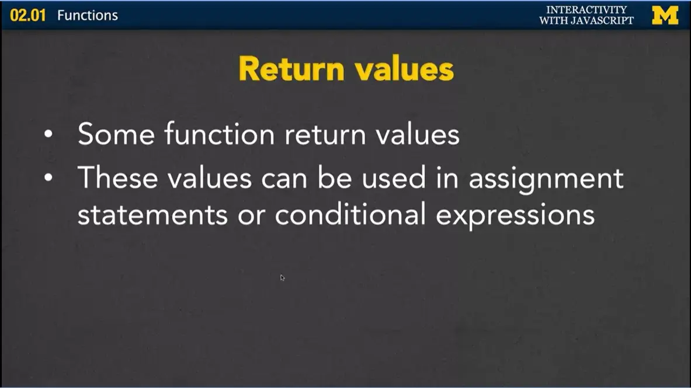
</p>

The next thing to talk about, when we talk about functions, are return
values. Some functions return values, others don&#39;t. But these values
can be used later for assignment statements or conditional expressions.
Later when we talk about forms, we&#39;re going to want to put in special
functions that will say, hey, I need you to halt execution right now,
because I don&#39;t want you to hit submit. I don&#39;t want you to be able to
hit yes on that form.

<!--~~~~~~~~~~~~~~~~~~~~~~~~~~~~~~~~~~~~~~~~~~~~~~~~~~~~~~~~~~~~~~~~~~~~~~~~~~~~~~~~~~~~~~~~~~~~-->
<!--~~~~~~~~~~~~~~~~~~~~~~~~~~~ 106.  (xx) ~~~~~~~~~~~~~~~~~~~~~~~~~~~~~~-->
<p align="center">
  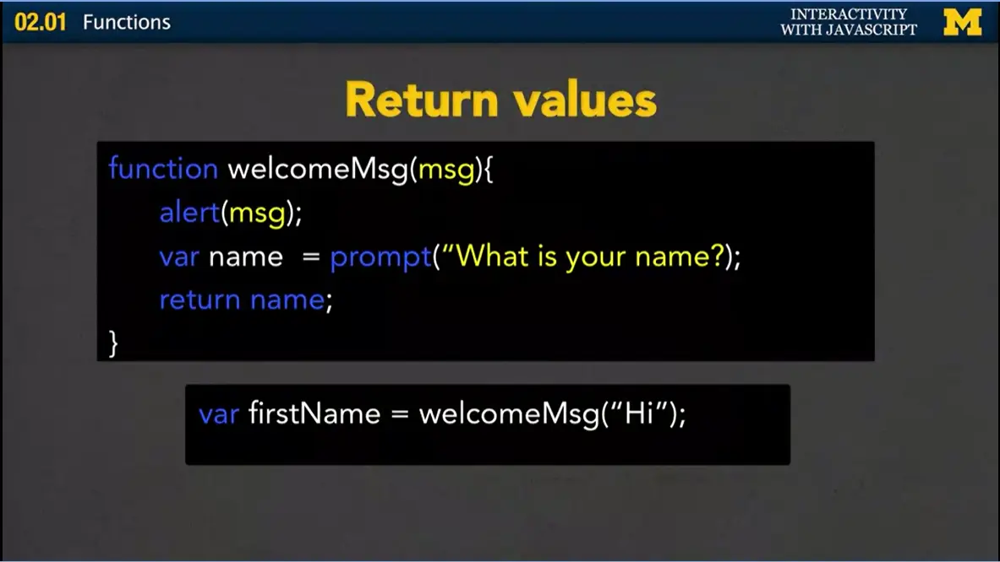
</p>

Let&#39;s look an example of a function that returns a value. In this case,
I&#39;ve written a simple function that takes your message that you want to
say, hello or good afternoon, good morning, but we&#39;re going to follow
that up with a prompt. And that prompt&#39;s going to ask a person for
their name. We&#39;re combining a few different elements here. We start off
by saying, hey, I&#39;m going to make a variable called firstName, and I
want to set it to whatever the person types into the prompt. If over
here, if I don&#39;t have the term var, firstName would be left as
something that&#39;s empty. Using return statements are just typically used
in order to assign values to valuables or to check conditional
statements, and we&#39;re going to be using these a lot. I just need you to
be aware of the term.

<!--~~~~~~~~~~~~~~~~~~~~~~~~~~~~~~~~~~~~~~~~~~~~~~~~~~~~~~~~~~~~~~~~~~~~~~~~~~~~~~~~~~~~~~~~~~~~-->
<!--~~~~~~~~~~~~~~~~~~~~~~~~~~~ 107.  (xx) ~~~~~~~~~~~~~~~~~~~~~~~~~~~~~~-->
<p align="center">
  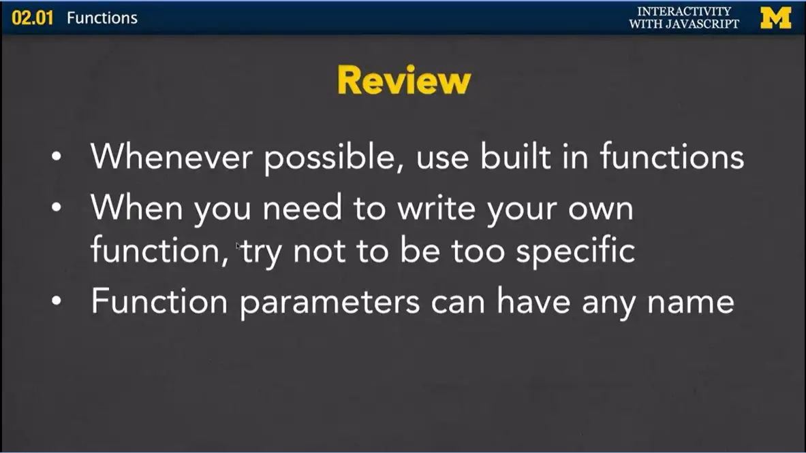
</p>

Let&#39;s review what we&#39;ve talked about with functions so far. Whenever
possible, use built in functions. Sometimes when people are first
learning how to program, they feel this need to write everything from
scratch to show that they really understand. There&#39;s really no point in
doing that at the beginning. If someone else has written a really good
function use it. You can practice your own skills by augmenting it or
adding little things.

When you do write your own function, try not to be too specific. And
what I mean by that is, don&#39;t write a function that you&#39;re not going
to be able to reuse multiple times in a lot of different scenarios.
Don&#39;t hard-code too many values so that it&#39;s so specific that it only
works for one person.

Finally, I just want to remind you, that function parameters can have
any name you want them to have. A lot of times people get caught up in
my examples, and think that&#39;s the only way to go. It&#39;s not the case.
Don&#39;t do everything exactly the way you see it online, or in my
examples. It gives you a lot more power if you change those parameter
names, to see how the inner workings are going.

We&#39;re going to be using functions a lot in this class. You&#39;re going to
be writing your own functions in the homework, and I&#39;m hoping that
you&#39;ll be able to do this and feel like you&#39;re really starting to
understand some of the power of JavaScript. Good luck.
<!--~~~~~~~~~~~~~~~~~~~~~~~~~~~~~~~~~~~~~~~~~~~~~~~~~~~~~~~~~~~~~~~~~~~~~~~~~~~~~~~~~~~~~~~~~~~~-->
<h2 id="Week2-02">Week 2-02. Code Placement</h2>
<!--~~~~~~~~~~~~~~~~~~~~~~~~~~~~~~~~~~~~~~~~~~~~~~~~~~~~~~~~~~~~~~~~~~~~~~~~~~~~~~~~~~~~~~~~~~~~-->
<!--~~~~~~~~~~~~~~~~~~~~~~~~~~~ 108.  (xx) ~~~~~~~~~~~~~~~~~~~~~~~~~~~~~~-->
<p align="center">
  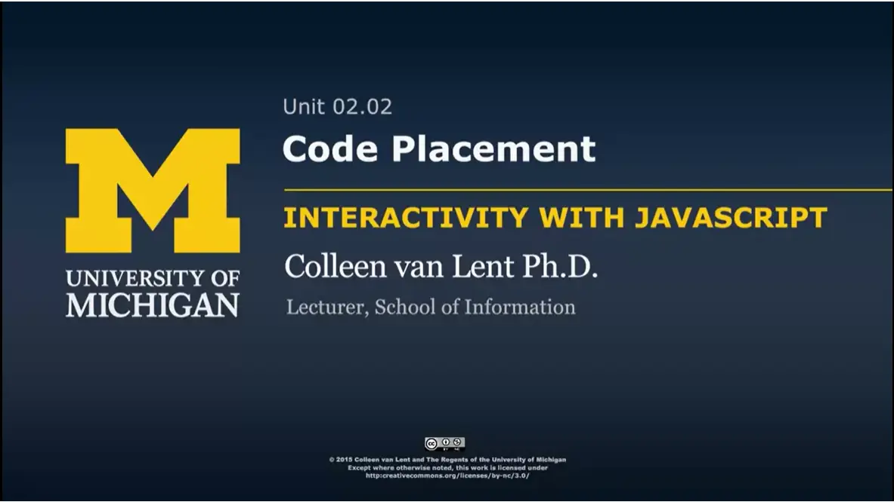
</p>

Today, we&#39;re going to talk not about new concepts, but really, putting
our code in the best place to make it easier for you to follow what&#39;s
going on.
<!--~~~~~~~~~~~~~~~~~~~~~~~~~~~~~~~~~~~~~~~~~~~~~~~~~~~~~~~~~~~~~~~~~~~~~~~~~~~~~~~~~~~~~~~~~~~~-->
<!--~~~~~~~~~~~~~~~~~~~~~~~~~~~ 109.  (xx) ~~~~~~~~~~~~~~~~~~~~~~~~~~~~~~-->
<p align="center">
  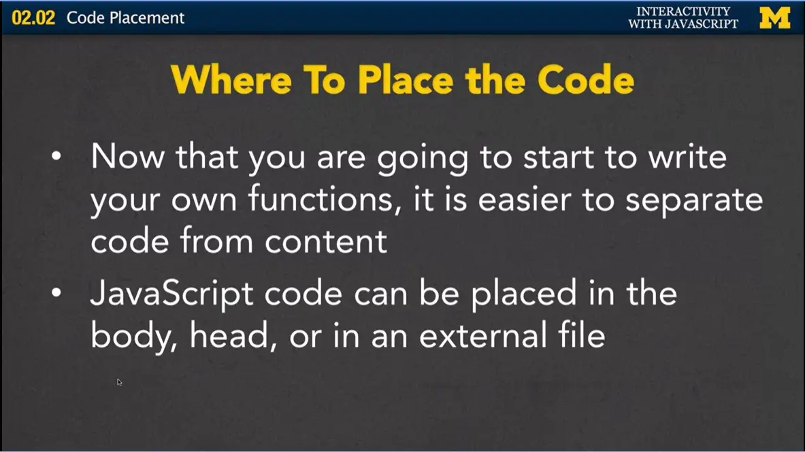
</p>

Up to this point, we&#39;ve been putting our JavaScript into the HTML body
tag. Now, it&#39;s fine to start off that way, but as we get more and more
complex, it&#39;s going to make your life easier if we separate our content
from our other style in JavaScript functions.

In order to do that, we need to think about where we can put our
JavaScript code. And where you can put it, is you can leave it in the
body, as we&#39;ve been doing, you can put your functions into the head
section of your HTML code, or you can use an external file.

<!--~~~~~~~~~~~~~~~~~~~~~~~~~~~~~~~~~~~~~~~~~~~~~~~~~~~~~~~~~~~~~~~~~~~~~~~~~~~~~~~~~~~~~~~~~~~~-->
<!--~~~~~~~~~~~~~~~~~~~~~~~~~~~ 110.  (xx) ~~~~~~~~~~~~~~~~~~~~~~~~~~~~~~-->
<p align="center">
  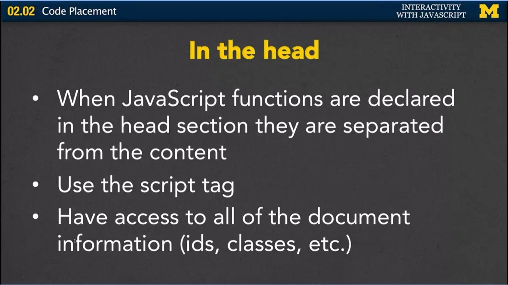
</p>

If you decide to put your JavaScript functions in the head section,
that&#39;s a really great idea, because they&#39;re separated from the content
and it makes it a little bit easier for you to follow the code that
you&#39;re writing. It doesn&#39;t make any difference to the actual
execution, but it just might make the debugging easier.

If you&#39;re going to use this method, you need to remember that you have
to use a script tag. Just as a style tag, tells the browser that your
about to add some style to your page. The script tag says. Wait, this
isn&#39;t content, this is going to be some JavaScript code.

If you do this. If you put your code into the head section, don&#39;t
worry, all of your function will still have access to all the document
information, the ID&#39;s, the classes, etc.

<!--~~~~~~~~~~~~~~~~~~~~~~~~~~~~~~~~~~~~~~~~~~~~~~~~~~~~~~~~~~~~~~~~~~~~~~~~~~~~~~~~~~~~~~~~~~~~-->
<!--~~~~~~~~~~~~~~~~~~~~~~~~~~~ 111.  (xx) ~~~~~~~~~~~~~~~~~~~~~~~~~~~~~~-->
<p align="center">
  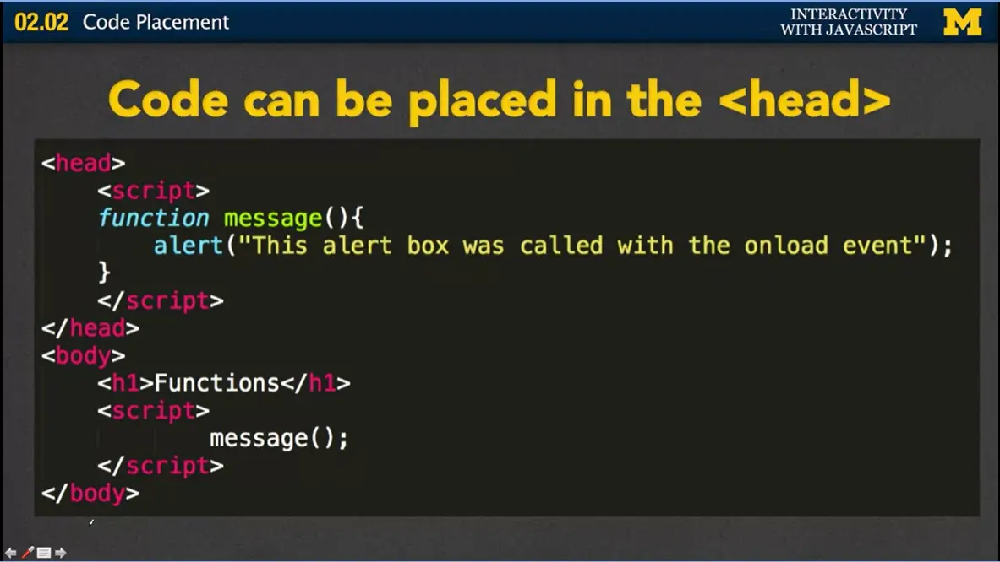
</p>

Let&#39;s take a quick look at an example. As you can see, I have my head
section and inside there, I have this script ending, script in ending
head. You need to make sure that you have the proper tags, if you want
your code to validate. Inside this script, I put a very simple function
called message. Now, what you need to understand, is when I talk about
putting your JavaScript code into the head, I&#39;m only talking about your
JavaScript functions. It&#39;s still necessary, down here in the body of
your code to call the functions. But still, it&#39;s a lot cleaner than
having the entire function written down here. Plus, for code reuse, you
can now call the function multiple times, but only write it once up
here.

<!--~~~~~~~~~~~~~~~~~~~~~~~~~~~~~~~~~~~~~~~~~~~~~~~~~~~~~~~~~~~~~~~~~~~~~~~~~~~~~~~~~~~~~~~~~~~~-->
<!--~~~~~~~~~~~~~~~~~~~~~~~~~~~ 112.  (xx) ~~~~~~~~~~~~~~~~~~~~~~~~~~~~~~-->
<p align="center">
  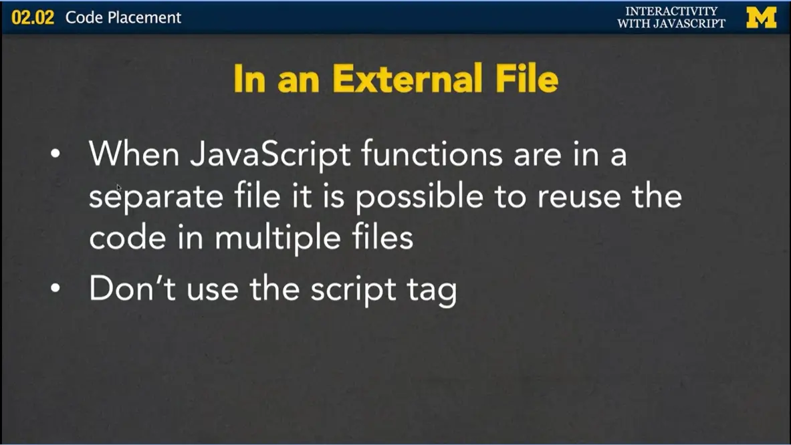
</p>

If instead, you decide to put your JavaScript functions in an external
file, then you can use that code multiple times in multiple files. The
one thing that&#39;s important to remember right from the start is again,
when you&#39;re using external file, don&#39;t use the script tag. It&#39;s just
the JavaScript, without any script tag.

<!--~~~~~~~~~~~~~~~~~~~~~~~~~~~~~~~~~~~~~~~~~~~~~~~~~~~~~~~~~~~~~~~~~~~~~~~~~~~~~~~~~~~~~~~~~~~~-->
<!--~~~~~~~~~~~~~~~~~~~~~~~~~~~ 113.  (xx) ~~~~~~~~~~~~~~~~~~~~~~~~~~~~~~-->
<p align="center">
  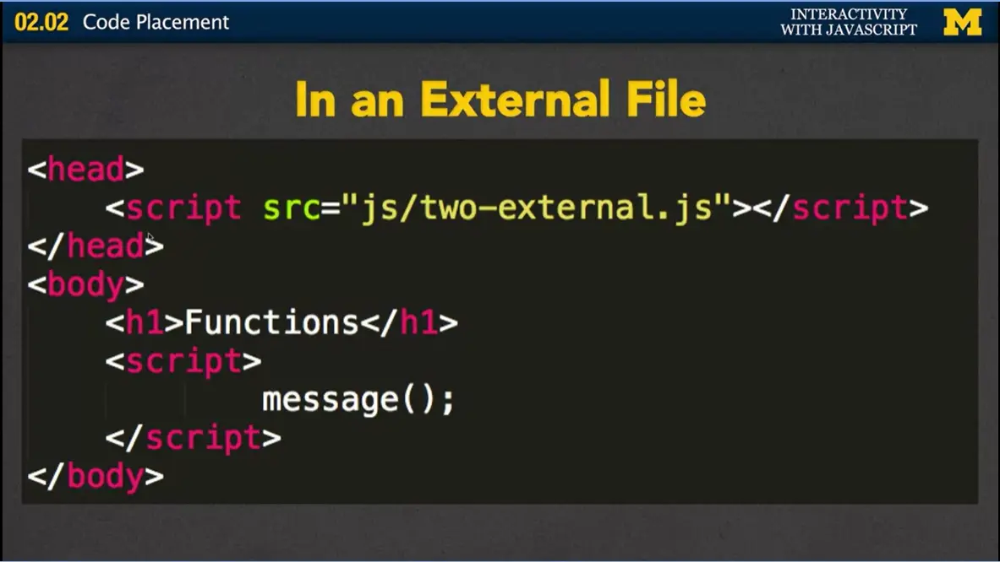
</p>

Let&#39;s look at an example here. Here you can see, that inside the head
section, I&#39;ve gone in and I&#39;m done with my script. But instead of
writing the actual function, I&#39;ve gone ahead and give it a source
saying up, all my JavaScript is inside my JS folder, and here&#39;s the
name of the file that I want to use.

If for some reason this doesn&#39;t work, you want to make sure that
you&#39;re very careful about what you put right in here, you want to make
sure that this is exactly correct, because if the browser can&#39;t find
the file, then it&#39;s not going to be able to run your JavaScript. So,
let&#39;s say, you do have a typo in your link to your external JavaScript
file. Well, the problem with this, is that, it&#39;s actually harder to
realize what&#39;s going on. If you mess up in your HTML code or your CSS
code, it&#39;s usually pretty easy to figure out that you did something
wrong, because the colors aren&#39;t the way you wanted or your text just
isn&#39;t there. But with JavaScript, sometimes the changes you're making
are so slight, you don&#39;t even realize that you have a problem.

<!--~~~~~~~~~~~~~~~~~~~~~~~~~~~~~~~~~~~~~~~~~~~~~~~~~~~~~~~~~~~~~~~~~~~~~~~~~~~~~~~~~~~~~~~~~~~~-->
<!--~~~~~~~~~~~~~~~~~~~~~~~~~~~ 114.  (xx) ~~~~~~~~~~~~~~~~~~~~~~~~~~~~~~-->
<p align="center">
  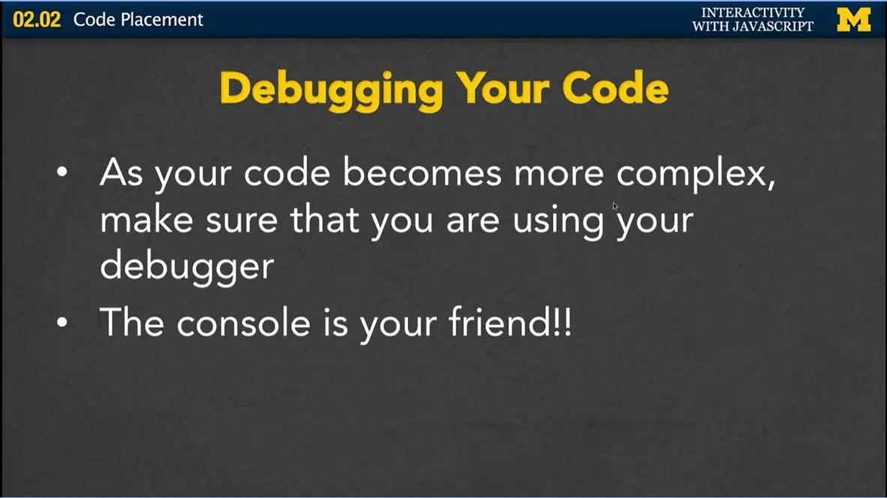
</p>

It&#39;s very important, as your code becomes more and more complex, that
you&#39;re using the console to debug your code. The console really is your
friend. I can&#39;t stress enough how much you always want to have it on
while you&#39;re coding. Myself, sometimes I forget to turn it on and I&#39;m
annoyed later, when I could have found my errors so much more easily.

<!--~~~~~~~~~~~~~~~~~~~~~~~~~~~~~~~~~~~~~~~~~~~~~~~~~~~~~~~~~~~~~~~~~~~~~~~~~~~~~~~~~~~~~~~~~~~~-->
<!--~~~~~~~~~~~~~~~~~~~~~~~~~~~ 115.  (xx) ~~~~~~~~~~~~~~~~~~~~~~~~~~~~~~-->
<p align="center">
  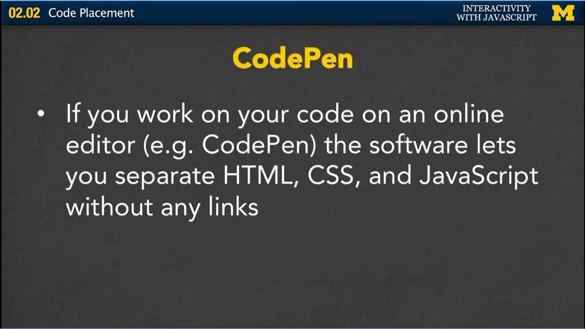
</p>

Another way that we can talk about separating your code into this
external file from your HTML, is to use these different types of
software options, such as CodePen. When you use CodePen, you&#39;re able to
separate, have a separate window for your HTML, your CSS, and your
JavaScript. What&#39;s great about this is, it lets you see all of your
code at once and see in real time what&#39;s happening as you change that
code. The downfall of this, for when you&#39;re first getting started, is
that, I find that sometimes people don&#39;t realize that they don&#39;t
understand how to link their code, out there in the real world.

If you&#39;re going to use CodePen, I always recommend that once you&#39;re
done, take that code and put it into three separate files, so that
you&#39;re sure you know how to link them together.

<!--~~~~~~~~~~~~~~~~~~~~~~~~~~~~~~~~~~~~~~~~~~~~~~~~~~~~~~~~~~~~~~~~~~~~~~~~~~~~~~~~~~~~~~~~~~~~-->
<!--~~~~~~~~~~~~~~~~~~~~~~~~~~~ 116.  (xx) ~~~~~~~~~~~~~~~~~~~~~~~~~~~~~~-->
<p align="center">
  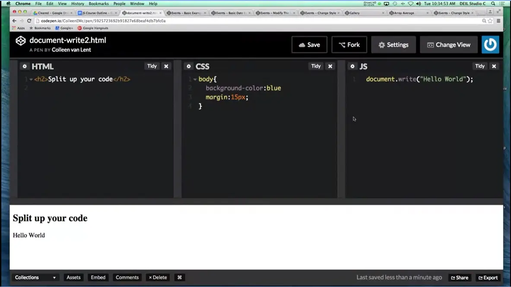
</p>

Let&#39;s take a look. As you can see here, I have one window for my HTML
code. One, for my CSS and one for my JavaScript. And code pen, takes
care of all the work of making sure that they&#39;re all together. If this
is your first time ever using CodePen, I did want to point out, that
there&#39;s this handy little function, that you can re-size the windows.

<!--~~~~~~~~~~~~~~~~~~~~~~~~~~~~~~~~~~~~~~~~~~~~~~~~~~~~~~~~~~~~~~~~~~~~~~~~~~~~~~~~~~~~~~~~~~~~-->
<!--~~~~~~~~~~~~~~~~~~~~~~~~~~~ 117.  (xx) ~~~~~~~~~~~~~~~~~~~~~~~~~~~~~~-->
<p align="center">
  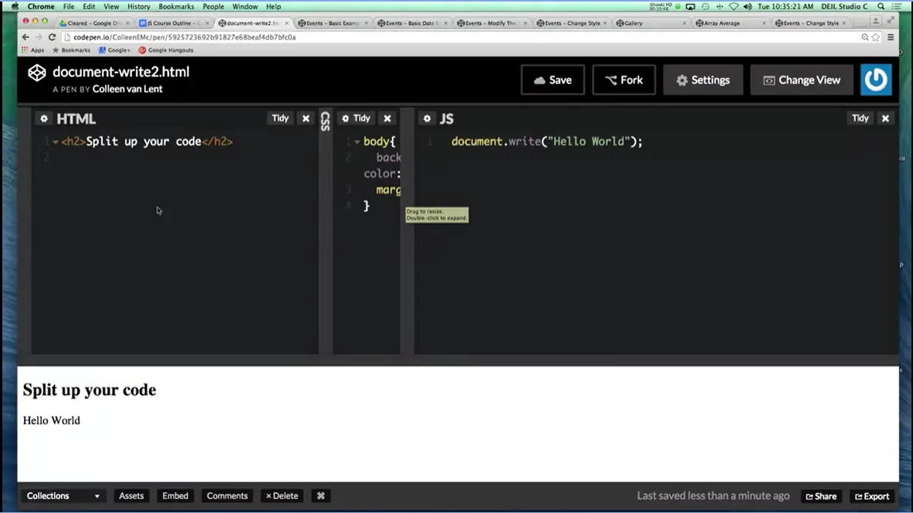
</p>

If you&#39;re not too concerned with your CSS right now, you can make that
smaller. And really kind of focus, on what you&#39;re working on, in the
HTML and the JS.

<!--~~~~~~~~~~~~~~~~~~~~~~~~~~~~~~~~~~~~~~~~~~~~~~~~~~~~~~~~~~~~~~~~~~~~~~~~~~~~~~~~~~~~~~~~~~~~-->
<!--~~~~~~~~~~~~~~~~~~~~~~~~~~~ 118.  (xx) ~~~~~~~~~~~~~~~~~~~~~~~~~~~~~~-->
<p align="center">
  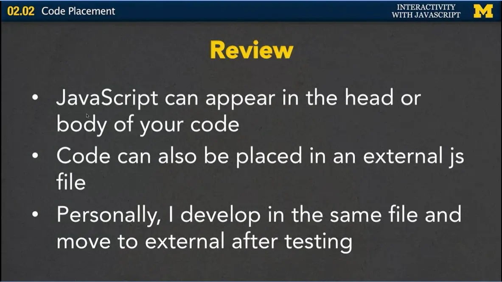
</p>

All right, let&#39;s review what we talked about today. The first thing, is
that you need to feel comfortable with the idea that your JavaScript
code can appear in the head. Or the body of your code, or very often in
both. Code, can also be placed in an external JavaScript file. If you do
this, just make sure that you&#39;ve linked the files correctly together,
otherwise you might have some issues trying to figure out why your code
isn&#39;t working. Luckily, the console can tell you, if it can&#39;t find
that file and it leads you down the right path to fixing your code.

Personally, I always develop in the same file. I tend to have my HTML
and my JS in the same file, while I&#39;m doing my testing. Once I&#39;m done,
I move it out into an external style sheet. It&#39;s really up to you to
determine which style you like best. Whether you like your JavaScript in
the same file or in a separate file. There are benefits to both. And the
most important thing for you right now, is to develop the confidence
that you can get your JavaScript working, in whatever way, it best suits
you. Good luck.

## Organizing Your Code

## Code Placement

When you write code, it is important to get into the good habits of
organizing your code. While there are no specific rules about how and
where to place your code, there are definitely conventions. (Conventions
are suggestions that most programmers follow. This way other programmers
can quickly and easily understand their code.)

The most common organization is to have one main folder with your HTML
files in it. There are also three subfolders (folders inside the main
folder) for your CSS, image, and JavaScript files.

<!--~~~~~~~~~~~~~~~~~~~~~~~~~~~~~~~~~~~~~~~~~~~~~~~~~~~~~~~~~~~~~~~~~~~~~~~~~~~~~~~~~~~~~~~~~~~~-->
<!--~~~~~~~~~~~~~~~~~~~~~~~~~~~ 119.  (xx) ~~~~~~~~~~~~~~~~~~~~~~~~~~~~~~-->
<p align="center">
  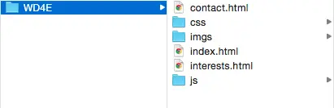
</p>

When we use CodePen we use that idea of separating our code. However, be
aware that CodePen doesn&#39;t require many of the things you should have
in your code. For instance, in the HTML files it ignores all of the
information in the &lt;head&gt; section. So, if you develop in CodePen, make
sure to test your code later using the proper folder/file structure. You
will need to include links to the style sheets, images, and any external
JavaScript files.

<!--~~~~~~~~~~~~~~~~~~~~~~~~~~~~~~~~~~~~~~~~~~~~~~~~~~~~~~~~~~~~~~~~~~~~~~~~~~~~~~~~~~~~~~~~~~~~-->
<h2 id="Week2-03">Week 2-03. Folder Structure / Organizing Your Code</h2>
<!--~~~~~~~~~~~~~~~~~~~~~~~~~~~~~~~~~~~~~~~~~~~~~~~~~~~~~~~~~~~~~~~~~~~~~~~~~~~~~~~~~~~~~~~~~~~~-->
<!--~~~~~~~~~~~~~~~~~~~~~~~~~~~ 120.  (xx) ~~~~~~~~~~~~~~~~~~~~~~~~~~~~~~-->
<p align="center">
  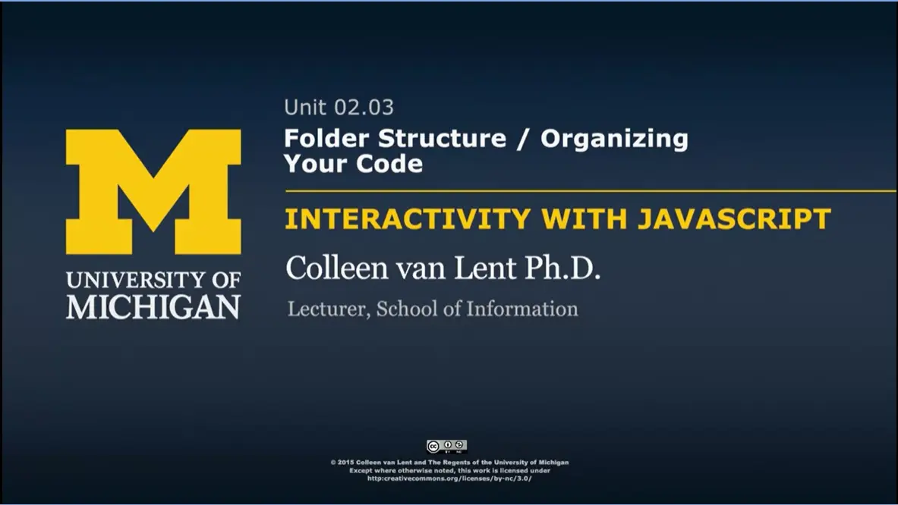
</p>

I know that one of the most frustrating things that can happen when
you&#39;re designing and developing your webpage is when you just can&#39;t
get your code to talk to one another. If you&#39;ve written some HTML, and
you&#39;re trying to link it to your style sheet, and they just don&#39;t seem
to recognize each other. Today, we&#39;re going to talk about how web
designers tend to organize and separate their code into different parts.

<!--~~~~~~~~~~~~~~~~~~~~~~~~~~~~~~~~~~~~~~~~~~~~~~~~~~~~~~~~~~~~~~~~~~~~~~~~~~~~~~~~~~~~~~~~~~~~-->
<!--~~~~~~~~~~~~~~~~~~~~~~~~~~~ 121.  (xx) ~~~~~~~~~~~~~~~~~~~~~~~~~~~~~~-->
<p align="center">
  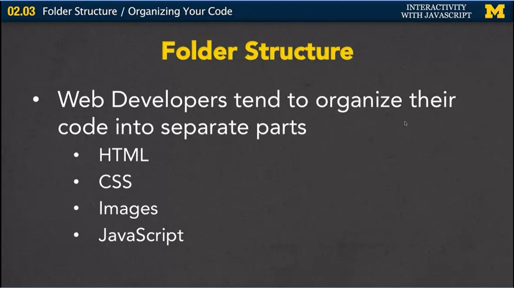
</p>

First, we always start off with a main folder that&#39;s going to hold your
HTML code. In addition to your code, you&#39;re going to have a folder for
your CSS, your images, and if you&#39;re doing it yet, your JavaScript code
as well. Organizing your code into these separate folders, CSS,
JavaScript, images, it&#39;s not a rule. Your page will still work even if
you have everything inside one big folder. But as you go on in web
design, your fellow designers are going to expect that you have similar
conventions to their own. you want to get used to doing things the right
way, right from the beginning.
<!--~~~~~~~~~~~~~~~~~~~~~~~~~~~~~~~~~~~~~~~~~~~~~~~~~~~~~~~~~~~~~~~~~~~~~~~~~~~~~~~~~~~~~~~~~~~~-->
<!--~~~~~~~~~~~~~~~~~~~~~~~~~~~ 122.  (xx) ~~~~~~~~~~~~~~~~~~~~~~~~~~~~~~-->
<p align="center">
  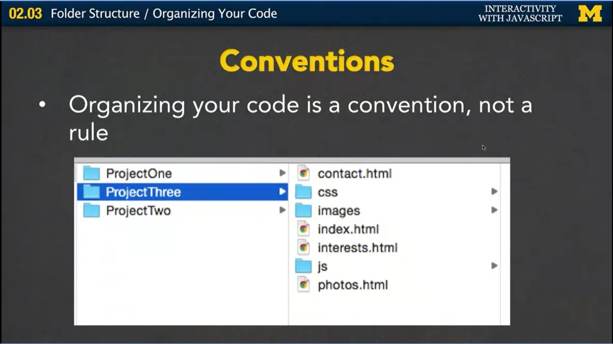
</p>

Here I&#39;ve got a quick picture of how I could organize the code using
these different folders. I have ProjectOne, ProjectTwo, and
ProjectThree. Here in ProjectThree is where I really want to look at
what we&#39;re doing. As you can see, I&#39;ve got an html file, an html file,
all four of my html files. In addition, though, I have my css, my
images, and any JavaScript. We want to make sure that all these
different files can talk to one another. And so, we&#39;re going to use the
convention here, and I&#39;m going to show you how to make sure they can
link together in the right way.

<!--~~~~~~~~~~~~~~~~~~~~~~~~~~~~~~~~~~~~~~~~~~~~~~~~~~~~~~~~~~~~~~~~~~~~~~~~~~~~~~~~~~~~~~~~~~~~-->
<!--~~~~~~~~~~~~~~~~~~~~~~~~~~~ 123.  (xx) ~~~~~~~~~~~~~~~~~~~~~~~~~~~~~~-->
<p align="center">
  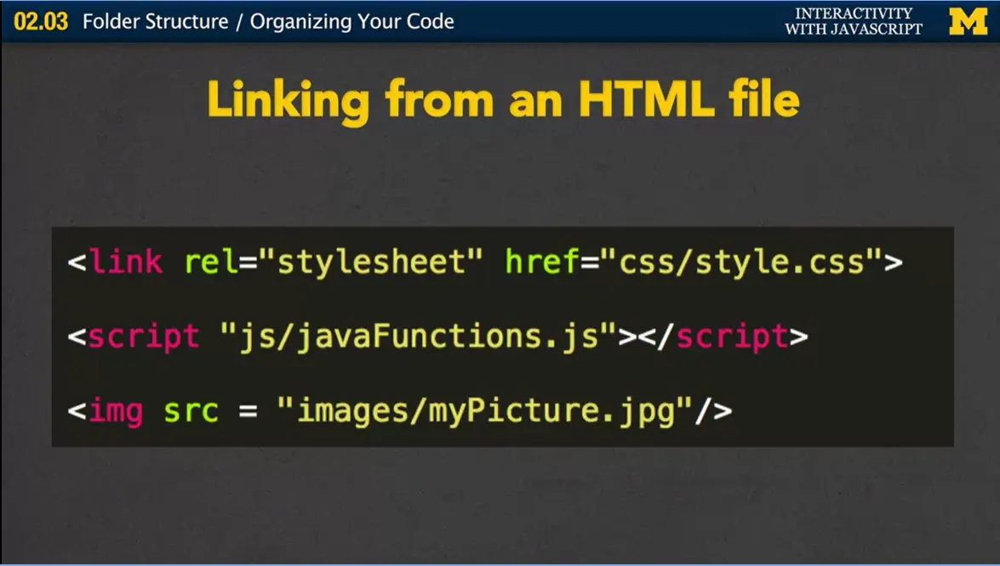
</p>

2^nd^ line should be: **&lt;script
src="js/javaFunctions.js"&gt;&lt;/script&gt;**

Let&#39;s say that inside your HTML file, you want to link to your style
sheet, your Java functions, and perhaps a picture. Well, this is the way
you&#39;re going to do it. When you link to your style sheet, you want to
make sure you include your CSS folder. You don&#39;t need any other folder,
just that one. But be careful, if you called it css lower case, make
sure your link says css lower case, not upper case. When it&#39;s time to
link to your java files, you do the same thing. Make sure you start the
link with that js. What this does is it tells the browser, hey, I need
this file right here, but in order to find it, go into the JavaScript
folder first, right?

Finally, the same thing, when it&#39;s time to link to an image, make sure
you link to your image folder first. Now the images folder is the one
that tends to have the most variance in the name. Some people call it
image, some call it images. Another kind of common name is to call it
img. When you&#39;re linking your code with other people&#39;s code, make sure
you do a quick check. And make sure that your folder names CSS,
JavaScript, and images match what other people are expecting.

<!--~~~~~~~~~~~~~~~~~~~~~~~~~~~~~~~~~~~~~~~~~~~~~~~~~~~~~~~~~~~~~~~~~~~~~~~~~~~~~~~~~~~~~~~~~~~~-->
<!--~~~~~~~~~~~~~~~~~~~~~~~~~~~ 124.  (xx) ~~~~~~~~~~~~~~~~~~~~~~~~~~~~~~-->
<p align="center">
  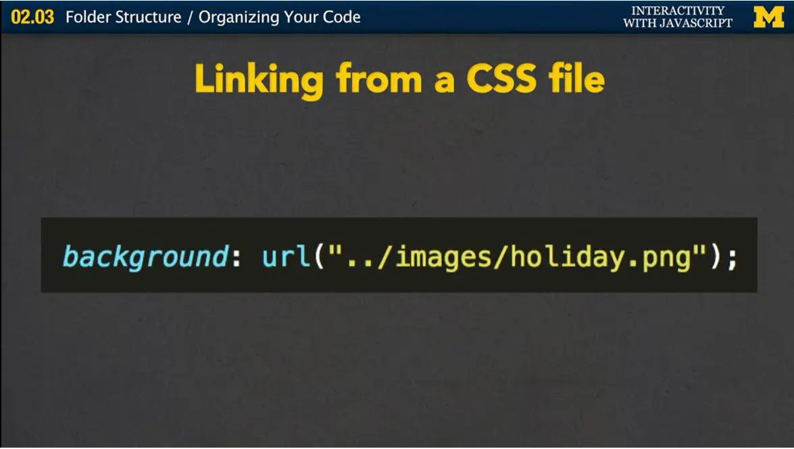
</p>

When it comes to linking from your style sheet, it can be a little bit
trickier. In the example I have here, we want to link to this holiday
picture right here, all right? Now we know that the file isn&#39;t in the
CSS folder. It doesn&#39;t belong there. Pictures should be in the images
folder. But the problem is, how do you tell the browser that the images
folder is someplace different? In this example we go up 2 directories,
find 'images' folder and pull from there. Done & done.

<!--~~~~~~~~~~~~~~~~~~~~~~~~~~~~~~~~~~~~~~~~~~~~~~~~~~~~~~~~~~~~~~~~~~~~~~~~~~~~~~~~~~~~~~~~~~~~-->
<!--~~~~~~~~~~~~~~~~~~~~~~~~~~~ 125.  (xx) ~~~~~~~~~~~~~~~~~~~~~~~~~~~~~~-->
<p align="center">
  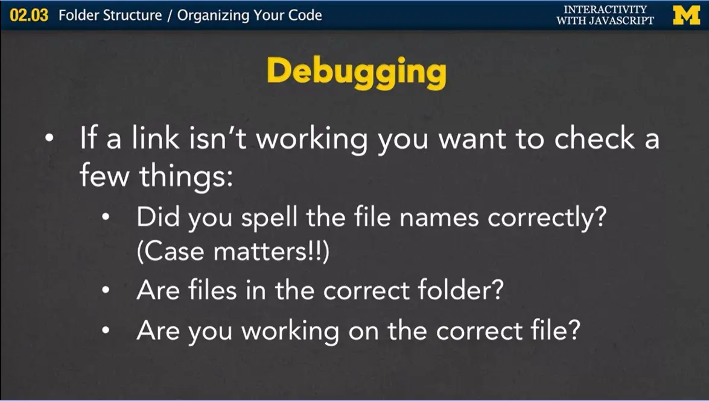
</p>

If things aren&#39;t working for you in your folder structure, here&#39;s a
few tips you can do just to see if we can find out where the issue is.
First, if the link isn&#39;t working for you, check to make sure that you
spelled the file name correctly. Case matters, upper case, lower case,
it can make a big difference. You also want to make sure that the files
are in those correct CSS, JS, or images (img) folders.

Finally, and this is a big one. As people tend to mess up on their code,
they open up new versions of the files. It never ever ceases to amaze me
how many times that I&#39;ve done this myself, where I&#39;m working on a
file, I&#39;m making changes, and they&#39;re just not showing up in the
browser. Almost all the time it&#39;s because I&#39;m working on a bad copy.
I&#39;m hoping that this is going to help you understand a little bit more
how you can organize your code to make the best use of the different
CSS, JavaScript, and images functions out there. Thanks.

<!--~~~~~~~~~~~~~~~~~~~~~~~~~~~~~~~~~~~~~~~~~~~~~~~~~~~~~~~~~~~~~~~~~~~~~~~~~~~~~~~~~~~~~~~~~~~~-->
<h2 id="Week2-04">Week 2-04. Events</h2>
<!--~~~~~~~~~~~~~~~~~~~~~~~~~~~~~~~~~~~~~~~~~~~~~~~~~~~~~~~~~~~~~~~~~~~~~~~~~~~~~~~~~~~~~~~~~~~~-->
<!--~~~~~~~~~~~~~~~~~~~~~~~~~~~ 126.  (xx) ~~~~~~~~~~~~~~~~~~~~~~~~~~~~~~-->
<p align="center">
  
</p>

Hi everybody. One of the things we promise you in this course was that
we&#39;d teach you how to do interactivity with JavaScript. Well, we
finally reached that point where we can start having some fun and
reacting to events that happened to your web page.
<!--~~~~~~~~~~~~~~~~~~~~~~~~~~~~~~~~~~~~~~~~~~~~~~~~~~~~~~~~~~~~~~~~~~~~~~~~~~~~~~~~~~~~~~~~~~~~-->
<!--~~~~~~~~~~~~~~~~~~~~~~~~~~~ 127.  (xx) ~~~~~~~~~~~~~~~~~~~~~~~~~~~~~~-->
<p align="center">
  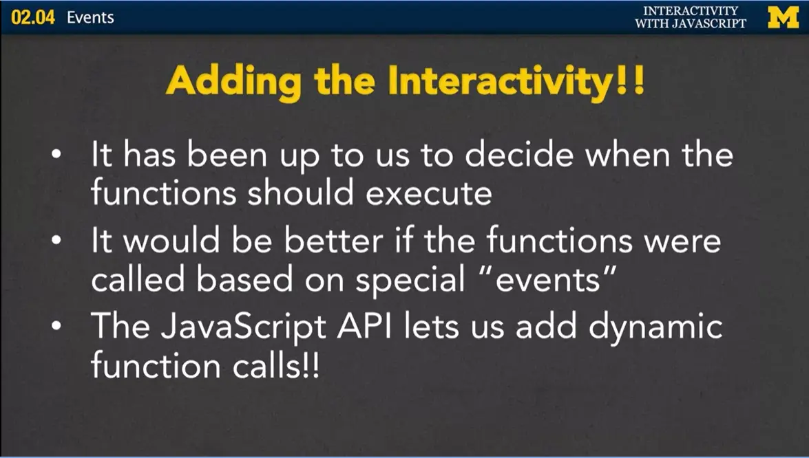
</p>

Up to now it has been up to us to decide when the functions should
execute. In our code, we put the script tags and we call those
functions. Well now, what we want to do, is we want to take advantage of
the fact that we can call these functions based on special events. Where
do these events come from, well, they come from the JavaScript API. We
can start doing things based on clicking, mouse movement, all these
different types of dynamic function calls. Let&#39;s take a look at how we
can do this.
<!--~~~~~~~~~~~~~~~~~~~~~~~~~~~~~~~~~~~~~~~~~~~~~~~~~~~~~~~~~~~~~~~~~~~~~~~~~~~~~~~~~~~~~~~~~~~~-->
<!--~~~~~~~~~~~~~~~~~~~~~~~~~~~ 128.  (xx) ~~~~~~~~~~~~~~~~~~~~~~~~~~~~~~-->
<p align="center">
  
</p>

First, let&#39;s talk about just some of the events that we normally react
to on a web page. The first one is **onclick**, it's very
straightforward, if the user clicks on an HTML element, we want
something JavaScript function to execute. We can also have
**onmouseover, onresize**, and a very common one is **onload**.

This last one says whenever the page is loaded, I want to call some
JavaScript functions or run some sort of JavaScript code, but please
don&#39;t do it until the page is completely done. The reason that this one
is a little bit more interesting to me, is that sometimes students have
problems in that they try to write JavaScript. But the page that they
are trying to apply the JavaScript to, is so complex and takes so long
to load that the JavaScript is done before the user can even see the
page. This last one onload we are going to use quite a bit to make sure
we are all seeing the exact same events.

<!--~~~~~~~~~~~~~~~~~~~~~~~~~~~~~~~~~~~~~~~~~~~~~~~~~~~~~~~~~~~~~~~~~~~~~~~~~~~~~~~~~~~~~~~~~~~~-->
<!--~~~~~~~~~~~~~~~~~~~~~~~~~~~ 129.  (xx) ~~~~~~~~~~~~~~~~~~~~~~~~~~~~~~-->
<p align="center">
  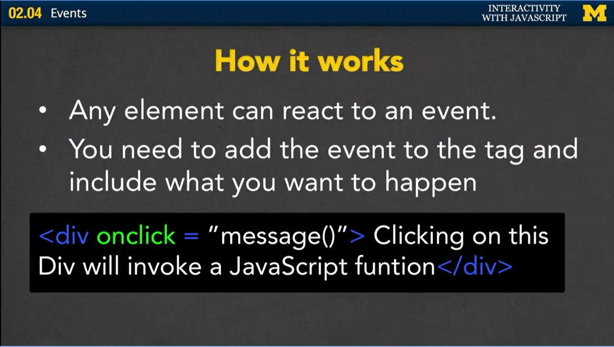
</p>

All right, so how does this work? We know that any element can react to
an event. Well, we need to add code to our HTML that links the events
and the tags together. Here&#39;s an example for you. Here, I have my tag
div, simple HTML five tag but I&#39;ve added this event right here that
says on click.

Now the browser&#39;s changed, the browser is what I say listening. It&#39;s
listening, listening to this one div and saying okay, if anybody clicks
on this then I am going to call the JavaScript function message. All
right, this isn&#39;t going to happen just once, this is going to happen
for the duration that this site is loaded onto the browser.

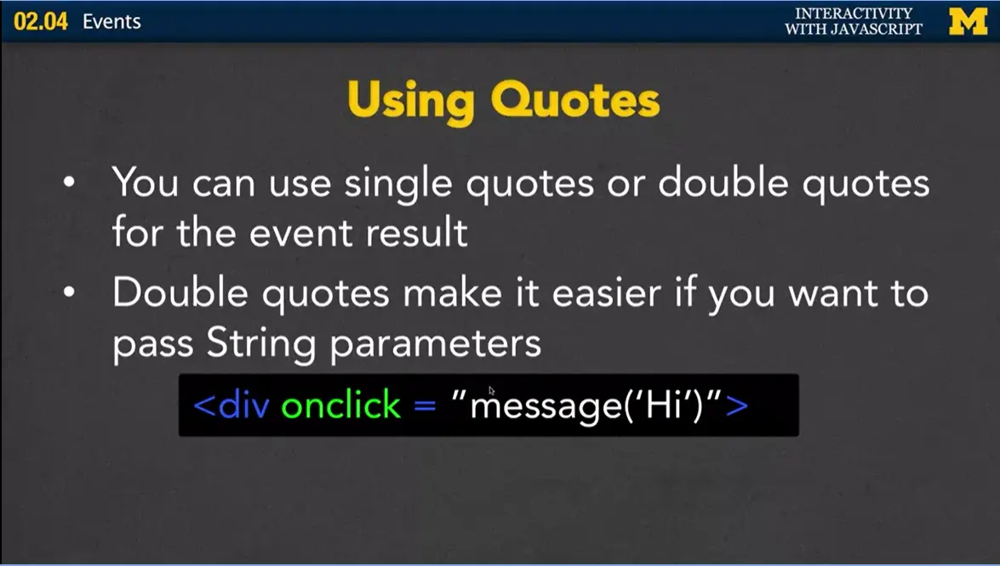{width="4.0in"
height="2.2670942694663165in"}

One of the things that we need to talk about is the use of quotes. When
we have our event such as **onclick** equals message function or
**onclick** equals add function, anything like that we need to put the
function inside quotes. And you can use single quotes or double quotes
in order to do this. However, I always use double quotes because it
makes it much easier if I want to pass string arguments to the function.
If you take a look down here, you can see I want to call the function
called message and I need to send it this Hi message.

Well, if I&#39;d done it this way **(&lt;div onclick='message('Hi')'&gt;**)
equals message with a single quote. And then, what&#39;s going to happen
when I try to send my screen? As soon as I add another single quote the
browser goes, that&#39;s the end, it matches there&#39;s your whole string.

If you&#39;re going to be matching different strings together, put the
outer one in double quotes and he inner one in single quotes and it&#39;s
going to make it much easier for your browser to understand what&#39;s
going on.

Be careful copying and pasting quotes when you&#39;re coding. It&#39;s a very
common thing to do but it&#39;s important to remember that a lot of times
your editor gets mixed up. Because when you&#39;re coding, you don&#39;t have
that same kind of slant that Word, PowerPoint, and other programs put
into your quotes. Whenever you copy and paste, go back and make sure
that they&#39;re matching up correctly.

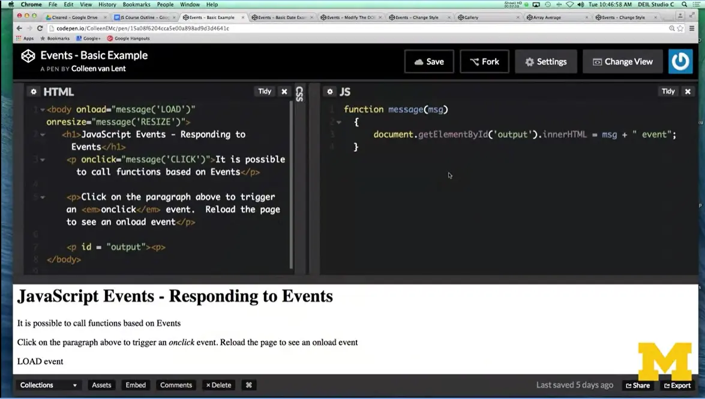{width="4.0in"
height="2.2670942694663165in"}

Let&#39;s take a look at what I do with this code right here. I have my
HTML on one side and my JavaScript function on the other. The JavaScript
function&#39;s pretty simple, all is it going to do is take a string, and
it&#39;s going to update the output element to show whatever that string is
along with the word event.

Over here in the HTML is where it&#39;s going to get a little bit more
interesting and it&#39;s going to be the first time we&#39;re using events, I
have three. I have **onload**, which means hey whenever I load this
page, I want you to call the message function and send it the message
load. I have **onresize** which means if I change the size of the
browser, I want to send a different message and then finally the last
one is **onclick**. All three of these events, **onload, onresize,
onclick**, they&#39;re all going to call the message function, but they&#39;re
going to call it with three different frame runners.

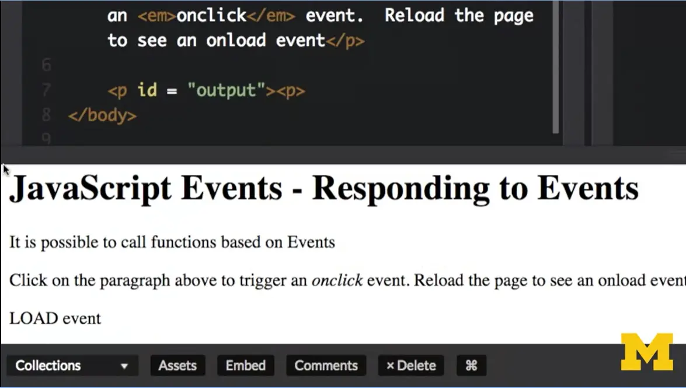{width="4.0in"
height="2.2670942694663165in"}

Let&#39;s take a look at what&#39;s going on. As you can see, when I loaded
the page, it automatically had LOAD event show up.

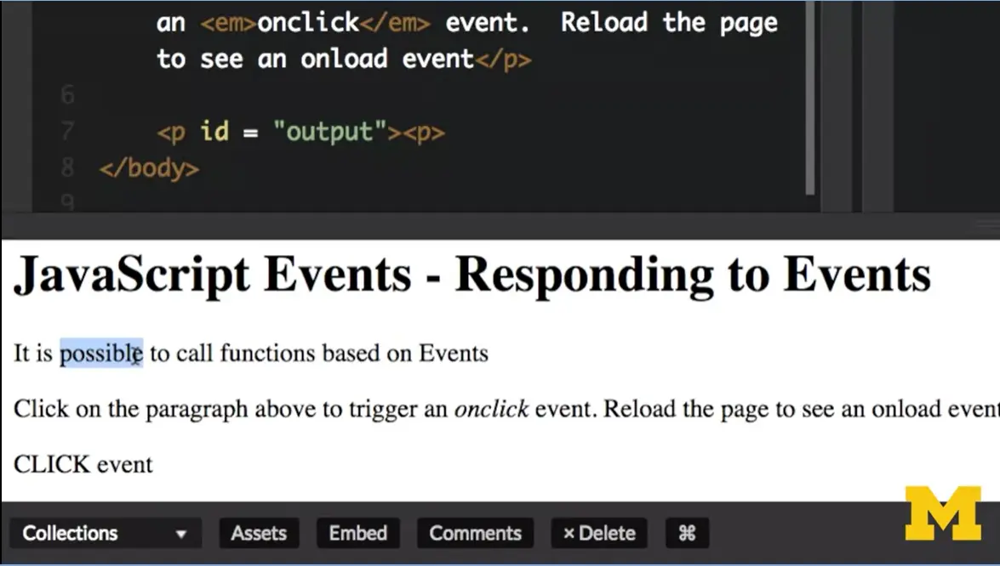{width="4.0in"
height="2.2670942694663165in"}

What happens if I click on this paragraph right here? Oh, it changes to
click event. It&#39;s actually happening over and over again; you just
can&#39;t tell because it&#39;s so quick.

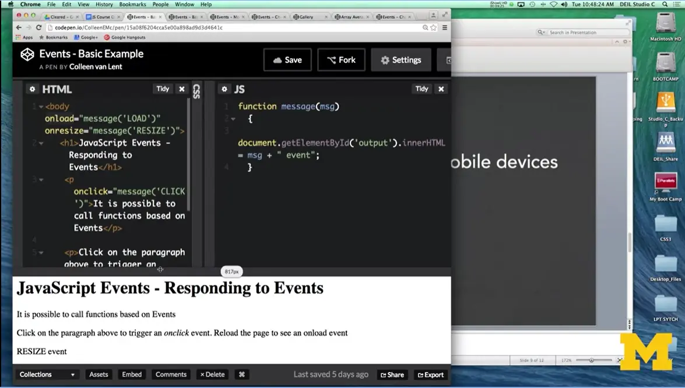{width="4.0in"
height="2.2670942694663165in"}

Now, the last thing I&#39;m going to do is I&#39;m going to resize the page
and you can see, that it recognizes that there is a resize event. So,
it&#39;s pretty simple to go through, and I&#39;ll go back here, and had your
HTML actually change based on the different events.

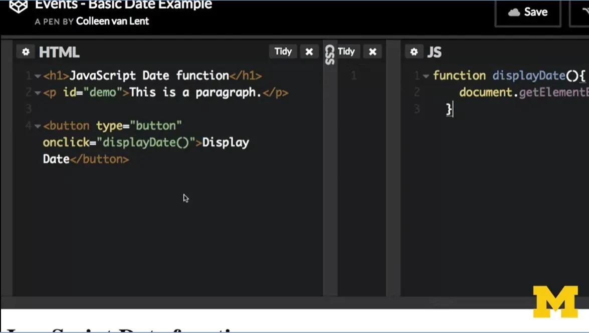{width="4.0in"
height="2.2670942694663165in"}

The second example is, again, a very straightforward way of showing you
how the events can be linked to different element types. One HTML
element we haven&#39;t used a lot in my courses is **button**. I avoid
using it because I think that the semantics of a **button** tag really
conveys this idea of click me and I&#39;m going to do something, and since
we didn&#39;t have the power to do that yet, I really didn&#39;t want to use
that element, but now we can.

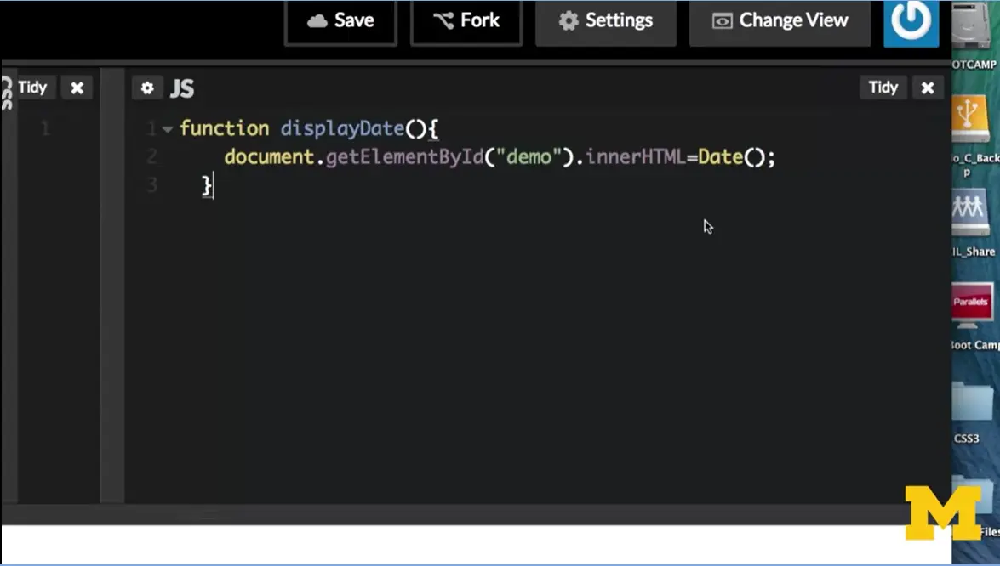{width="4.0in"
height="2.2670942694663165in"}

What I have here is a simple JavaScript function that says, hey I want
you to call the JavaScript **date** function, this is something that I
didn&#39;t write. You know that it was written by JavaScript partly because
well, it&#39;s yellow.

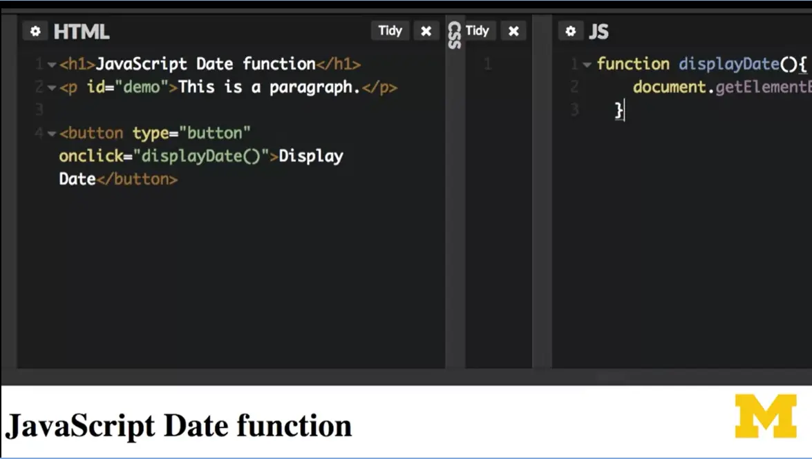{width="4.0in"
height="2.2670942694663165in"}

All right, so I&#39;m going to use this function and connect it with the
**button**. So, I have **button** type equals **button** and I have
**onclick** equals **displayDate()**.

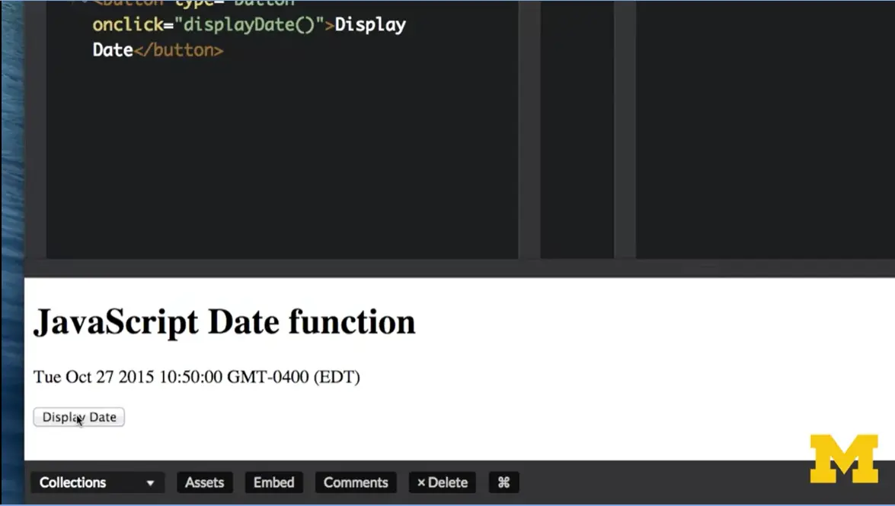{width="4.0in"
height="2.2670942694663165in"}

As soon as I click on that, we want to keep our eye on where it says
this is a paragraph, because when I click on it that should be updated
to what the current date in time is for when I&#39;m running this. All
right. Now, there&#39;s a good chance that this date doesn&#39;t look exactly
the way you expect it. Don&#39;t forget, computers are very specific, and
they&#39;re going to give much longer answers than we&#39;re usually used to.

As we start adding JavaScript events and reacting to events to our code,
I just want you to be aware of something that&#39;s going on, that&#39;s
really quite complex.

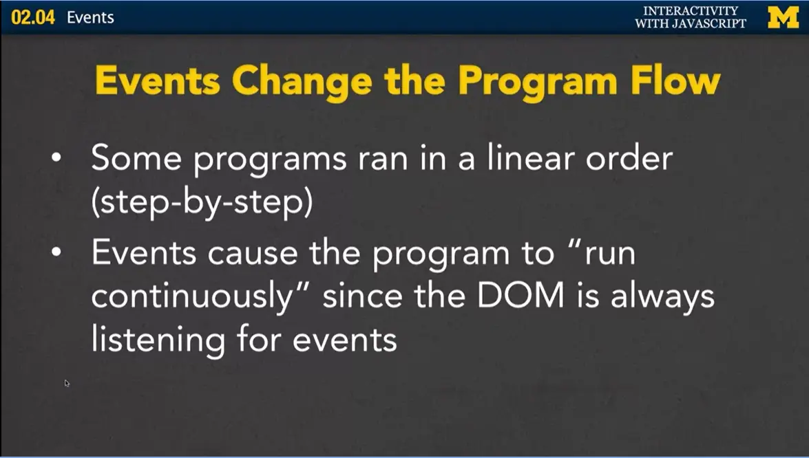{width="4.0in"
height="2.2670942694663165in"}

Before JavaScript, for the most part, our programs ran in a linear
order, it would start at the top and execute each statement step by
step, one by one and everything was really only executed once. But now
that we have events, we&#39;re really causing the program to what I want to
say, run continuously. Because soon as I add that event, the DOM is now
always going to be listening for those events. The API is saying, all
right I need to wait on click, onclick, onclick. If you add too many
events to your page, you could conceivably slow down the execution of
your page.

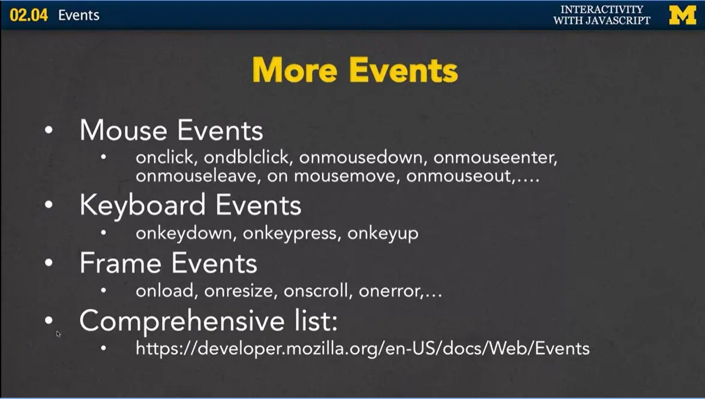{width="4.0in"
height="2.2670942694663165in"}

Clearly there are a lot more events than just the four I told you about.
We tend to categorize these events into groups. We have mouse events
where you can react to onclick, double click, mouse enter or mouse
leave, mouse move, you can react to keyboard events. You can actually
listen for certain keys to be pressed down or the least. There&#39;s also
what we call frame events, and we&#39;ve looked at two of those already.
You can do onload, onresize, you can react to scrolling on your page or
even if there&#39;s an error.

If you want a more comprehensive list of events, you can really go
anywhere online, but I went ahead and I&#39;ll link one for you in the
course page, that goes directly through Mozilla. It is
<https://developer.mozilla.org/en-US/docs/Web/Events>.

The important thing to know is that you&#39;re not expected to know all of
the events, it&#39;s something we&#39;re going to learn over time. Hopefully,
you&#39;ve got this little idea of what events do and how you can start
using them to add a little bit of interaction with your page. Without
these events JavaScript can be limited in its ability to interact with
the DOM. We didn&#39;t have onclick, onload and be really hard to actually
work with our webpages.

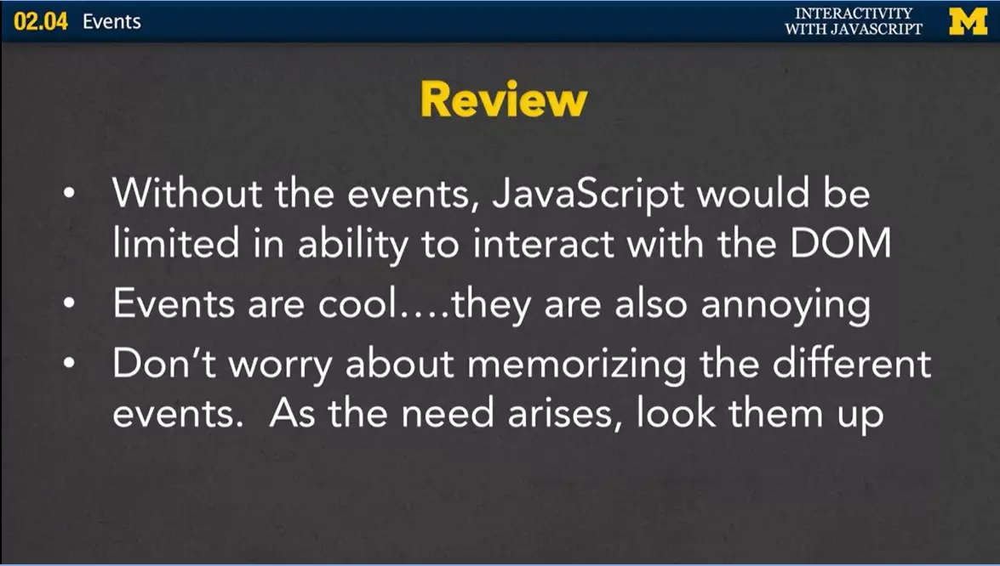{width="4.0in"
height="2.2670942694663165in"}

Another thing I&#39;d like you to take away from this is while events are
really cool, they are also very annoying. It&#39;s possible to put a
listener on every paragraph of your page or every dip and have cool
things happening all the time. But after a while, the usability of your
page is really going to take a hit.

I know I&#39;ve said it before, but don&#39;t worry about memorizing all the
different events. As you code, certain needs will arise and you&#39;ll say,
I wonder if there&#39;s an event for that, I&#39;m going to go look it up.
What I&#39;m much more concerned about at this point and hopefully you are
to is gaining the basic idea of, I know how events work, I&#39;m going to
try to implement one. And when a problem arises, as it probably will, I
can kind of fight my way through and make it work, just don&#39;t forget.
We&#39;re there on the message boards. We&#39;re happy to all work as a team
to make sure that your page is doing the types of cool things that you
want it to do. Good luck.

This is a great time for you to write some code!!! Open your editor (or
CodePen) and write a small program that pops up an alert message when
you load the page. Or better yet, change the content of your page to the
current Date every time you open the page. Once you are done, compare
your answer to an example I have here:
<http://codepen.io/ColleenEMc/pen/vLEJjq>

## Mastering Events and Functions

## Events

The rest of the material is more and more examples of using Events and
functions in JavaScript. If you are a little worried that you don&#39;t
understand them after the first module, that is fine. Just read all the
way through, try to play with some of the code, and then read them
again. It isn&#39;t uncommon for it to take a few weeks to make sense.
Since we only have four weeks in this course you may find that you are
sometimes able to make the code work, without fully understanding the
details. That happens a lot. Programming is something that comes with
time and practice. And then suddenly the moments of &#34;Hooray&#34; start to
outnumber the times that you are stuck.

<h2 id="Week2-05">Week 2-05. Code With Me -- Events</h2>

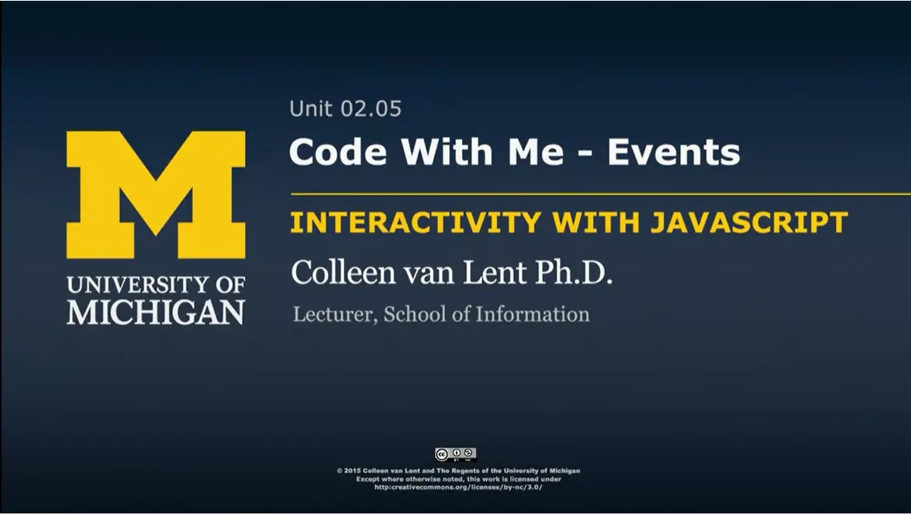{width="4.0in"
height="2.2670942694663165in"}

Hi everybody, welcome back. It&#39;s time for us to take some of the things
we&#39;ve been learning and put them into practice. One of the most
important things about learning a programming language is making sure
that you&#39;re getting your hands-on experience. Reading these modules
just isn&#39;t enough. It&#39;s great if you just want to learn about
JavaScript or learn about these different elements at a very high level.
But if you actually want to feel competent and confident in your coding,
you need to make sure that you&#39;re practicing. Let&#39;s dive into the
code. I want you to modify the code. And whenever possible, it&#39;s great
if you can break the code. Because it&#39;s always better to make your
errors now. We have the whole community around you. You can ask
questions.

{width="4.0in"
height="2.2670942694663165in"}

We&#39;re going to look at two different examples today. One, in which
we&#39;re going to modify the DOM. And the second, we&#39;re actually going to
change the style of the page that we&#39;re looking out right now. Let&#39;s
get started. In this example, I&#39;m going to do something a little bit
different then we&#39;ve done before. When I first introduced the idea of
events, I said that events are matched with functions. Well, you can
also match events just with JavaScript code, not a function itself.

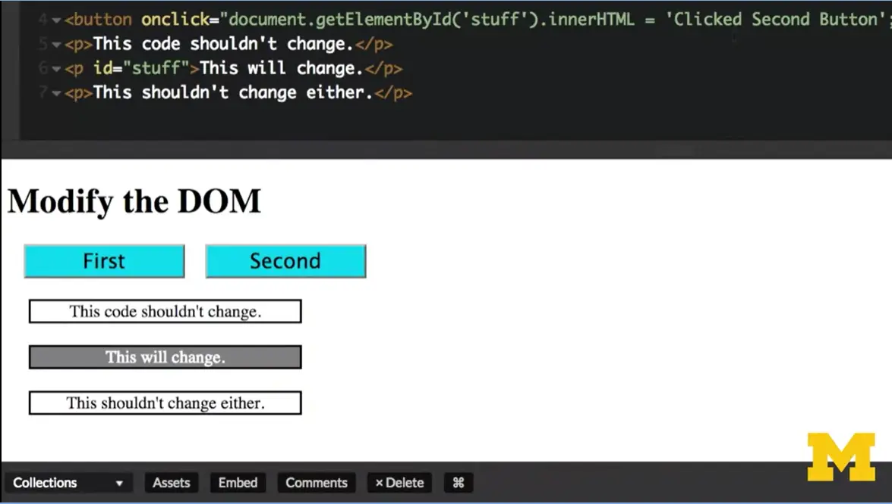{width="4.0in"
height="2.2670942694663165in"}

Here I&#39;ve created two buttons, and I named them First and Second. You
are going to use those buttons to change the content of this third
paragraph right down here. When I click on this First button I have
onClick, grab that element, change the innerHTML, and I want you to
change it to Clicked First Button. The other one is very similar. The
only difference is that I want to change the content of that paragraph.

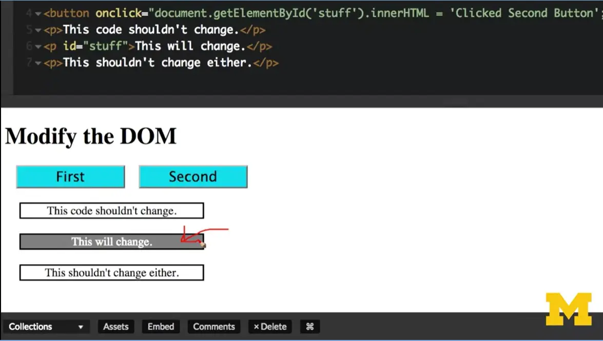{width="4.0in"
height="2.2670942694663165in"}

When I click on these buttons this, right here, is the element I want
you to look at.

{width="4.0in"
height="2.2670942694663165in"}

Let&#39;s click on the First button. You can see that I clicked, it said,
hey I know that I just clicked the First button.

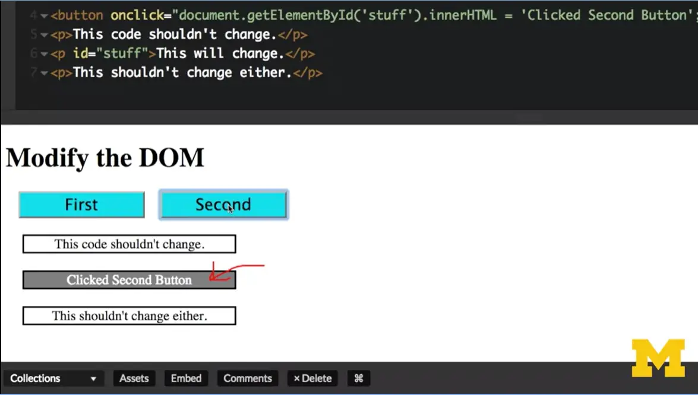{width="4.0in"
height="2.2670942694663165in"}

When I click on the second one, you know that I&#39;ve clicked on the
Second button. This seems like a really small program to write, but
there&#39;s a lot going on in here, and a lot of places where people tend
to make mistakes. Let&#39;s just look at them quickly.

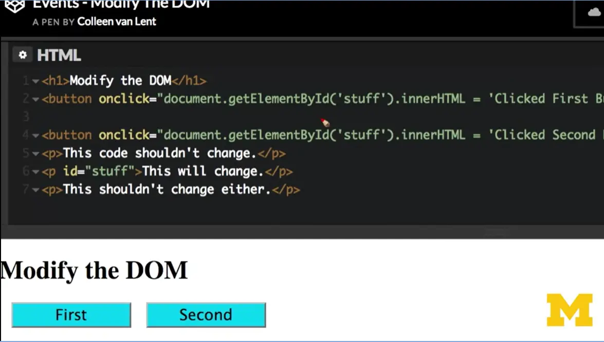{width="4.0in"
height="2.2670942694663165in"}

The first thing I want you to look at is this idea of using
document.getElementById. Whether or not you have these as upper- or
lower-case letters, makes a big difference. If you accidentally change
it from ById to ID as uppercase, this is going to cause problems in your
code.

The other thing I see a lot of people do, is they think that innerHTML
is a method, just like all the other ones are. It&#39;s not. When you&#39;re
using innerHTML, you need to make sure you use those equal, that
assignment statement, okay? The other thing that I feel sometimes people
really get kind of hung up on is the code that I give them. You can put
anything you want in here. Let&#39;s change some things. First thing I want
you to look at is this line right here. If I were to change this, I want
you to intuitively know before I do it what part of this page is going
to change. Is it the event that&#39;s going to change? Is it the button
that&#39;s going to change? Is it the whole page? So luckily, with CodePin
you&#39;ll be able to see it immediately. All right, wow, now I really.

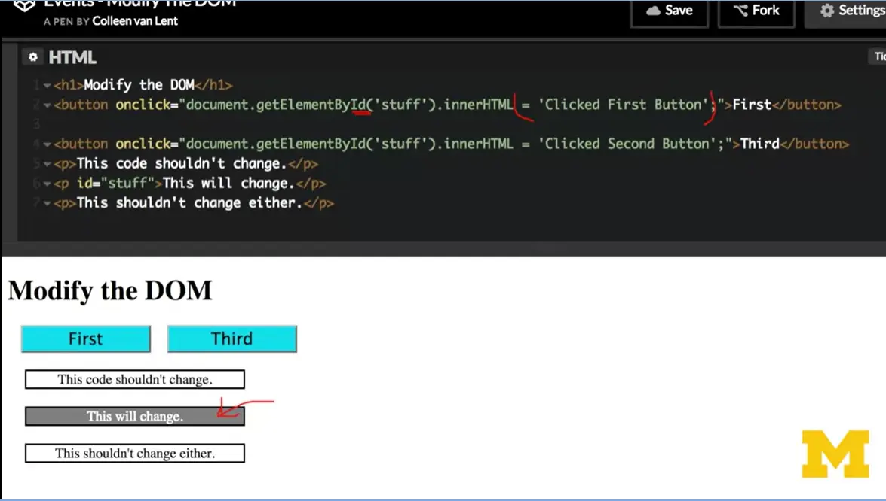{width="4.0in"
height="2.2670942694663165in"}

That&#39;s how I can change the button itself. If I want to change what&#39;s
going to happen, that where I put in here, Clicked Another Button.

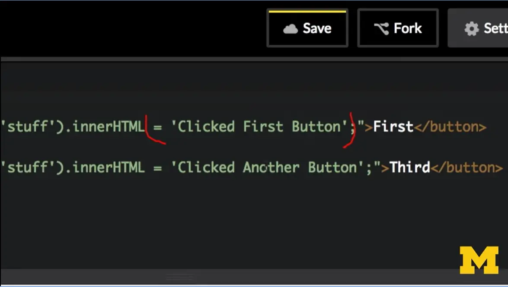{width="4.0in"
height="2.2670942694663165in"}

Let&#39;s save. I&#39;m going to click on First, Second.

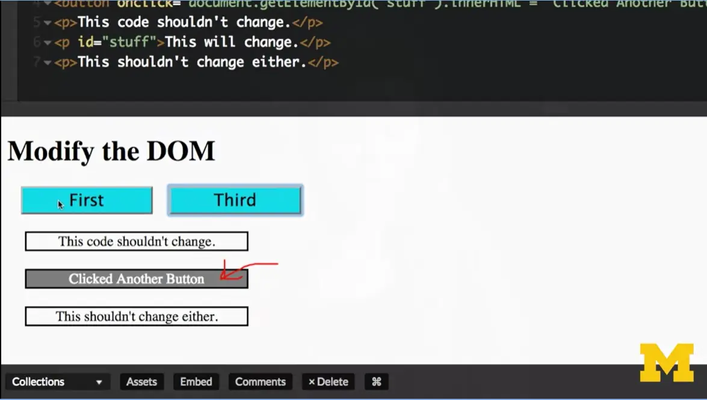{width="4.0in"
height="2.2670942694663165in"}

Play with this. Try putting it in yourself. And realize, again, that you
can put your JavaScript anywhere you want, it doesn&#39;t always have to be
in an external file.

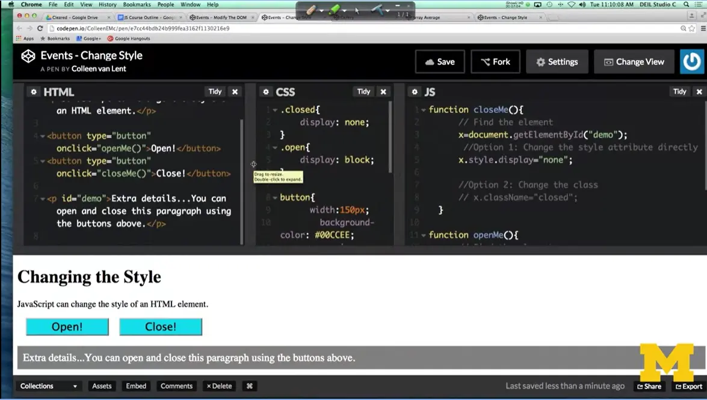{width="4.0in"
height="2.2670942694663165in"}

Let&#39;s look at the next example. Okay, get ready. This example is going
to be a big one, because we do have a lot of things going on. We have
our HTML. We have our CSS. And we have our JavaScript.

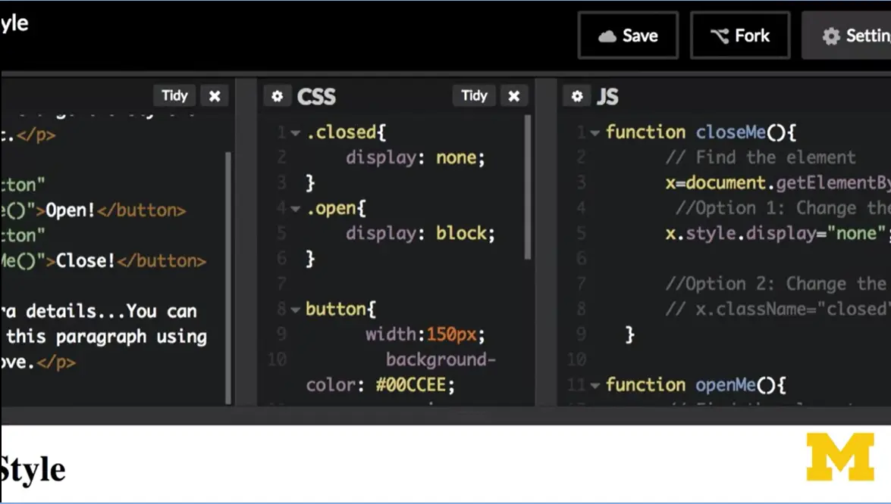{width="4.0in"
height="2.2670942694663165in"}

Let&#39;s start with the CSS, because it&#39;s the simplest and it&#39;s not
going to change as this program runs.

I&#39;ve declared two classes. One called **.closed**, and one called
**.open**, and what they do is, well, it&#39;s pretty straightforward. The
**.closed** one says, I want to change the display to none. What&#39;s
going to happen is, right down here, this one right here, it&#39;s going to
disappear. However, if I were to set the class to **.open**, well, then
now it&#39;s going to reappear again. That&#39;s all we really need to
realize, is that .closed will make it go away, .open is going to make it
come back.

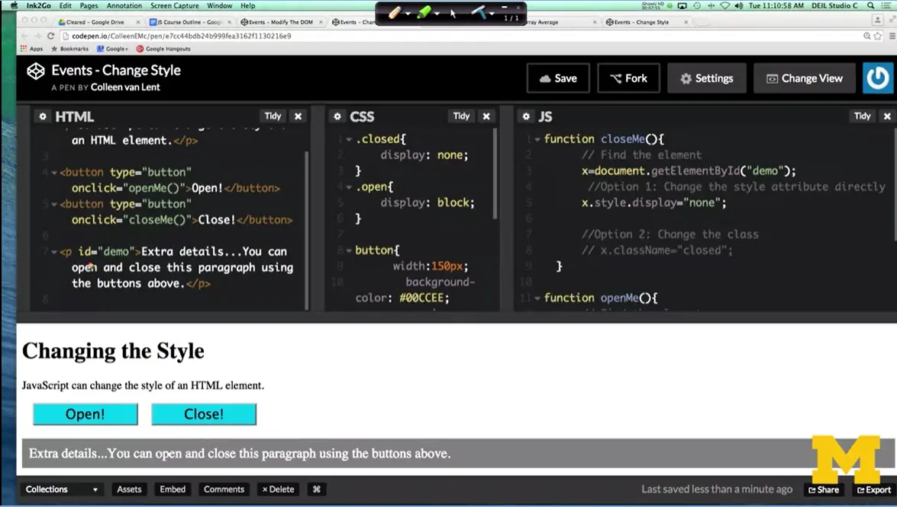{width="4.0in"
height="2.2670942694663165in"}

Over here, in my HTML, I have a paragraph called demo. And that&#39;s right
down here, it&#39;s all this entire thing we can see right here. This is
the one we want to change in our code.

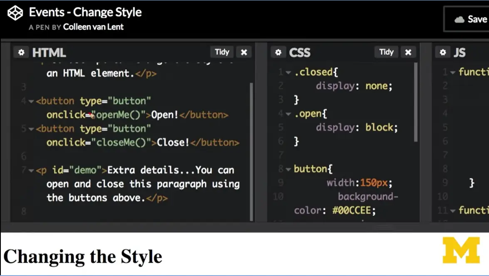{width="4.0in"
height="2.2670942694663165in"}

And finally in the HTML, we have two events. We have **onClick,
openMe**, and **onClick**, **closeMe**. Let&#39;s see how we can write the
JavaScript that will make that div appear and disappear. Let&#39;s start
with closeMe. I&#39;ve actually put two different options here. The code
looks a little bit longer than you might expect. What I need to do, is I
simply need to grab the demo element by doing document.getElementById.
But now instead of trying to change the inner HTML, I&#39;m going to change
the style.

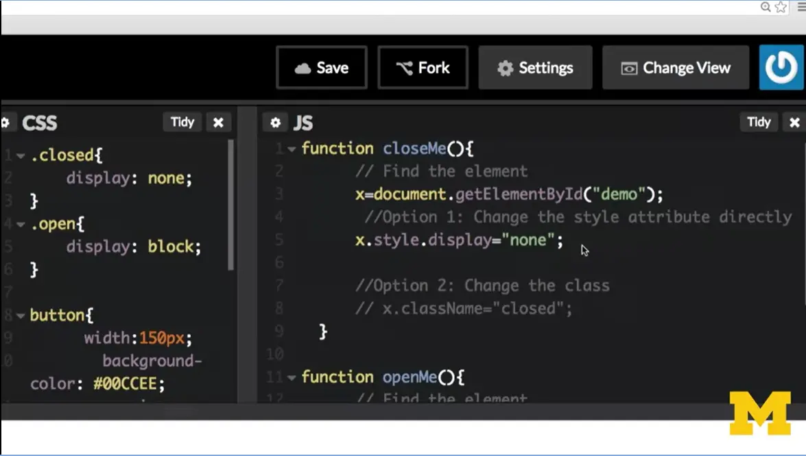{width="4.0in"
height="2.2670942694663165in"}

I go in and I say x, which is my element, **.style.display=&#34;none&#34;.**
I&#39;m not using my CSS, I&#39;m actually hardcoding it in here that I want
it to go from none.

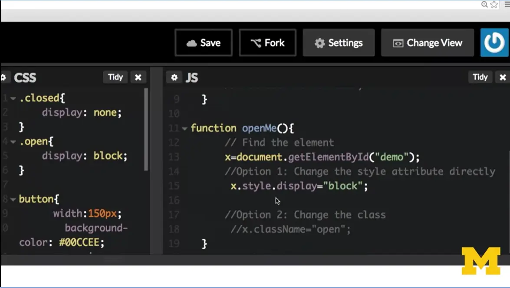{width="4.0in"
height="2.2670942694663165in"}

And in open, similarly, it says, hey grab that element, and I want it to
go from whatever it used to be, and now it should be block.

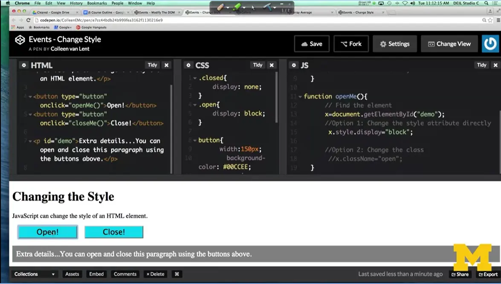{width="3.5in"
height="1.9837073490813648in"}
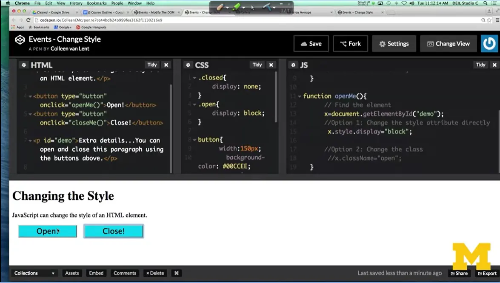{width="3.5in"
height="1.9837073490813648in"}

Let&#39;s look and see if this works. Close, Open. Close, Open. Great, it
works, but we&#39;ve hardcoded those elements in. We&#39;ve hardcoded block.
What if we also wanted to change the color, or the width, or many other
elements? This is where the idea of our classes can come in.

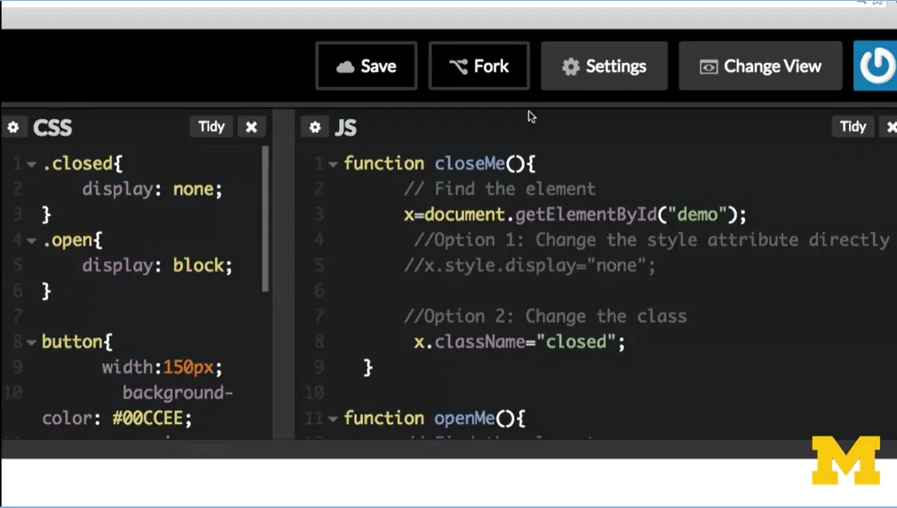{width="3.5in"
height="1.9837073490813648in"}
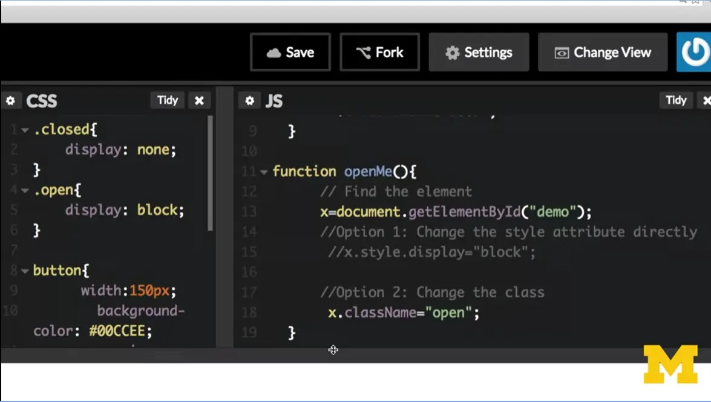{width="3.5in"
height="1.9837073490813648in"}

Let&#39;s change it over here really quickly. I&#39;m going to comment out
this line of code. And same right here. All I&#39;ve done here, is we&#39;re
going to have the same element, but the difference is now, we can
actually go in and we could say, you know what? For that element I want
you to change the class name. I don&#39;t know what it used to be, but now
I want it to be closed. And down here, I want it to be open.

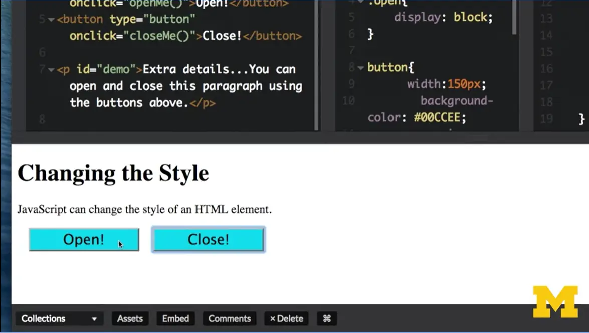{width="3.5in"
height="1.9837073490813648in"}
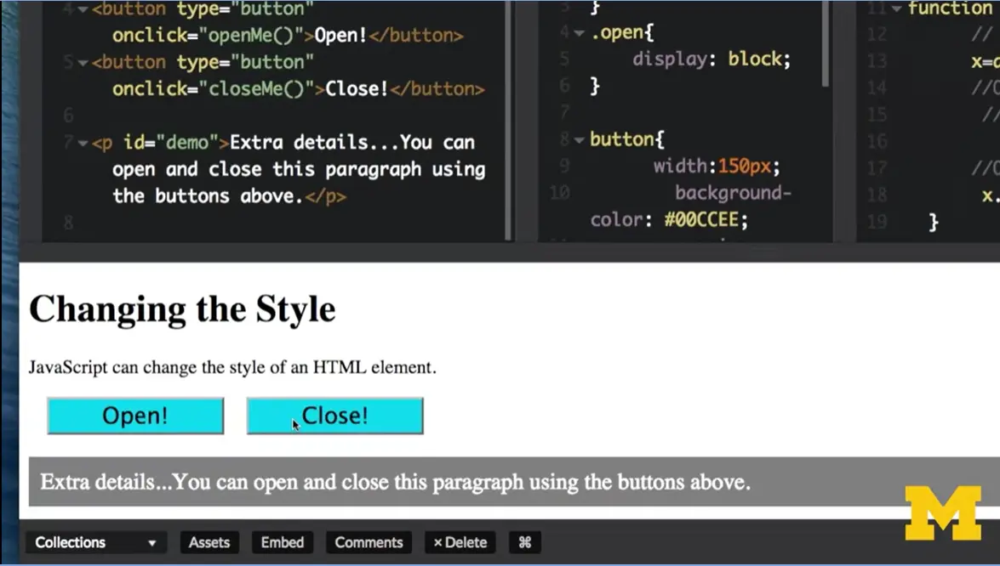{width="3.5in"
height="1.9837073490813648in"}

So, I can talk a lot. But it&#39;s important that even I stop and check
that code and make sure I didn&#39;t break it. Close, Open, Close, Open.

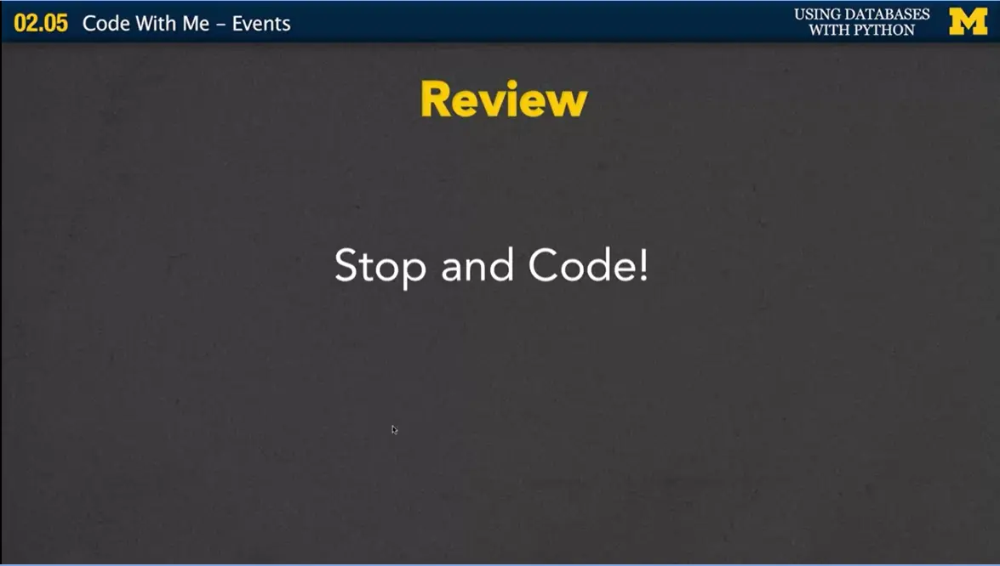{width="4.0in"
height="2.2670942694663165in"}

Now I don&#39;t really have time to do this right now, but I think what
would be a great exercise for you, is to look at this code using
**Inspect Element**. When you do that, and you click on those Open and
Close buttons, you can really see that we&#39;re going in there and we&#39;re
changing the DOM. All those things, all those different styles, you can
see them in effect. Make sure you&#39;re playing with this as you&#39;re
coding along with me. I could review with you what we just did, but I&#39;m
not going to.

The most important thing for you to do right now, is stop reading this
module and bring up some sort of editor code bin, and go in there and
start coding. If you don&#39;t do it now, you might start falling behind as
we get into these more complex ideas. So, good luck.

<h2 id="Week2-06">Week 2-06. "this"</h2>

{width="4.0in"
height="2.2670942694663165in"}

Hi everybody, welcome to my personal least favorite lecture of all time.
It&#39;s the lecture where I try to explain the word this, and how it&#39;s
used in programming languages. The only reason I don&#39;t enjoy this
lecture, is that I find it extremely difficult to talk about the word
this without using the word this. Try your best to follow along. And
I&#39;ll do my best to make sure I&#39;m as clear as possible.

Why do we even need to use special key words? Well, because a key to
smart programming is using different functions. You don&#39;t want to write
your own code. You want to use somebody else&#39;s code. But a common road
block, especially for new programmers, is trying to figure out.

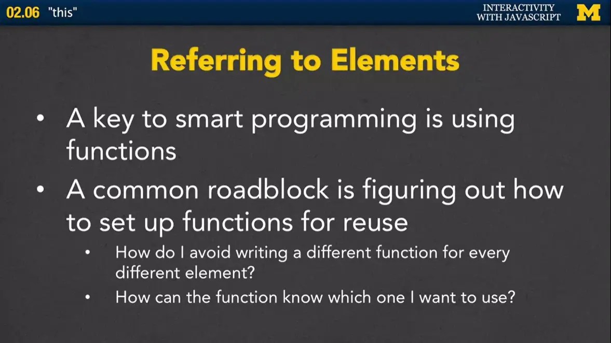{width="4.0in" height="2.25in"}

How can I write a function so that I can reuse it over and over again?
How can I write this function so that different elements can use it? But
the function knows basically, how do I know what information to use.
That&#39;s where "this" keyword comes in.

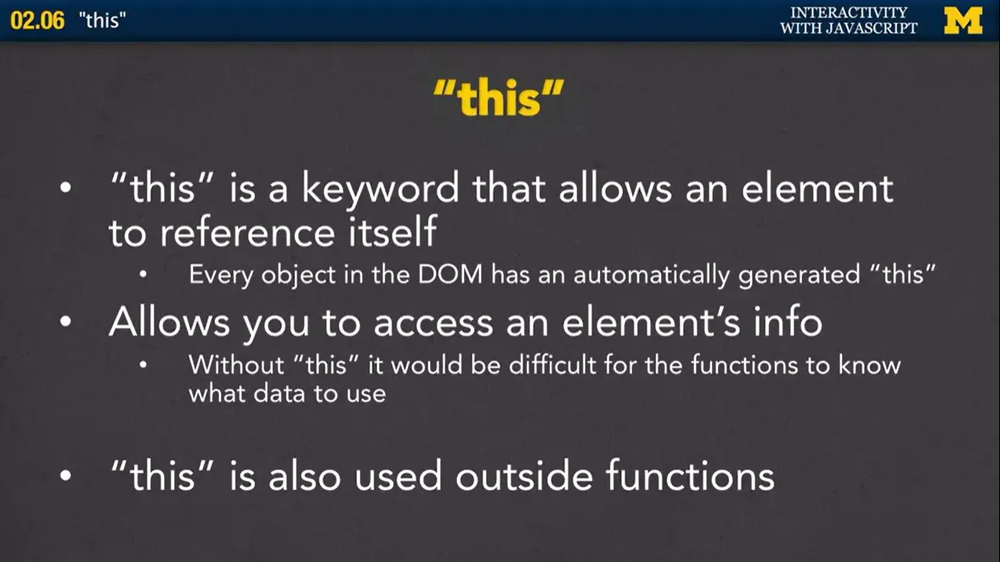{width="4.0in" height="2.25in"}

This allows an element to refer to itself. Every object in the DOM, has
an automatically generated this. This "this" attribute allows you to
access an element&#39;s info. Without "this", it would be very difficult
for functions to know what data to use. This is also used in outside
functions.

Let me draw up something really quickly, before we get to more explicit
examples. When you&#39;re writing code, if you were to say have an A tag.
And somewhere along the lines you say onclick. And you want to write a
function. How do you tell the function that you want to use this
particular a tag? As opposed to other a elements that might be in the
program? Well, you can go ahead, and you can somewhere put the word this
in here. Whenever the computer sees the word this, boom. What it&#39;s
going to do is it&#39;s just going to backtrack and go back, back, back,
back, back, back, back, back until it&#39;s, oops, here&#39;s an open tag.
They must be referring to this DOM element right here.

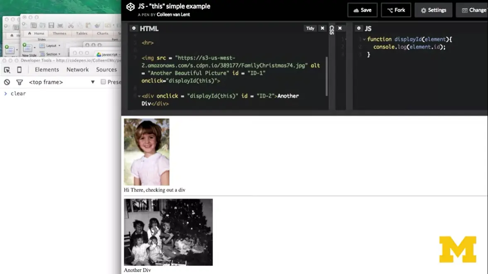{width="4.0in" height="2.25in"}

Let&#39;s look at what I hope are a few simple examples of using the word
this. Right here I have four different elements on my page. I have two
awesome pictures from the 80s and the 70s. And then, I also have a few
divs with some text within it, right here.

Each one of these elements has been associated with an event. And I want
to show you how I can use the word this. So that the events can be very
specific to the element I&#39;m click on. Let&#39;s start by looking at this
picture right here. In the html code you can see that I have source
check. I have alt text check, and I also have an event that says on
click. I want you to log to the console the alt text of this particular
element. As soon as the computer sees the word this. It&#39;s going to back
up, until it gets to the image. And then we&#39;ll say. They want the alt
text for this image. Let's see what happens when I actually click on
this image.

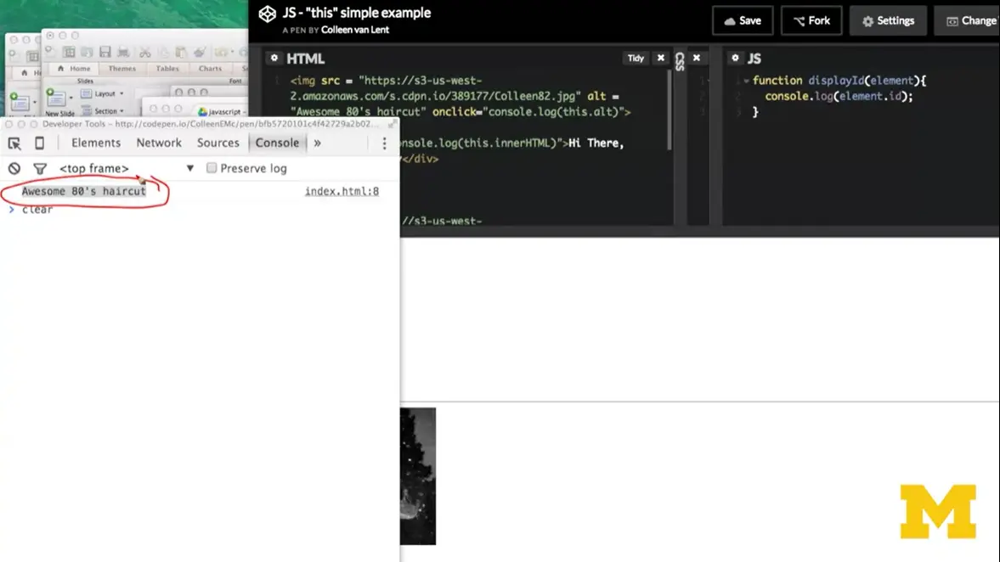{width="4.0in" height="2.25in"}

As you can see, as soon as I clicked on it. The message Awesome 80&#39;s
haircut shows up, all right? If I were to click on this multiple times.
It doesn&#39;t actually show up in the console multiple times.

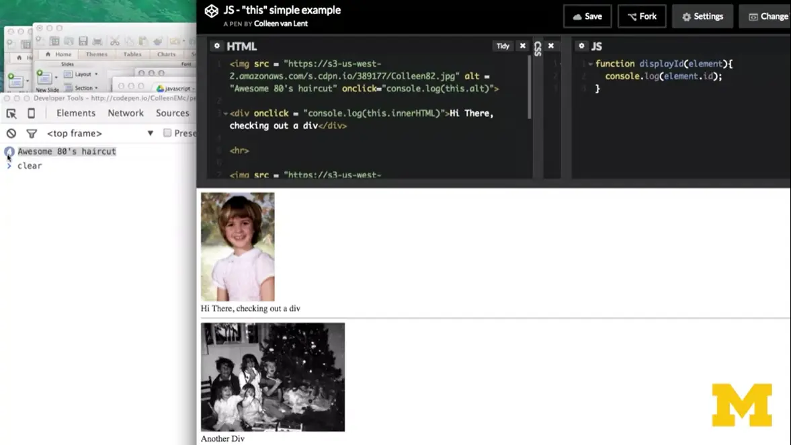{width="4.0in" height="2.25in"}

You can see that there&#39;s a little number over here that says. Oh, this
has happened four times in a row. But the important thing is that, I
click on an image and the event knew that this was the image I was
clicking on.

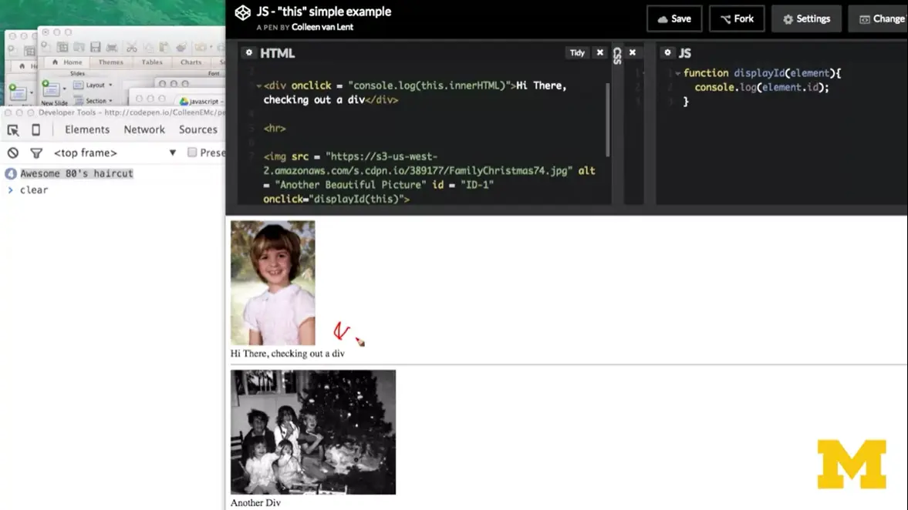{width="4.0in" height="2.25in"}

Let&#39;s look at the next example down here. I&#39;ve got my div that just
says, hi there. Checking out a div. I&#39;m looking at the second example
right here. On this one, I want I want to do something similar, but divs
don&#39;t have alt text. Instead, what I said to do is, log the inner html.
When I click on this div, I&#39;m expecting to see, hi there, checking out
the div to show up in the console.

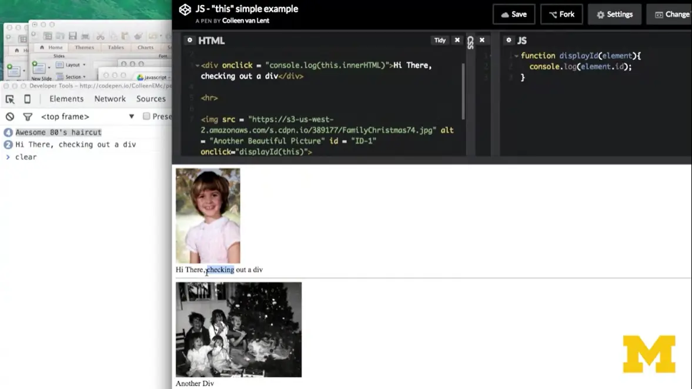{width="4.0in" height="2.25in"}

As you can see, it&#39;s working. These first two examples are very
similar. And that all I&#39;m doing is basically kind of manipulating
what&#39;s going on in the console.

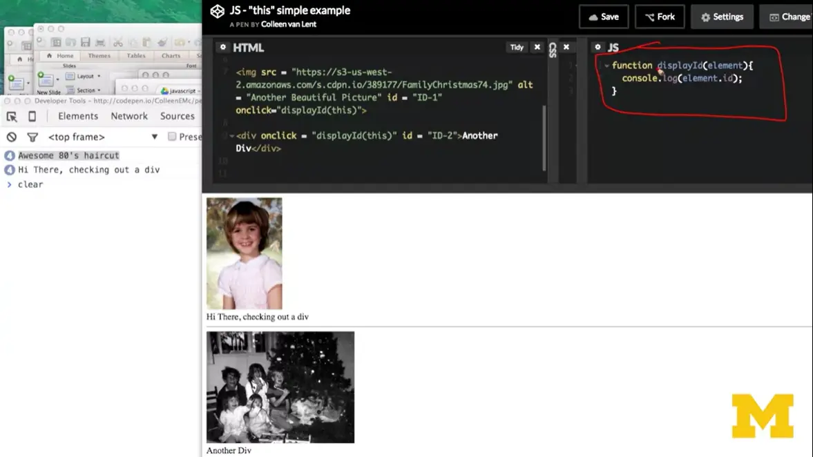{width="4.0in" height="2.25in"}

In these last two, I did something very similar. But instead of just
using on-click do something. I&#39;m going to use this function on the
right. Here&#39;s a great example of code reuse. The first few examples,
concept only. This one I want to show you how I can use this same
function called **displayID** on different elements. On my family
Christmas photo down here, you can see that I have an id of ID-1. On
this picture over here, I have an id of ID-2. My hope is that they can
both use the same exact function called displayID. And even though
they&#39;re using the same function, it&#39;s actually going to show different
results.

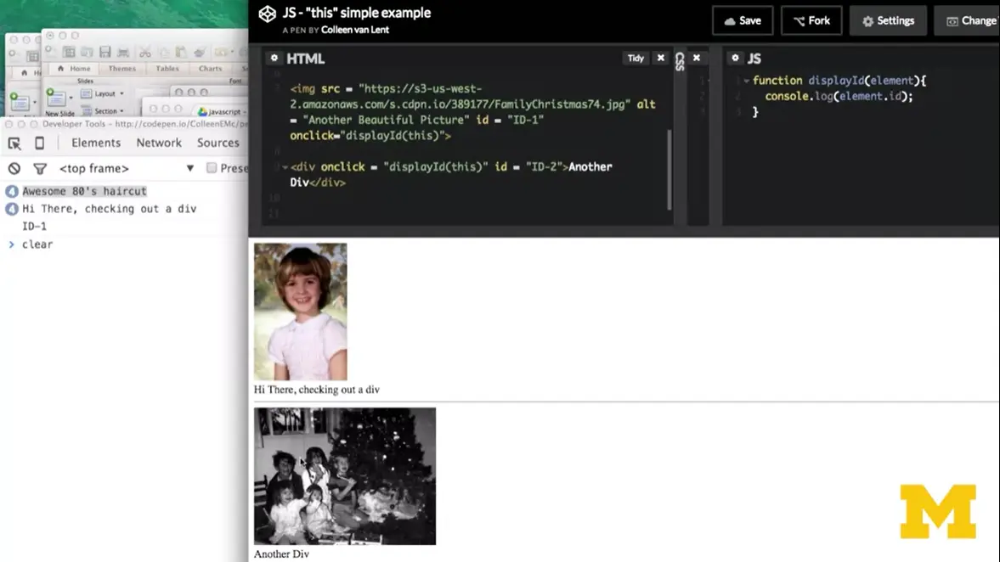{width="4.0in" height="2.25in"}

Let&#39;s see what happens when I start to click. ID-1, ID-1, ID-2, ID-2.
Here&#39;s a simple example of us using onClick along with a function and
the keyword, this, to provide different data. I want to show you though,
a slightly more colorful example. That I think also makes this point
really well.

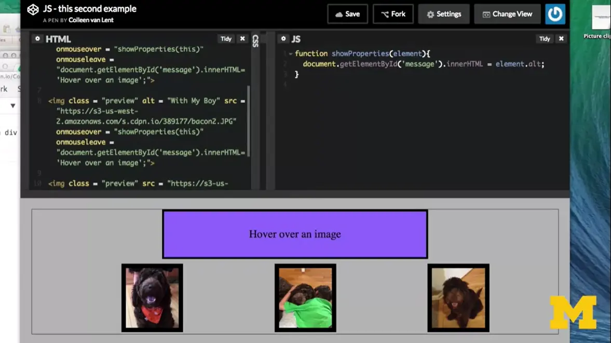{width="4.0in" height="2.25in"}

In this example let&#39;s start right off with the JavaScript. I have a
function called showProperties. And it is expecting to be sent some sort
of element. Remember, I can call this parameter anything I want. I can
call it element, I can call it e, I can call it elem. It doesn&#39;t matter
to the computer. As long as it makes sense to you, the general idea
that. Oh, I think I&#39;m going to be passed a DOM element here.

Once you get inside the function you can do **document.getelementbyid**.
Basically, what it&#39;s doing is it&#39;s grabbing this section of my html.
Stating I want to change what&#39;s showing up inside that little box. What
do I want to change it to? I want to change it to the alt text of
whatever element is being sent to me. I&#39;m going to stop here and pause
just for a second. Because this is a great place for you to think. All
right, she&#39;s talking about alt text. So that probably means the element
is going to be a picture. Because if it ends up being a div or a
paragraph, this won&#39;t break but nothing&#39;s going to happen. Now, I&#39;m
going to show you the cool part of this. On each one of these elements,
I have shown property and the keyword this which says send this image
that I am hovering over with my mouse and call that property.

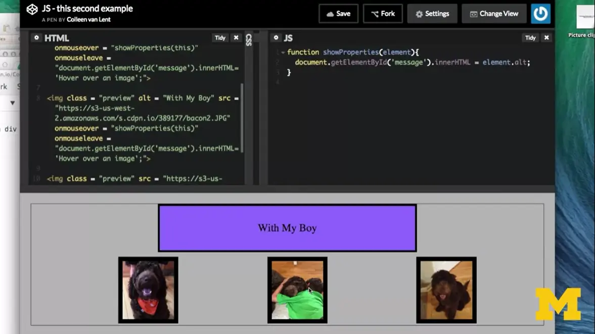{width="4.0in" height="2.25in"}

Let&#39;s take a look and see how this works. I&#39;m going to hover over the
first picture of my dog. And I am really hoping that the alt text
associated with this picture is going to show up in the preview, and it
did. I hover over another picture, and I get with my boy. And then
finally, in the last picture you can kind of see how once again the alt
text is being displayed inside the preview. I&#39;ve done something really
simple here. And what you&#39;re going to do in one of the homework is
expand on this idea and say. Not only do I want to change whatever text
is showing up in here. I actually want to change this whole picture. So
go back.

Follow this more complex example of using the keyword this that you can
figure out how to change more than just one thing. How can we change
different things? How can we change the background color? Could you
change the border? Different things like this that are, you all know how
to do. But just because you know how to do it, doesn&#39;t mean you don&#39;t
have to stop and think and really process it in your mind first.

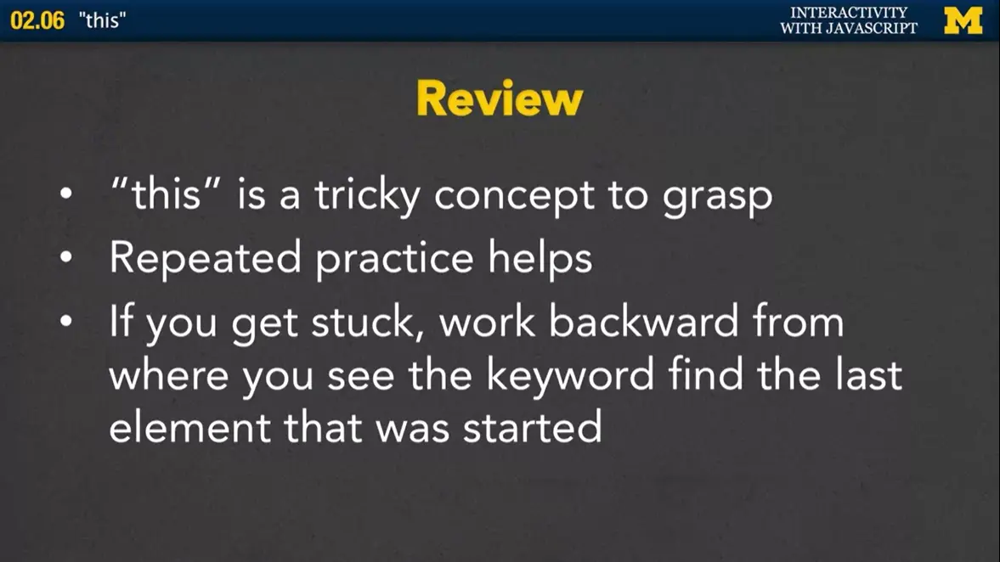{width="4.0in" height="2.25in"}

The key word this, the concept of the word this, can be really tricky to
grasp. It took me quite a while myself. And I don&#39;t think I really
understood it until I started teaching it. The important thing to note
is that repeated practice helps. You want to go in and you want to do as
much coding as you can. And then, if or when you get stuck, remember to
work backwards. Find that keyword and just start marching back until you
find a tag. As soon as you find that tag, think back. Think to the early
things you learned when you were first learning HTML5. Think about that
DOM and go. Oh, we&#39;re talking about this little part of the tree right
there. I hope this is something you&#39;re able to grasp much more quickly
than I did. And I&#39;m going to do my best to give you the examples that
you can use to really master this. Good luck.

## Homework Time!!

I am going to provide an optional quiz for people who want to double
check how well they have retained some of the general concepts from Week
Two.

What I really want people to focus on though is the Photo Gallery
assignment. All of the components you need to complete this program are
in these modules, it is your job to put them together. Please note, the
answer can be as little as 4 or 5 lines of code, or much more if that
makes more sense to you. While you are welcome to seek out help on the
forums, please remember that you are not allowed to post code. The code
to get you started is here: <http://codepen.io/ColleenEMc/pen/wKYxZa>

<h2 id="Week2-07">Week 2-07. Photo Gallery</h2>

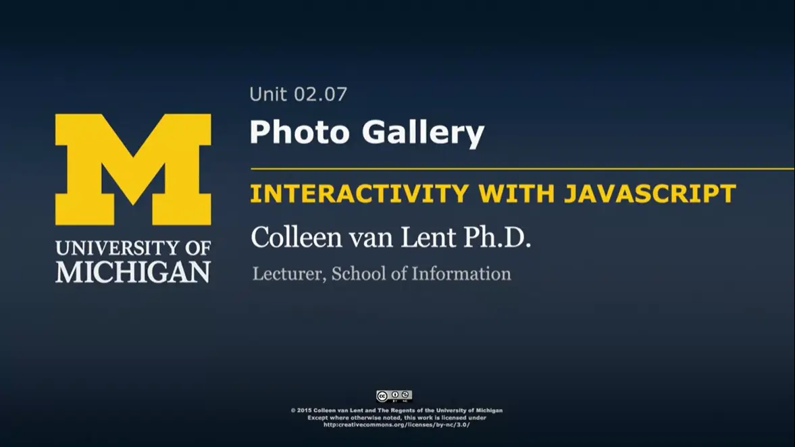{width="4.0in" height="2.25in"}

In this module, I want to walk you through how we&#39;re going to be
putting some of the things we&#39;ve learned into practice. And the main
things I&#39;m looking for, from you, are your abilities to do two things.

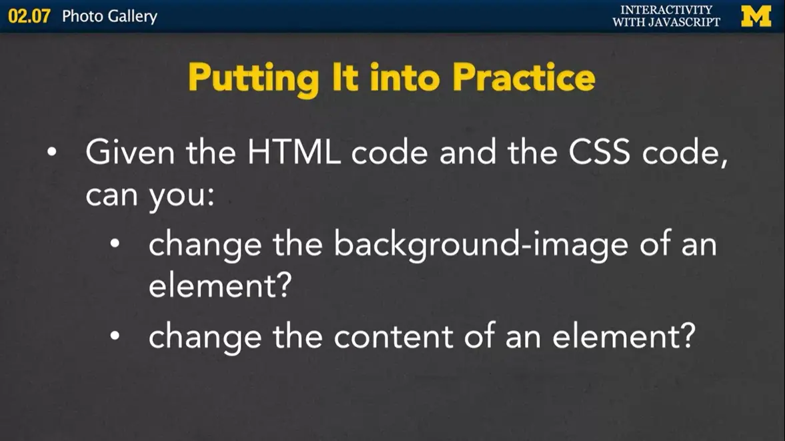{width="4.0in" height="2.25in"}

First is, if I give you some HTML code and some CSS code, can you change
the background image of an element? The second thing I want you to try
to do is can you change the content of an element? I have a very
specific planner to put into place.

<https://codepen.io/ColleenEMc/pen/wKYxZa>

So, let&#39;s take a look at the gallery homework.

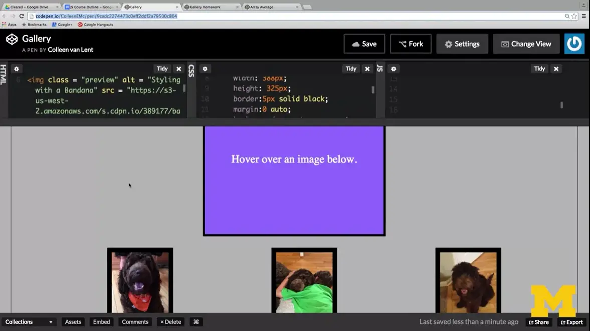{width="4.0in" height="2.25in"}

In order to begin this assignment, I&#39;m going to give you the HTML code
and the CSS code that will create this page here. I&#39;ve got one div and
three images underneath it. Each one of those images has a link to this
source file and it has alt text.

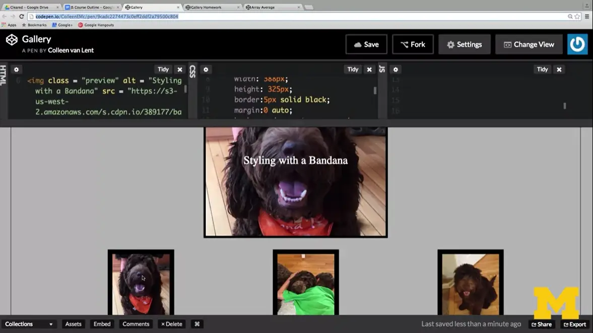{width="4.0in" height="2.25in"}

So right here, its alt text is Styling with a Bandana. And did you
notice that as soon as I put my mouse over this image, it changes the
source image and the text for the main div.

We&#39;re creating a photo gallery here.

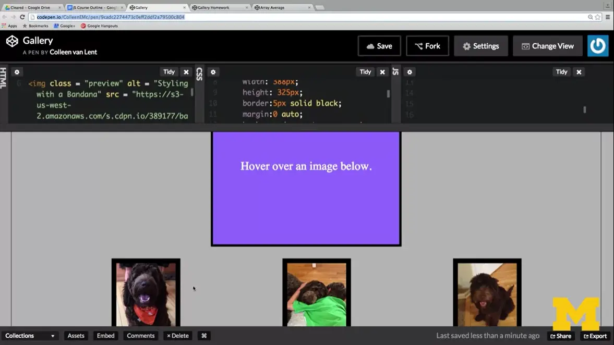{width="4.0in" height="2.25in"}

As I leave the picture and I go off to this side, we go back to the
original image in color.

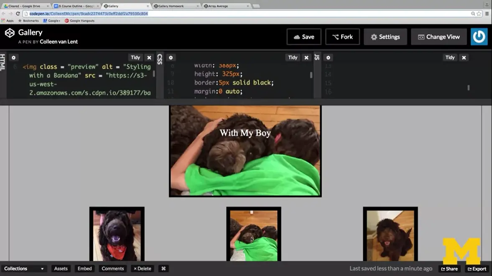{width="4.0in" height="2.25in"}

When I go over the next picture, you can see boom it went in and found
out what the source file was for this image. It located the alt text and
use both of those things to update that upper dish. Again, I&#39;m going to
leave.

{width="4.0in" height="2.25in"}

And I&#39;m going to go over this last one. I&#39;ve actually put in the
JavaScript function codes for you and the events. The one thing that I
need you to do is write those functions.

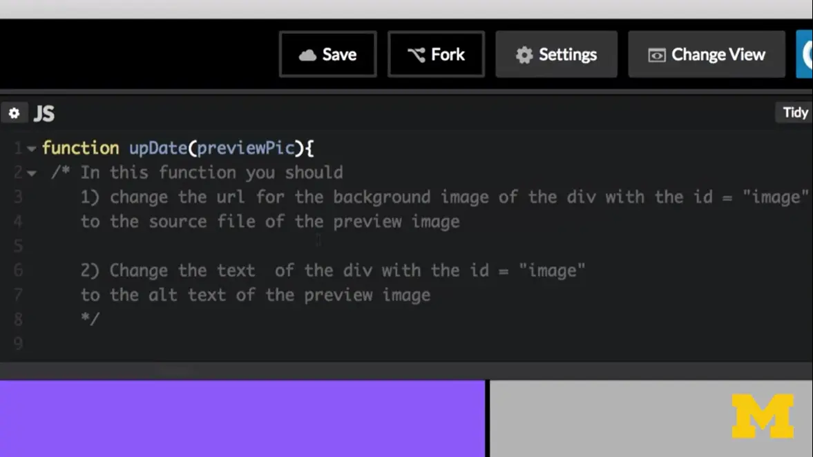{width="4.0in" height="2.25in"}

Let&#39;s look at the functions I want you to write. The first one is
called, **upDate**, and we&#39;re going to send it to **previewPic**. And I
put in here, one of the things I want you to do is change the URL for
the background image to be the source file of the image we were going
over, that **previewPic**. The next thing I want you to do is I change
the text of the div so that&#39;s going to show the alt text of the preview
image. This is what we call **upDate**.

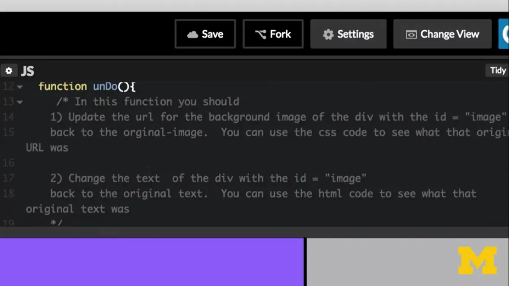{width="4.0in" height="2.25in"}

When we leave the picture, I want you to undo what we just did, I want
you to go in and I want you to change the text and the background image
again.

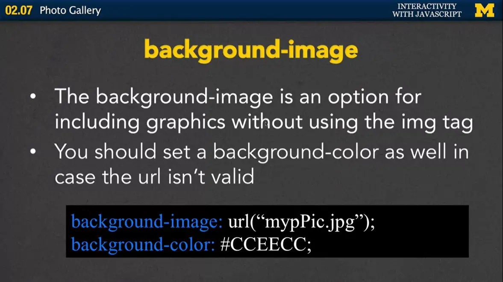{width="4.0in" height="2.25in"}

Just as a little refresher in case you haven&#39;t used background images
before, the background image is an option for including graphics without
using an image tag. It&#39;s really just another way to add a little bit of
style without affecting the content. When you set background images
it&#39;s always a good idea to also set a background color. Because
sometimes, the URL might not be valid or the browser might not be able
to download it.

Here&#39;s an example of me setting the background image and the background
color. In order to this we want to say the URL use this keyword URL. And
then inside the parentheses you need to put the name of the file. Okay?
Now in this case it just happens to be mypPic.jpg. What you don&#39;t want
to do in the homework is you don&#39;t want to hard code this right here.
Instead of giving a name, you are going to want to use some sort of
variable. Okay? After you do that, you&#39;re going to want to hard code
the background color because we&#39;re hoping it won&#39;t be there at all.

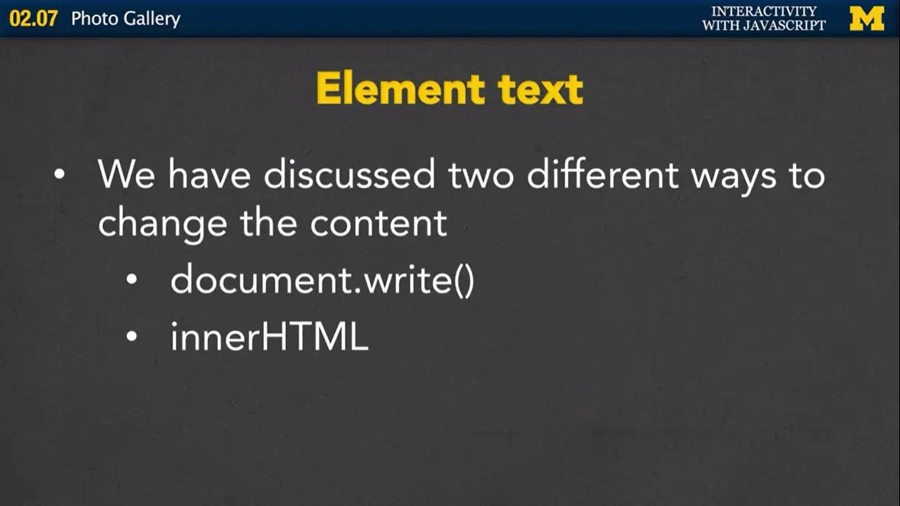{width="4.0in" height="2.25in"}

For the element text, I&#39;m going to leave that a little bit more for you
to figure out how you&#39;re going to do that. We&#39;ve discussed two
different ways to change the content of the document. One is to use
**document.write()**. The other one we&#39;ve used quite a bit is
innerHTML. You need to think about what&#39;s the best way to update the
content that&#39;s inside that div to have it display the message you want.

Again, I really want you avoid doing anything where you are using the
actual alt tag. I don&#39;t want you saying, oh, look this picture happens
to say the alt text is happy. And you going in and hard coding something
and saying, oh well then this should equal happy. This isn&#39;t how
programmers work. The way that programmers try to do things is instead
you should have something is going to equal some sort of element, all
right? Avoid using quotes on the right-hand side for this assignment.
Really try to use something that can change as the document changes.

{width="4.0in" height="2.25in"}

Okay, so a couple tips to get you started. The code you need to write
should actually be really short. If you are writing more than five or
six lines of code, you probably want to stop and rethink the logic
behind what you&#39;re working on. I wrote it in two lines of code and that
was each function in about two lines of code but I can see you putting
it more in to five or six to break it down in to small pieces. You will
need to think about how you&#39;re going to incorporate the quotes. Because
don&#39;t forget, when you mix double quotes with single quotes, things can
kind of get mixed up. You should also remember that if you want to put
two Strings together, you need to use that plus operator in order to
concatenate the Strings.

This homework assignment is meant to give you an opportunity to do
something that you&#39;re proud of. If you find yourself getting frustrated
or lost, you should stop and ask for some help on the discussion board
to make sure you&#39;re on the right track. But really, I&#39;m hoping that
this something that you can do, that you can later use if you want to
incorporate it into your own portfolio. So good luck.

<h3 id="cha-wk3"><a href="http://codepen.io/collection/noEJaj/">Link to All of the Code for Week Three</a></h3>

Again, the following is a link to all of the code for Week Three. The
individual files are linked within the modules but the weekly
collections may include additional code that you are free to use.

<a href="http://codepen.io/collection/noEJaj/">Code: Week Three</a>

Even if you use CodePen, I encourage you to practice writing the code on
your own. For now, I put complete examples in CodePen, but as time goes
on, I will remove some of the commands to link the code together. You
will need to work and learn that part on your own..

<h3><a href="http://www.cheat-sheets.org/saved-copy/jsquick.pdf">A JavaScript Cheat Sheet</a></h3>

I thought about putting this next link in the optional resources
section, but it is something I really want people to know about. This
&#34;Cheat Sheet&#34; covers the major essentials of the JavaScript language.
Some of it we have covered, and some we will cover in the next two
weeks. And then there is a chunk we will never get to.

<http://www.cheat-sheets.org/saved-copy/jsquick.pdf>

So why do I want to share this with you? As you learn to program it is
important to step back every once and awhile and review what you have
learned AND what you still have left to learn. It helps a lot of people
to look ahead and start to see that they need to master the small stuff
before they can tackle the larger concepts.

## Arrays

Finally!! Now is when I start to explain some of the concepts I said you
had to wait for. Hopefully by now you are comfortable with the code

```
document.getElementById(&#39;idName&#39;);
```

This code will cause the API to search the DOM until it finds a node
with the id of &#39;idName&#39;). The key is that it is returning a single
Node. But what about these other functions?

```
document.getElementsByTagName(&#39;p&#39;);
document.getElementsByClassName(&#39;thumbnail&#39;);
```

These commands may return zero, one or more Nodes. So now we need to
find a way to handle dealing with collections of data, rather than just
one thing at a time. This is where Arrays come in. Let&#39;s get started.

<h2 id="Week3-01">Week 3-01. JavaScript Arrays</h2>

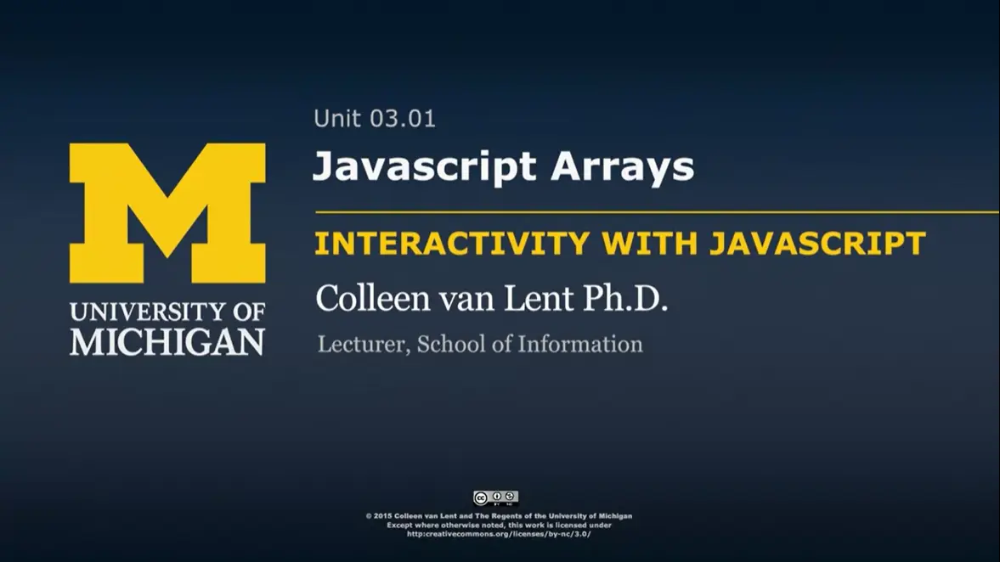{width="4.0in" height="2.25in"}

Today we&#39;re going to be starting something that&#39;s really quite
different than what we&#39;ve been doing in the past. In the first few
weeks, I used variables that stored a single piece of information. We
talked about numbers, strings, true or false booleans, or objects. And
while objects can be quite complex where you can have entire DOM
elements, the fact is they were just dealing with one element at a time.

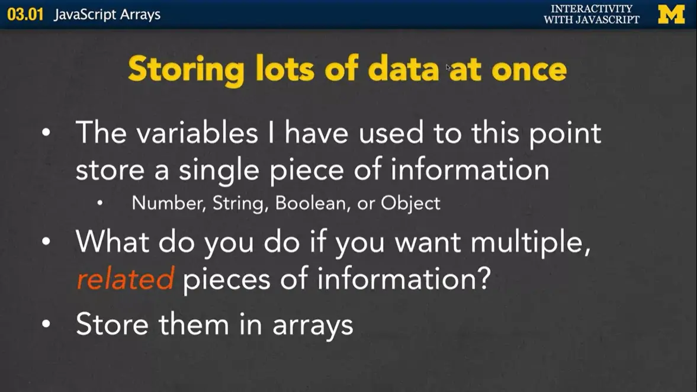{width="4.0in" height="2.25in"}

But what do you do if you want to use multiple related pieces of
information? That&#39;s where the idea of arrays comes in. Arrays give us a
chance to declare multiple values that are all linked to a single
variable.

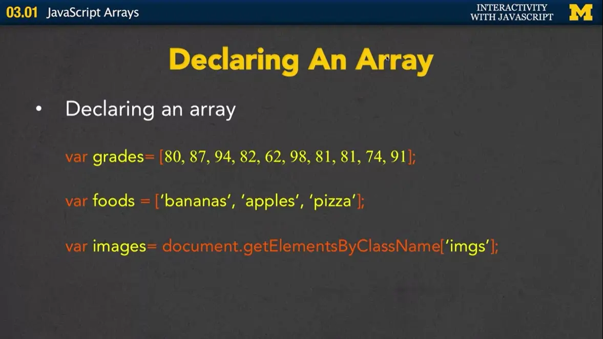{width="4.0in" height="2.25in"}

In this case I&#39;ve declared an array called grades, but instead of
giving it one value, I&#39;ve given it ten. In this next example, I said I
wanted an array called foods, and I gave it three values. In the first
one they were numbers, in the second one they&#39;re strings. My third
example, I&#39;m finally going to get to where we can start using those
APIs **getElementsByClassName**. In this case, I have no idea how many
elements will be in this images array because I don&#39;t know how many
images were in the document.

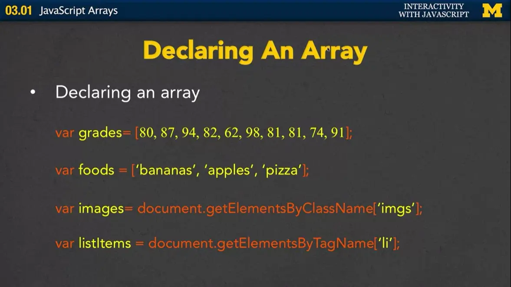{width="4.0in" height="2.25in"}

And in the same way, I could declare array by saying, you know what, I
want to make a variable, I&#39;m going to call it listItems. And how I&#39;m
going to assign it or declare and initialize it, is by doing
**document.getElementsByTagName** and giving it **&lbrack;&#39;li&#39;&rbrack;**. Now
it&#39;ll travel through the DOM and grab every element that has that li
tag.

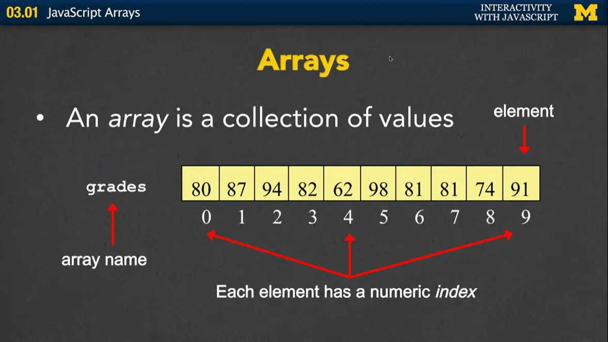{width="4.0in" height="2.25in"}

Hopefully you&#39;ve seen this idea that an array is not a single value,
but a collection of values. You start off by giving your array a name,
and then you can assign as many values as you&#39;d like. Each one of these
values 80, 82, 81, etc., these are called elements. My array is called
grades and it has ten elements in it. Now if I want to actually use
these elements, I need to know that each element has a numeric index, or
a number that goes with it. And in arrays, with almost all computer
science ideas, we don&#39;t start at 1, we start at 0. If I have an array
of 10 elements, The index goes from 0 to 9. If I have an array of 5
elements, I know that it&#39;ll go from 0 to 4.

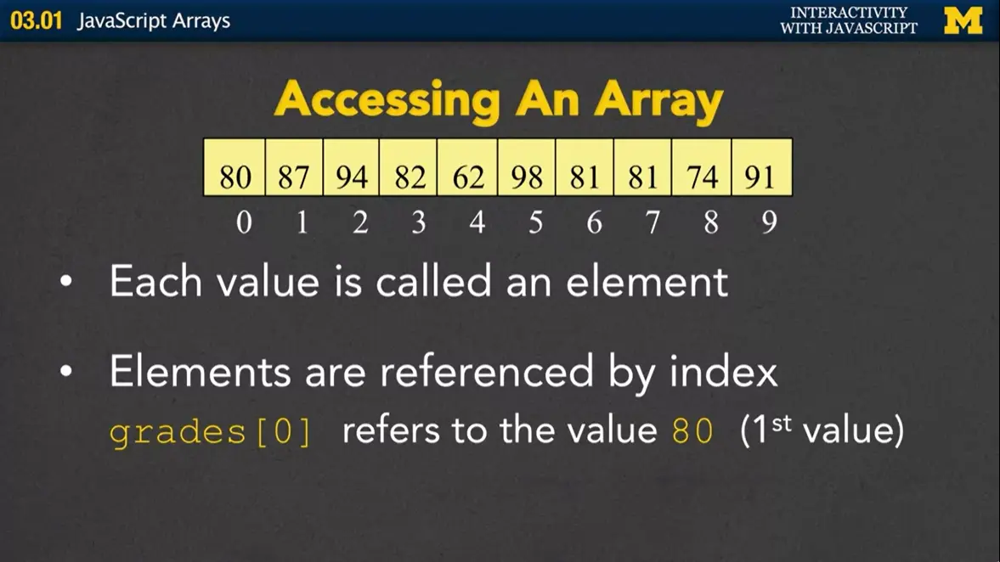{width="4.0in" height="2.25in"}

Okay, so we have our array, and we know, in this case, that we have an
array with 10 values in it. Each of those values is called an element.
In computer science, when you&#39;re talking to other people, this is a
term that you want to use, because then you&#39;ll really be conveying that
you&#39;re using an array. How do we get to those elements, though? Well,
each element is referenced by an index. If I were to say
**grades&lbrack;0&rbrack;,** right here, well, the computer knows, oh, I have this
array up here. I need to go find the one that&#39;s in the 0 place, so
**grades&lbrack;0&rbrack;** refers to 80.

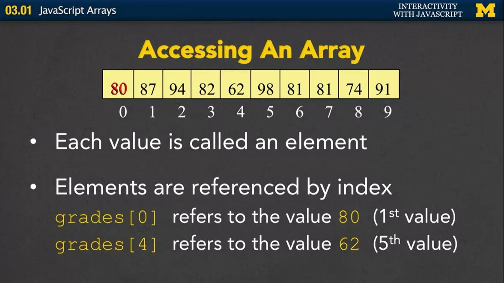{width="4.0in" height="2.25in"}

If I want to talk about **grades&lbrack;4&rbrack;,** well this refers to value 62.
**grades&lbrack;0&rbrack;** is the first value, **grades&lbrack;4&rbrack;** is actually the
fifth value. If this is the first time you&#39;ve really experienced
starting your counting at 0, it can be a little bit confusing at first,
but you&#39;ll get the hang of it in really no time.

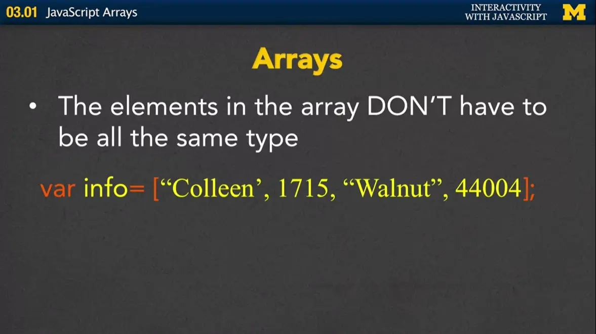{width="4.0in" height="2.25in"}

One thing I wanted to mention because it&#39;s different than in other
program and languages, is that elements in array don&#39;t have to be all
the same type. I could have an array, in this case called info, that has
a string and a number, and then a string and a number, and that works
just fine. However, it&#39;s very uncommon and I wouldn&#39;t necessarily
encourage you to do your arrays in this manner.

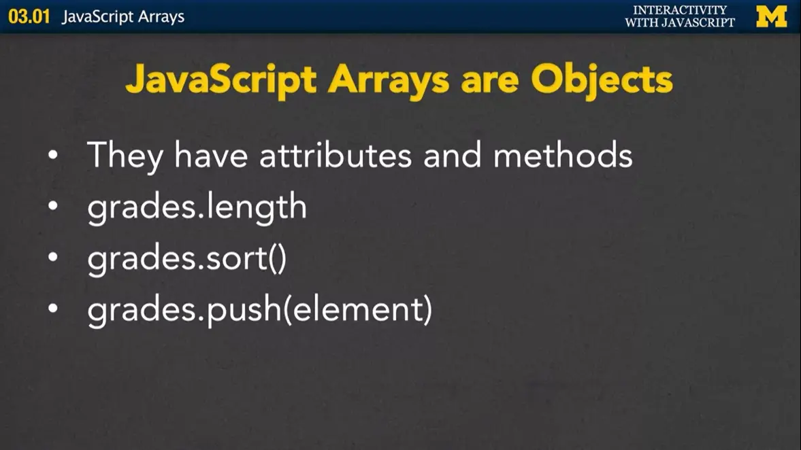{width="4.0in" height="2.25in"}

Instead, we want to focus on this idea that arrays tend to have the same
values in them and that they have attributes and methods. Because
JavaScript arrays are objects and that gives them some special power.
For instance, we can refer to **grades.length**. We can call the method
**grades.sort()**, or we could even add additional elements to our array
using the method called **push,** where we would add another element to
it.

Now, if you start thinking about some of the different ways we can use
arrays, you can start to put things together. For instance, when I
talked earlier about **grades&lbrack;9&rbrack;** or **grades&lbrack;8&rbrack;**, we knew exactly
how big that array was because we had initialized it. But sometimes you
won&#39;t know how long the array is, especially if you used
**getElementsByTagName** or something like that.

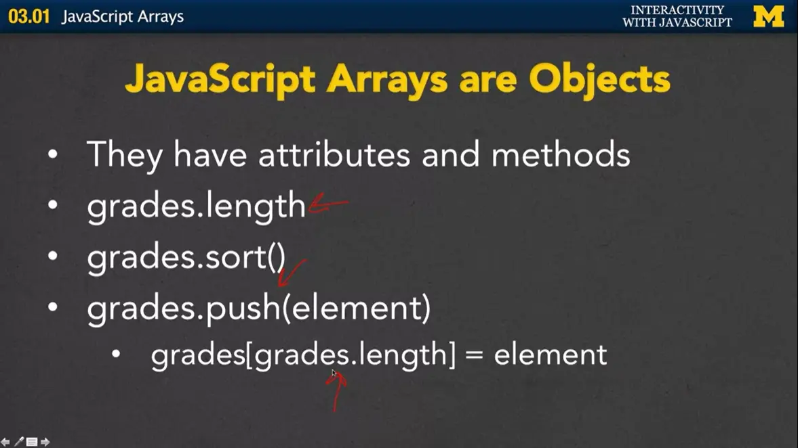{width="4.0in" height="2.25in"}

It is possible to combine the idea of length and the idea of push to
come up with our own way of adding things to our array. Grades, here&#39;s
the element I need. I need **&lbrack;grades.length&rbrack;**, because I know that&#39;s
the last place where we don&#39;t have anything, and set it = element here.
These two things right here, **grades.push(element)** and
**grades&lbrack;grades.length&rbrack; = element**, they&#39;re the same thing, it&#39;s
just a different way to program. This kind of flexibility can be really
great once you get the hang of JavaScript. But when you first get
started, it can sometimes be confusing when you see people doing the
same thing in different ways. It&#39;s a really great learning opportunity
for you to try to figure out which things match as you go out and see
new code.

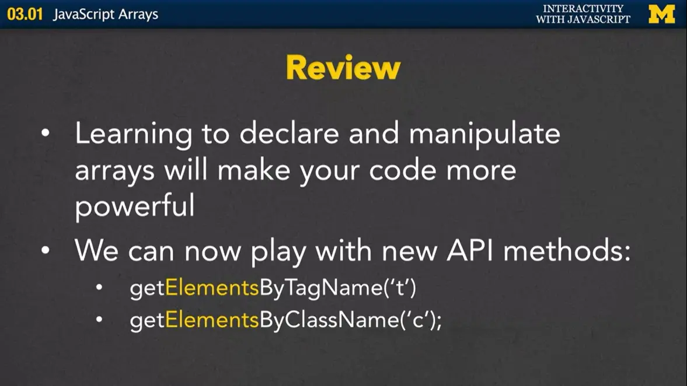{width="4.0in" height="2.25in"}

Let&#39;s review. As you learn to declare and manipulate arrays, your code
is going to become much more powerful. You just need to take the time to
switch your mindset from single values to collections of values. And
once you do that, we can start playing with these new API methods that
we haven&#39;t used before. The **getElementsByTagName** and
**getElementsByClassName**.

Quick note because I know this is a typo of a lot us make, is that
you&#39;re writing this the correct way. We&#39;ve been using
**getElementById**, make sure you&#39;re typing this else you might run
into problems. Go ahead, start typing in some code, use the console to
make sure things are going the way you want them to, and keep coming
along with me as you learn new ways to use arrays to improve your page,
thanks.

<h2 id="Week3-02">Week 3-02. Code With Me -- Arrays</h2>

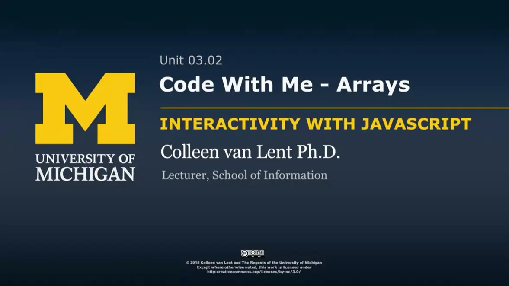{width="4.0in" height="2.25in"}

Today, we&#39;re going to do what I call a Code with Me. Well, it&#39;s
perfectly okay if you just sit here and read the modules. I really
encourage people to take this as an opportunity to find out, can you do
the things that you&#39;ve been reading about all along?

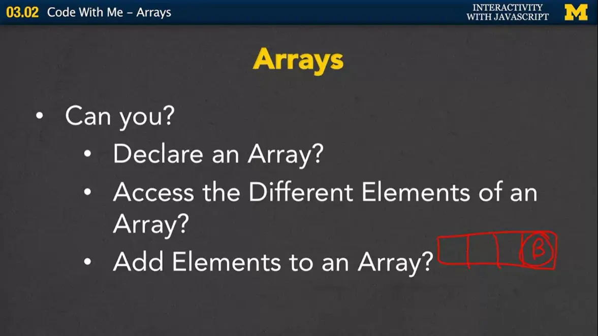{width="4.0in" height="2.25in"}

Specifically, I&#39;m wondering, can you declare an array? We&#39;ve been
talking about them, we&#39;ve been using them, but I&#39;ve been doing all the
work. What if I asked you to declare array? Would you be stuck or can
you jump right in?

After you declare an array, can you access the different elements of an
Array? If you remember, each array is made up of as many different
elements as you can think of. If you want to actually access this one
right here, how do you do it? Next thing I want you to think about is
can you add elements to array? If we want to add something after B,
perhaps a C, do you know the proper JavaScript to use in order to make
your code work? Let&#39;s jump right in. As I said, I have this code online
for you. But I really encourage you to start from scratch and try coding
on your own. And using my code as a reference just in case things go
wrong.

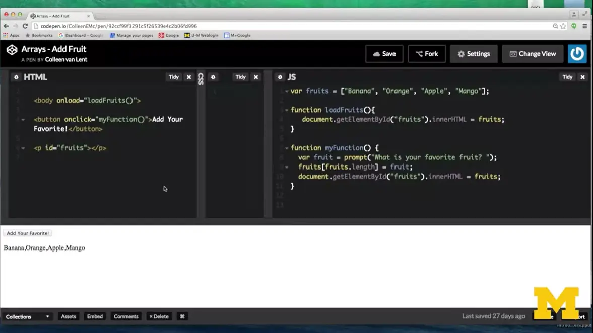{width="4.0in" height="2.25in"}

Let&#39;s take a look at this code. I really want you to understand each
and every line. Sometimes I do things the long way, but that&#39;s okay.
Because I really think it&#39;s a great learning experience for you to
understand what&#39;s going on with JavaScript.

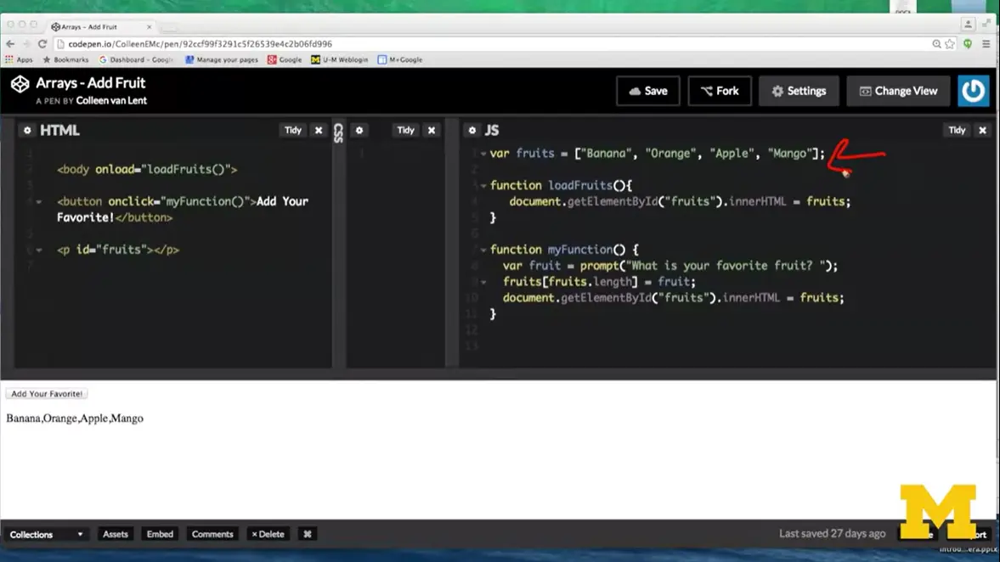{width="4.0in" height="2.25in"}

Let&#39;s start off with the fact that I declared an array with four
different elements in here. I have Banana, Orange, Apple and Mango, I&#39;m
going to use those inside my HTML code. In fact, where I use them, is I
use it in the very first function called loadFruits.

When my page starts up, it&#39;s going to call that function and right away
it says, you know what? I want you to grab everything that&#39;s in this
array, all of it, and dump it right into this paragraph right here. This
is why, again, if you look carefully at the HTML file, there&#39;s no
fruits there. It&#39;s all being added by the JavaScript. Once you&#39;ve got
that kind of initial setup for your page, this is where we want to add
elements to our array.

In order to add something, we basically don&#39;t want to add it here. We
want to add additional things to the end of our array. All right, let&#39;s
get started. In this function, it&#39;s going to ask us what our favorite
food is. Once they ask, we need to know where should we put it?

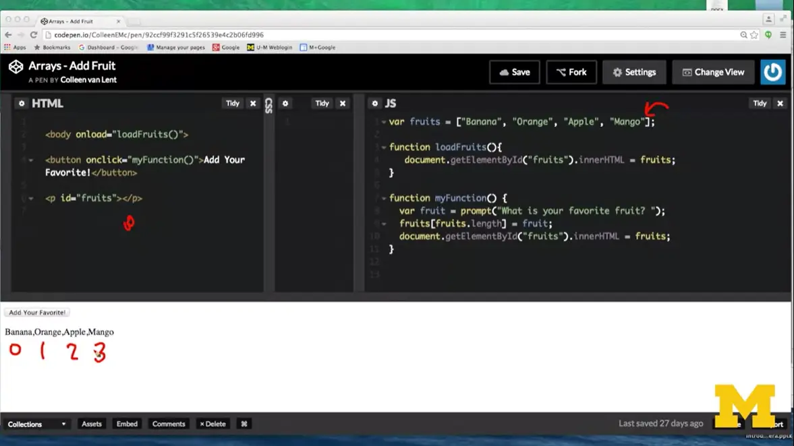{width="4.0in" height="2.25in"}

Right now, I&#39;m going to draw up on the screen to get an idea of what
the index of each one of these elements is. It starts at 0, 1, 2 and 3.
So this means we want to put the next fruit in position 4.

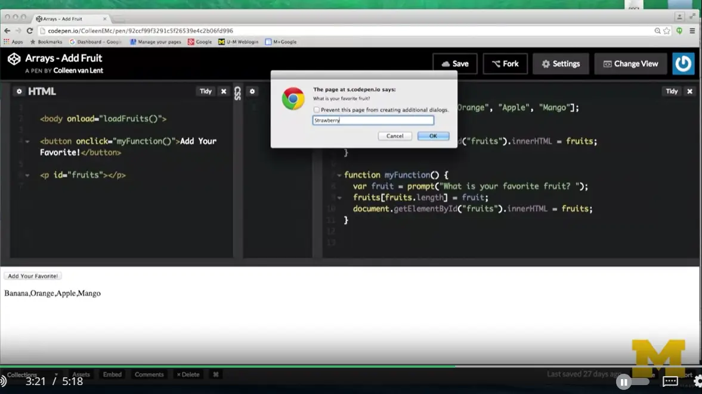{width="3.5in"
height="1.96875in"}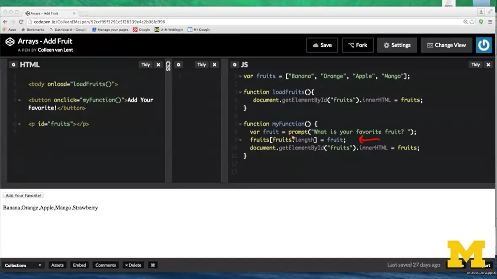{width="3.5in"
height="1.96875in"}

Let&#39;s take a look. I click Add Your Favorite. I&#39;ll say Strawberry. And
when I hit OK, right away the JavaScript has gone in and said, oh, I
need to add this fruit to my whole array. The kind of cool thing is
that, it doesn&#39;t say 4 here. I didn&#39;t say, I want it to go in position
4, because then it wouldn&#39;t work if I wanted to add more and more
fruit. This is where these little elements are coming together. You know
that to add something to your array, you use the array name. We have
fruits, then you have to give it an index. And the easiest way to add
something to an array is to just use the length of itself. Originally, I
had four elements in my array. Perfect, I put it in position 4. Now the
length of my array is one, two, three, four, five. Because I&#39;m using a
variable here, instead of hard coding a number. My program will work no
matter how many different elements I add. Length is the count of fruits
in the array.

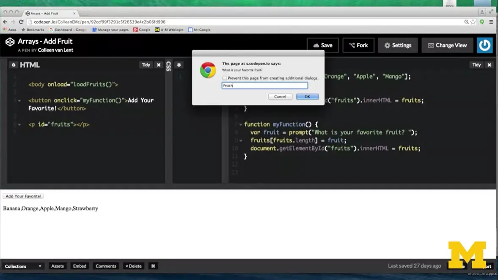{width="4.0in" height="2.25in"}

Let&#39;s add two more. And I can add Peach. And I can add another one.
I&#39;ll just add Banana again because I have no imagination this morning.
There we go. This is a very simple example, but one that I want you to
master. I want you to go in there, I want you to make your own array.
Don&#39;t use fruit, use your favorite foods, use your favorite cars. Use
your friends and take them on and off. And see if you can do these
different things to manipulate an array. Once you feel comfortable doing
this, you should feel confident going on in this class reading
additional modules. And knowing that you do understand what&#39;s going on,
even if you make a mistake now and then. So good luck.

<h3>Advanced Coding Techniques</h3>

In the next few lectures, we will talk about more advanced coding
techniques. Any programming language has the general ability to loop
(run the same code multiple times) and to make decisions during &#34;run
time.&#34; The important thing to know is that while the concepts are the
same among programming languages, they all do it a little differently.
Some use parentheses, some don&#39;t. Some rely on indentation, others
don&#39;t.

The important thing is to understand the LOGIC. Doing just the examples
we provide here aren&#39;t enough, you will want to change your code to
come up with new decisions and different criteria to test different
situations.

<h2 id="Week3-03">Week 3-03. JavaScript Iteration</h2>

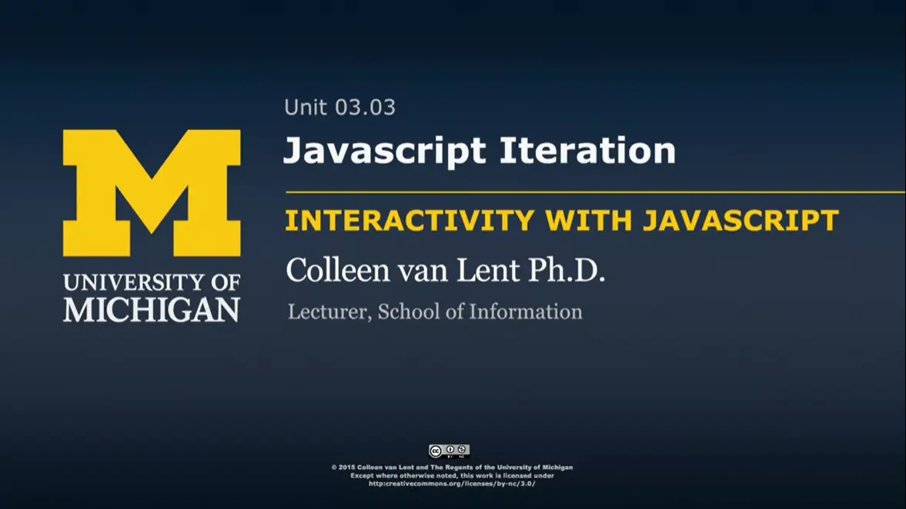{width="4.0in" height="2.25in"}

Hi everybody. Now that we know that arrays are an option for storing
data, we need to think of the upsides and downsides of using them.

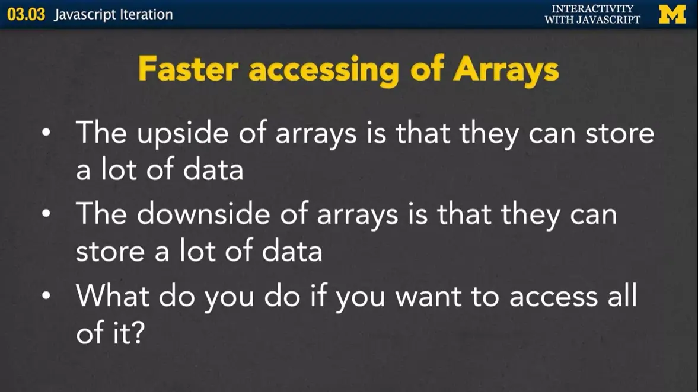{width="4.0in" height="2.25in"}

The upside, of course, is that arrays can store a lot of things in a
single variable, instead of declaring variable grade&lbrack;1&rbrack;, var
grade&lbrack;2&rbrack;, var grade&lbrack;3&rbrack;. The downside is, is when a single variable
stores a lot of data, sometimes it can be a little bit harder at first
to access that data. What you want to do is go through every single
number, but we don&#39;t want to write the same code 10 times, or 20 times,
or 40 times? What we want to do is we want to use iteration, or what we
typically call looping.

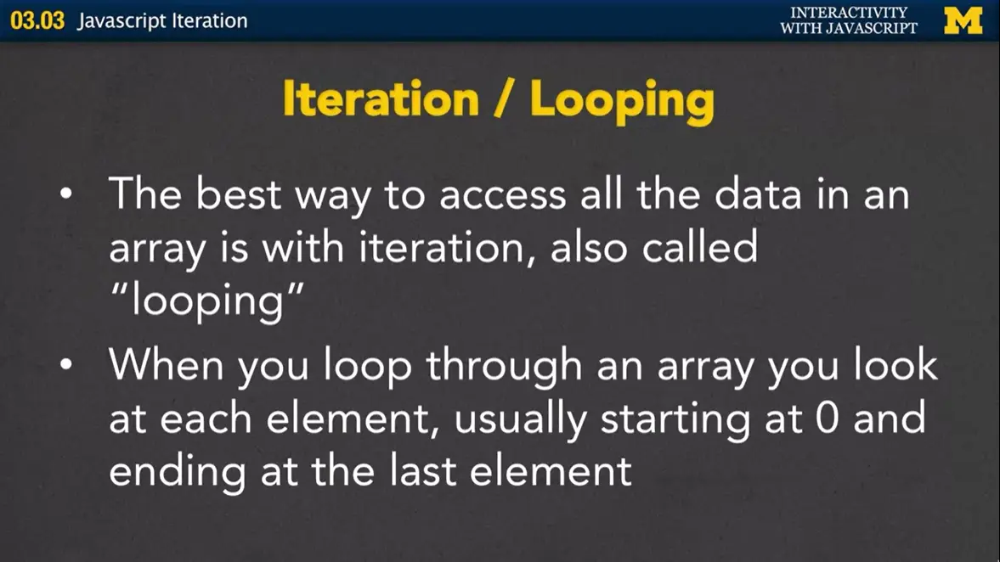{width="4.0in" height="2.25in"}

When you loop through an array, you look at each element, usually
starting at the first one and ending at the last one.

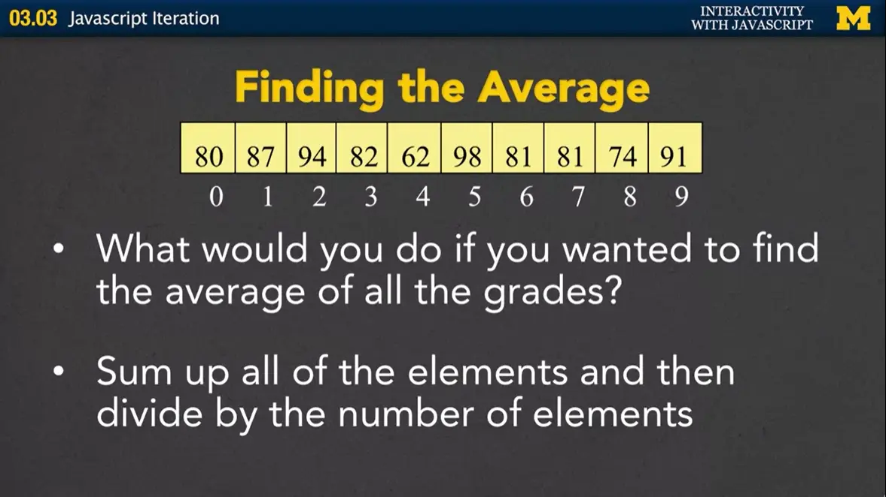{width="4.0in" height="2.25in"}

In our example here, we have an array of ten elements. How could we find
the average of those ten elements? Well, we would start off by saying we
need to go through and add 80 plus 87 plus 94 plus 82. We need to add
them all up, and probably store them in a variable. Then, once you have
that number, you need to divide it by however many elements there are.

In order to do this, we are going to use what is called a for loop. A
for loop is simply a construct where we can run the same code multiple
times. But between each execution, we&#39;re going to check some sort of
Boolean condition to see if we&#39;re done or not.

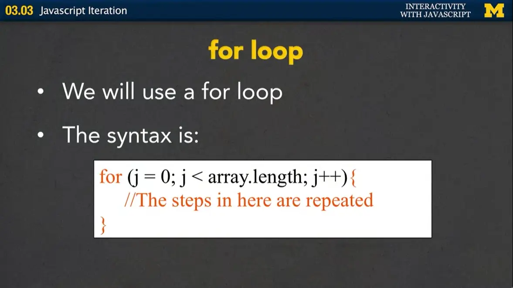{width="4.0in" height="2.25in"}

Here&#39;s a syntax. You need to have the keyword for. It lets JavaScript
know, oh, change things here. I&#39;m going to change the flow of control.
The next thing you set up is the initializer. You need to have some sort
of variable that&#39;s going to be used for counting how many times we
move. We&#39;re going to have a boolean condition that&#39;s either going to
be true or false. And then, typically, you need to have some sort of
update or increment variable that lets us keep going.

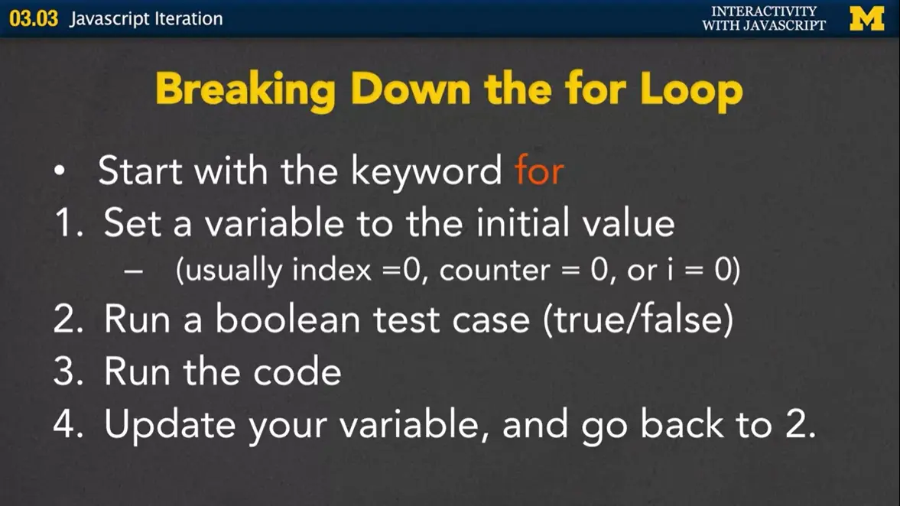{width="4.0in" height="2.25in"}

We want to start with the keyword for. Then, you set that variable to
the initial value. Usually, we tend to call that variable index, or
counter, or even i or j, something small. It&#39;s a variable we don&#39;t
want for a long time, just for this for loop. Once you&#39;ve set index or
counter to zero, you want to setup, what&#39;s that boolean test case
we&#39;re looking for? We need to write something that can evaluate to
either true or false. Once you&#39;ve written that, you need to think about
what code you want to run when the boolean is true, and then fourth, you
update your variable and you head back to two. Here&#39;s a little diagram
of how that all works together.

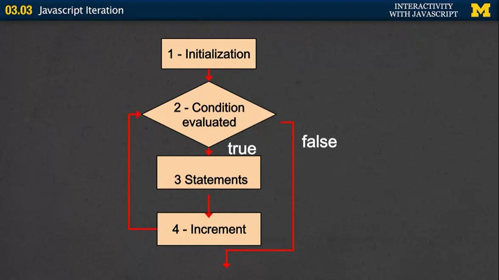{width="4.0in" height="2.25in"}

Here we have kind of a narrated explanation of what&#39;s going on. We
start with our initialization. This only happens once. After you&#39;ve
initialized your variable, you head down and you check, and you say,
hey, is my condition true or false? If it&#39;s true, we want to head down
here and run all of our statements. Once you&#39;re done, you increment
your variable, and you go back up and you check again. Hey, is it still
true? As long as it&#39;s true, you&#39;re going to just keep looping down,
and you might end up looping five or six times. You can&#39;t be sure. But
once the condition evaluates to false, then you know oh, I&#39;m all done.
I&#39;m not going to run this code anymore. And you hop out to the end.

The important thing to know for a for loop is that the initialization is
always going to happen once, but you have no idea how many times these
steps are going to happen.

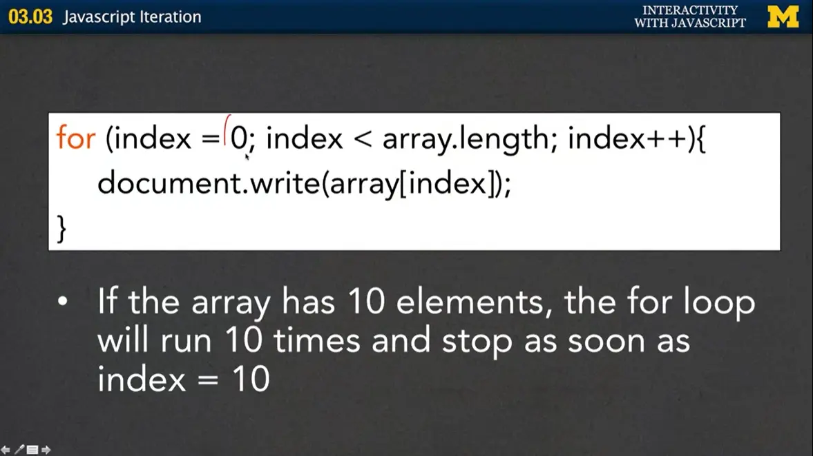{width="4.0in" height="2.25in"}

Here&#39;s a quick for loop that&#39;s going to go through and write each
element of the array. We start at zero, we loop until we get to the
length of the array and each time, we add one to it. if the array has
ten elements, the for loop will run ten times, and then it&#39;ll stop as
soon as, because we know that ten needs to be less than the length of
the array. If the array happens to have six elements, it will run six
times. If it has two elements, it will run two times. We&#39;re very
flexible here by using that **array.length**.

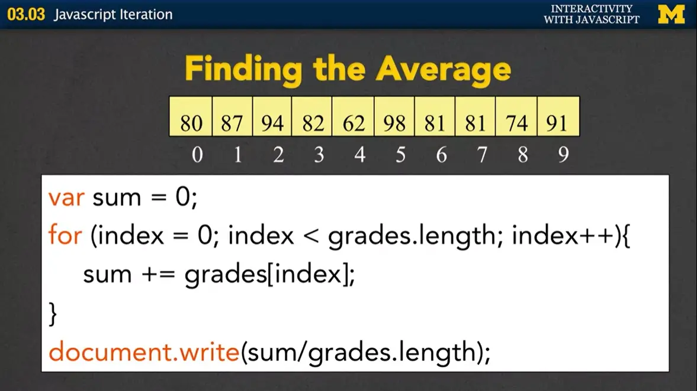{width="4.0in" height="2.25in"}

Let&#39;s get back to that example where we want to find the average of all
the grades that are stored in our array. What I&#39;ve done, is I start off
by declaring a variable that&#39;s going to keep track of everything we&#39;ve
looked at so far. At the beginning, sum is going to equal zero. Then
it&#39;ll be 80. Then we need to add 80 to 87, so it keeps getting bigger
and bigger and bigger. And you can keep track of all those numbers. Each
time we loop, this is where we&#39;re adding in the next value. And we&#39;re
going to through all ten times.

When we&#39;re done with the for loop, when we&#39;re all done, that&#39;s when
you want to go in and actually divide the number by the number of
elements. It can be pretty tricky when you&#39;re writing this code,
because if you&#39;re not careful about what you want to be inside the loop
versus what you want to be outside the loop. You can get some really
inaccurate answers. Okay so if you followed that code and you understand
how it works that&#39;s great. What we want to think about instead is how
what would happen to make that code not work?

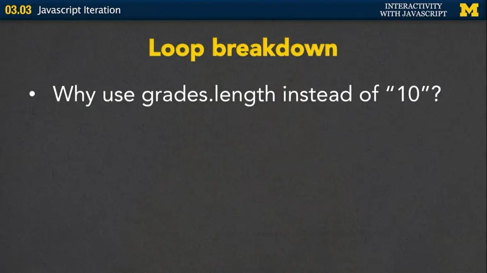{width="4.0in" height="2.25in"}

The first question I would ask you is why did I use **grades.length**
instead of &#34;10&#34;? We could&#39;ve said, keep looping as long as the index
is less than 10. And that would&#39;ve been perfectly correct. But the
problem is, what if later we decide to add some numbers to our array? Or
take some numbers away from our array? Well then, that 10 is no longer
correct, and you would need to remember to go in and change it.

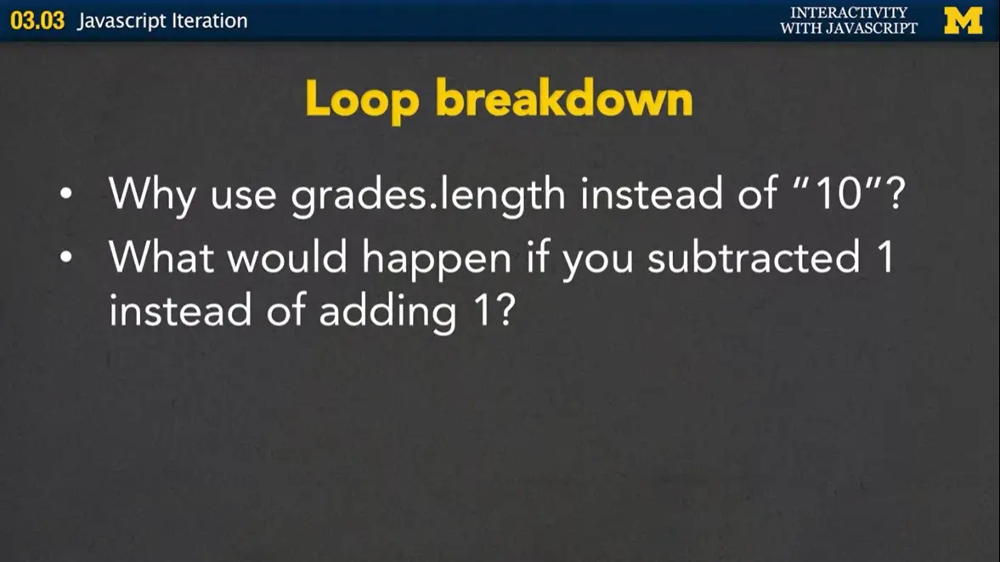{width="4.0in" height="2.25in"}

What would happen if instead of adding one to our counter we subtracted
one? This happens a little bit more often than anyone wants to admit.
And what&#39;s going to happen is you&#39;re going to have an infinite loop.
You can end up never leaving that line of code, and it will stall your
entire browser. You want to make sure that you&#39;re incrementing or
decrementing the way you mean to.

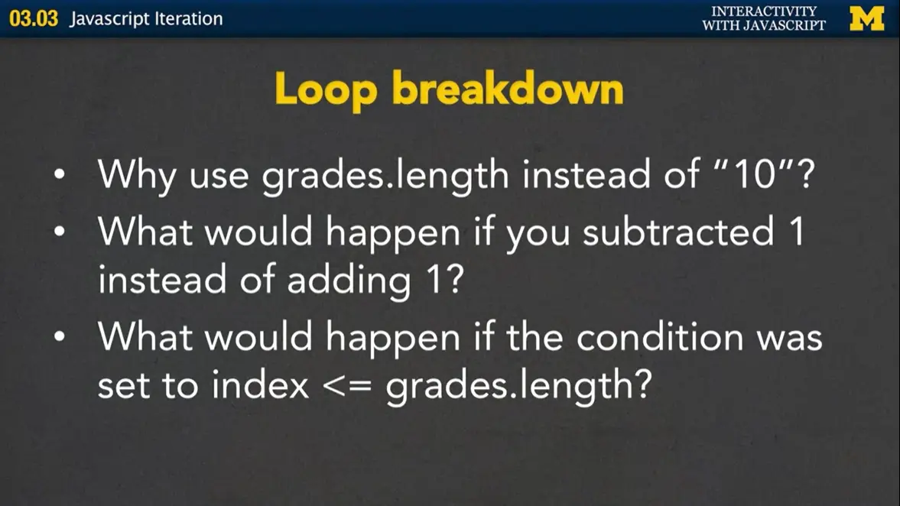{width="4.0in" height="2.25in"}

Along the same lines, what would happen if I set the condition to check
if index was less than or equal to **grades.length**? I had initially
used less than, and that was the correct way. If I use less than or
equal to, the JavaScript will actually crash. The thing is, I bet a lot
of people would never even realize it did, because JavaScript does such
a great job of hiding its errors. You need to go into the console and
see what&#39;s going on.

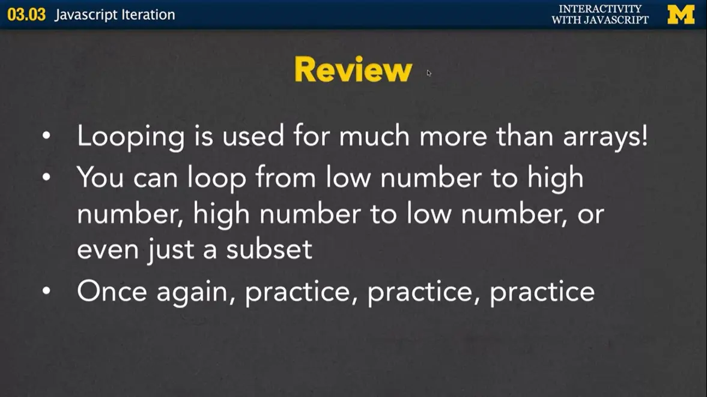{width="4.0in" height="2.25in"}

Just to review, if you&#39;re learning to program in any programming
language, looping is used for much more than arrays. It&#39;s a very
powerful construct, and it&#39;s something you really want to understand
very well. I also want you to realize that, just because I happen to do
my loops from a low number to a high number, there&#39;s no set way that&#39;s
the right way. You can also go from high to low, or even subsets. The
most important thing is that I need you to practice, practice, practice.
You need to feel comfortable with the idea that array elements start at
zero. You need to understand that you can use **array.length** or other
methods. The more you play with these things, the easier it will become.
Thanks for reading.

<h2 id="Week3-04">Week 3-04. Flow of Control</h2>

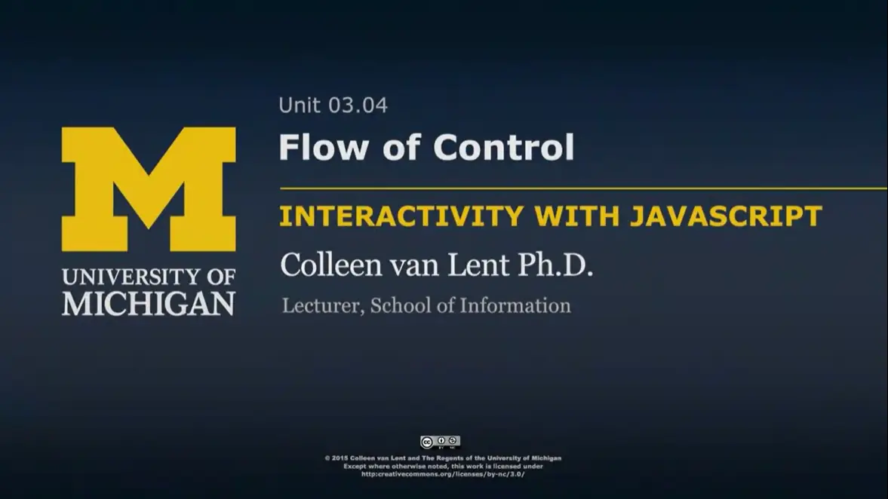{width="4.0in" height="2.25in"}

Hi, everybody. Today, we&#39;re going to be talking about Flow of Control.
Flow of control is just a fancy term for the fact that sometimes we want
to be able to control which code our computer actually executes, instead
of doing everything we&#39;re going to be putting decision points into our
code.

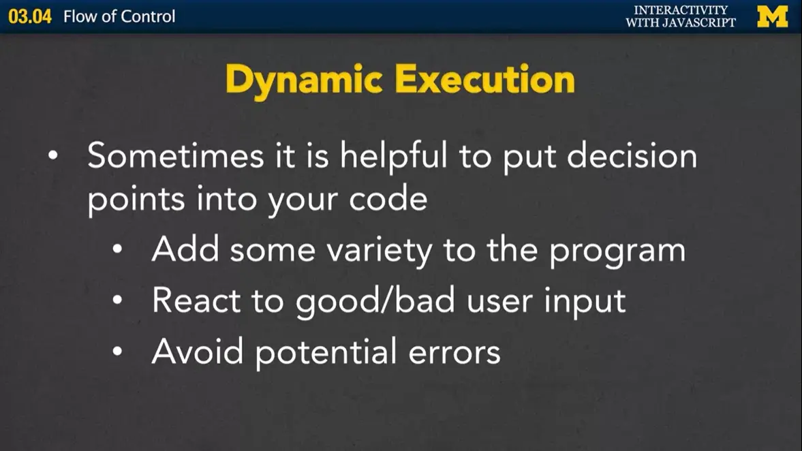{width="4.0in" height="2.25in"}

When your computer comes across them, it can kind of decide at the fly
whether or not you should run it. This is a great way to add a little
bit of variety and interactivity to your program. It&#39;s also a way that
you can respond to what we call good or bad user input. And I&#39;ll show
you some examples today, in the lecture. Finally, it also helps us avoid
potential errors that the user might be putting in. This isn&#39;t even
something always that they do but that we&#39;ve coded ourselves.

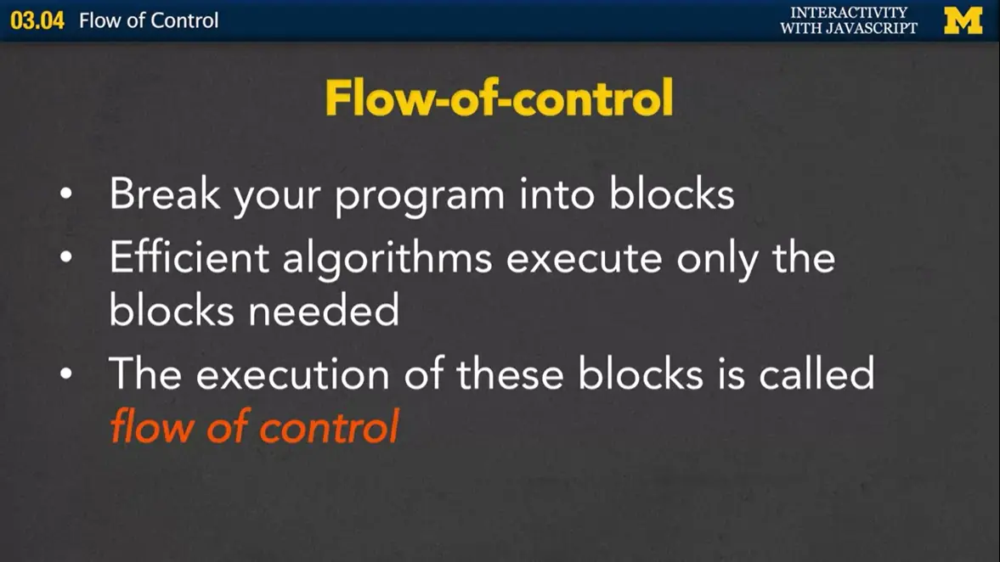{width="4.0in" height="2.25in"}

Let&#39;s talk about flow-of-control in a little bit more of a technical
term. When you design your code, it&#39;s very important that you break
your program down into blocks. Blocks are just another fancy word of
saying, here are some statements we want to always put together. That
way, when your program runs, really efficient algorithms, which is
another word for the steps your programs take, can execute only those
blocks that they need to execute. And again, the execution of these
blocks is where we come up with the term flow-of-control.

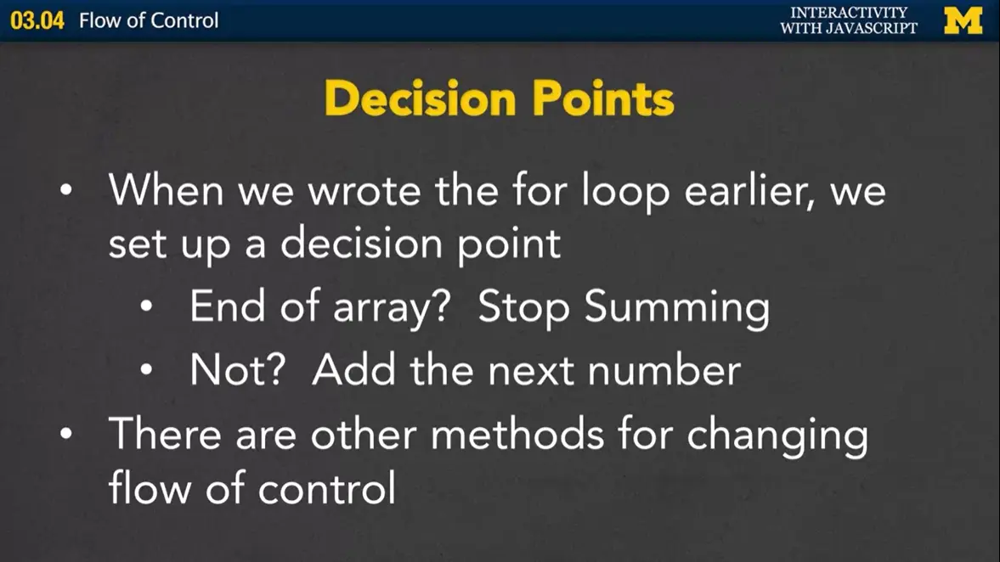{width="4.0in" height="2.25in"}

We&#39;ve actually had decision points before in our program where we might
not have realized it. We&#39;ve actually written decision points in before
when we wrote for loops. You might not have realized it because it
wasn&#39;t very specific. But we basically had the idea that hey, have we
each reached the end of the array? If we have, we should stop adding
numbers to figure out the average. If we haven&#39;t reached the end of the
array, then the computer should keep going and add that next number.

There are many different ways for changing the flow of control. Some
were kind of hidden and we didn&#39;t even know they were happening. And
some are very explicit, and these are the ones we&#39;re going to talk
about now.

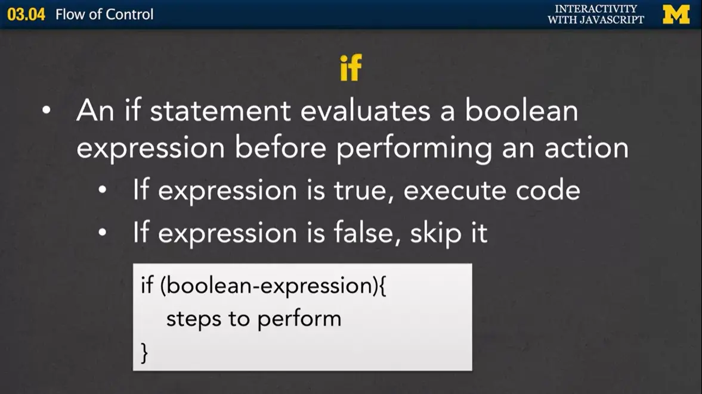{width="4.0in" height="2.25in"}

One of the most common control structures in any programming language is
the if statement. With an if statement, it evaluates a boolean
expression and then says, hm, is it true? Or is it false? If it&#39;s true,
then we want to execute the code that comes next. If it&#39;s false, then
we should skip it.

How we would write this code is the actual word if, inside parenthesis
we would put in a boolean-expression. And again, those are the
expressions that are always going to return true or false. Is A greater
than B? Does C equal D? After the computer checks that expression, we
give it a list of steps to perform.

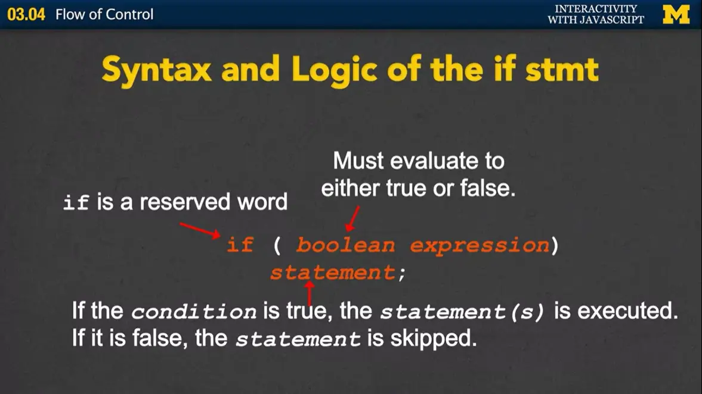{width="4.0in" height="2.25in"}

Let&#39;s talk about the syntax and logic of the if statement. One of the
things I said, is that you need to realize, that the word if is a
reserved word. And reserved words and programming have a very specific
meaning and you&#39;re not allowed to use them for variables and different
things like that.

The next part that&#39;s very important is that you have to put in these
parentheses. If you don&#39;t put in the parentheses, your program won&#39;t
work. Inside the parentheses you&#39;re going to put your boolean
expression. Something that&#39;s going to evaluate to either true or false.
We&#39;re going to see a lot of greater than or equal to or equal equal,
different things we&#39;ve talked about earlier. Finally, after the if
statement, we&#39;re going to see the actual statement that we want to
perform all by itself.

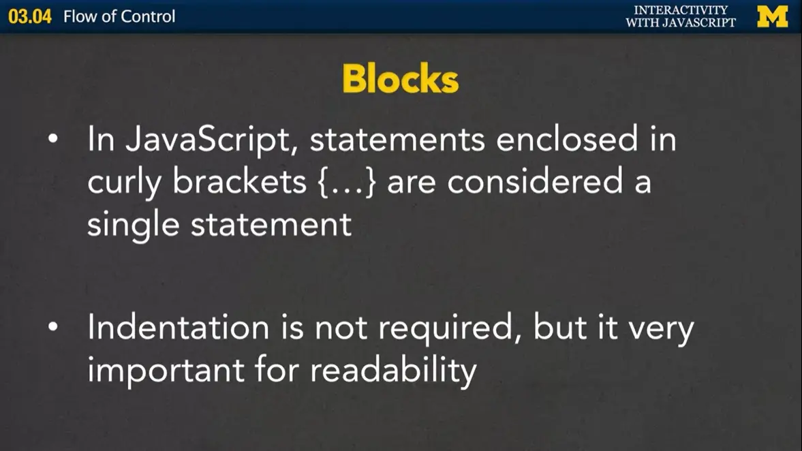{width="4.0in" height="2.25in"}

Now in this example I didn&#39;t include those curly brackets that you
might often see. Something along the lines of here. These curly brackets
say, don&#39;t execute just one statement, execute a whole bunch of them.
Each one is a statement followed by semicolon. We&#39;ll talk about
variations on this simple syntax and logic as we go on. Those curly
blocks I added in the previous slide. These curly blocks are what tell
JavaScript that these statements should be considered a block, or a
single entity. It&#39;s really kind of cool, because when you do this,
other programmers can look at your code and realize, hey. That&#39;s not
really a single statement. It&#39;s something that needs to be done
together. Now, when you do blocks of code, it&#39;s very common to indent
them together or move them all over a little bit so they all line up.
It&#39;s not required, but you&#39;re going to see most people do it, because
it makes your code a lot easier to read. It&#39;s a lot easier to see that
there are six or seven lines of code that are all along the same line,
then to necessarily always be looking for these curly blocks.

{width="4.0in" height="2.25in"}

Let&#39;s look at this with a little bit of action and animation added to
it. The first thing we&#39;re going to do, is evaluate that condition. If
it&#39;s true, execute either a single statement, or an entire block of
statements. But if that condition is false, I don&#39;t want you to do all
this. This should not be done. Instead, jump all the way down, and
continue on with the rest of the program. Make sure that makes sense to
you, that an if statement doesn&#39;t make you skip everything that comes
afterwards, it only skips certain blocks if it&#39;s true. Now, let&#39;s do
two examples with real code.

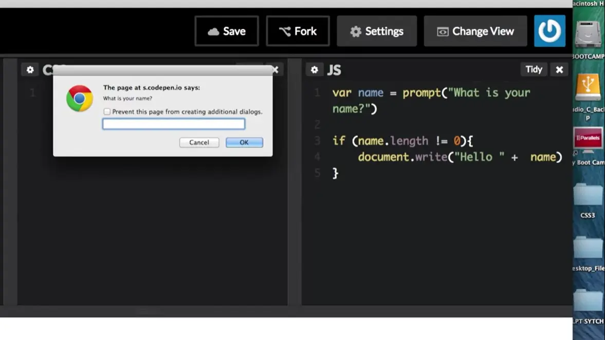{width="4.0in" height="2.25in"}

Let&#39;s look at this example, over here. In the code that I have, I&#39;ve
declared a variable called name, right here. And I&#39;ve decided that if
somebody enters their name, I&#39;m going to say hello to them. But if they
don&#39;t enter anything, I don&#39;t want to say hello at all. Let&#39;s see
what happens when I enter in Colleen.

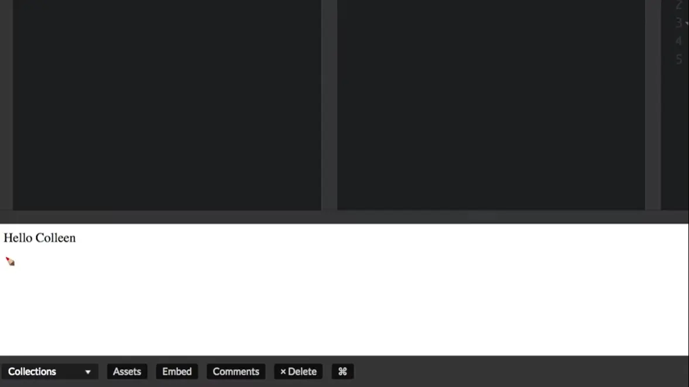{width="4.0in" height="2.25in"}

Look down here. I have, Hello Colleen shows up, all right. How that
happened is that I went in here and I added my if statement, I said if
that name, if the length of that name doesn&#39;t equal zero which means
someone actually types something in, write my name and that worked
great.

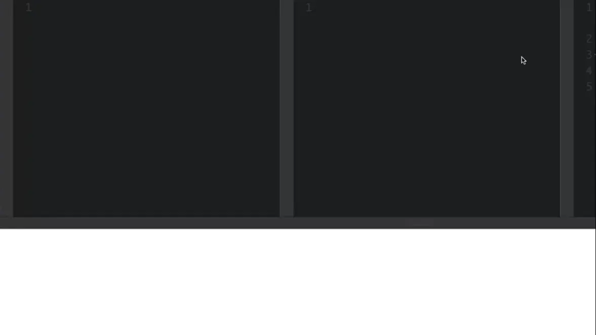{width="4.0in" height="2.25in"}

But let&#39;s see what happens if I put in nothing. We have the same prompt
but I&#39;m going to just hit OK. In this case the program didn&#39;t crash or
anything along that line, it just doesn&#39;t have any output at all. That
was a very simple example.

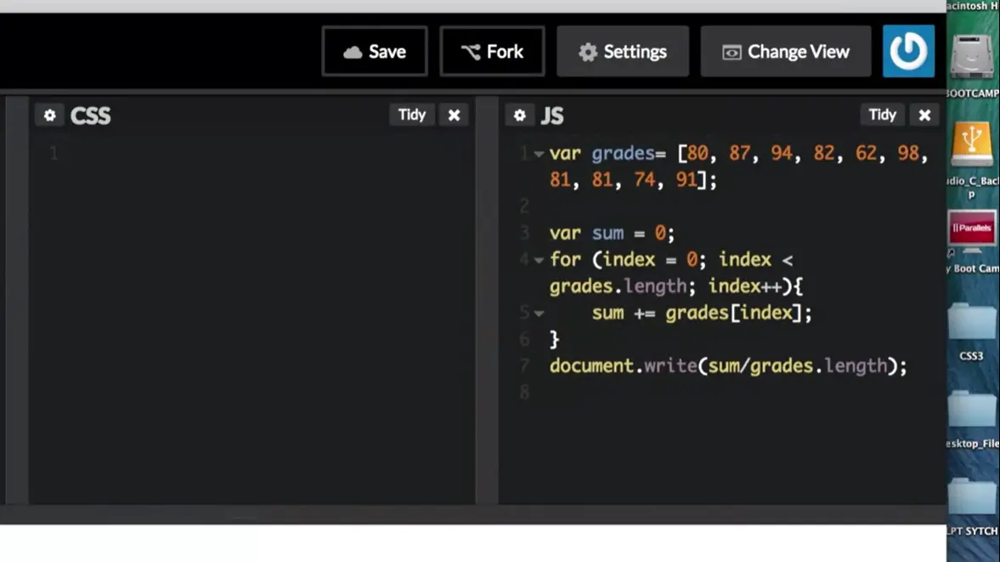{width="4.0in" height="2.25in"}

Let&#39;s move on to another that we&#39;ve seen before. In the example where
we figured out the average in an array of numbers, we were very straight
forward. We went in and we said here&#39;s all of our numbers. Find out the
average first. Here&#39;s where we didn&#39;t really think about every
possible situation, right here. At the very end we say find out the
average by adding up all the numbers and then dividing by the numbers
there were. However, in computer science, it&#39;s very important that you
check and make sure that you never divide by zero.

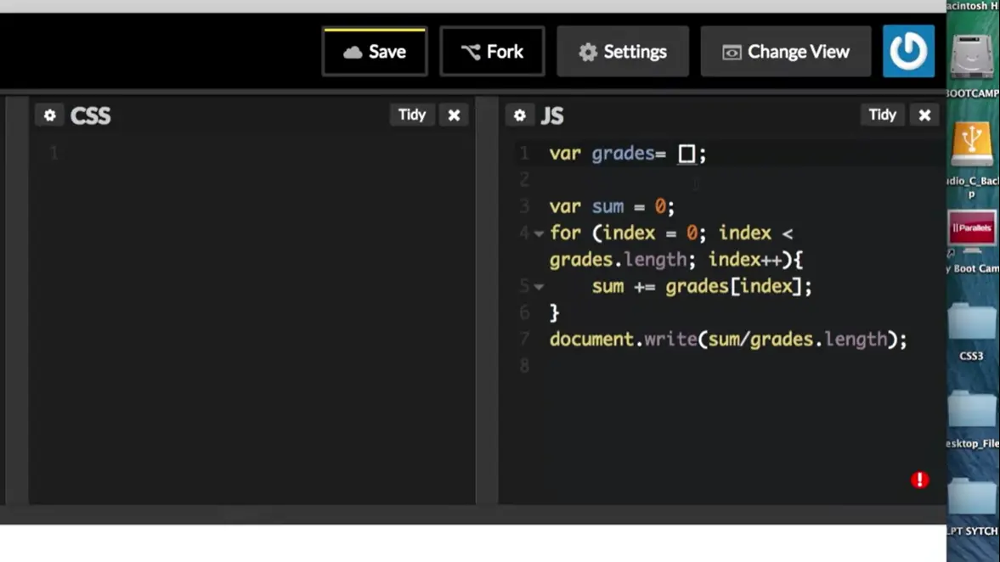{width="3.5in"
height="1.96875in"}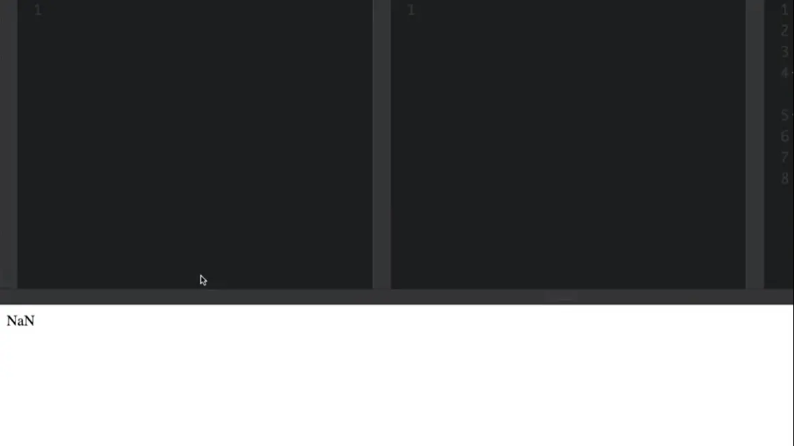{width="3.5in"
height="1.96875in"}

If I were to change my code right here and get rid of all the numbers so
that we have an empty array, let&#39;s see what happens. Down here, I&#39;ve
got instead of 83 or something like that, I have something called NaN,
or not a number. That would really freak people out if they were on your
website and they saw something like that. It would be much better if
instead we gave them some sort of idea that oh, it&#39;s okay, we&#39;re just
not going to do the average. At the very least, we should get rid of
this kind of weird not a number. How are we going to do that? We need to
write an if statement.

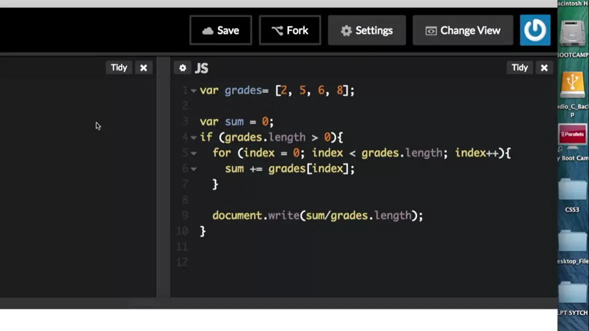{width="3.5in"
height="1.96875in"}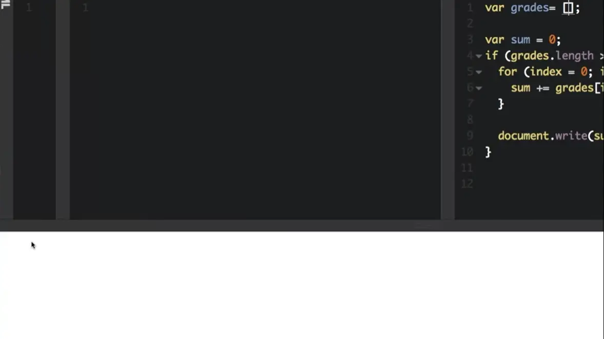{width="3.5in"
height="1.96875in"}

In the code I have here, called array average with zero, I took the same
code we had before, but I added an if statement. And that if statement
says, oh, you know what, before you bother finding the average, before
you do any of that, I want you to check the length of that array and
make sure that it&#39;s greater than zero. My code still works right now,
when I have these four simple numbers. But it&#39;s also going to work when
I delete the ones that are in there. In this case, now you can see that
instead of having not a number, we have just a blank screen. Now, it
might be, you might be thinking, I'm not sure blank screen is such a
great idea. Don&#39;t worry, we&#39;re going to handle that as well when we
talk about the else that can go along with the if.

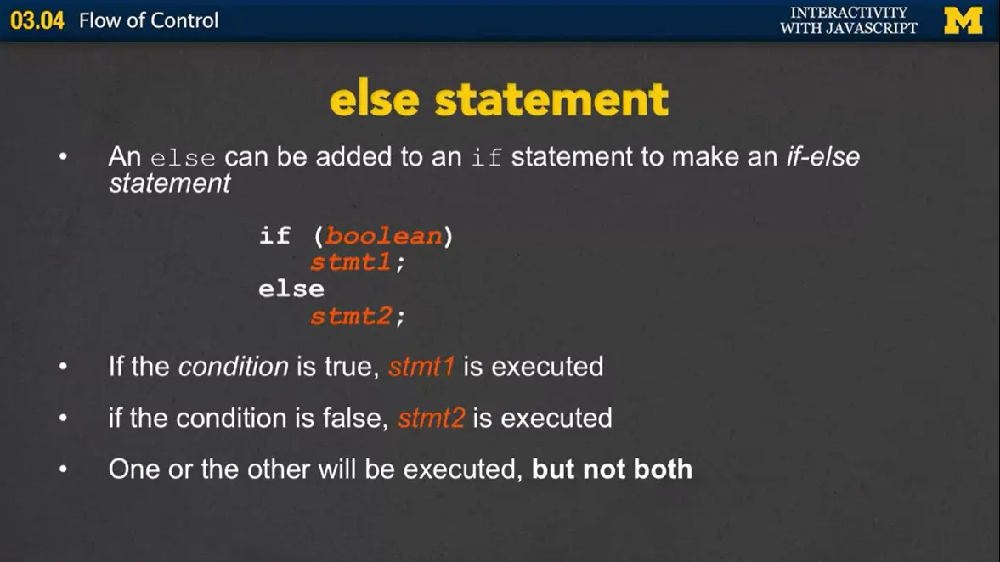{width="4.0in" height="2.25in"}

How do we do that? How do we add a second option to your code? Well, an
else can be added to an if statement to make we calling, an if-else
statement. And in this case, it looks very similar, the only difference
is that we have to include the word else and there are no parentheses,
all right. You never want the parentheses after the else portion of the
statement. When you have this if else statement how it works is, if the
condition is true then statement one is executed. If the condition is
false then statement two is executed. One or the other will be executed,
but not both.

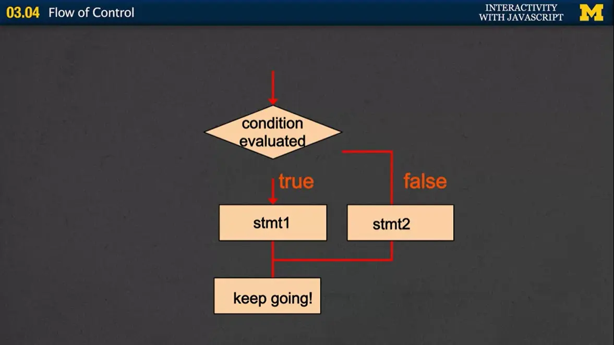{width="4.0in" height="2.25in"}

Using flow of control, we're going to evaluate the condition first. If
it's true go to statement one, if its false do statement or statements
two and then you know what keeps going.

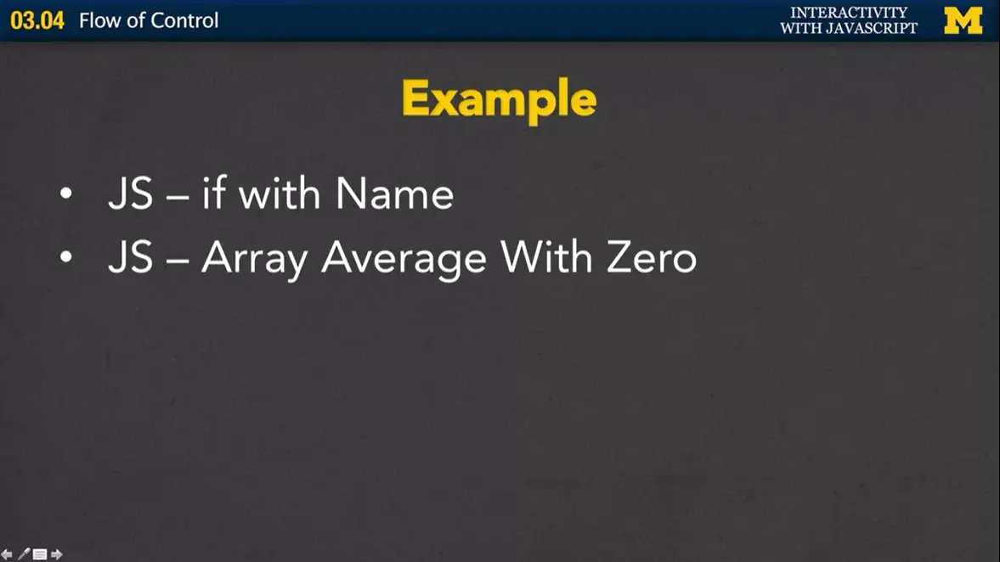{width="4.0in" height="2.25in"}

Let's look back at our examples with an added else.

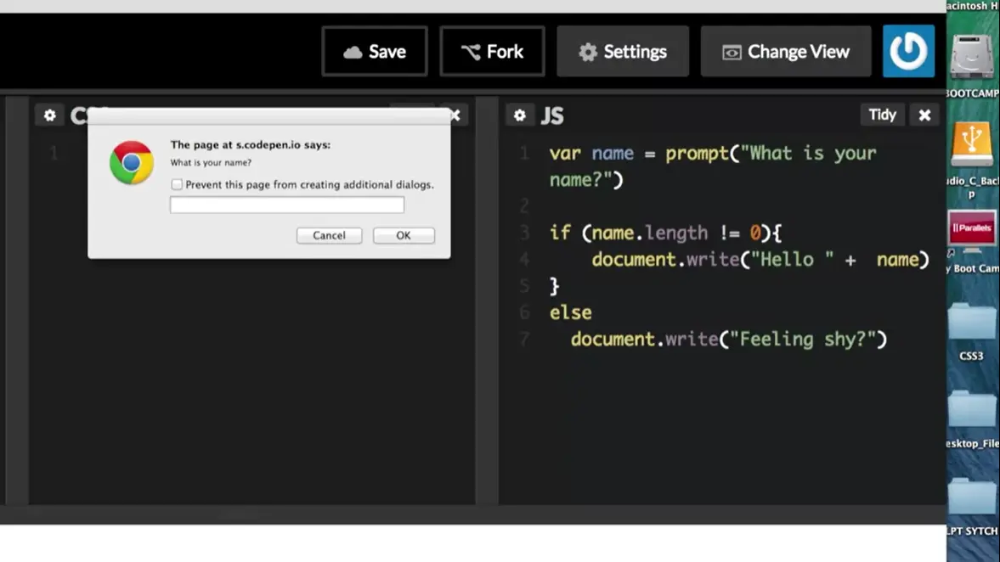{width="3.5in"
height="1.96875in"}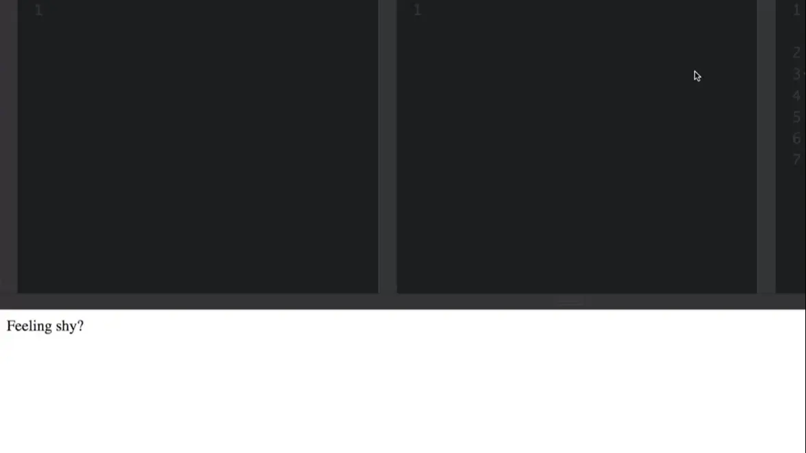{width="3.5in"
height="1.96875in"}

I&#39;ve gone back to our JavaScript if statement with the name and I&#39;ve
added an else. And all it does is say, hey. That person didn&#39;t enter
their name. Let&#39;s send them a little message. Now, if I put in my name,
it still works as we expected. Hello Colleen. But, if I leave it blank,
instead of doing nothing, it sends out a message called, feeling shy?

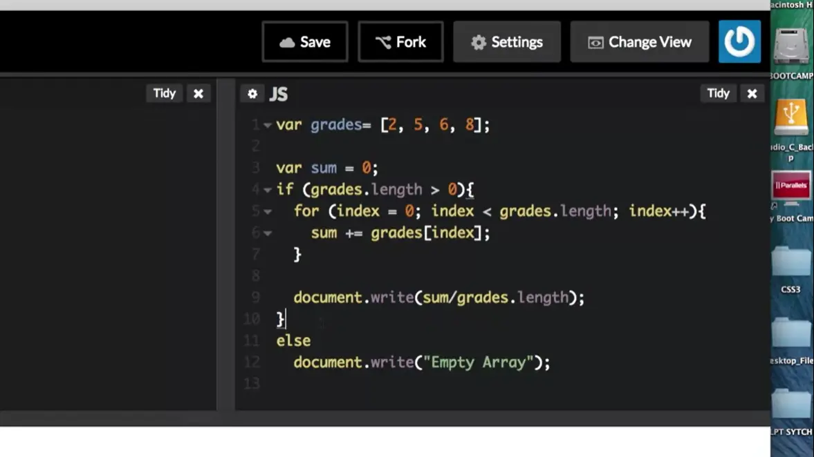{width="3.0in"
height="1.6875in"}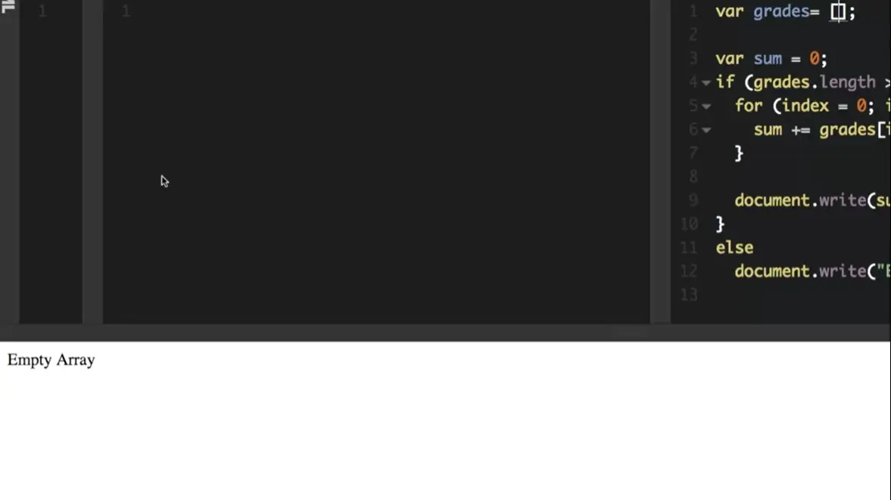{width="3.0in"
height="1.6875in"}

We can do the same thing with our average. Where here instead of just
doing nothing, instead of reading in those numbers and acting like
nothing happened, if it&#39;s an empty array. We&#39;re going to add a little
message that says, you know what, there is an empty array. I didn&#39;t do
anything. Let&#39;s make sure I didn&#39;t break my code. Put in a 0 array.
And you can see that instead of getting not a number, instead of getting
nothing, we get the message Empty Array. I can&#39;t stress how important
it is for you to play with this code. Make sure that you use the if to
specify that single line of code, or that block of code, that you want
to be executed.

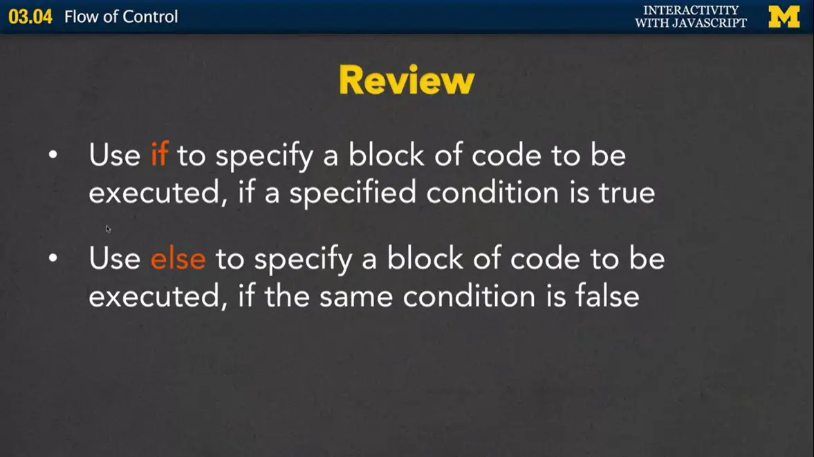{width="4.0in" height="2.25in"}

Run this over and over again, find out where you tend to make your
different little errors, either forgetting the parentheses, forgetting
the curling blocks, doing things like that. Next, then add your else
statement to specify what you want to do if the condition is false.

It&#39;s really easy to read these modules and nod along and think, yeah,
I&#39;ve got it, I&#39;ve got it. I can&#39;t stress how important it is for you
to stop, go in, play with the code, break the code, see what happened. I
rarely write code correctly the first time, so I don&#39;t want you to feel
bad if as you start adding these more dynamic and advanced things to
your code, if you run into a few problems. That just means you&#39;re
learning. So good luck.

<h2 id="Week3-05">Week 3-05. Code With Me -- Combining Loops & Conditionals</h2>

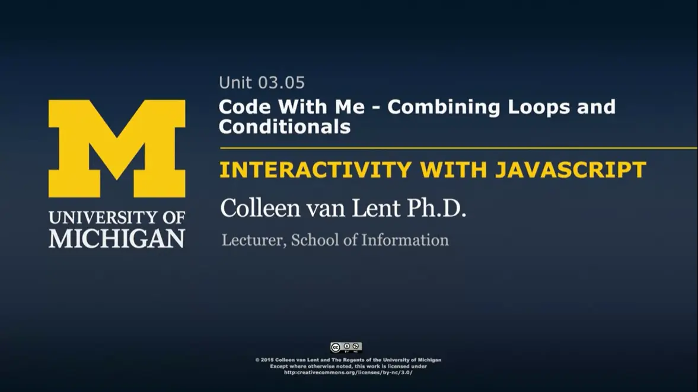{width="4.0in" height="2.25in"}

Hi everybody, welcome back. It&#39;s time for another code with me. This is
one of those situations where I really hope that you put down whatever
else you&#39;re doing, and really focus on writing your own code from
scratch. I know it&#39;s easier when I provide the code for you and you
follow along, but the real learning happens, when you make the mistakes
that come along with coding by yourself.

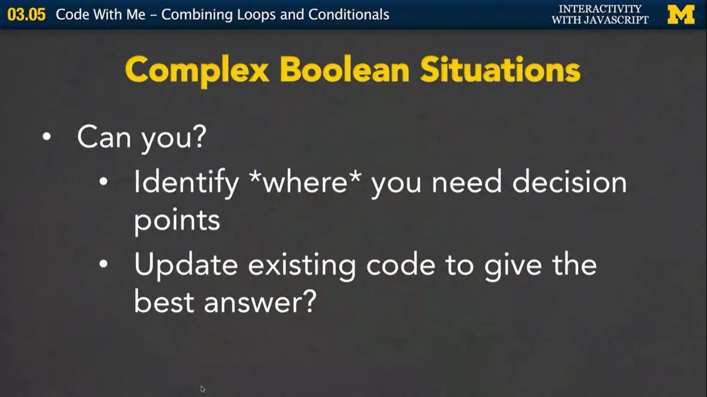{width="4.0in" height="2.25in"}

Let&#39;s think about some of the things we&#39;ve been learning, and how you
can incorporate them into a more complex situation. For instance, can
you identify where you need decision points? Up until now I&#39;ve given
you the code. But if I were to present you with new situations, can you
modify it in different ways? And when you do modify it, are you giving
the very best answer for as many situations as possible?

In today&#39;s example, we&#39;re going to build on the previous code where we
took the average of an array. But now, we want to make our code a little
bit better and a little bit smarter. Let&#39;s get started.

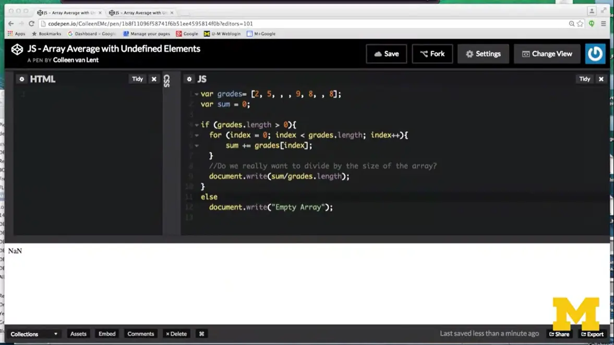{width="4.0in" height="2.25in"}

Here&#39;s the code we had earlier in this course. But I&#39;ve made one very
important change, it&#39;s right up here in the array. Instead of
specifying a value for every single element, I&#39;ve left some of them
empty, or what we in JavaScript call undefined. The problem is now, when
our code goes through and it adds every single element together to come
up with the sum We get an error.

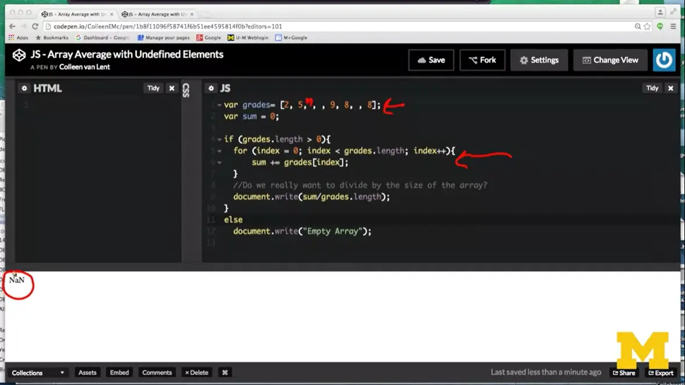{width="4.0in" height="2.25in"}

If you check right down here. Your screen is going to say NaN. That
stands for not a number, and it&#39;s something that may happen to you
quite frequently when you&#39;re first coding, if you haven&#39;t thought
about the logic very much. And it almost always happens when you&#39;re
doing some math. Let&#39;s think about how we can fix this, and what kind
of logic we need behind it.

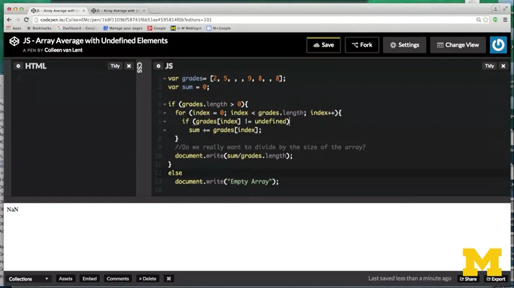{width="4.0in" height="2.25in"}

The first place I&#39;m going to look is right here. And my reason is, we
want to make sure that we&#39;re not adding everything into the sum, just
the things that truly belong there. Only the things that are numbers. If
you had to stop and go forward by yourself. The question might be. What
do I need to add here? Do I need to add another assignment statement? Do
I need to add looping? Do I need to add a conditional? Well, the answer
is you want to add an if statement, because we only want this line of
code to happen sometimes. Let&#39;s think about what that would be. Right
in here, one line above, I&#39;m going to add an if statement. And this if
statement says, you know what, I only want to do this, if the index has
actually been defined, if this is a real number. If it&#39;s undefined,
which is a very specific word to JavaScript, then skip this. Don&#39;t do
it. And hopefully right away you can see, that we now have a valid
number as our answer.

We&#39;re off to a really great start. However, we want to make sure we
don&#39;t stop right here. That&#39;d be a really bad idea, the reason is,
because our answer isn&#39;t actually correct. If you look at our array, we
have 2 + 5 is 7, 9 is 16, 24, 32. It adds up to 32 and we have about
one, two, three, four, five, five numbers here. We would expect our
average to be something around 6. And that&#39;s not the case. We ended up
with four.

Where did we go wrong? Again, it&#39;s not a syntax error. It&#39;s a logic
error. And the problem is right here. We said add up all those numbers,
and then divide by the length of the array. But we don&#39;t actually want
to do that, because there are a lot of empty elements up there. Let&#39;s
change this, so that we&#39;re actually keeping track of how many elements
are good, and only divide by them. Let&#39;s get started.

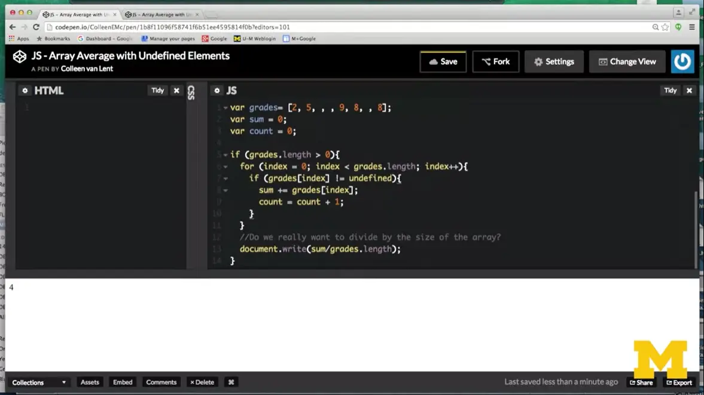{width="4.0in" height="2.25in"}

The first thing I&#39;m going to do is I&#39;m going to add a new variable
called count. What is this variable going to do? It&#39;s going to keep
track of all the good values. So, when I go down here, every time I add
a new number into the sum, I want to say oh, that was a good one. Let&#39;s
add one to count. Now this is very important. I want you to look so
closely at this code, and notice that these two lines right here line
up. They&#39;re right underneath each other.

This is your editor trying to give you some sort of information, and
what it&#39;s saying is, you know what? This count right here this line,
it&#39;s not part of the if statement, it&#39;s not there. And even if I go
in, and I say oh, I want it to be part of the i statement so I&#39;m going
to do one, two, three oh good, now it lines up. That&#39;s not good enough.
If you want two things to happen as part of your if statement, you have
to remember to put in that extra curly bracket, because that says, oh, I
want you to do both of these things.

{width="4.0in" height="2.25in"}

Now we&#39;ve done this, we&#39;re adding one to our count. We have one last
place we need to change our code, and that&#39;s right down here. Instead
of dividing by the length. We&#39;re going to divide by count. And there
you can see, we&#39;ve updated our answer and now we have 6.4, which is
much closer and hopefully correct for what we were aiming for.

The real lesson behind this lecture today, is not about dividing and
it&#39;s not about if statements. It&#39;s about you going in and thinking
logically about your code. And trying to write the best code for every
possible, or as many possible scenarios. It&#39;s really one of those
things that&#39;s going to help you solidify your knowledge. So go in
there, change the array, try to think up other situations, and practice,
practice, practice. Good luck.

<h2 id="Week3-06">Week 3-06. Advanced Conditionals</h2>

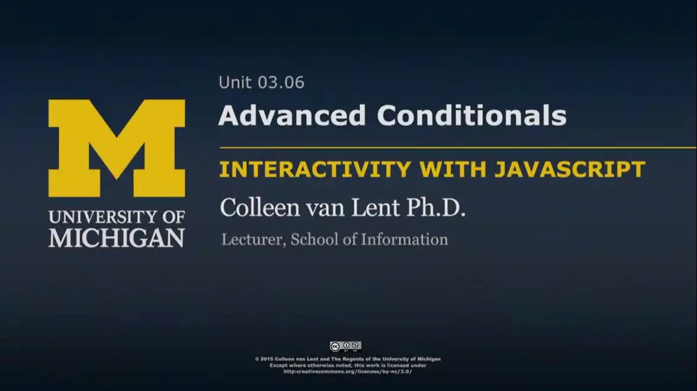{width="4.0in" height="2.25in"}

Earlier, we talked about how you can add if statements in order to
affect the flow of control of your program.

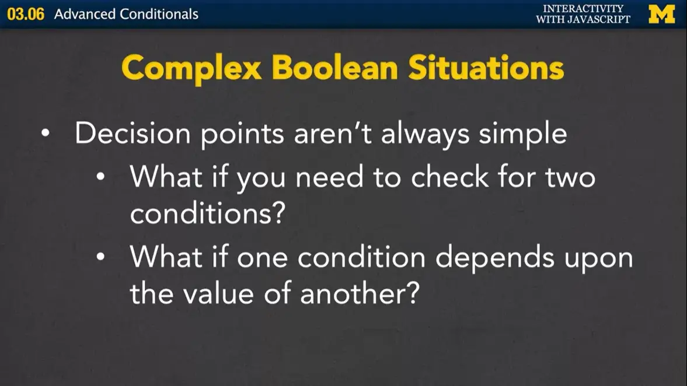{width="4.0in" height="2.25in"}

What you need to do is you go through, and you kind of circle those
little decision points in your code where the computer needs to make a
decision whether or not it&#39;s going to execute this code, or maybe that
code. In our earlier examples, the decision points tended to be pretty
simple. But, it&#39;s not always going to be that way. What if you need to
check for two conditions? Or, what if one condition depends upon the
value of another. I&#39;m sure you can think of lots of everyday situations
where, when you make decision, it depends on more that one thing. Even
if you&#39;re going to go to a movie, you need to decide. Is the rating
okay? And it is as much as I want to pay.

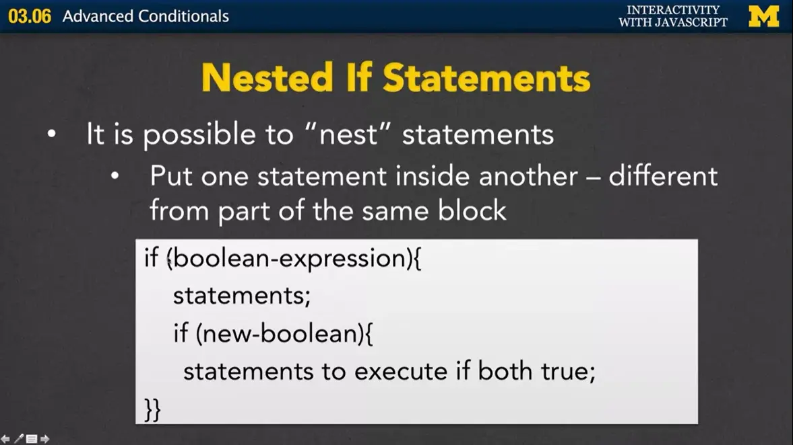{width="4.0in" height="2.25in"}

Let&#39;s talk about what we call nested If statements. It&#39;s possible to
put one If statement inside of another. In this situation I have an If
statement right up here and then I have my boolean expression in
somewhere inside my block and the programs working it&#39;s way down it
says here&#39;s another if statement and another boolean expression. In
which case we have two blocks to our program. We have a big outer block,
but we also have this kind of small inner block as well. Now, here&#39;s
where the logic comes in, it&#39;s important for you to understand I will
never get here. Ever, ever, unless both boolean expressions are true.

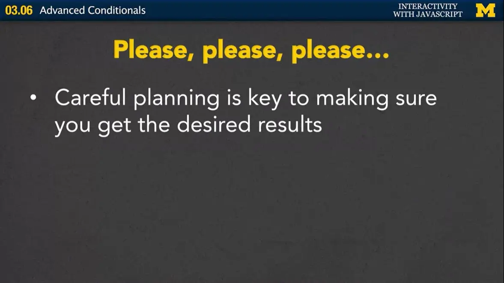{width="4.0in" height="2.25in"}

The first thing I&#39;m going to say before we even go on with this, is
that it&#39;s so important that you think about your code, and you plan
ahead. Because, as we start to make these more complicated or more
complex decisions points, you want to make sure that your logic is
correct.

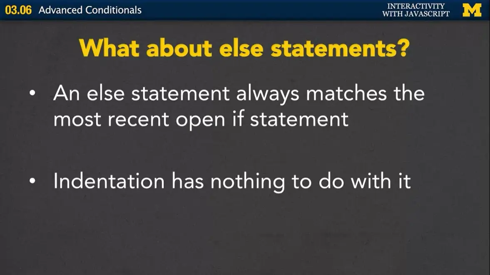{width="4.0in" height="2.25in"}

What about else statements. I talked before about how you can nest If
statements inside of each other. Well, if you want to have an else
statement along with those If statements its important again to think
about the logic. Because an else statement always matches the most
recent open if statement. Indentation, where you put your code, whether
you put an else directly below an if, has nothing to do with it as far
as the computer is concerned. It&#39;s all about the curly brackets.

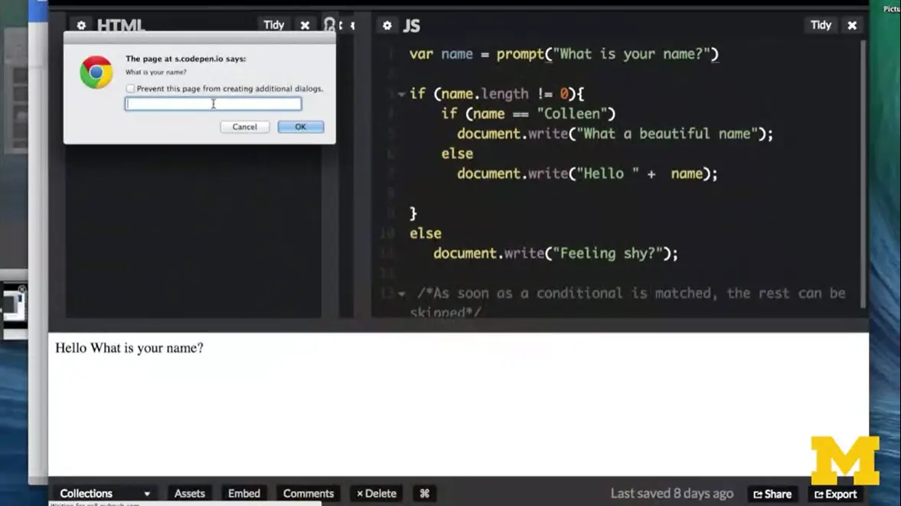{width="4.0in" height="2.25in"}

Let's build on to that nested if we were doing before or that If
statements we were doing with that name before. The difference is, well,
earlier we were simply respond and say, Hi to whatever name they put on.
We want to be a little bit more complex. We&#39;re going to leave that same
part where if they don&#39;t enter anything or going to say, Hey, are you
feeling shy? But now, if they do enter a name, we want to do different
things depending upon what they enter. If they enter any regular name,
I&#39;m going to still leave out, Hello whoever. But, if the name they
happen to enter is say, Colleen, we&#39;re going to print out what a
beautiful name. We need to think about the decision points we&#39;re
setting.

First, we have to decide, did they enter a name or not. When we think
about that, that gives us this first big outer block. Then, we need to
think about each of the different cases that might happen when we enter
a name. And so I have my if, name, and again it&#39;s ==, not =, but ==.
That&#39;s how you check for equivalence. If name == Colleen do one thing,
else, do another.

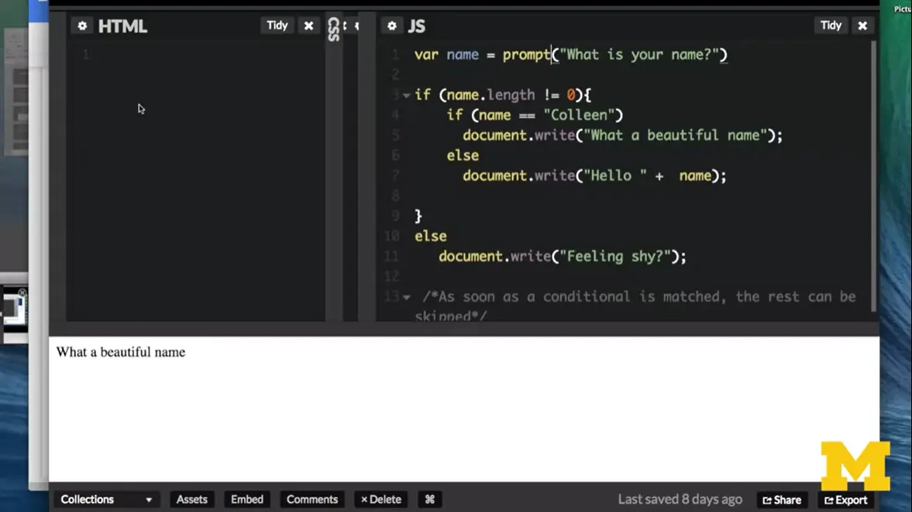{width="4.0in"
height="2.25in"}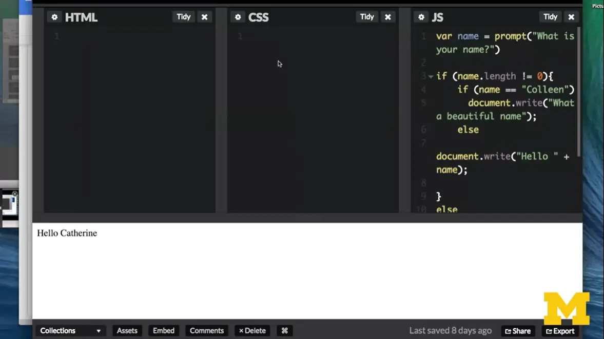{width="4.0in"
height="2.25in"}

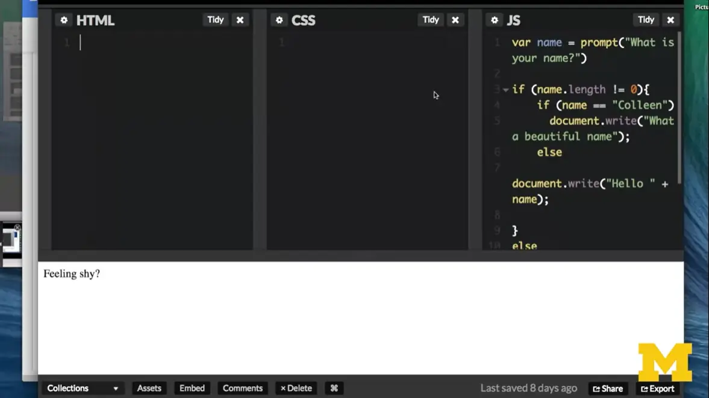{width="4.0in" height="2.25in"}

Now the reason why this else statement right here matches this one is
that it&#39;s the last one that&#39;s open. Because what we don&#39;t want to
happen, is if someone enter in an empty name, we don&#39;t want this else
to suddenly go, Hello emptiness. We want it to again skip, and go all
the way down here. Hopefully that&#39;ll make a little bit more sense, as
soon as I run this. First, let&#39;s put in my name. There we go, exactly
the output we were hoping for. What if I put in a different name such
as. Well, then we get the Hello Catherine. Finally, if I try it one more
time and I don&#39;t put anything in at all we get that last message of
feeling shy? You can see that by adding these different if statements
I&#39;ve created different levels and different outputs depending on what
the person put in.

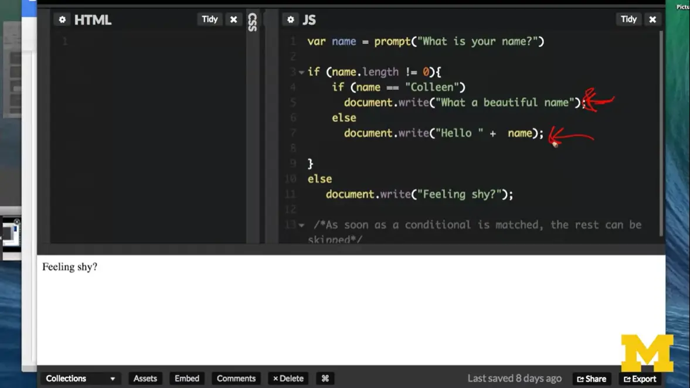{width="4.0in" height="2.25in"}

Now, I want you to look closely again at this code one more time. As you
can see, when I get to this statement. Let&#39;s say, right here. I&#39;m
basically saying that name.length isn&#39;t equal to zero and the name
equals Colleen. This statement down here, I&#39;m basically saying the same
thing as if name.length doesn&#39;t equal zero and the name doesn&#39;t equal
Colleen. Each one of these bits of code could actually be written with
more complex boolean expressions.

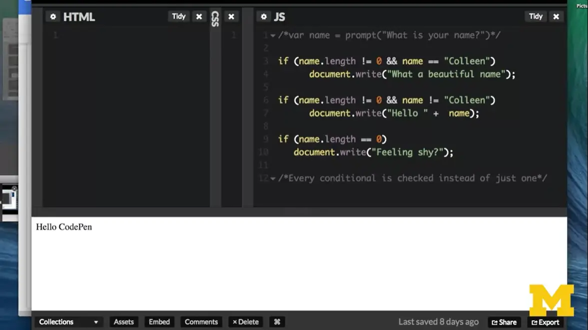{width="4.0in" height="2.25in"}

Let me show you what I mean. Right here, I&#39;ve replaced my nested if
statements and replaced them with much longer conditional statements.
Much more specific. We might also say conditional statements. This code
works and it&#39;s absolutely fine but it&#39;s much less efficient than
nesting the different if statements. And here&#39;s the reason why.

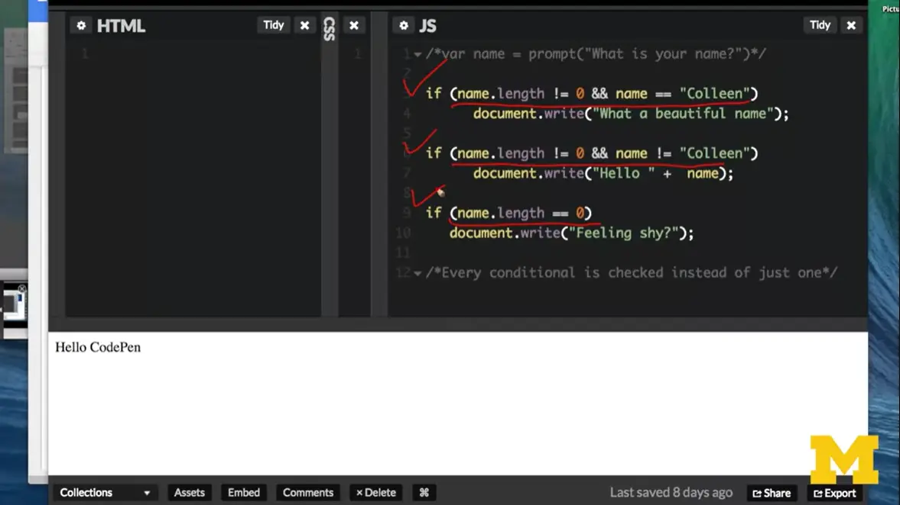{width="4.0in" height="2.25in"}

When the computer runs to this code, it does this if statement. If it&#39;s
true, it executes the code, but then it still goes down and it checks
this one and that one as well. We&#39;re not really doing flow of control
as much as just checking one line at a time.

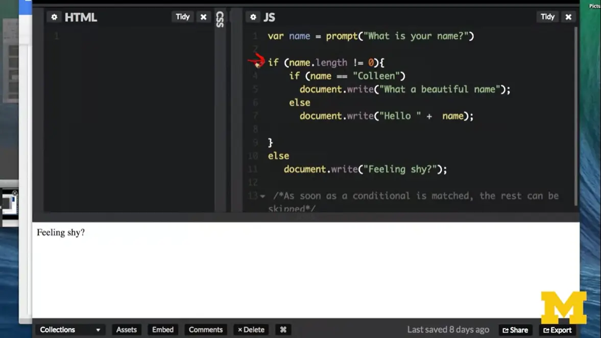{width="4.0in" height="2.25in"}

In our previous example, if the computer sees that the name is empty, it
skipped all this and it jumped all the way down here. In a similar
manner, if the computer see&#39;s that this is true, it skips all the way
down here. When we write this flow of controls, in these small programs
it may not seem like much, that we&#39;re skipping two or three lines of
code. But you can imagine how in the long run it could really make a
difference.

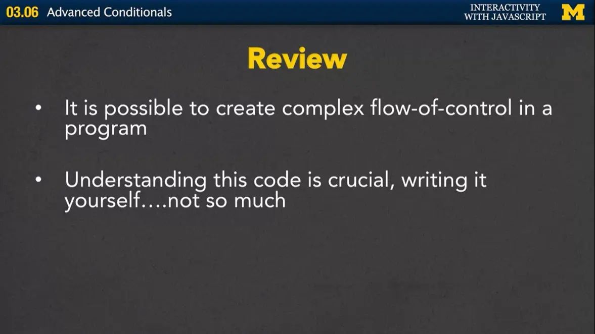{width="4.0in" height="2.25in"}

What do I want you to do in this class? I want you to do whatever you
are comfortable with. It is possible to create complex flow-of-control
in a program using if, else, and different nested statements. It&#39;s also
possible to get your programs to work putting in these complex
conditional statements.

The most important thing to me, and hopefully to you at this point, is
writing code that you understand. Follow along with my code. Make sure
you understand it. But when it comes to writing your own code, I&#39;m not
as concerned that you necessarily do it the same way I did it. I want
you to write it so that you understand what you&#39;re doing. Go out there,
code as much as you can, play with the examples. I promise that I&#39;ll
provide more so you can keep practicing. Good luck.

<h2 id="Week3-07">Week 3-07. Common Errors</h2>

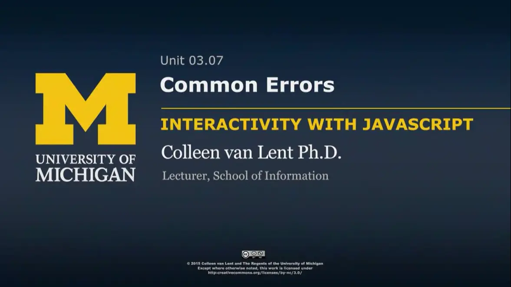{width="4.0in" height="2.25in"}

Hi everybody, welcome back. One of the things I like to say is that if
you&#39;re not messing up, you&#39;re not really programming. It&#39;s really
important that you learn that trial and error is a crucial part to
developing your skills. If you&#39;ve programmed HTML or CSS in the past,
you know that sometimes you just can&#39;t get things to work. You want to
make something green, and it&#39;s just not changing. You want to change
the font size, and it&#39;s just not happening. And while it&#39;s
frustrating, the nice part is that you can visually see your mistakes.
You know something isn&#39;t working.

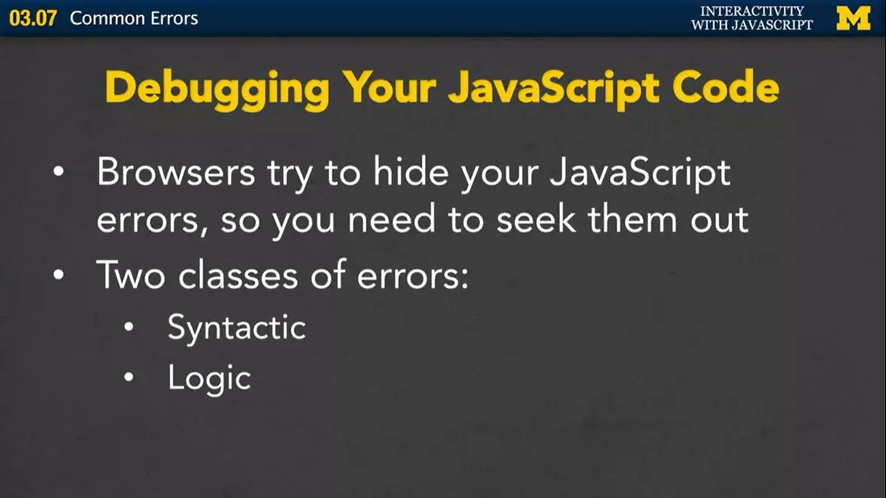{width="4.0in" height="2.25in"}

However, when you are using JavaScript most of the time the browsers are
just going to hide your errors. So, you don&#39;t even know that your code
isn&#39;t working unless you actually go in there and you look and you try
to find the errors on your own.

There are two classic types of errors in programming. They are called
syntactic errors and logic errors.

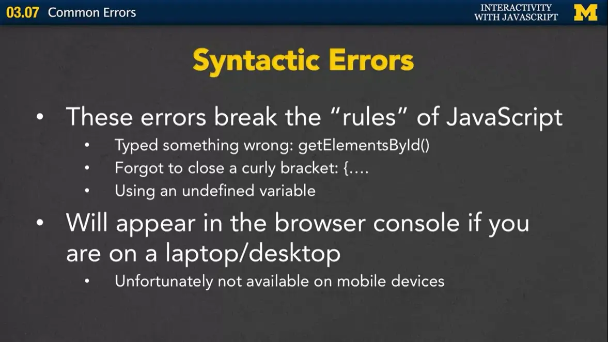{width="4.0in" height="2.25in"}

With syntactic errors, what you&#39;ve done is you&#39;ve broken some sort of
rule of JavaScript. So, perhaps you typed something wrong. This might
look right at first. **GetElementsById()**, but it&#39;s important to
remember that it&#39;s actually **getElementById()**. A simple typo that
breaks the rules and says, hey, we don&#39;t have a function called that.
You might also just forget to close a curly bracket when you&#39;re making
a block of statements. Another one that happens all the time is that you
use an undefined variable. An undefined variable just means you&#39;re
trying to use a variable but you never actually told the computer what
it was. This happens a lot when you&#39;re copying and pasting and using
other people&#39;s code. Since you&#39;re not exactly sure what they were
doing, it&#39;s very easy to introduce errors.

The good thing is that these errors will often appear in the browser
console if you&#39;re on a laptop or desktop. That&#39;s why I&#39;m always
encouraging people to open up Inspect Element, take a look. Click on
that console button, and see if there&#39;s any errors. And it&#39;ll help you
out immensely.

Unfortunately, that console isn&#39;t available on mobile devices. I&#39;ve
really been looking for it. I&#39;m hoping that if students find these
kinds of tools, they&#39;ll share them in the discussion board. Let me
know. Let me update the course information. Because you&#39;re really at a
disadvantage if you don&#39;t have that ability to look and seek out your
errors.

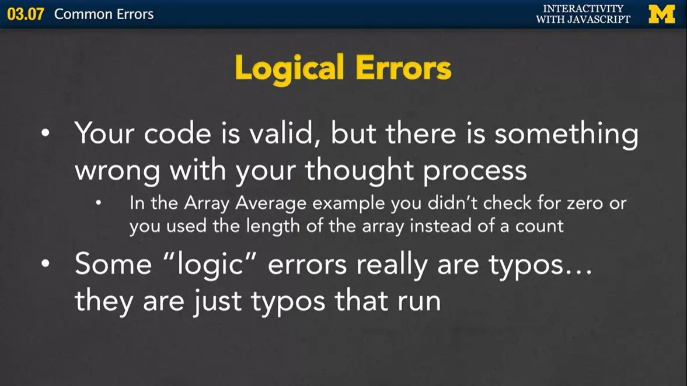{width="4.0in" height="2.25in"}

Now logical errors are a little bit different. Your code is valid, you
followed all the rules, but maybe there&#39;s something wrong with the
thought process that went into it. You didn&#39;t think of every possible
scenario of what the input might be. One example would be that Array
Average. Where we didn&#39;t really think to check to see if the length of
the array was zero and so we had to put it in.

Some logic errors really are just typos. They&#39;re just typos that run.
So, let&#39;s look at some of the most common errors so I can try to help
you kind of debug your code before you even do it.

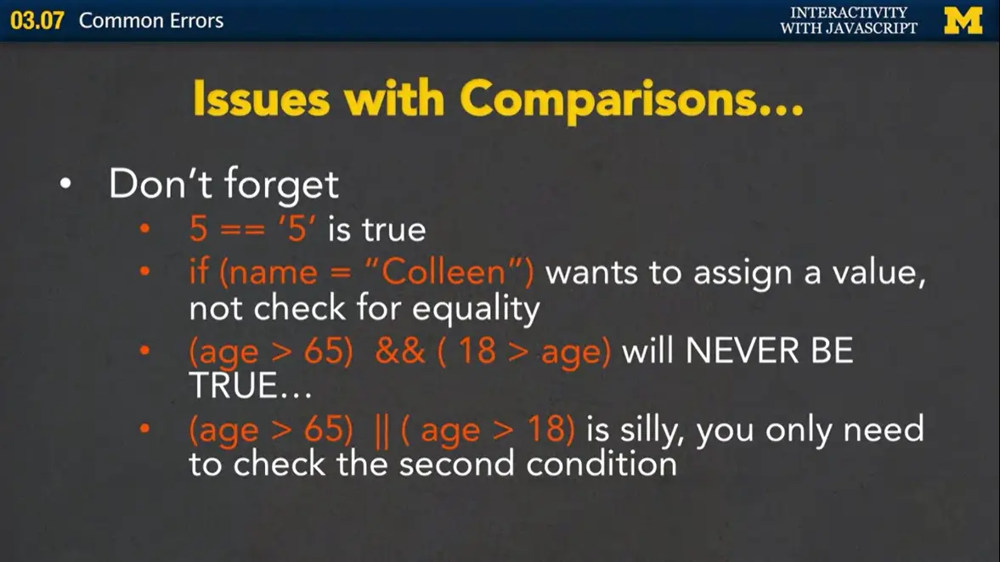{width="4.0in" height="2.25in"}

A few things I don&#39;t want you to forget. First, you need to realize
that the number 5 is actually equal to the letter 5 as far as JavaScript
is concerned. If you&#39;re really concerned about making sure something&#39;s
both the same value and the same type, you need to use that ===, the
triple equal.

Another common error is when people do their if statements. When you
have a single equal statement, to the computer you&#39;re saying hey, take
the value Colleen and assign it into the variable name. That&#39;s not what
we want to do, right? What we really want to check for is equality, and
we need to use those double equals.

Another thing people do with comparisons, and again, this is an example
of a logic error, not necessarily a syntactic error, is in their boolean
comparisons. What I&#39;m going to check right here is if the variable age
is greater than 65 and it&#39;s less than 18. If you think about that for a
second, you realize it probably wasn&#39;t what you wanted to check,
because there&#39;s no way that a number can be greater than 65 and less
than 18 at the same time. This will never be true.

Similarly, on this next line of code, I have something that&#39;s
syntactically correct. And actually, it&#39;s logically correct. But it&#39;s
just kind of silly. Why would you ever check if something is greater
than 65 or greater than 18? There&#39;s really no need to check both
conditions, because if you know you&#39;re greater than 65, you&#39;re pretty
much guaranteed that you&#39;re also over 18. This is why, when you&#39;re
writing your code, you want to just stop every once in a while, and make
sure you&#39;re double checking each line as to what it&#39;s actually doing.

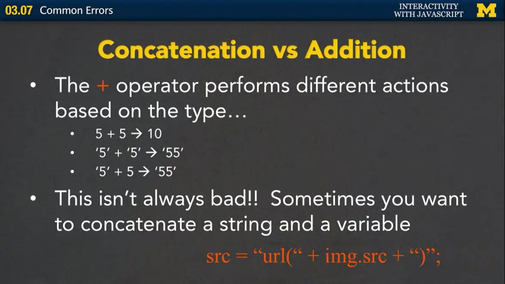{width="4.0in" height="2.25in"}

Another very common source of frustration and sometimes outright anger
with people is the + operator. You need to remember that the + works
differently depending upon the type of variables. 5 + 5, oh. Well, that
evaluates to 10. But 5 + 5, two strings. That&#39;s going to concatenate.
It&#39;s not going to add it. It&#39;s going to concatenate it and give you
55. What happens if you have a number with a string and you have that +
operator? Well, in that case, even if it only sees a single string, even
if there were 18 things, +, +, +, as soon as it sees a single string, it
says, oh, this is a concatenation operator not an addition. This isn&#39;t
always bad.

Sometimes you want to concatenate strings and variables together.
Sometimes you might want to have a variable right here, such as source,
that says, oh, do you know what? I want to grab a new source file. How
can I do that? Because I need to use the exact words, url, and the
parentheses. And over here, I need it to end in another parentheses.
Now, who knows what img.src is? I have a pretty good idea that img.src
is an element out there, where can grab the source. But this is a great
and very useful to you example of how you can combine strings, plus the
variables, plus strings to create a new string.

Next, let&#39;s talk about nesting. When you start nesting, it&#39;s very
important that your else statements match the appropriate if. You also
want to make sure that you never include semicolons inside the if
itself.

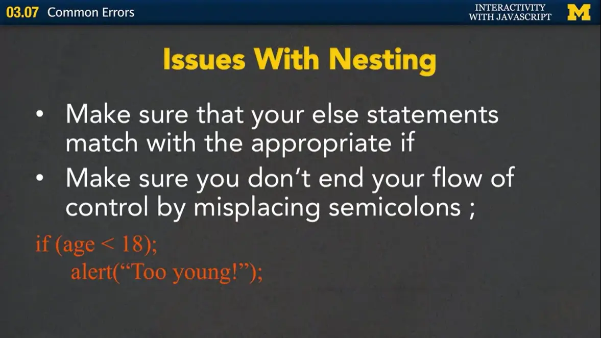{width="4.0in" height="2.25in"}

Let me show you an example. Right here, I have if (age &lt; 18);
alert(&#34;Too young!&#34;);. This isn&#39;t going to do what you expect. If you
remember, computers ignore indentation. So, while it looks really good
and it looks like you&#39;re saying, if this is true, do that. It&#39;s not
going to work. This semi-colon right here, eh, it&#39;s really bad. It
counts as a statement. What you&#39;re really saying right here is, if age
is less than 18, nothing. And then it will immediately go down to the
next line. It&#39;s always going to say too young.

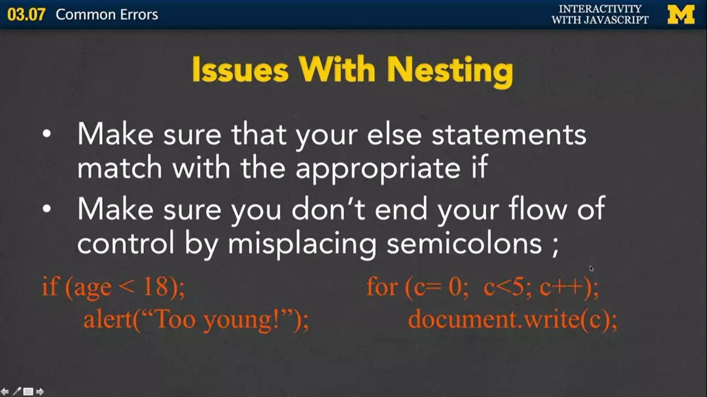{width="4.0in" height="2.25in"}

In a very similar manner, I have a for loop over here, where I included
a semi-colon. We&#39;re going to have that same exact error. What&#39;s going
to happen in this case is that it will loop five times just like you
want it to. And each time it&#39;s going to do nothing. When that loop is
all done, the last thing it&#39;s going to do is go to the next line of
code and write out the number 5. I&#39;ve put this code online, and I&#39;d
really love for you to take a look at it and kind of play with it, and
help you recognize how these semi-colons can affect the flow of control.

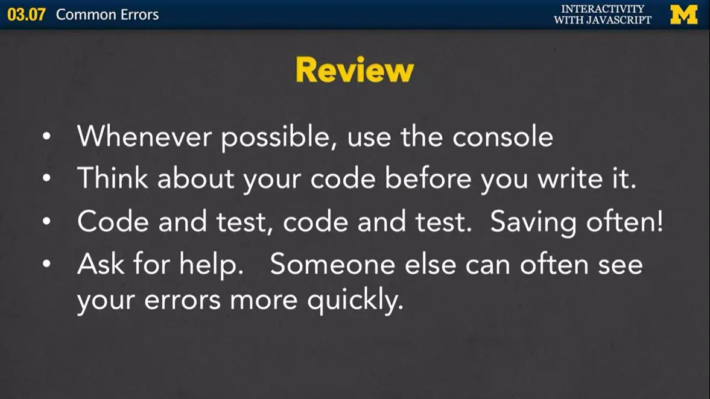{width="4.0in" height="2.25in"}

Whenever possible, I really encourage you to use that console. There
have been so many times when I have wasted a lot of effort trying to fix
my code when the console was telling me the error the whole time. I just
didn&#39;t think to use it.

Again, think about your code before you write it. It&#39;s so tempting to
just start typing things down and hoping frantically that something will
work. The good news is, it probably will. The bad news is, you won&#39;t
understand what you did. And that&#39;s the whole point, right? Helping you
understand better these different aspects of JavaScript.

Code and then test it, and then code and then test it. And please, save
as often as you can. Because again, it&#39;s really easy to start coding
and think, oh I can fix this and make little changes and little changes
and then suddenly realize you don&#39;t remember where you were even ten
minutes ago in your code.

Finally, ask for help. That&#39;s the point of Coursera, right? To have
these discussion boards. It&#39;s so often the case that someone else can
see your errors more quickly than you can. It&#39;s not because they&#39;re
any smarter, it&#39;s just they have fresh eyes. So similarly, make sure
you go out there and help someone else with their code. Not only are you
doing a great thing, but it&#39;s a great way for you to learn even more.
Thanks.

<h3 id="cha-wk4"><a href="http://codepen.io/collection/DYydJE/">Link to All of the Code for Week Four</a></h3>

Again, the following is a link to all of the code for Week Four. The individual
files are linked within the modules but the weekly collections may
include additional code that you are free to use.

<a href="http://codepen.io/collection/DYydJE/">Code: Week Four</a>

Even if you use CodePen, I encourage you to practice writing the code on
your own. For now, I put complete examples in CodePen, but as time goes
on, I will remove some of the commands to link the code together. You
will need to work on that part on your own..

<h3>Introduction to Forms</h3>

This week we will cover forms. You have all seen forms (we use them for
the peer assessment) and I want you to know how to style forms and
perform some &#34;validation&#34; - checks on the input. Form validation is a
valuable and extremely common way to incorporate JavaScript into your
site.

But I need you to know that we are only going to talk about half of what
you need to know to use forms. When someone hits the Submit button on
our forms we don&#39;t do anything with it. So if you decide to later make
your own site you will not want to create your own form&period;&period;&period;&period;otherwise
people will think that they are sending you information when they are
not.

<h2 id="Week4-01">Week 4-01. Simple Forms</h2>

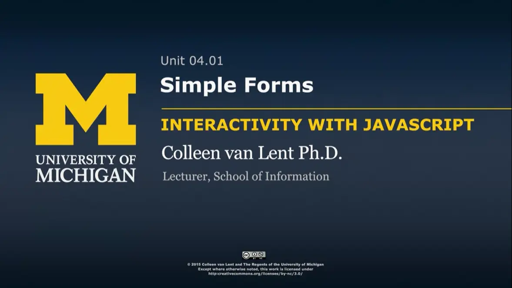{width="4.0in" height="2.25in"}

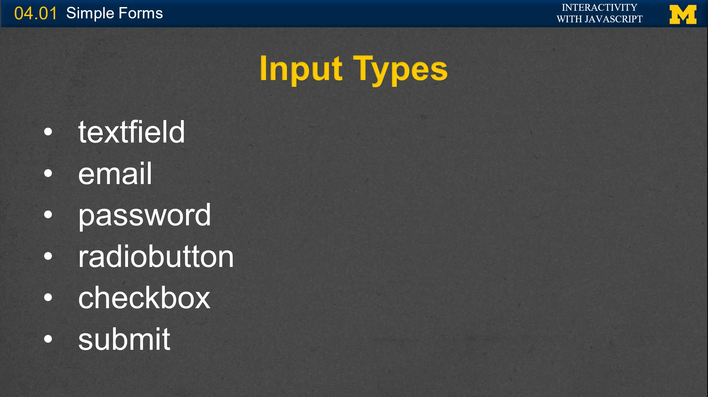{width="4.0in"
height="2.247863079615048in"}

Hi, everybody. One place where you tend to see a lot of JavaScript used
is when people are creating forms. Forms are a great way to let you give
people the opportunity to send you feedback.

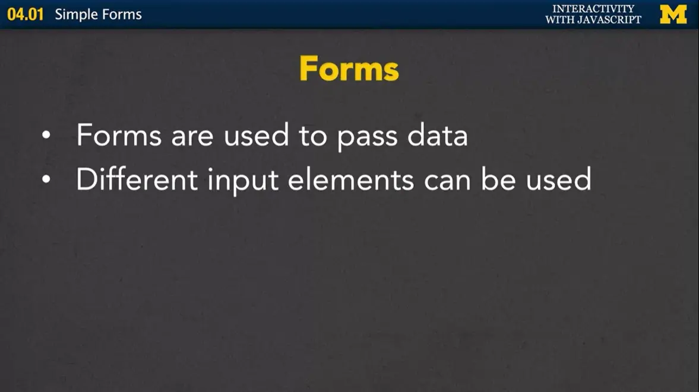{width="4.0in" height="2.25in"}

Forms also add a new layer to what we call the Request-Response Cycle.
So previously, we&#39;ve had our phone, yeah, no one has an antenna anymore
but I&#39;ll put one in, all right, and we had a server. And how it would
work is from your phone or your laptop, you would send out for request
and say, hey, can you send me back that file, index.html. And then the
server would send back a whole bunch of information. It would send back
the HTML file. It might send back a style sheet or two. It might send
back some pictures. And it was really good, we can get things to work
nicely that way.

But now, what if you also want to send additional information instead of
just see index.html, we said, hey, can you return a page, and by the
way, here is my username and my password. Forms lets us send that
additional information. Forms pass this data, and how they can do that
is they can let you put in different type of input elements. Strings,
numbers, files, a lot of different things like that. However, in order
to really get the full power of forms, they must be associated with a
server. We aren&#39;t hooked up to servers in this class. You&#39;re just
developing locally on your laptops. We can create the forms, but we
can&#39;t really process them yet. The reason for this is that we&#39;re doing
what&#39;s called front end web development.

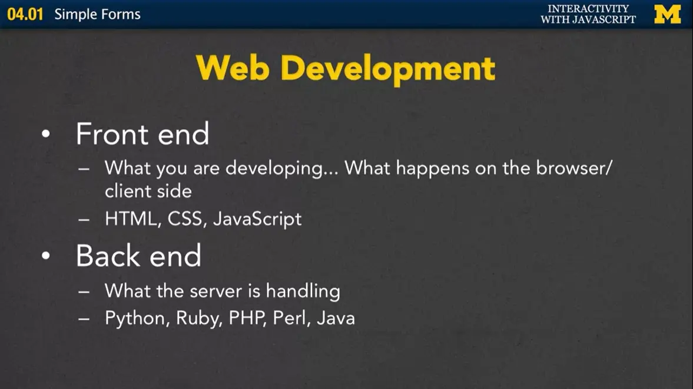{width="4.0in" height="2.25in"}

With front end development, you tend to think about what happens on that
browser or client side. How we want things to look on your laptop, on
your phone, on your tablet. We do this using our HTML and CSS in
JavaScript. If you want to take this further, this idea forms, then you
need to jump into what&#39;s called back-end development. That&#39;s where the
server&#39;s actually handling that data you&#39;re going to send to people.
You&#39;ll need to learn something like Python, or Ruby, PHP. There&#39;s a
lot of different things we can do at the back end. But in this class and
in this lecture, we&#39;re only going to talk about the front end. We&#39;re
going to talk about that HTML, CSS, and JavaScript that we use to put
together a form.

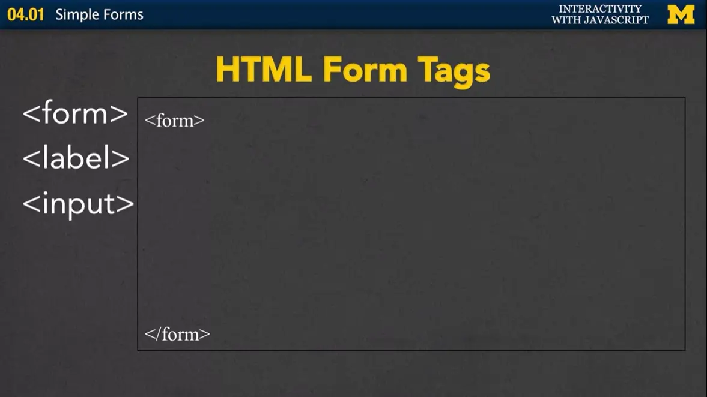{width="4.0in" height="2.25in"}

Okay, so how do we make a form? Typically, you want to use at least
three different HTML elements, the **form**, the **label**, and the
**input**. The form tells a browser, hey we&#39;re about to do a **form**
and we&#39;re going to probably be processing some data, get ready. The
**label** is what matches different text on the screen with the actual
input that you can put in.

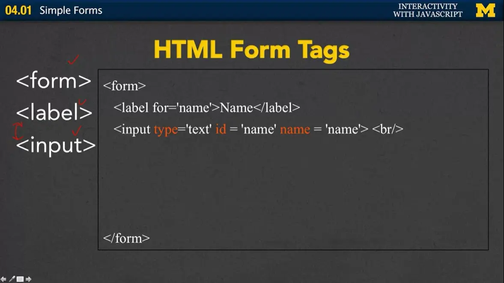{width="4.0in" height="2.25in"}

Let&#39;s start off by putting in the name. Here, I have **&lt;label
for=&#39;name&#39;&gt;, type=&#39;text&#39;, id=&#39;name&#39;.** And then I do actually
happen to have name=&#39;name&#39;. It can get a little overwhelming with all
the places I used name, all right. So when we do this, what I&#39;ve done
is I&#39;ve just created a label called name and I&#39;ve linked it to that
field that somebody can type into. And that label&#39;s very important
because what it means is if somebody clicks in here, great, I activated
the input field. But it also means if somebody clicks even on the name,
it&#39;ll activate this input field. Why is this important? Well, some
people have a hard time navigating through forms, especially on their
phone. By letting it set up, so that you can hit small pieces of text
instead of just necessarily the buttons or check boxes, it&#39;s going to
make their life much easier.

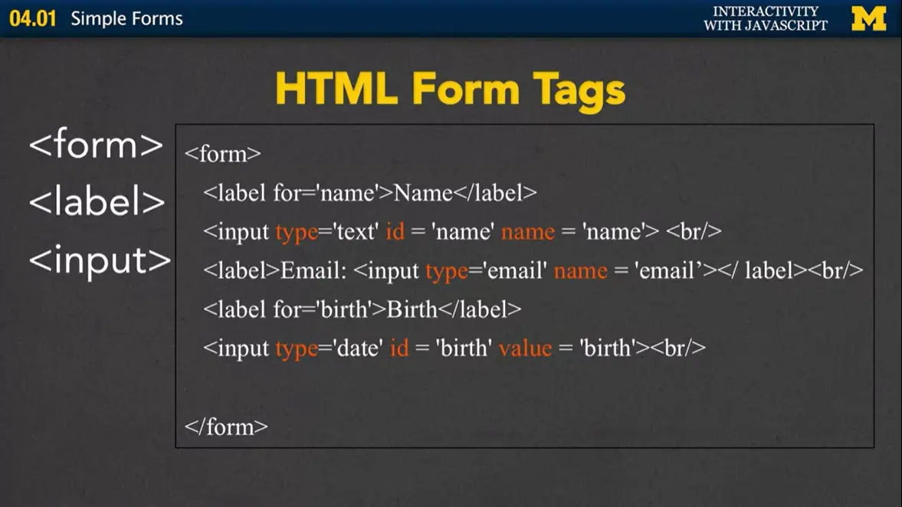{width="4.0in" height="2.25in"}

By putting in label for=&#39;name&#39;, it lets the computer know that these
two things are linked together. But we can actually link forms and
labels in another way. In my second example, I skipped the whole for
part and instead, how I made it work, because I said, hey, I&#39;ve got a
label tag, everything inside of here is all grouped together.

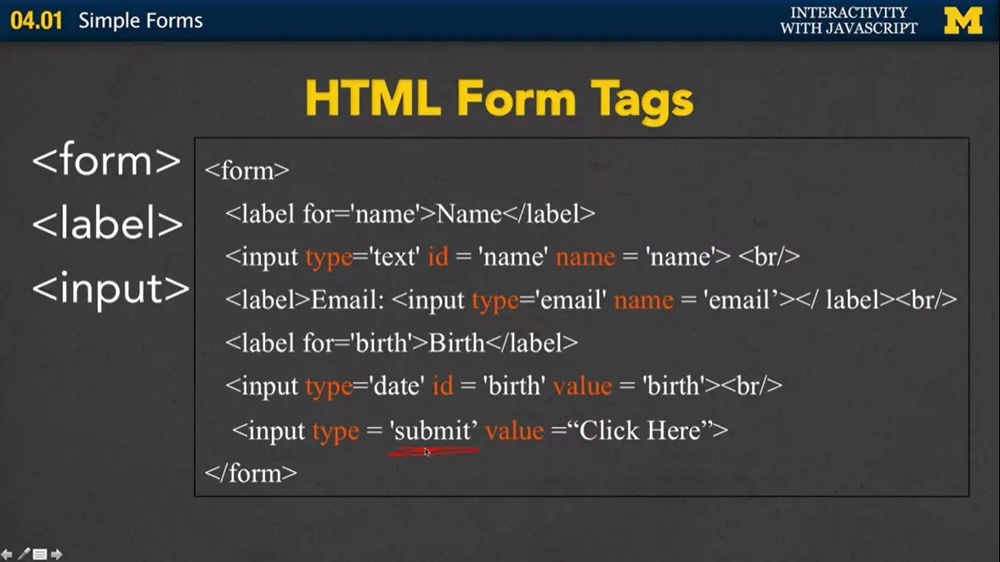{width="4.0in" height="2.25in"}

Now, I&#39;m going to have one field for the name, one field for the email,
and add one for the birthdate. It&#39;s easy to go through and be very
consistent and add new inputs one at a time.

The thing that I&#39;m not sure if you&#39;ve noticed at all is that each one
of these has a different type. I have type=&#39;text&#39;, type=&#39;email&#39;,
and, finally, type=&#39;date&#39;. Each one of these will create a different
type of input experience for the user. And, speaking of form attributes,
the last thing we want to make sure we always have is input
type=&#39;submit&#39;. If you don&#39;t have this part right here, there&#39;s no
way for anybody to actually send the form. So don&#39;t forget to include
that.

{width="4.0in" height="2.25in"}

Now that we have this code, let&#39;s see what it looks like on the
browser. Here&#39;s how it would look on Chrome. I have my name, I have my
three input fields. And if you notice, I have right here some sort of,
month, month, day, day, year, year, year. That&#39;s a nice little calendar
function. If I look at the exact same page, the exact same code, but I
look on it on Firefox, it&#39;s going to look a little bit different, that
month, day, and year are gone. So let me show you this in real time.

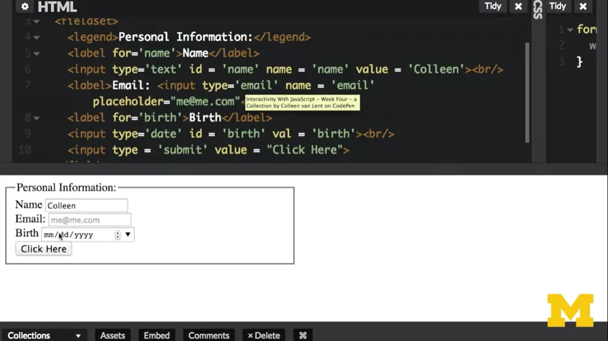{width="4.0in" height="2.25in"}

Here&#39;s my form when I&#39;m looking at it on Chrome. And you can see down
here in the corner, I&#39;ve got my name, and my email, and the birthdate.

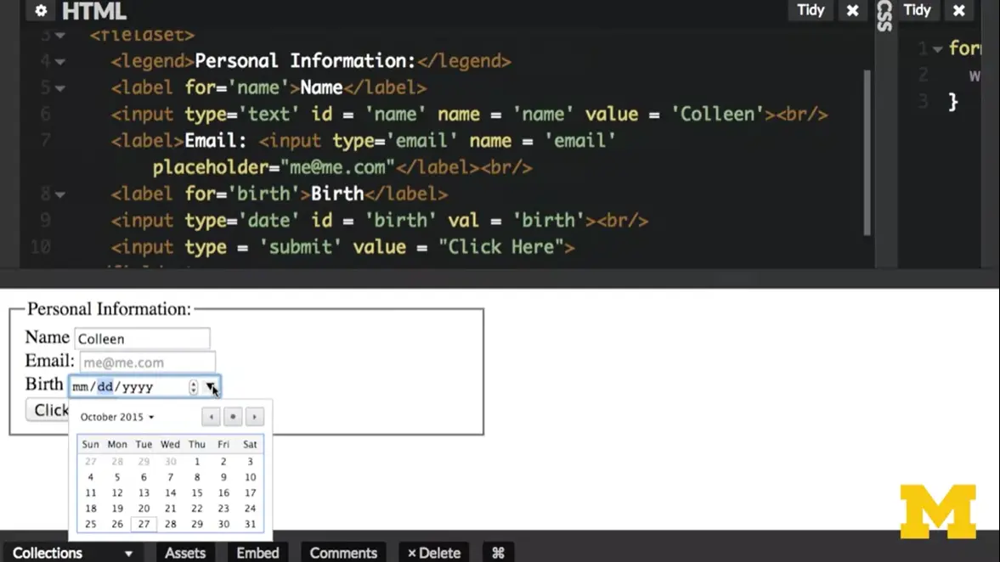{width="4.0in" height="2.25in"}

And when I click here inside birth, or inside here, I can have an entire
calendar function pop up for me where I can say, oh, I want to pick
February 13th, 2015, all right. And this is a really handy way for
someone to be able to input data.

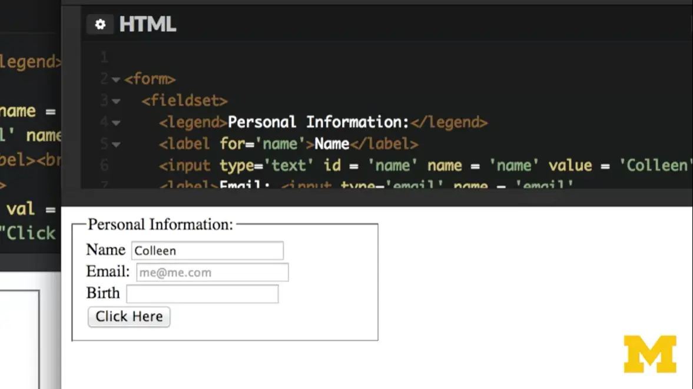{width="4.0in" height="2.25in"}

But now, let&#39;s look at the same code but on Safari. You might notice
that this isn&#39;t here anymore. There&#39;s no way for me to generate that
calendar to pop up. All right, oops, I shouldn&#39;t have done that, but
that&#39;s fine. And so, these are the little things that you need to
consider when you&#39;re coding for multiple different types of browsers.

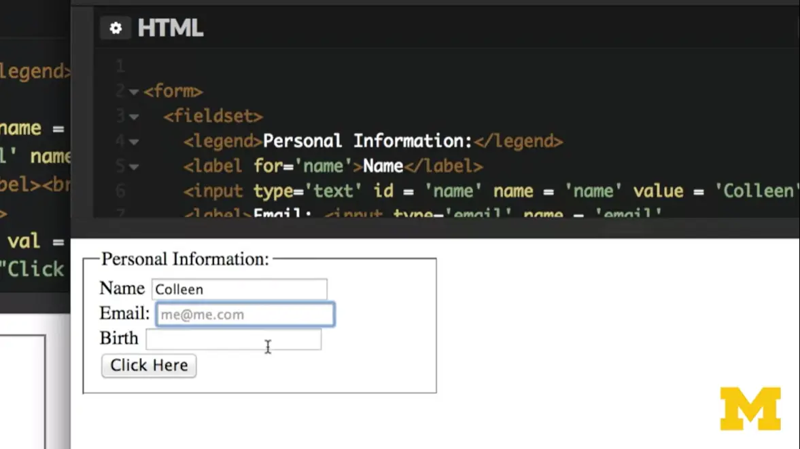{width="4.0in" height="2.25in"}

You&#39;ve seen a very simple form.

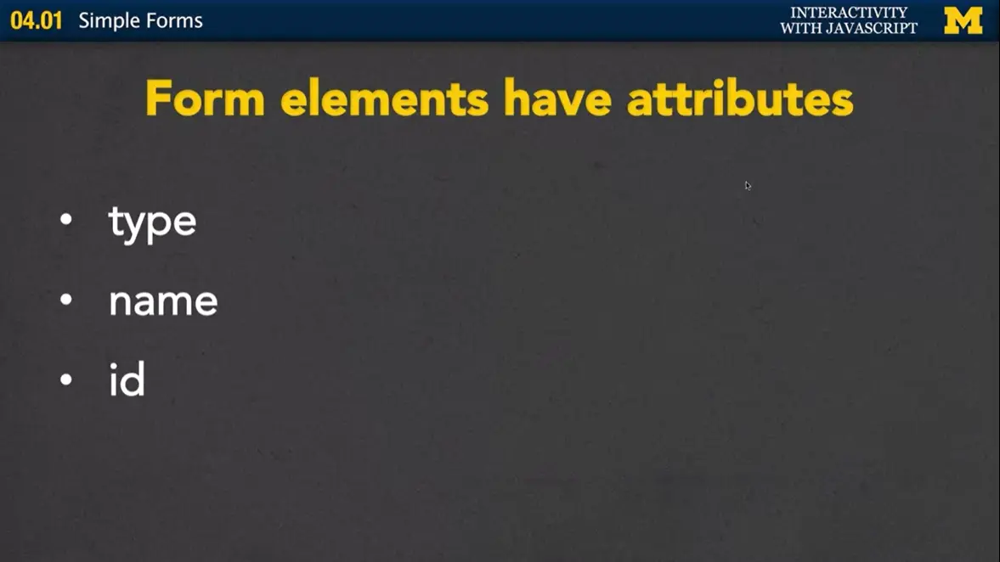{width="4.0in" height="2.25in"}

Let&#39;s talk about the different attributes these form elements can have.
The first one is type. The next one is name. And the next one is id.
These are the three attributes we&#39;re going to see the most so I want to
cover them in a little bit more depth.

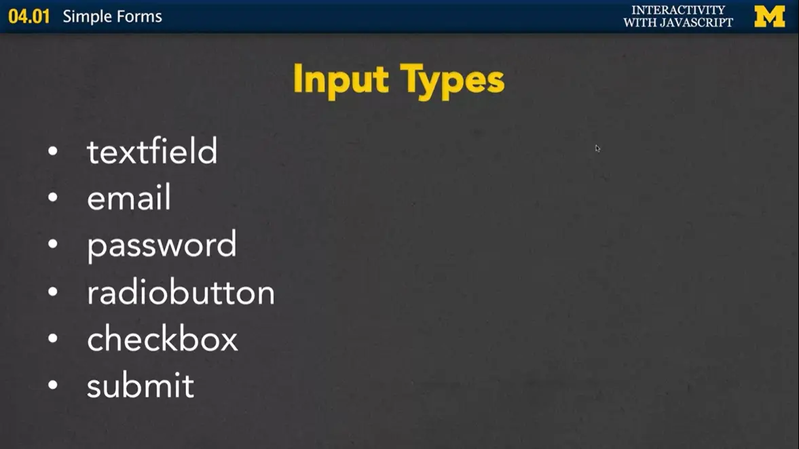{width="4.0in" height="2.25in"}

For our input types, there&#39;s a long list of different things you might
see in your field. You might see textfield, email, password, or
radiobutton. Those are those circular things where you can only pick one
or the other, or one from multiple choices. You can have a checkbox.
With a checkbox, you can click yes or no on multiple different elements.
And finally, you&#39;re used to seeing the submit button. These are kind of
the key input types that everyone would expect you to know how to use if
you&#39;re a web developer.

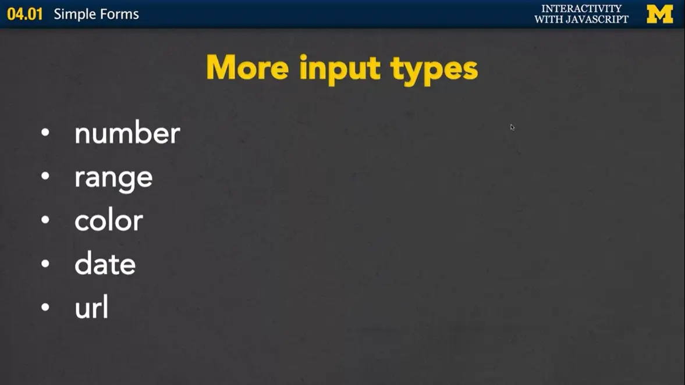{width="4.0in" height="2.25in"}

A few additional input types are number, range, color, date, and URL.
Each one of these are very restrictive in what they let the user type
in. If you have that something is a number, the form isn&#39;t going to
submit if you put in some letters. Same thing for date and for URL,
it&#39;s expecting to see http://. If the user doesn&#39;t input that, the
browser says, nope, you just can&#39;t do it.

The other really cool thing about these input types is that if
somebody&#39;s looking at your page on a mobile phone, some of them will
cause a different keyboard to pop up. Have you ever been on your phone,
and when you&#39;re filling something out, if it&#39;s a web address, you&#39;ll
get the at symbol on your keyboard? Well, if you&#39;re filling in a phone
number, you&#39;ll get the number keypad instead of the character keypad.
All of these different input types can help make your site act a little
bit better to the user. Let&#39;s take a look at these just briefly on the
website.

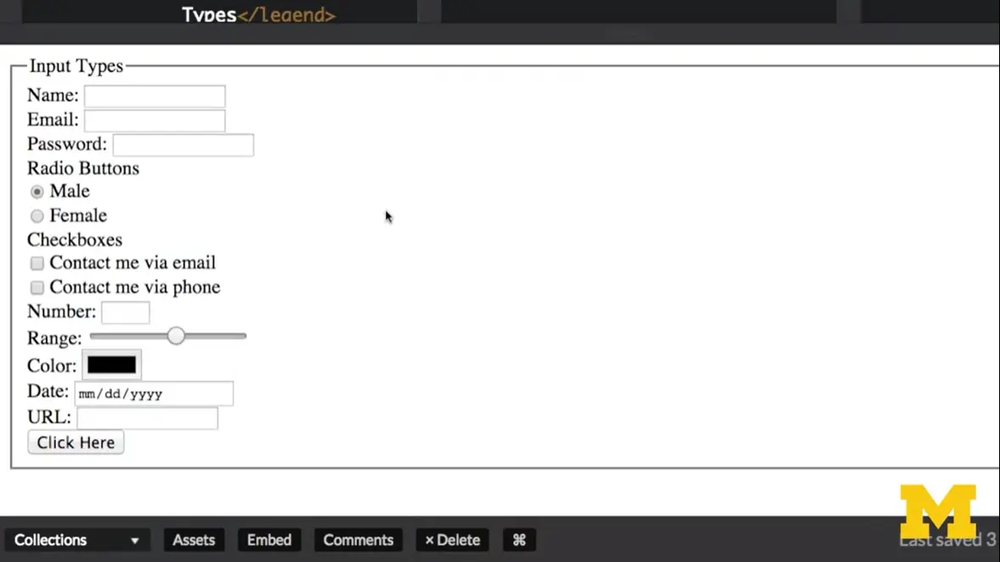{width="4.0in" height="2.25in"}

Here are each of those input types on a form and this going to go in and
type in a few of them so you can see. If I type in my name, it&#39;s as you
expect.

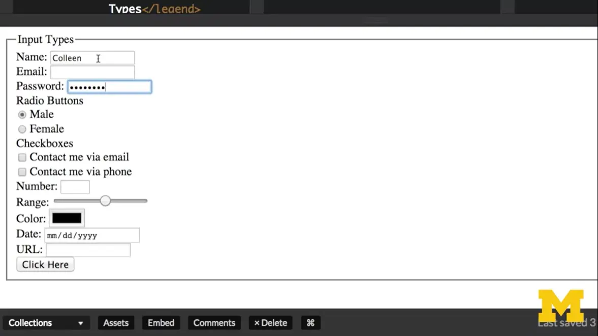{width="4.0in" height="2.25in"}

But look what happen when I start typing in to the password. I&#39;m going
to write in Colleen. And instead, you&#39;re getting kind of masked or
covered up. With radio buttons, I can only check one of the options, not
both. But with check boxes, you can click as many as you want. Now
number, when you get the number, you get something, it&#39;s called a
spinner where you can actually press up and down. You don&#39;t see those
in text boxes or email addresses. Range let&#39;s you pull back and forth.
Color, if it&#39;s supported by the browser, when I click on it will
actually give me a color wheel, the whole list of different things I can
pick, all right? And finally, URL was the one where I said it&#39;s going
to expect you to type HTTP.

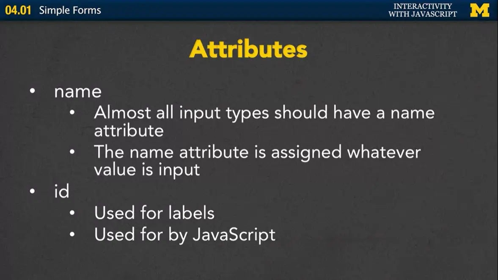{width="4.0in" height="2.25in"}

In addition to the input type, I mentioned there are two other attribute
you want to make sure you understand. The first one is name. Almost
every input type should have a name attribute associated with it.
Because if you don&#39;t, when the time does come for you to work on your
back-end development, if you decide to go work on the servers, is that
that information is actually sent to the browser. For my name example, I
would have name = &#34;Colleen&#34; is actually included in the information
that&#39;s sent to the server. The other attribute is the id attribute. The
id attribute is very important for what we&#39;re doing for the front-end
development. First, it&#39;s used for those labels that I talked about. It
identifies this particular part of the form, as that particular part, so
you can make sure that when you click on the label, the right input
value is kind of highlighted. The second reason of course is that we&#39;ve
been using id&#39;s with JavaScript all along and we want to make sure that
we can continue to do that.

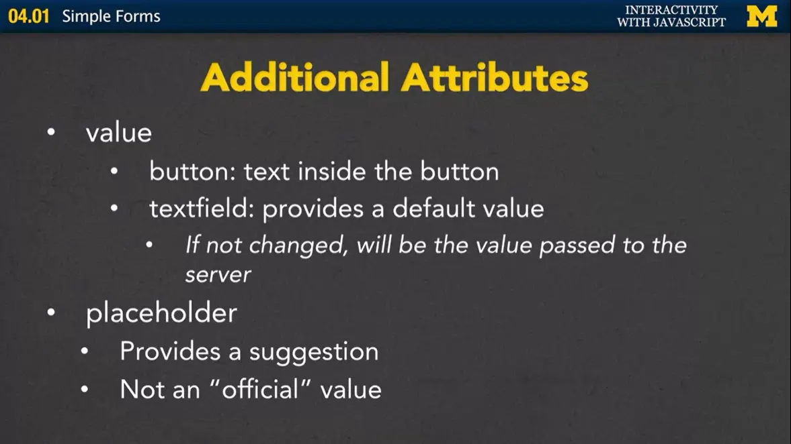{width="4.0in" height="2.25in"}

Two additional attributes because they&#39;re going to make our life
easier, is one is value. When you have a value attribute, it&#39;s going to
do different things depending upon which input type it&#39;s matched with.
If you have a button, that value actually becomes the text inside the
button. It becomes the words Click, along that line. Now for a
textfield, it&#39;s a little bit different. With the textfield, it lets you
actually hard code in the values that are going to be sent to the
server. On a button, this Click here is permanent, you can&#39;t change it.
But in a text field, it&#39;s perfectly okay for you to come in, erase this
and put in some new value.

The other cool attribute is this idea of a placeholder. It&#39;s very
similar to value, but instead, it provides a suggestion. It&#39;s nothing
official, just something you may want to do. And you&#39;ll see this often
in telephone numbers or anything where you want people to format things
a certain way. In the telephone field, you wouldn&#39;t see in blacking,
usually I could gray out color. Something along the line of (123)
456-7890. It&#39;s a suggestion, it&#39;s letting the person know what kind of
input you&#39;re expecting. Now, as soon as somebody clicks in there, it&#39;s
gone, so it&#39;s not permanent.

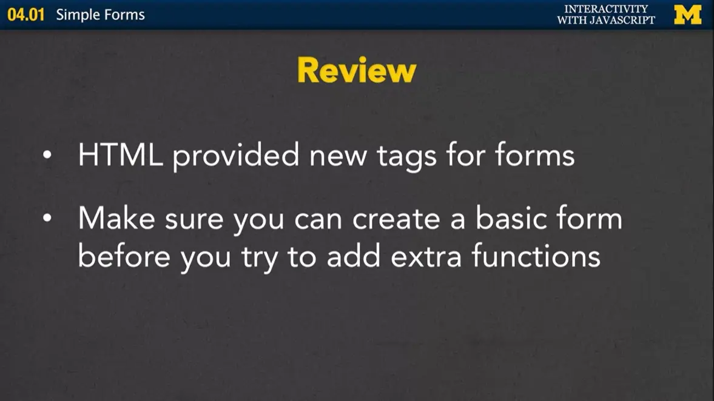{width="4.0in" height="2.25in"}

Let&#39;s review all the things we&#39;ve learned about forms in this one
short module. First, you need to know the HTML tags for creating forms.
Once you create that basic form, then you&#39;ll be able to add the extra
functions that we&#39;re going to be covering in these next few lectures.
So go in, use the basic form, change it so maybe you have a first name
and a last name. Play with what happens when you have an email field
verse a textfield. And see if you can make something that you&#39;ll be
able to play with throughout the rest of this week as we learn more
about JavaScript. Thanks.

<h2 id="Week4-02">Week 4-02. Simple Validation</h2>

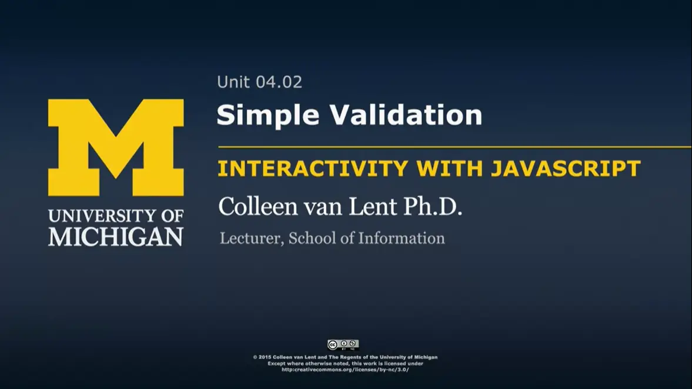{width="4.0in" height="2.25in"}

Okay, everybody. Let&#39;s talk validation. Before we can validate input,
we need to think ahead. We need to think what is it we want to validate
on our form or on our page. And after you decide what you want to
evaluate, you have to decide how are we going to do it? Because we
always have a few different options.

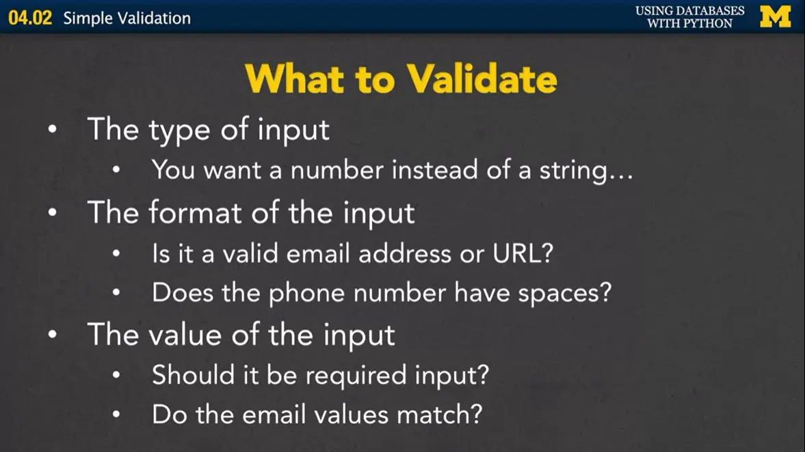{width="4.0in" height="2.25in"}

Let&#39;s talk about what we might want to validate. One option is the type
of input. Is it important to you that you get a number instead of a
string? Or the format of the input. If you&#39;re asking of an email
address, do you want to make sure that the ampersand is in there and
that the dot? Or for the url, is it particularly important to you to
have that www or that http?

Sometimes with phone numbers, people have very strict requirements at
how they want people to enter those numbers. Should you have spaces,
parentheses, different things like that. Finally, the value of the input
may be what you&#39;re trying to validate. Should it be required? Do you
want the person to have to put it in? Do you want to check to make sure
that two email value match? These are the type of things I&#39;m talking
about when I say what to validate.
<!--~~~~~~~~~~~~~~~~~~~~~~~~~~~~~~~~~~~~~~~~~~~~~~~~~~~~~~~~~~~~~~~~~~~~~~~~~~~~~~~~~~~~~~~~~~~~-->
<!--~~~~~~~~~~~~~~~~~~~~~~~~ 300. how do you want to validate? (###) ~~~~~~~~~~~~~~~~~~~~~~~~~~~-->
<p align="center">
  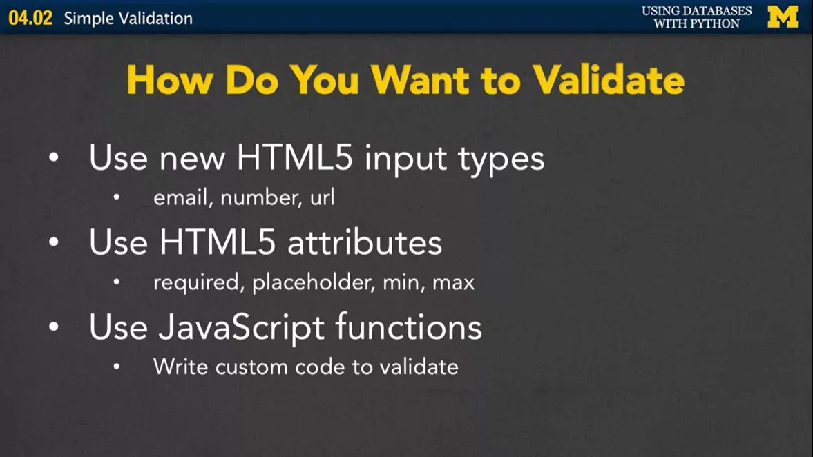

When we talk about how we want to validate, here&#39;s where it can get a
little bit more interesting. One option is to just use the new HTML5
input types. So, email, number, url. They can actually force the person
to type in just what you want them to put in, and nothing else.

You can also use HTML5 attributes. So, required, placeholder. These are
the things we&#39;ll cover in just a few minutes.

The third option is to use custom JavaScript functions, code that
you&#39;re going to write to make sure that they&#39;re entering only the
information you&#39;re expecting.
<!--~~~~~~~~~~~~~~~~~~~~~~~~~~~~~~~~~~~~~~~~~~~~~~~~~~~~~~~~~~~~~~~~~~~~~~~~~~~~~~~~~~~~~~~~~~~~-->
<!--~~~~~~~~~~~~~~~~~~~~~~~~~~~~~~~~ 301. input types (###) ~~~~~~~~~~~~~~~~~~~~~~~~~~~~~~~~~~~~-->
<p align="center">
  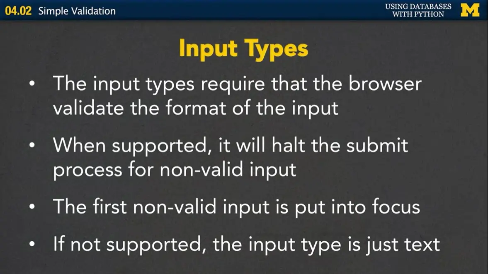

Let&#39;s start with those new HTML5 input types. The input types require
that the browser validate the input. Not you. You&#39;re putting it all on
Chrome, Firefox, Edge, whatever it is you&#39;re using. When they&#39;re
supported, it will actually keep the browser from being submitted if
it&#39;s not valid input. How it tends to work is it&#39;ll find the first
thing that doesn&#39;t meet the rules and it puts it into focus. When it
highlights that one it says, nope, you can&#39;t go any further. If it&#39;s
not supported, then the input type just falls back to a plain text
field.
<!--~~~~~~~~~~~~~~~~~~~~~~~~~~~~~~~~~~~~~~~~~~~~~~~~~~~~~~~~~~~~~~~~~~~~~~~~~~~~~~~~~~~~~~~~~~~~-->
<!--~~~~~~~~~~~~~~~~~~~~~~~ 302. example form, validation, #1 (###) ~~~~~~~~~~~~~~~~~~~~~~~~~~~~-->
<p align="center">
  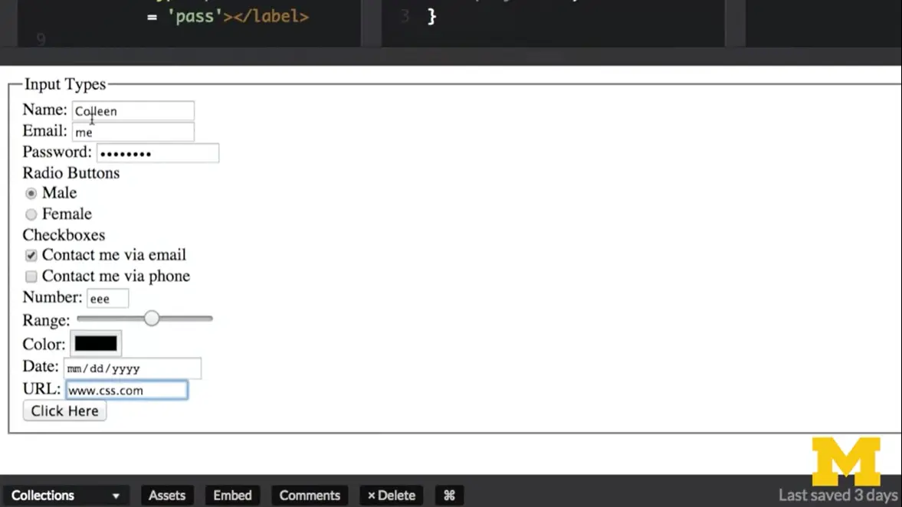

Let&#39;s look at our early example of all the different input types, and
I&#39;ll show you what I&#39;m talking about. I&#39;ve gone back to the form we
used before. And I&#39;ve put in some values for each of the different
input types. I have Colleen, me, passwords, all those little things like
that.
<!--~~~~~~~~~~~~~~~~~~~~~~~~~~~~~~~~~~~~~~~~~~~~~~~~~~~~~~~~~~~~~~~~~~~~~~~~~~~~~~~~~~~~~~~~~~~~-->
<!--~~~~~~~~~~~~~~~~~~~~~~~ 303. example form, validation, #2 (###) ~~~~~~~~~~~~~~~~~~~~~~~~~~~~-->
<p align="center">
  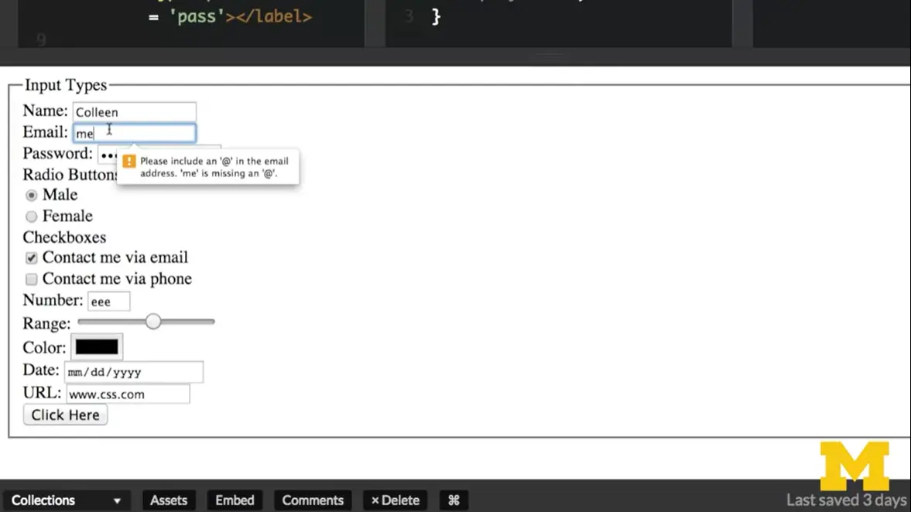

Now, because I used the email input type, this should fail as soon as I
hit click here. Great. There you go. The browser, this is Chrome, said
nope, you need to have that ampersand and a dot to make this work. No
problem. I&#39;ll put it in. And once I&#39;ve done that, I&#39;m going to go
down here to click here again.
<!--~~~~~~~~~~~~~~~~~~~~~~~~~~~~~~~~~~~~~~~~~~~~~~~~~~~~~~~~~~~~~~~~~~~~~~~~~~~~~~~~~~~~~~~~~~~~-->
<!--~~~~~~~~~~~~~~~~~~~~~~~ 304. example form, validation, #3 (###) ~~~~~~~~~~~~~~~~~~~~~~~~~~~~-->
<p align="center">
  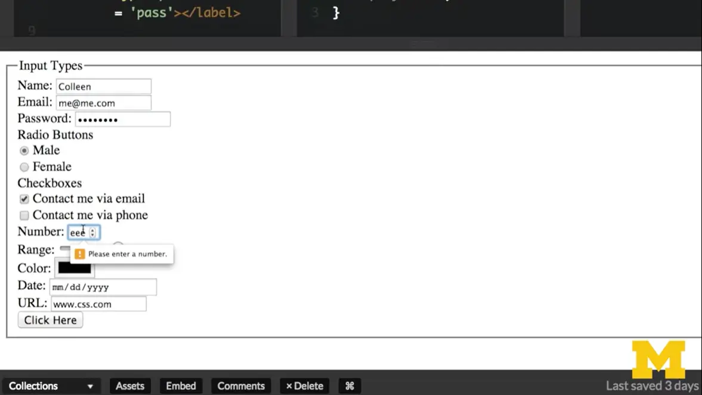

And the next thing it found that didn&#39;t fulfill that input type is now
highlighted, or in focus as we call it. So, I can make this 3.
<!--~~~~~~~~~~~~~~~~~~~~~~~~~~~~~~~~~~~~~~~~~~~~~~~~~~~~~~~~~~~~~~~~~~~~~~~~~~~~~~~~~~~~~~~~~~~~-->
<!--~~~~~~~~~~~~~~~~~~~~~~~ 305. example form, validation, #4 (###) ~~~~~~~~~~~~~~~~~~~~~~~~~~~~-->
<p align="center">
  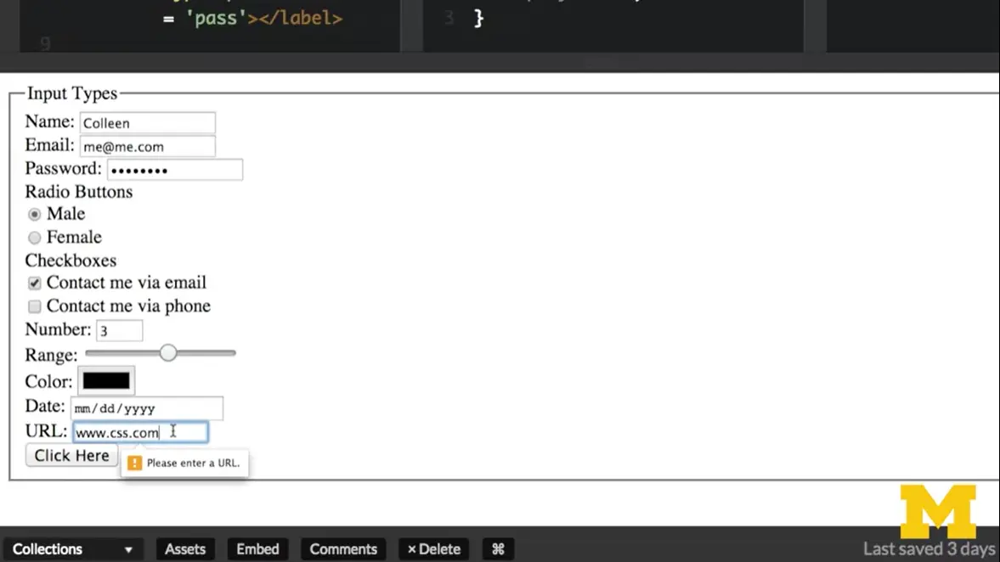

The last one I&#39;m going to click on is, it says sorry, this is not a
valid URL. It&#39;s requiring me to put in http before we do that. Now when
I click here, it&#39;s going to hopefully just refresh and we&#39;ve submitted
the form. But just as a reminder, when I said this last bullet here but
if it's not supported, and the input type is just text, that means in
some browsers using the email tag, or the number tag, or the URL tag, it
doesn&#39;t guarantee valid input because maybe the browser just doesn&#39;t
support it.

<!--~~~~~~~~~~~~~~~~~~~~~~~~~~~~~~~~~~~~~~~~~~~~~~~~~~~~~~~~~~~~~~~~~~~~~~~~~~~~~~~~~~~~~~~~~~~~-->
<!--~~~~~~~~~~~~~~~~~~~~~~~~~~~~~~~ 306. input attributes (###) ~~~~~~~~~~~~~~~~~~~~~~~~~~~~~~~~-->
<p align="center">
  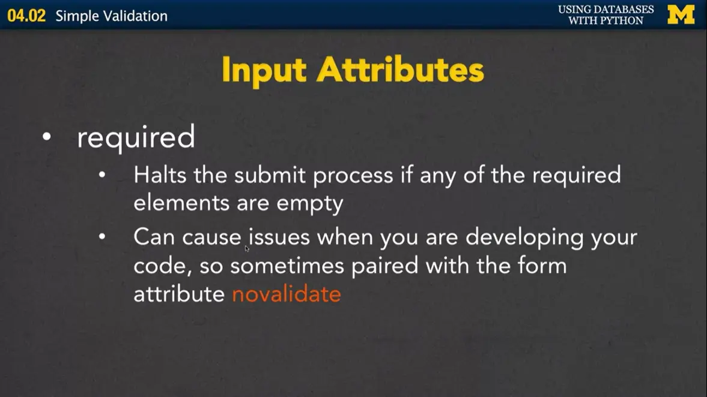

Another step we can take instead of just using input types is to use
input attributes. These are just additional attributes that tell the
browser additional information. The required attribute essentially says,
hey, you can&#39;t submit this form if this particular input field is
empty.

If you want someone to put in their password, you&#39;re going to include
required. Otherwise, people could just leave it empty and they could
submit the forms without adding their password. This can cause some
issues when you&#39;re developing your code, because what people tend to do
is they put required in a lot of the different fields. Let&#39;s think
about the form we just looked at where I had 10 or 11 input fields.
It&#39;s going to be super annoying when you&#39;re testing your code if you
have to fill in all 10 every single time. It is possible to overwrite
the required field with a special attribute called **novalidate**.

If I were to include in my code form, my form tag, **novalidate** it
will ignore all of the required attributes. It seems a little silly, but
as you start programming, you&#39;re going to be really glad you know about
this. Because it lets you test sometimes, and not test other times.
<!--~~~~~~~~~~~~~~~~~~~~~~~~~~~~~~~~~~~~~~~~~~~~~~~~~~~~~~~~~~~~~~~~~~~~~~~~~~~~~~~~~~~~~~~~~~~~-->
<!--~~~~~~~~~~~~~~~~~~~~~~~~ 307. pattern of simple validation (###) ~~~~~~~~~~~~~~~~~~~~~~~~~~~-->
<p align="center">
  

Another attribute you can use is called **pattern**. **Pattern** only
works with the input type equals text. And what it does is it forces the
user to use a specific format when entering their input. For instance,
you might say you can only enter in numbers and there has to be five of
them. Or you can only enter numbers but there needs to be between 13 and
16 of them. Where did this weird example come from? Well, this is
actually the pattern for credit cards. You may want people to only be
able to enter in characters.

For their user names you might not want them to enter in numbers or
spaces or things like that. This right here says you can enter in
lowercase a to z, upper case A to Z. And this plus means and there has
to be at least one character. Now, these are called regular expressions.
And they can be a little bit tricky to figure out on your own. But
that&#39;s okay because you don&#39;t need to. Usually, what people tend to do
is they combine their patterns with a place holder and supporting text
to let people know, hey, this is the format we have to use. But then,
when it comes time to come up with these special expressions, you go to
a website such as html5pattern.com. If you go there, there are people
who have spent way too many hours of their lives coming up with all the
different combinations you could ever think of. Don&#39;t worry about
creating the patterns. Just practice using them right now.

Another way that you can kind of validate the input is by limiting your
number to only certain inputs. You can use min, max, and step to say,
you know what, you can&#39;t enter a number that&#39;s less than three. You
can&#39;t enter a number over 100. And step means you can only enter in
increments of five, or increments of ten. The range attribute that we
saw earlier does the same thing. You by default put in a max and a min.
The only difference is that instead of typing in a number, you use that
little slider to move things back and forth. Okay. Let&#39;s put some of
this into practice.

We&#39;re going to do an example of where we want to enter an American zip
code into one of our input fields. If we want to do that, we need to
decide what it is we need to check and how we want to check it. What do
we want to check? We want to make sure that we have a five-digit input.
All right? How are we going to check it? We pretty much have two
options. We can either use the input combined, input equals number,
combined with a min and a max. Or we can use input equals text and
combine that with a pattern.

Let&#39;s look at an example where I&#39;ve used both text equals input and
text equals number. In my first one, I have type equals text, and I have
my pattern that says I need digits between 0 and 9, and there should be
five of them. Just to make my life easier, I&#39;ve made both of these
required. In my second example, I have input type equals number. And I
have a min of five zeroes and a max of five nines. That&#39;s kind of
trending keep it within five-digit idea.

Let&#39;s see what happens when I type in some values. Do they both work?
Does either one work? You can never really know with my code. I&#39;m going
to start off with bad inputs for both, 1234 and 1234. Now, when I hit
submit, right away the browser says, sorry, that doesn&#39;t match the
input. I&#39;m going to stick in a 5. Great. That&#39;ll work. Now let&#39;s hit
submit. And you can see it actually accepted that value when I only put
in four digits.

The problem with min and max is that I&#39;m not making it be at least five
digits. In mathematics, this is the exact same thing as just plain old
0. So, in this particular case, if you really want there to be five
numbers you want to save it as a pattern. As we&#39;ve seen, not every
browser supports every input type or even the pattern attribute. What we
want to do is start thinking about how we can use the JavaScript that
we&#39;ve learned to write functions that can do a kind of custom
validation on the events.

Before you dump too much into JavaScript, embrace these new input types
and the attributes that are provided. Even if the browser doesn&#39;t
support them yet, there&#39;s a really good chance it will support them
soon. Plus, these input types tend to add a little bit of styling and
semantics that are really nice for the user. But you will still need to
add JavaScript if you want to ensure that the input is correct. Don&#39;t
depend on the browsers. Don&#39;t get lazy. It&#39;s time for us to start
looking at how you can start writing code to make everything more
secure. Thanks.

<h2 id="Week4-03">Week 4-03. Comparing Two Inputs</h2>

Hi everybody. We&#39;ve seen how to use HTML five, attributes, and input
types to really try to validate the inputs people can put into their
forms, but that&#39;s not always going to be enough. One, we&#39;ve seen that
a lot of browsers don&#39;t support all these types, so you can&#39;t always
depend on them. But two, there may be situations that go beyond what
these tags and attributes can do for you.

In this module, we&#39;re going to do an example where we want to check
that the two email addresses that are input Match exactly. Let&#39;s see
how we&#39;re going to do that. One of the things I mentioned is right from
the start, you want to think about what exactly is it you&#39;re trying to
validate. In this case, we&#39;re trying to compare that two emails are the
same. How are we going to do that? Well, it&#39;s going to be a little bit
more complex.

We&#39;ll start with the HTML. We can use the email input type and the
required attribute to kind of get us started. But then we want to add
some JavaScript. And that JavaScript is going to be in charge of making
sure those values are actually the same.

The last question that we didn&#39;t think about before, is when do we want
to do this? We&#39;re going to use these API events that are linked to the
DOM to decide when we should run our JavaScript. In this case, let's
validate as soon as that second email is entered.

We decided we want to validate at input time, but that still doesn&#39;t
tell us which event we want to use. Two options are oninput and
onchange. Either one of them will react every time you type into the
email form. But oninput is going to check every single time you type in
a character, and we probably don&#39;t want that. We want instead to use
onchange because that will wait until we&#39;re done typing in the email
address and have hit tab or enter to leave that field.

Okay. After we decide which event to trigger on, we need to decide what
is it we&#39;re going to compare. Because in JavaScript, when we talk about
the different elements, it rarely is that it&#39;s as simple as just some
text. Is it the inputs that you want to compare, or some attribute of
those email inputs? Finally, what&#39;s our output, what is our goal? We
need to let the user know. And communicate the result of when we did our
check.

Here&#39;s our kind of goal. This is what we want to look for. I have a
field that has two email input types one and two. And right here they
don&#39;t match. When they don&#39;t match I&#39;m going to generate a java
script alert that lets the user know, no we really need them to be the
same.

Let&#39;s look at the actual code. All right, so on our left here we have
the HTML code that we need. I just have my two input types. They&#39;re
both email. And I included my required. What&#39;s different is that on my
second email type, the one that matches down here, I have an on change
equals check. This is responsible for calling the JavaScript code
that&#39;s going to say hey, I need to make sure these two things match.
The other thing that&#39;s really important about this HTML code is that
I&#39;ve included IDs. I have ID equals email address and ID equals email
repeat. This is how JavaScript is going to identify who&#39;s who. Alright.

Now let&#39;s switch over to the JavaScript code. I&#39;m going to take a few
extra steps just to try to make everything clear. I&#39;ve created two
variables. Email one and email two. And I used
**document.getelementbyid** in order to grab those values. If by any
chance you&#39;ve reached this point and you don&#39;t follow what&#39;s going on
with these two lines of code, I actually recommend that you stop, go
back, and review some of the earlier things. If you are okay with this
idea, great, let&#39;s move on.

Your first stop might be, we need to compare email one to email two, and
then we&#39;ll know. Not exactly. You have to remember that when JavaScript
makes the DOM, this maybe email one and this maybe email two, but it&#39;s
not the whole node we want to compare, right? We don&#39;t care about
background colors or things like that. What we care about are the actual
values. That are stored in email one and email two.

We have this line of code. If email one doesn&#39;t equal email two, then
send up that alert that says, hey the two emails must match. Let&#39;s see
if it works. I have me and me.com. I&#39;m going to put in me at me2.com.
As soon as I&#39;m about to tab out of here, I&#39;m hoping to see my
JavaScript alert. Great, it worked. It said the two emails must match.

Before I go any further, I&#39;m going to do the smart thing, and make sure
I don&#39;t always get that alert. Tab out. Great, it didn&#39;t happen, Now,
this works exactly the way we planned it out to work. But that doesn&#39;t
mean we planned it out the right away. I&#39;m going to click on confirm
emails now. And you can see that it let me get away with that. Let&#39;s
think about what we need to change. When you check on inputs, it can be
the case that, while everything&#39;s worked, it didn&#39;t really have what I
call teeth. It didn&#39;t make anything happen.

How can we actually stop the form from being submitted if the values
aren&#39;t correct? Well, we need to rethink our plan. The what was okay.
The how was okay. And the when was kind of okay, but we want to add a
second way to do this as well. We also want to check on the submit.
Let&#39;s look at that code. In the new version of our code, I&#39;ve added
something to the submit button. I went in and I added a
**onclick=&#34;return check();**&#34;.

There&#39;s something new that you haven&#39;t seen before. It&#39;s the idea of
the return value. And it says hey, don&#39;t just run this function, I need
to know did it return true or false. Then, I went over here and I added
an additional line of code to our JavaScript. It says go ahead check all
the same things and still do that alert, but in addition, after the
person hits okay I need you to return false. For you only to be
returning things two times, we&#39;ll run this function it&#39;ll go through
says they didn&#39;t match, I&#39;m going to return the word false over here.
And whenever input type sees a false it knows I&#39;ve gotta stop. I&#39;m not
allowed to do what it is I&#39;m trying to do. Let&#39;s take a look if this
works. I have the me and the me two. And, now, when I try to confirm, it
won&#39;t let me. It won&#39;t let you hit that submit button until you get it
right.

What is return? It&#39;s something we&#39;re going to get into in a future
lecture, but for right now you just need to know that every function can
return values. Whether they&#39;re Numbers, Strings, Booleans, Objects,
Arrays. When we do form submission, we tend to stick with the Boolean,
where we&#39;re saying, you know what? We need to stop this. And when we do
that, it&#39;s going to stop whether it&#39;s a submit, or a link, or any type
of HTML five tag that has an action associated with it.

I hope from this lecture you got the general idea that it&#39;s more than
just knowing how to code, you have to be careful about what you&#39;re
comparing and when you&#39;re comparing it. Even though it can be tricky,
JavaScript is still a great tool for verifying the input. And, it&#39;s a
great language to know, no matter what you&#39;re doing on that front end
development. But really what you need to make sure you&#39;re doing is
creating the most basic forms before you go in and try to add this
JavaScript interactivity. It&#39;s going to make your life much easier and
it&#39;s always going to create better, cleaner code. Thanks.

<h2 id="Week4-04">Week 4-04. Checkboxes & Radio Buttons</h2>

<p>Hi, everybody, welcome back. Today, we&#39;re going to talk about some new
form fields that you can add to your page. When we were doing name and
email and different things like that.</p>
<p>The set up was fairly straightforward. You give it an input type of
text, email, password, etc. But as far as a page was concerned, these
were all very separate part of the page. Each one was its own part of
the dom. However, there are some additional form fields that we&#39;re
going to want to look at. And these include checkboxes and radio
buttons. And how they differ from the earlier input field we were doing
is that they need to be related within the code. Because we want to make
sure that when we&#39;re giving people options. That when we send them off
later, the computer knows oh, these are related.</p>
<p>Let&#39;s take a look and let&#39;s start with checkboxes. You&#39;ve all seen
these before when you&#39;ve been online. They&#39;re typically shaped as
these squares and you have the opportunity to click them for things such
as, do you want to be part of the mailing list, if you want to receive
additional information etc. It allows the user to select options with
just a single click instead of typing in the different options they may
want. The important thing to know here is that in your code, each of
these options shares a single name. All right, so remember, we&#39;re using
other input type. We have name equals first name or name equals keyword.</p>
<p>Now if you look through your code, you&#39;re going to see multiple input
types that all have the same name. Let&#39;s take a look at the example
called Easy Checkbox. In this code, I&#39;ve put up a few checkboxes that
let people indicate which foods they like, and which ones they don&#39;t
like.</p>
<p>As you can see, I have three input type =&#34;checkbox&#34;, but the important
thing is that for all three of them, they all have the same name. Even
though they all have the same name, each one of these has a different
value. And so, it&#39;s going to let the computer let the other software
know that, oh, food, their favorite foods are pizza and chips, or just
kale, or any combinations of these.</p>
<p>Something I want to point out for just a second, because it&#39;s so
important with accessibility is that I have labels on each one of these
input fields. I know that personally, there are many times I&#39;ve tried
to click on something in a form, and my fingers are just too fat and I
can&#39;t get it just right. And if you have to click only on the box, that
can be a real problem turning it on and off. But by adding these labels,
it also lets you click on the text next to it. I can click on the word
Kale and it&#39;ll activate the button. This is just a really simple way
for you to add checkboxes into your code. The next thing we want to look
at are radio buttons.</p>
<p>Visually, radio buttons are typically shaped like circles. And just like
checkboxes, it allows your user to kind of click on it, to say, yes, no,
and to have different options. The big difference is with radio buttons,
you&#39;re only allowed to select one option per group. So well with
checkboxes, I could pick kale and pizza and chips. With radio buttons,
you can only select one. Let&#39;s take a look at how that works. In this
example, I&#39;ve gone in and I&#39;ve made something for gender and it&#39;s
simply you can choose male or female.</p>
<p>The important thing to notice is that when I click on male, that&#39;s
fine, but when I click on female, not only does it select female, it
unselects the male. And as you may have just noticed, as I fumbled on
this a little bit, I was like, why isn&#39;t it working when I click on the
male? Why do I have to hit the actual button? It&#39;s because I forgot to
put labels on these. And so, the usability is really taken down a notch
when you don&#39;t remember these simple things. Once again, I have the
same exact name for every member of the radio button and a different
value. That&#39;s how the computer will know which one somebody selected.
However, let&#39;s think about this a little deeper. Because it often
happens that people go, oop, I&#39;ve got it. I&#39;ve got radio buttons down
and we&#39;re all set, but then, as they try to do more complex things,
stuff pops up.</p>

<p>Let&#39;s look at the Easy Radio Button too. In this example, I have two
groups of radio buttons, I have gender and I have favorite food. And
while it makes sense that with radio buttons if I click on Pizza, maybe
Chips will go away or if I click on Kale It&#39;ll go away. Same with male
and female. The important thing is that many times, I&#39;ve seen formed
where someone clicks on male and then somehow that unselects the
favorite food. You want to make sure that you&#39;re being logical in your
grouping things together. And how we do that is again with the name
attribute. These share the same name and that&#39;s gender. These share the
same name and that&#39;s food. And so this is how you can make sure that
your code is clicking or unclicking the way you really want it to.</p>
<p>Okay, great, we&#39;ve got our check boxes and our radio buttons, but this
course is about JavaScript. So how do we incorporate with these
checkboxes, and radio buttons, and other kind of advanced form fields?
Well, now instead of looking at things, such as inner HTML, or if things
have been clicked. These different attributes have something called a
checked attribute, and so how this works is a radio button or a checkbox
can be labeled as checked. And when you do that, by default, JavaScript
will know whether it&#39;s on or off. In fact, in the code I did earlier, I
threw that checked attribute in there. Let&#39;s take a look at that and
then, go on for a more advanced example of using JavaScript. Now that I
mentioned checked, I want you to take a look at this again and see if
you notice something.</p>
<p>When I first loaded the page, chips was pre-selected as one of my
favorite food. How did I do that? Well, if you check the code you can
see that right here inside the input type=&#39;radio&#34;, value&#34;Chips&#34; I
included a boolean attribute called checked=&#34;true&#34;. This says hey I
want you to highlight this one as being pre-selected. And again, this is
something you see all the time when you&#39;re on the web, right? when you
go to check out some place, it&#39;s been pre-selected that you want to be
part of the mailing list or, it&#39;s been pre-selected that you would like
to auto renew. This is a kind of tricky way that web developers can kind
of guide people down the path they want to go. But now that we know
about checked, let&#39;s look at a slightly more complex example where
we&#39;ll use the JavaScript. Now, in this code what we&#39;re trying to do is
we&#39;re trying to give people the option of including a nickname in their
form. There&#39;s a lot of code and I&#39;m hoping you&#39;ll go back and you&#39;ll
look at it line by line.</p>
<p>But let me give you a quick introduction to what&#39;s going on. Once I
have my names in, I need to decide if I want to include a nickname or
not. When I click on this check box, boom, a new input field opens up.
Let&#39;s see how that worked. If you take a look at our code. You can see
that right here on the checkbox, I have an onchange, so if someone
clicks or doesn&#39;t click it, let&#39;s call the nickname function. Now this
is something where again we need to use logic because just because
something changed doesn&#39;t mean we just clicked on it. We may have
unclicked it as well.</p>
<p>The first thing we&#39;re going to check is that hey, is that checkbox
checked? Oh yes, it is, so that means it was closed before and we want
to change this little part down here from display hidden or display none
to display inline. And then, the next thing we want to do and this is
something new, you haven&#39;t seen before. Is, not only do we want to make
it display, but we want to set an attribute on it. Because if someone
says they have a nickname, we&#39;re going to force them to add that
nickname in there. And so, I have set attribute, required true.</p>
<p>This right here is the code that&#39;s going to be executed when I turn the
checkbox on. However, when I turn the checkbox off, oops, right down
there. This right here is the code that&#39;s going to be executed next. We
say, oh never mind, it&#39;s not required anymore, we&#39;re going to remove
that attribute and we&#39;re going to hide it by setting the display to
none. It&#39;s an easy way to let us change the dynamics as a page, but
what we&#39;re doing is actually very complex. It&#39;s few lines with a
complex idea behind it. Let&#39;s just double check that it works. I&#39;ll go
here. I&#39;ve got Colleen van Lent. If I hit verify, and let us go to a
new page. However, if I go back and I click on that I have a nickname
but I don&#39;t provide it. We get this note, sorry you need to fill that
in.</p>
<p>Again, when I was coding this myself, I was all gung-ho and I did all
the if part correctly and it worked great. It was the else part that I
actually had to sit and think about and say oh, that&#39;s right now that I
have these required attributes and different things like, we really need
to think about it. The important thing for you to take away from this is
that the idea that checkboxes and radio buttons are typically using the
checked attribute in order to handle any type of interactivity.</p>
<p>We&#39;ve been playing a lot with forms, and forms are really great way to
allow a user to interact with your page. Checkboxes and radio buttons,
these are very commonly used events on a page that really give the user
a lot of power to do things without typing in a lot of code. However,
even though we&#39;ve covered this, I need you to understand that we&#39;re
doing what&#39;s called front-end programming. We&#39;re out there making
things look good. We&#39;re not doing what&#39;s called the back-end
programming. That&#39;s where you have to learn additional programming
languages, and that&#39;s how you actually get the forms to do something.</p>
<p>Right now, let&#39;s work on making beautiful forms and adding in that
verification and the great styling. But I do want to make sure that you
understand that we&#39;re only going to make them, we&#39;re not going to do
anything with the data that sends them. Once you understand that and you
can really focus on just learning the JavaScript, I think you can have a
really good time adding these cool little tricks and tips to your page.
Good luck.</p>

<h3>Optional Material</h3>

<h3>The History of &#34;Debugging&#34;</h3>

<p>If you want to learn more about the history of debugging, here is an
article that talks about the fact that two different people are credited
with the term, Grace Hopper and Thomas Edison.</p>

<a href="http://theinstitute.ieee.org/tech-history/technology-history/did-you-know-edison-coined-the-term-bug">History of Debugging</a>

<p>Even if you use CodePen, I encourage you to practice writing the code on
your own. For now, I put complete examples in CodePen, but as time goes
on, I will remove some of the commands to link the code together. You
will need to work on that part on your own..</p>

<h3>The Document Object Model (DOM)</h3>

<p>One of the reasons you want to learn about JavaScript is that it works
so well with the structure used to create HTML documents. Every webpage
can be broken down into a mathematical tree structure called the
Document Object Model (DOM). Each HTML tag is a node in the tree and
these nodes have all types of different attributes, such as text,
background color, width, etc.</p>
<p>With JavaScript it is easy to write code that basically says &#34;I want to
grab *that* part of the webpage and change it.&#34; In this lecture I
review the DOM and talk about how it is related to JavaScript. There is
no code associated with this lecture, but if you check under the
resources, I do include a link to site where you can find specifics on
the DOM.</p>

<h6>Last Updated 2/16/24 2:27pm</h6>

<h5>the end...readme.md</h5>
